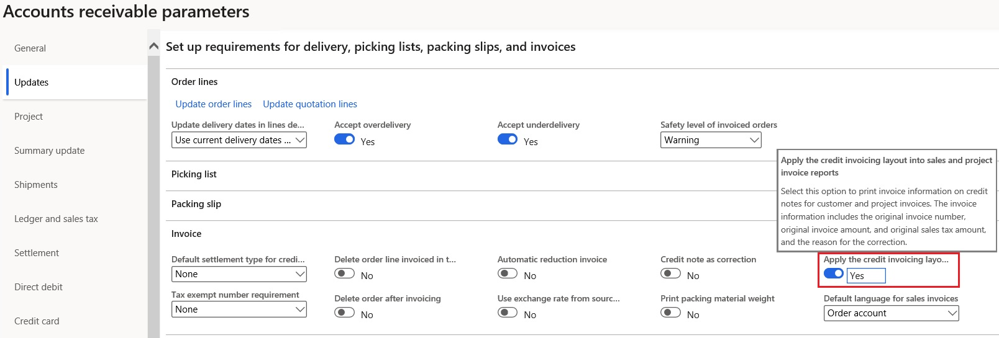
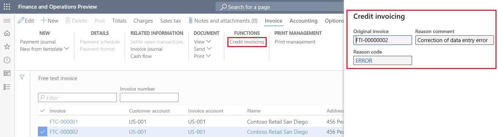
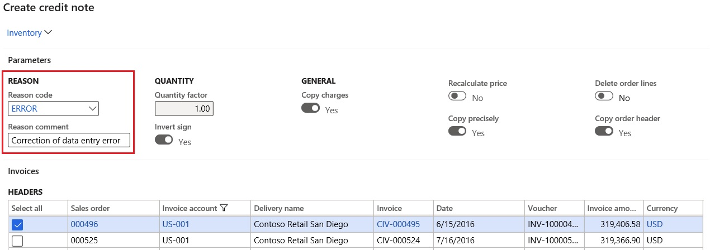
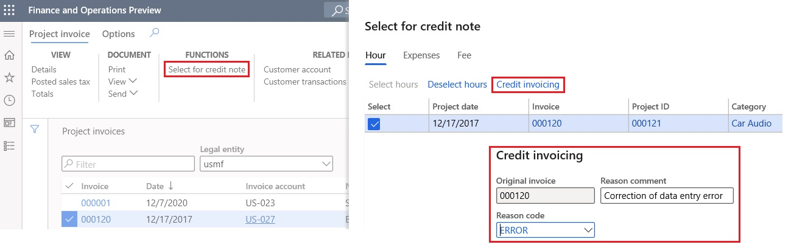

# References to original invoices in credit notes

[!INCLUDE [banner](../includes/banner.md)]

In some countries and regions, legal requirements mandate that printed credit notes include references to the original invoices. This article explains how to set up and print the original invoice numbers in related credit notes.

## Prerequisites

- In the **Feature management** workspace, turn on the **Credit invoicing layout for sales and project invoice reports** feature. For more information, see [Feature management overview](../../fin-ops-core/fin-ops/get-started/feature-management/feature-management-overview.md).
- Configure the printable formats of the required documents in Print management.

The functionality described in this article applies to the following documents:

**Accounts receivable**

- Free text credit note
- Customer credit note

**Project management and accounting**

- Project credit note

## Configure Accounts receivable parameters

Follow these steps to set the parameter that controls whether references to the original invoices print in related credit notes.

1. Go to **Accounts receivable** > **Setup** > **Accounts receivable parameters**.
1. On the **Updates** tab, on the **Invoice** FastTab, set the **Apply the credit invoicing layout into sales and project invoice reports** option to **Yes**.

## Define references to original invoices

Use the following procedures to define references to original invoices, based on the document type.

### Free text credit note

1. Go to **Accounts receivable** > **Invoices** > **All free text invoices**.
1. Create a new credit note, or select an existing credit note.
1. Open the invoice.
1. On the Action Pane, on the **Invoice** tab, in the **Functions** group, select **Credit invoicing**.
1. Enter the reference to the original invoice, and select the reason for the correction.

### Customer credit note

1. Go to **Accounts receivable** > **Orders** > **All sales orders**.
1. Select and open the invoiced sales order that you need to correct.
1. On the Action Pane, on the **Sell** tab, in the **Credit note** group, select **Credit note**.
1. Enter the reason for the correction. The system automatically establishes the reference to the original invoice.

### Project credit note

1. Go to **Project management and accounting** > **Project invoices** > **Project invoices**.
1. Select and open the project invoice that you need to correct.
1. On the Action Pane, on the **Project invoice** tab, in the **Functions** group, select **Select for credit note**.
1. Select **Credit invoicing**.
1. Enter the reason for the correction. The system automatically establishes the reference to the original invoice.

## Printing credit notes

When you print free text, customer, and project credit notes, they include the reference to the original invoice and the correction reason.

> [!NOTE]
> Make sure that the printable formats of the documents are correctly configured, assuming that references to original invoices are printed.

## References to original invoices in debit notes

By default, you can enter references to original invoices for credit notes. For example, you can enter references when you make negative (decreasing) corrections to original invoices.

To enter references when you make positive (increasing) corrections to original invoices, you must enable the **References to original invoices in debit notes** feature in the **Feature management** workspace.  

[!INCLUDE[footer-include](../../includes/footer-banner.md)]
