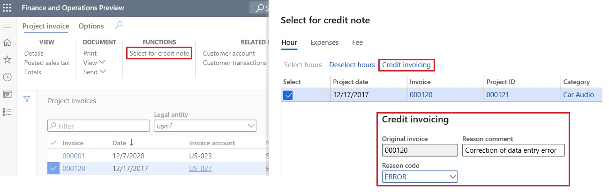

---
# required metadata

title: References to original invoices in credit notes
description: This topic explains how to set up and print the original invoice numbers in related credit notes.
author: ilkond
ms.date: 10/26/2021
ms.topic: article
ms.prod: 
ms.technology: 

# optional metadata

ms.search.form: 
audience: Application User
# ms.devlang: 
ms.reviewer: kfend
ms.search.scope: Core, Operations
# ms.tgt_pltfrm: 
# ms.custom: 
ms.search.region: Global
# ms.search.industry: 
ms.author: ilyako
ms.search.validFrom: 2021-03-19
ms.dyn365.ops.version: 10.0.17

---

# References to original invoices in credit notes

[!include [banner](../includes/banner.md)]

In some countries and regions, there is a legal requirement that printed credit notes include references to the original invoices. This topic explains how to set up and print the original invoice numbers in related credit notes.

## Prerequisites

- In the **Feature management** workspace, turn on the **Credit invoicing layout for sales and project invoice reports** feature. For more information, see [Feature management overview](../../fin-ops-core/fin-ops/get-started/feature-management/feature-management-overview.md).
- The printable formats of the required documents must be configured in Print management.

The functionality that is described in this topic applies to the following documents:

**Accounts receivable**

- Free text credit note
- Customer credit note

**Project management and accounting**

- Project credit note

## Configure Accounts receivable parameters

Follow these steps to set the parameter that controls whether references to the original invoices are printed in related credit notes.

1. Go to **Accounts receivable** \> **Setup** \> **Accounts receivable parameters**.
2. On the **Updates** tab, on the **Invoice** FastTab, set the **Apply the credit invoicing layout into sales and project invoice reports** option to **Yes**.

## Define references to original invoices

Use the following procedures to define references to original invoices, based on the document type.

### Free text credit note

1. Go to **Accounts receivable** \> **Invoices** \> **All free text invoices**.
2. Create a new credit note, or select an existing credit note.
3. Open the invoice.
4. On the Action Pane, on the **Invoice** tab, in the **Functions** group, select **Credit invoicing**.
5. Enter the reference to the original invoice, and select the reason for the correction.

### Customer credit note

1. Go to **Accounts receivable** \> **Orders** \> **All sales orders**.
2. Select and open the invoiced sales order that must be corrected.
3. On the Action Pane, on the **Sell** tab, in the **Credit note** group, select **Credit note**.
4. Enter the reason for the correction. The reference to the original invoice is automatically established.

### Project credit note

1. Go to **Project management and accounting** \> **Project invoices** \> **Project invoices**.
2. Select and open the project invoice that must be corrected.
3. On the Action Pane, on the **Project invoice** tab, in the **Functions** group, select **Select for credit note**.
4. Select **Credit invoicing**.
5. Enter the reason for the correction. The reference to the original invoice is automatically established.

## Printing credit notes

When you print free text, customer, and project credit notes, they will include the reference to the original invoice and the correction reason.

> [!NOTE]
> Make sure that the printable formats of the documents are correctly configured, on the assumption that references to original invoices will be printed.

## References to original invoices in debit notes

By default, references to original invoices can be entered for credit notes. For example, you can enter references when you make negative (decreasing) corrections of original invoices.

To enter references when you make positive (increasing) corrections of original invoices, you must enable the **References to original invoices in debit notes** feature in the **Feature management** workspace.  

[!INCLUDE[footer-include](../../includes/footer-banner.md)]
