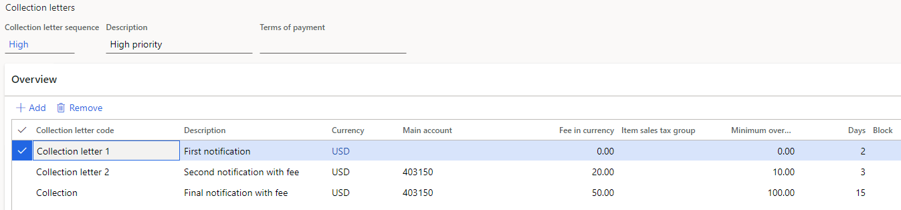
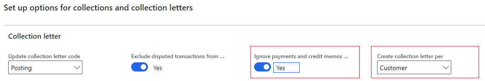
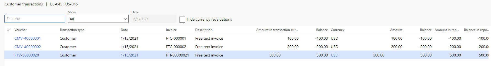
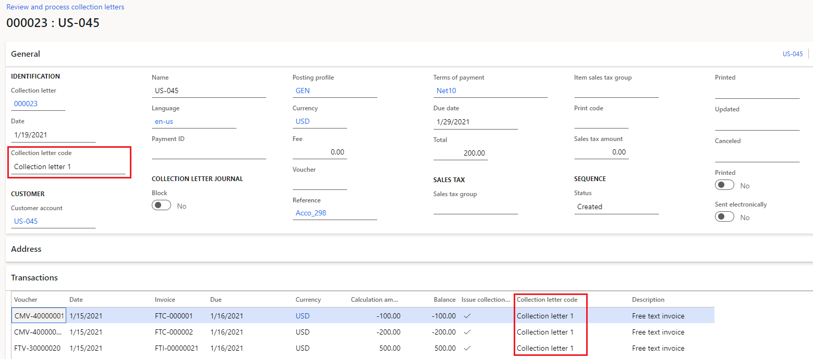
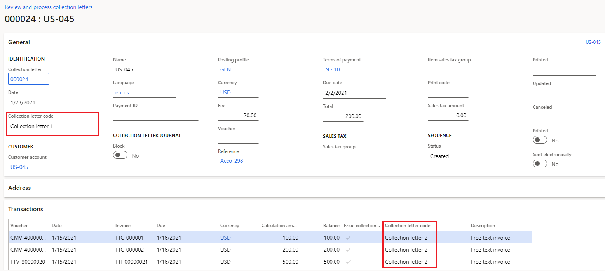
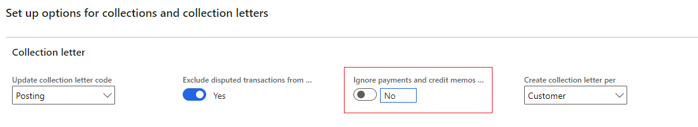
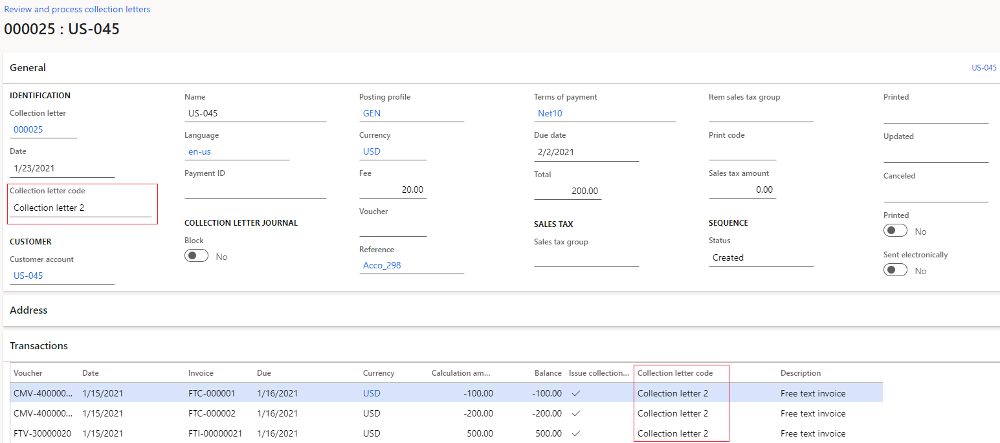

--- 
# required metadata 
 
title: Process collection letters example
description: This article goes through an example that shows the process of creating, printing, and posting collection letters. 
author: JodiChristiansen
ms.date: 03/23/2023
ms.topic: how-to 
ms.prod: 
ms.technology: 
 
# optional metadata 
 
ms.search.form: CustPosting, CustCollectionLetterNote
audience: Application User 
# ms.devlang: 
ms.reviewer: twheeloc
# ms.tgt_pltfrm: 
# ms.custom: 
ms.search.region: Global
# ms.search.industry: 
ms.author: jchrist
ms.search.validFrom: 2021-02-03 
ms.dyn365.ops.version: 10.0.16

---

# Process collection letters example

[!include [banner](../../includes/banner.md)]

This article goes through an example that shows the process of creating, printing, and posting collection letters. The example is based on the **Ignore payments and credit memos when calculating collection letter code** option in Credit and collections. It uses data in the USMF demo company and a new customer, US-045.

To begin, go to **Accounts receivable \> Customers \> All customers**, select **New**, and enter the required information to create customer US-045.

When you've finished, follow these steps.

1. Go to **Credit and collections \> Collection letter \> Setup collection letter sequence**, and set up the collection letter sequence as shown in the following table that is assigned to the customer posting profile.

|   Collection letter code    	|     Description    	|     Currency    	|     Main   account    	|     Fee in currency    	|   Minimum   over 	|   Days   Block    	|
|-----------------------------	|--------------------	|-----------------	|-----------------------	|--------------------	|-----------------------	|------------------	|
|  Collection letter 1       	|     First notification |     USD      	|                 	|     0.00             	|     0.00              	|     2               	|
|  Collection letter 2       	|     Second notification with fee    	|     USD      |     403150     	|     20.00        	|     10.00    	|     3               	|
|  Collection               	|     Final notification with fee     	|     USD         	|     403150  	|     50.00     	|     100.00            	|     15         	|

The following illustration shows the information that's in the table as it would appear on the **Collection letters** page. 

 You must now set the two parameters that are required for this example.

2. Go to **Credit and collections \> Setup \> Accounts receivable parameters**, and follow these steps:

    1. On the **Collections** tab, set the **Ignore payments and credit memos when calculating collection letter code** option to **Yes**.
    2. Make sure that the **Create collection letter per** field is set to **Customer**.

    

3. Go to **Accounts receivable \> Invoices \> All free text invoices**, select **New**, and then follow these steps:

    1. In the **Customer account** field, select **US-045**.
    2. In the **Invoice date** field, enter **1/15/2021**.
    3. In the **Due date** field, enter **1/16/2021**.
    4. On the **Invoice lines** FastTab, in the **Main account** field, enter **401100**.
    5. In the **Unit price** field, enter **500.00**.
    6. Select **Post**.

    You must now enter two credit notes for the customer.

4. Select **New**, and then follow these steps:

    1. In the **Customer account** field, select **US-045**.
    2. In the **Invoice date** field, enter **1/15/2021**.
    3. In the **Due date** field, enter **1/16/2021**.
    4. On the **Invoice lines** FastTab, in the **Main account** field, enter **401100**.
    5. In the **Unit price** field, enter **-100.00**.
    6. Select **Post**.

5. Repeat step 4, but enter **-200.00** in the **Unit price** field.
6. Go to **Accounts receivable \> Customers \> All customers**, and select customer **US-045**. On the Action Pane, select **Transactions \> Transactions** to review the customer transactions that you posted earlier.

    

    You must now create collection letters for customer US-045.

7. Go to **Credit and collections \> Collection letter \> Create collection letters**, and follow these steps:

    1. Set the **Invoice** and **Credit note** options to **Yes**.

        By default, the **Collection letter** field should be set to **Collection per customer**.

    2. In the **Collection letter date** field, enter **1/19/2021**.
    3. On the **Records to include** FastTab, select **Filter**, and, in the **Customer account** field, add customer **US-045**.
    4. Select **OK**.
    5. Select **OK** to create collection letters.

8. Go to **Credit and collections \> Collection letter \> Review and process collection letters**, and follow these steps:

    1. Notice that the collection letter code on both the header and the transaction lines is **Collection letter 1**, because this collection letter is the first collection letter in the sequence. (To view the transaction lines, you might have to select the **Transactions** FastTab.)

   

    2. On the Action Pane, select **Post**.
    3. In the **Posting date** field, enter **1/19/2021**.

    You must now create collection letters again for customer US-045.

9. Go to **Credit and collections \> Collection letter \> Create collection letters**, and follow these steps:

    1. Set the **Invoice** and **Credit note** options to **Yes**.

        By default, the **Collection letter** field should be set to **Collection per customer**.

    2. In the **Collection letter date** field, enter **1/23/2021**.
    3. On the **Records to include** FastTab, select **Filter**, and in the **Customer account** field, add customer **US-045**.
    4. Select **OK**.
    5. Select **OK** to create collection letters.

10. Go to **Credit and collections \> Collection letter \> Review and process collection letters**, and follow these steps:

    1. Notice that the collection letter code on the header is **Collection letter 1**. However, the code on the transaction lines is **Collection letter 2**.

   

  The codes differ because the **Ignore payments and credit memos when calculating collection letter code** option is to **Yes**.

  2. Don't post this collection letter.

11. Go to **Credit and collections \> Setup \> Accounts receivable parameters**, and on the **Collections** tab, set the **Ignore payments and credit memos when calculating collection letter code** option to **No**.

    

    You must now create collection letters again for customer US-045.

12. Go to **Credit and collections \> Collection letter \> Create collection letters**, and follow these steps:

    1. Set the **Invoice** and **Credit note** options to **Yes**.

        By default, the **Collection letter** field should be set to **Collection per customer**.

    2. In the **Collection letter date** field, enter **1/23/2021**.
    3. On the **Records to include** FastTab, select **Filter**, and then, in the **Customer account** field, add customer **US-045**.
    4. Select **OK**.
    5. Select **OK** to create collection letters.

13. Go to **Credit and collections \> Collection letter \> Review and process collection letters**, and notice that the collection letter code on both the header and the transaction lines is **Collection letter 2**.

    

    The same code appears in both places because the **Ignore payments and credit memos when calculating collection letter code** option is now set to **No**.
