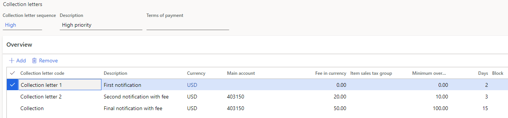
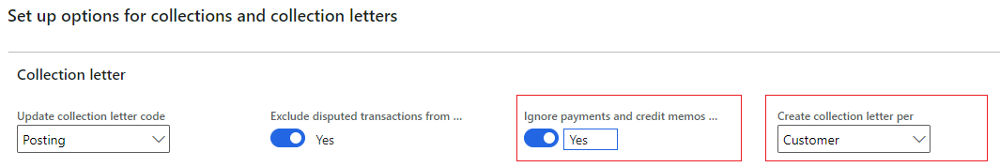
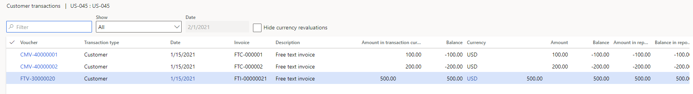
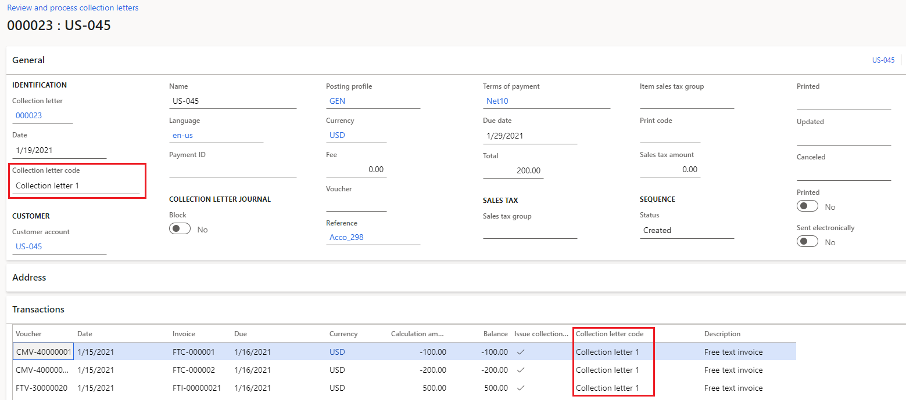

--- 
title: Process collection letters example
description: Access an example that shows the process of creating, printing, and posting collection letters, including a table that defines various collection letter codes. 
author: twheeloc
ms.author: twheeloc
ms.topic: how-to
ms.date: 07/30/2026
ms.custom:
ms.reviewer: twheeloc
audience: Application User 
ms.search.region: Global
ms.search.validFrom: 2021-02-03
ms.search.form: CustPosting, CustCollectionLetterNote
ms.dyn365.ops.version: 10.0.16
---

# Process collection letters example

[!include [banner](../../includes/banner.md)]

This article shows an example that demonstrates the process of creating, printing, and posting collection letters. The example is based on the **Ignore payments and credit memos when calculating collection letter code** option in Credit and collections. It uses data in the USMF demo company and a new customer, US-045.

To begin, go to **Accounts receivable > Customers > All customers**, select **New**, and enter the required information to create customer US-045.

When you finish, follow these steps:

1. Go to **Credit and collections > Collection letter > Setup collection letter sequence**, and set up the collection letter sequence as shown in the following table. Assign the sequence to the customer posting profile.

|   Collection letter code | Description | Currency |  Main account | Fee in currency |  Minimum over  |   Days Block     |
|----------------------|------------------|-----------------|------------------|----------------|------------|-----------------|
|  Collection letter 1 | First notification |  USD  |   |     0.00     |     0.00            |     2                |
|  Collection letter 2  | Second notification with fee | USD | 403150 |   20.00  |     10.00     |     3                |
|  Collection | Final notification with fee |   USD |     403150   |   50.00   |     100.00          |     15          |

The following illustration shows the information in the table as it appears on the **Collection letters** page.

 You must now set the two parameters that are required for this example.

1. Go to **Credit and collections > Setup > Accounts receivable parameters**, and follow these steps:

    1. On the **Collections** tab, set the **Ignore payments and credit memos when calculating collection letter code** option to **Yes**.
    1. Make sure that the **Create collection letter per** field is set to **Customer**.

    

1. Go to **Accounts receivable > Invoices > All free text invoices**, select **New**, and then follow these steps:

    1. In the **Customer account** field, select **US-045**.
    1. In the **Invoice date** field, enter **1/15/2025**.
    1. In the **Due date** field, enter **1/16/2025**.
    1. On the **Invoice lines** FastTab, in the **Main account** field, enter **401100**.
    1. In the **Unit price** field, enter **500.00**.
    1. Select **Post**.

    You must now enter two credit notes for the customer.

1. Select **New**, and then follow these steps:

    1. In the **Customer account** field, select **US-045**.
    1. In the **Invoice date** field, enter **1/15/2025**.
    1. In the **Due date** field, enter **1/16/2025**.
    1. On the **Invoice lines** FastTab, in the **Main account** field, enter **401100**.
    1. In the **Unit price** field, enter **-100.00**.
    1. Select **Post**.

1. Repeat step 4, but enter **-200.00** in the **Unit price** field.
1. Go to **Accounts receivable > Customers > All customers**, and select customer **US-045**. On the Action Pane, select **Transactions > Transactions** to review the customer transactions that you posted earlier.

    

    You must now create collection letters for customer US-045.

1. Go to **Credit and collections > Collection letter > Create collection letters**, and follow these steps:

    1. Set the **Invoice** and **Credit note** options to **Yes**.

        By default, the **Collection letter** field is set to **Collection per customer**.

    1. In the **Collection letter date** field, enter **1/19/2025**.
    1. On the **Records to include** FastTab, select **Filter**, and, in the **Customer account** field, add customer **US-045**.
    4. Select **OK**.
    1. Select **OK** to create collection letters.

1. Go to **Credit and collections > Collection letter > Review and process collection letters**, and follow these steps:

    1. Notice that the collection letter code on both the header and the transaction lines is **Collection letter 1**, because this collection letter is the first collection letter in the sequence. (To view the transaction lines, you might have to select the **Transactions** FastTab.)

   

    1. On the Action Pane, select **Post**.
    1. In the **Posting date** field, enter **1/19/2025**.

    You must now create collection letters again for customer US-045.

1. Go to **Credit and collections > Collection letter > Create collection letters**, and follow these steps:

    1. Set the **Invoice** and **Credit note** options to **Yes**.

        By default, the **Collection letter** field is set to **Collection per customer**.

    1. In the **Collection letter date** field, enter **1/23/2025**.
    1. On the **Records to include** FastTab, select **Filter**, and in the **Customer account** field, add customer **US-045**.
    4. Select **OK**.
    1. Select **OK** to create collection letters.

1. Go to **Credit and collections > Collection letter > Review and process collection letters**, and follow these steps:

    1. Notice that the collection letter code on the header is **Collection letter 1** and the transactions have **Collection letter 2**.

  The codes differ because the **Ignore payments and credit memos when calculating collection letter code** option is set to **Yes**.

  11. Don't post this collection letter.

  12. Go to **Credit and collections > Setup > Accounts receivable parameters**, and on the **Collections** tab, set the **Ignore payments and credit memos when calculating collection letter code** option to **No**.
    You must now create collection letters again for customer US-045.

  1. Go to **Credit and collections > Collection letter > Create collection letters**, and follow these steps:

   1. Set the **Invoice** and **Credit note** options to **Yes**.

        By default, the **Collection letter** field is set to **Collection per customer**.

   1. In the **Collection letter date** field, enter **1/23/2025**.
   1. On the **Records to include** FastTab, select **Filter**, and then, in the **Customer account** field, add customer **US-045**.
   1. Select **OK** to create collection letters.

  1. Go to **Credit and collections > Collection letter > Review and process collection letters**, and notice that the collection letter code on both the header and the transaction lines is **Collection letter 2**.
    The same code appears in both places because you set the **Ignore payments and credit memos when calculating collection letter code** option to **No**.
