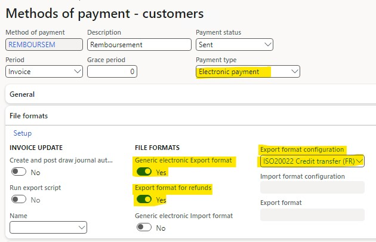

---
# required metadata

title: Refund payment processing in the Customer payment journal
description: This article explains how to provide a refund to clients from the customer payments journal using the ISO20022 Credit Transfer format.
author: ankviklis
ms.date: 11/06/2023
ms.topic: article
ms.prod: 
ms.technology: 

# optional metadata

ms.search.form: LedgerJournalTransCustPaym, LedgerJournalTransVendPaym
# ROBOTS: 
audience: Application User
# ms.devlang: 
ms.reviewer: kfend
# ms.tgt_pltfrm: 
ms.assetid: 53533ee3-470e-458a-ac8b-3815aa4cb502
ms.search.region: Global
# ms.search.industry: 
ms.author: ankviklis
ms.search.validFrom: 2023-03-11
ms.dyn365.ops.version: 10.0.36

---

# Refund payment processing in the Customer payment journal

[!include [banner](../includes/banner.md)]

This article explains how payment refunds are generated through the Customer payments journal using the ISO20022 Credit Transfer format. If a customer has a credit balance, you can refund the customer for the amount of the balance. This feature allows you to issue customer refunds and generate payment files with the ISO20022 Credit Transfer format in customer payments journals.

The following scenarios are supported:
- Refund or reimburse with a credit note.
- Refund a prepayment by using a payment proposal.
- Manual refund.

To configure the electronic payment format for customer refunds, complete the following steps:

1. Go to **Organization administration** > **Workspaces** > **Electronic reporting**.
2. Import the latest version of the **Payment model mapping for refunds to customers** configuration from the Microsoft Global Repository. For more information, see [Download ER configurations from the Global repository of Configuration service](../../fin-ops-core/dev-itpro/analytics/er-download-configurations-global-repo.md).

3. Go to **Accounts receivable** > **Payments setup** > **Methods of payment**.
4. Select **New** to set up the customer’s method of payment for the ISO20022 Credit Transfer format.
5. In the **Payment type** field, select **Electronic Payment**.
6. Set the **Generic electronic Export format** and **Export format for refunds** sliders to **Yes**. 

  

> [!NOTE]
> The same format configurations used for vendor payments are also used for these returning payments to customers in the **Export format configuration**.

For more information, see [Establish customer method of payment](tasks/establish-customer-method-payment.md).

To transfer the payment to the customers, provide the bank account details for the customers to whom you are providing the refunds. For more information, see [Set up a customer bank account](../localizations/europe/set-up-bank-accounts-iso20022-direct-debits.md#set-up-a-customer-bank-account).

To refund specific customer accounts, in the Customer payment journal, select the method of payment you created earlier, and then on the Action Pane, select **Functions** > **Generate payments**.

  

[!INCLUDE[footer-include](../../includes/footer-banner.md)]