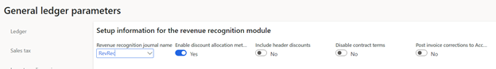
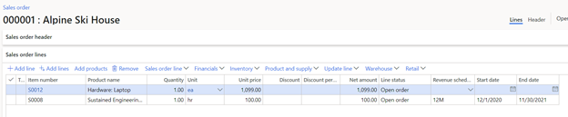
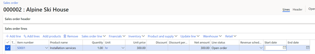
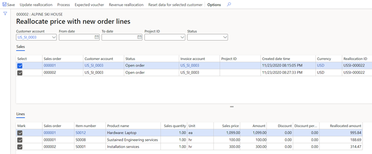
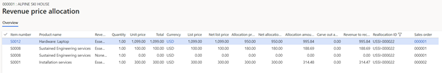

# Revenue recognition reallocation – Scenario 1

[!include [banner](../includes/banner.md)]

This article goes through a reallocation scenario where two sales orders are entered, but they are only confirmed. The same scenario will produce similar results if more than two sales orders are in a confirmed state.

For this scenario, the **Post invoice corrections to Accounts receivable** option is set to **No** on the **Revenue recognition** tab of the **General ledger parameters** page (**Revenue recognition \> Setup \> General ledger parameters**).

A sales order is created for customer US\_SI\_0003. The customer is purchasing a laptop (item number S0012) and a support plan for it (item number S0008, "Sustained Engineering Service"). The revenue for the laptop is immediately recognized (there is no revenue recognition schedule). The revenue for the support plan will be deferred and recognized over 12 months, as defined by the date range in the contract.

The sales order is confirmed. Because both items are set up for revenue price allocation, the revenue price is calculated when the sales order is confirmed. You can view the revenue that will be recognized on the **Revenue price allocation** page (on the **Sales order** page, on the Action Pane, on the **Manage** tab, in the **Revenue recognition** group, select **Revenue price allocation**). The revenue for the laptop will be posted to the Revenue account in the amount of $1,008.01. The revenue for the support plan will be posted to the Deferred revenue account in the amount of $190.99. The sum of the revenue prices must equal the sum of the lines that were set up to capture revenue price allocation ($1,199.00).

The customer chose not to purchase installation services (item number S0001) at the time of the sale but later changed their mind. Therefore, a second sales order is entered for the same customer.

The second sales order is confirmed. Because this sales order contains only one line, revenue price allocation isn't done when the sales order is confirmed. Revenue price allocation occurs only if there are two or more unique items, and if those items are set up for revenue price allocation.

If this new sales order is the only change to the customer's contract, the reallocation process can now be run. In one of the two sales orders, select **Reallocate price with new order lines** to open the **Reallocate price with new order lines** page. Alternatively, go to **Revenue recognition \> Periodic tasks \> Reallocate price with new order lines**. Select the two sales orders and the corresponding sales order lines, and then select **Update reallocation**. The **Reallocated amount** column shows the new revenue price for each sales order line.

If you select **Expected voucher**, nothing is shown, because no invoices have been posted.

To complete the reallocation, select **Process**. You're prompted for a posting date, even if nothing is posted. After the reallocation is completed, the **Revenue price allocation** page for each sales order will show the price allocation for all items across both sales orders. In other words, the **Revenue price allocation** page for each sales order will include an item that doesn't exist on that sales order, because it's part of the same contract but on a different sales order.

> [!TIP]
> To provide context about why these additional items are shown, you can add other columns to the grid, such as **Reallocation ID** and **Sales order**.
> 
> 

[!INCLUDE[footer-include](../../includes/footer-banner.md)]
