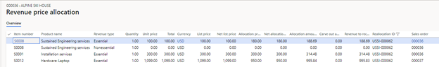

---
# required metadata

title: Revenue recognition reallocation - Scenario 2
description: This topic goes through a reallocation scenario where two sales orders are entered, and then the customer adds an item to the contract after first sales order is invoiced. When a new item is added to a contract, it can be added either to a new sales order or to the existing sales order.
author: kweekley
ms.date: 12/21/2020
ms.topic: index-page
ms.prod: 
ms.technology: 

# optional metadata

ms.search.form: Customer
audience: Application User
# ms.devlang: 
ms.reviewer: roschlom
# ms.tgt_pltfrm: 
# ms.custom: 
ms.search.region: Global 
# ms.search.industry: 
ms.author: kweekley
ms.search.validFrom: 2020-12-21
ms.dyn365.ops.version: 10.0.14

---

# Revenue recognition reallocation – Scenario 2

[!include [banner](../includes/banner.md)]

This topic goes through a reallocation scenario where two sales orders are entered, and then the customer adds an item to the contract after first sales order is invoiced. When a new item is added to a contract, it can be added either to a new sales order or to the existing sales order.

For this scenario, the **Post invoice corrections to Accounts receivable** option is set to **No** on the **Revenue recognition** tab of the **General ledger parameters** page (**Revenue recognition \> Setup \> General ledger parameters**).

A sales order is created for customer US\_SI\_0003. The customer is purchasing installation services (item number S0001) and a support plan (item number S0008) for a laptop, but they haven't yet selected the laptop. The revenue for the installation services will be deferred until the date when the laptop is purchased. The revenue for the support plan will be deferred and recognized over 12 months, as defined by the date range in the contract.

The sales order is confirmed. Because both items are set up for revenue price allocation, the revenue price is calculated when the sales order is confirmed. You can view the revenue that will be recognized on the **Revenue price allocation** page (on the **Sales order** page, on the Action Pane, on the **Manage** tab, in the **Revenue recognition** group, select **Revenue price allocation**). The revenue for the installation services will be posted to a Deferred revenue account in the amount of $250.00. The revenue for the support plan will also be posted to the Deferred revenue account, in the amount of $150.00. The sum of the revenue prices must equal the sum of the lines that were set up to capture revenue price allocation ($400.00).

The sales order is fully invoiced. The following illustration shows the accounting entry that is posted for the invoice.

The revenue recognition schedule is also created, but none of the revenue is recognized yet.

A few days later, the customer selects a laptop. A second sales order is entered for the customer.

The second sales order is confirmed. Because this sales order contains only one line, revenue price allocation isn't done when the sales order is confirmed. Revenue price allocation occurs only if there are two or more unique items, and if those items are set up for revenue price allocation.

If this new sales order is the only change to the customer's contract, the reallocation process can now be run. In one of the two sales orders, select **Reallocate price with new order lines** to open the **Reallocate price with new order lines** page. Alternatively, go to **Revenue recognition \> Periodic tasks \> Reallocate price with new order lines**. Select the two sales orders and the corresponding sales order lines, and then select **Update reallocation**. The **Reallocated amount** column shows the new revenue price for each sales order line.

Next, select **Expected voucher** to view the accounting entries that will be posted only to General ledger. Because the **Post invoice corrections to Accounts receivable** option is set to **No** on the **General ledger parameters** page, nothing will be changed in Accounts receivable when the reallocation is processed.

On the **Expected voucher** page, the last three lines reverse the original accounting entry from the posted invoice. The first four lines constitute the new accounting entry that is posted for the invoice. It's important that you understand that a new invoice isn't presented to the customer. After the reallocation, the customer still owes $426.00, which is the amount that must be posted to Accounts receivable in the new accounting entry. The offsetting tax and the deferred revenue equal $188.69 + $314.48 + $26.00 = $529.17. The deferred revenue amount has changed because of the reallocation. The difference of $103.17 is posted to a Partial invoice revenue clearing account. This balance will be cleared when the invoice is posted for the second sales order that was included in the reallocation.

To complete the reallocation, select **Process**. You're prompted for a posting date, even if nothing is posted. After the reallocation is completed, the **Revenue price allocation** page for each sales order will show the price allocation for all items across both sales orders. In other words, the **Revenue price allocation** page for each sales order will include an item that doesn't exist on that sales order, because it's part of the same contract but on a different sales order.

> [!TIP]
> To provide context about why these additional items are shown, you can add other columns to the grid, such as **Reallocation ID** and **Sales order**.
> 
> 

In sales order 00036, the revenue recognition schedule was also updated, based on the new revenue reallocation price. From this sales order, open the **Revenue recognition schedule** page. Previously, there were 13 lines for item S0008 (a 12-month schedule was assigned to this item). There are now 39 lines: the 13 original schedule lines, 13 reversal schedule lines, and 13 lines that are based on the new revenue price.

Likewise, there were previously two lines for item S0001, but now there are six.

When you select **Voucher** in sales order 000036, the invoice journal shows the original accounting entry. To view the reversing entry and the new accounting entry from the sales order, select **Revenue adjustments** on the Action Pane, and then select **Voucher**.

Next, open the **All customers** page (**Accounts receivable \> Customers \> All customers**), select customer **US\_SI\_0003**, and then select **Transactions**. The open invoice from sales order 000036 will be shown. If you select the voucher, you will see the original accounting entry, not the new accounting entry from the reallocation. The reversing entry and the new accounting entry can't be viewed from Accounts receivable.

The second sales order is now invoiced. The total invoice that is presented to the customer is for $1,099.00 + $71.44 tax = $1,170.44. The following illustration shows the accounting entry that is posted.

Because the sum of the revenue and sales is more than $1,170.44, the difference is posted for -$130.17. This amount clears the balance from the Partial invoice revenue clearing account. That balance is posted in the new accounting entry after the reallocation.

[!INCLUDE[footer-include](../../includes/footer-banner.md)]