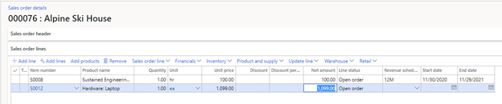
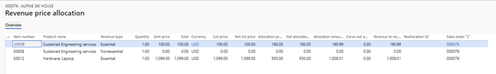
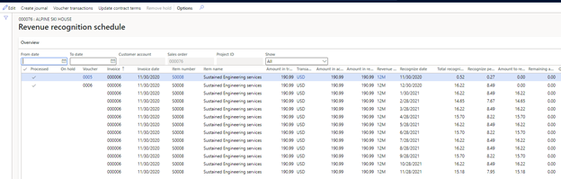
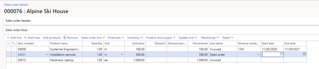
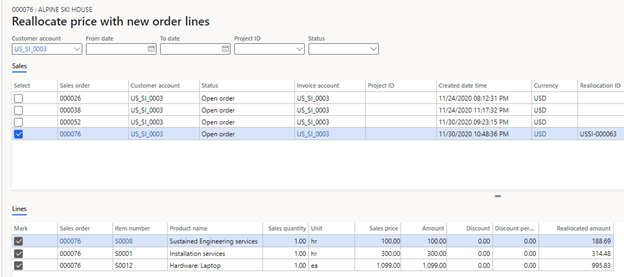
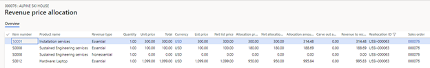
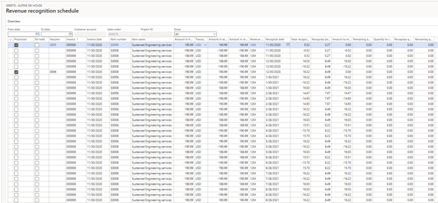
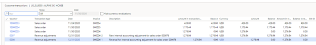
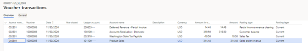

# Revenue recognition reallocation – Scenario 3

[!include [banner](../includes/banner.md)]

This article goes through a reallocation scenario where a new line is added to an existing, invoiced sales order. When a new item is added to a contract, it can be added either to a new sales order or to the existing sales order. This scenario also shows what occurs when Accounts receivable is updated because of the reallocation.

For this scenario, the **Post invoice corrections to Accounts receivable** option is set to **Yes** on the **Revenue recognition** tab of the **General ledger parameters** page (**Revenue recognition \> Setup \> General ledger parameters**).

A sales order is created for customer US\_SI\_0003. The customer is purchasing a laptop (item number S0012) and a support plan for it (item number S0008, "Sustained Engineering Service"). The revenue for the laptop is immediately recognized. The revenue for the support plan will be deferred and recognized over 12 months, as defined by the date range in the contract.

The sales order is confirmed. Because both items are set up for revenue price allocation, the revenue price is calculated when the sales order is confirmed. You can view the revenue that will be recognized on the **Revenue price allocation** page (on the **Sales order** page, on the Action Pane, on the **Manage** tab, in the **Revenue recognition** group, select **Revenue price allocation**). The revenue for the laptop will be posted to Revenue account in the amount of $1,008.01. The revenue for the support plan will be posted to the Deferred revenue account in the amount of $190.99. The sum of the revenue prices must equal the sum of the lines that were set up to capture revenue price allocation ($1,199.00).

The sales order is fully invoiced. The following illustration shows the accounting entry that is posted for the invoice.

The revenue recognition schedule is also created. After some time passes, two of the months have recognized revenue for the support plan.

At this point, the customer decides to add installation services (item number S0001). This item is added to the existing sales order. The customer is prompted to confirm that they want to modify the fully invoiced sales order, and they select **Yes**.

If this new item is the only change to the customer's contract, the reallocation process can be run now. In the sales order, select **Reallocate price with new order lines** to open the **Reallocate price with new order lines** page. Select all the sales order lines for this sales order, and then select **Update reallocation**. The **Reallocated amount** column shows the new revenue price for each sales order line.

Next, select **Expected voucher** to view the accounting entries. Because the **Post invoice corrections to Accounts receivable** option is set to **Yes** on the **General ledger parameters** page, these accounting entries will be posted to General ledger through the credit document, and a new invoice will be created in Accounts receivable.

On the **Expected voucher** page, the last four lines reverse the original accounting entry from the posted invoice. The first five lines are the new accounting entries that are posted for the invoice. It's important that you understand that a new invoice isn't presented to the customer. After the reallocation, the customer still owes $1,276.94, which is the amount that must be posted to Accounts receivable in the new accounting entry. The offsetting tax and the revenue or deferred revenue equal $995.83 + $188.69 + $77.94 = $1,262.46. The revenue or deferred revenue amount has changed because of the reallocation. The difference of -$14.48 is posted to a Partial invoice revenue clearing account. This balance will be cleared when the invoice is posted for the new item that was added to the sales order.

To complete the reallocation, select **Process**. A posting date is entered. After the reallocation is completed, the **Revenue price allocation** page shows the price reallocation for all three items.

The revenue recognition schedule was also updated, based on the new revenue reallocation price. From the sales order, open the **Revenue recognition schedule** page. Previously, there were 13 lines for item S0008 (a 12-month schedule was assigned to this item). There are now 39 lines: the 13 original schedule lines, 13 reversal schedule lines, and 13 lines that are based on the new revenue price.

When you select **Voucher**, the invoice journal shows the original accounting entry. To view the reversing entry and the new accounting entry from the sales order, select **Revenue adjustments** on the Action Pane, and then select **Voucher**.

Next, open the **All customers** page (**Accounts receivable \> Customers \> All customers**), select customer **US\_SI\_0003**, and then select **Transactions**. The **Customer transactions** page shows the original invoice (000006), the reversing document (000006-1), and the new invoice (000006-2). The original invoice and the reversing document are settled against each other and have a balance of 0 (zero). View the voucher for each document to see the impact in General ledger.

The sales order is invoiced again for the item that was added. The total invoice that is presented to the customer is for $300.00 + $19.50 tax = $319.50. The following illustration shows the accounting entry that is posted.

Because the sum of the revenue and sales is more than $319.50, the difference is posted for $14.48. This amount clears the balance from the Partial invoice revenue clearing account. That balance was updated in the new accounting entry that was posted after the reallocation.

[!INCLUDE[footer-include](../../includes/footer-banner.md)]
