# Revenue recognition reallocation – Scenario 3

[!INCLUDE [banner](../includes/banner.md)]

This article describes a reallocation scenario where you add a new line to an existing, invoiced sales order. When you add a new item to a contract, you can add it to either a new sales order or the existing sales order. This scenario also shows what happens when Accounts receivable is updated because of the reallocation.

For this scenario, set the **Post invoice corrections to Accounts receivable** option to **Yes** on the **Revenue recognition** tab of the **General ledger parameters** page (**Revenue recognition** > **Setup** > **General ledger parameters**).

[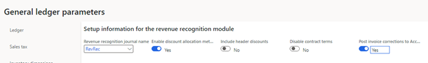](./media/25_rev-rec-scenarios.png)

Create a sales order for customer US\_SI\_0003. The customer purchases a laptop (item number S0012) and a support plan for it (item number S0008, "Sustained Engineering Service"). The revenue for the laptop is recognized immediately. The revenue for the support plan is deferred and recognized over 12 months, as defined by the date range in the contract.

[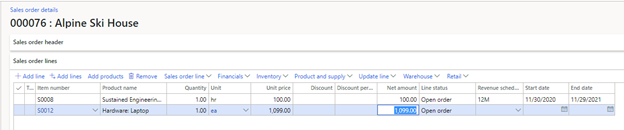](./media/26_rev-rec-scenarios.png)

Confirm the sales order. Because both items are set up for revenue price allocation, the system calculates the revenue price when you confirm the sales order. You can view the revenue that will be recognized on the **Revenue price allocation** page (on the **Sales order** page, on the Action Pane, on the **Manage** tab, in the **Revenue recognition** group, select **Revenue price allocation**). The revenue for the laptop is posted to the Revenue account in the amount of $1,008.01. The revenue for the support plan is posted to the Deferred revenue account in the amount of $190.99. The sum of the revenue prices equals the sum of the lines that are set up to capture revenue price allocation ($1,199.00).

[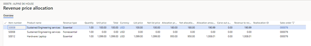](./media/27_rev-rec-scenarios.png)

Fully invoice the sales order. The following illustration shows the accounting entry that is posted for the invoice.

[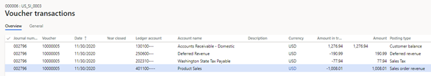](./media/28_rev-rec-scenarios.png)

Create the revenue recognition schedule. After some time passes, two of the months recognize revenue for the support plan.

[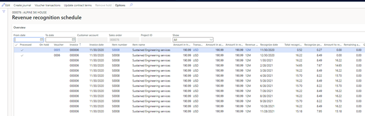](./media/29_rev-rec-scenarios.png)

At this point, the customer decides to add installation services (item number S0001). Add this item to the existing sales order. The customer is prompted to confirm that they want to modify the fully invoiced sales order, and they select **Yes**.

[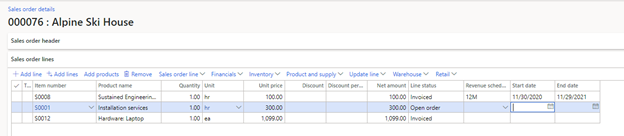](./media/30_rev-rec-scenarios.png)

If this new item is the only change to the customer's contract, run the reallocation process now. In the sales order, select **Reallocate price with new order lines** to open the **Reallocate price with new order lines** page. Select all the sales order lines for this sales order, and then select **Update reallocation**. The **Reallocated amount** column shows the new revenue price for each sales order line.

[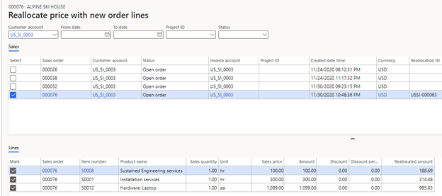](./media/31_rev-rec-scenarios.png)

Next, select **Expected voucher** to view the accounting entries. Because the **Post invoice corrections to Accounts receivable** option is set to **Yes** on the **General ledger parameters** page, post these accounting entries to General ledger through the credit document, and create a new invoice in Accounts receivable.

[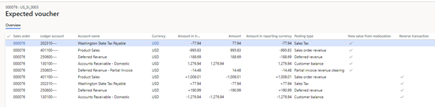](./media/32_rev-rec-scenarios.png)

On the **Expected voucher** page, the last four lines reverse the original accounting entry from the posted invoice. The first five lines are the new accounting entries that are posted for the invoice. It's important that you understand that a new invoice isn't presented to the customer. After the reallocation, the customer still owes $1,276.94, which is the amount that must be posted to Accounts receivable in the new accounting entry. The offsetting tax and the revenue or deferred revenue equal $995.83 + $188.69 + $77.94 = $1,262.46. The revenue or deferred revenue amount has changed because of the reallocation. The difference of -$14.48 is posted to a Partial invoice revenue clearing account. This balance is cleared when the invoice is posted for the new item that was added to the sales order.

To complete the reallocation, select **Process**. Enter a posting date. After the reallocation is completed, the **Revenue price allocation** page shows the price reallocation for all three items.

[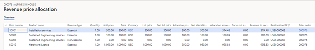](./media/33_rev-rec-scenarios.png)

Update the revenue recognition schedule, based on the new revenue reallocation price. From the sales order, open the **Revenue recognition schedule** page. Previously, there were 13 lines for item S0008 (a 12-month schedule was assigned to this item). There are now 39 lines: the 13 original schedule lines, 13 reversal schedule lines, and 13 lines that are based on the new revenue price.

[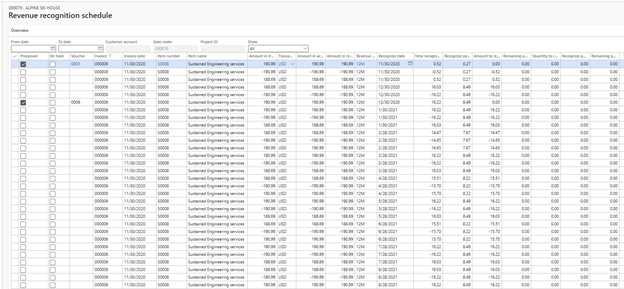](./media/34_rev-rec-scenarios.png)

When you select **Voucher**, the invoice journal shows the original accounting entry. To view the reversing entry and the new accounting entry from the sales order, select **Revenue adjustments** on the Action Pane, and then select **Voucher**.

Next, open the **All customers** page (**Accounts receivable** > **Customers** > **All customers**), select customer **US\_SI\_0003**, and then select **Transactions**. The **Customer transactions** page shows the original invoice (000006), the reversing document (000006-1), and the new invoice (000006-2). The original invoice and the reversing document are settled against each other and have a balance of 0 (zero). View the voucher for each document to see the impact in General ledger.

[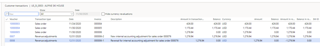](./media/35_rev-rec-scenarios.png)

Invoice the sales order again for the item that you added. The total invoice that you present to the customer is for $300.00 + $19.50 tax = $319.50. The following illustration shows the accounting entry that is posted.

[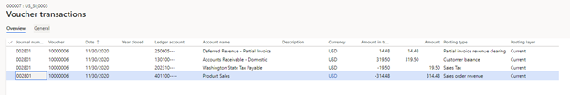](./media/36_rev-rec-scenarios.png)

Because the sum of the revenue and sales is more than $319.50, post the difference for $14.48. This amount clears the balance from the Partial invoice revenue clearing account. That balance was updated in the new accounting entry that was posted after the reallocation.

[!INCLUDE[footer-include](../../includes/footer-banner.md)]
