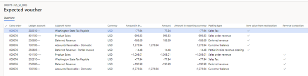

---
# required metadata

title: Revenue recognition reallocation - scenario 3 
description: This scenario walks through a reallocation scenario where a new line is added to an existing, invoiced sales order. When adding a new item to a contract, the new item can be added to a new sales order, or added to the existing sales order.
author: kweekley
manager: aolson
ms.date: 12/21/2020
ms.topic: index-page
ms.prod: 
ms.service: dynamics-ax-applications
ms.technology: 

# optional metadata

ms.search.form: Customer
audience: Application User
# ms.devlang: 
ms.reviewer: roschlom
ms.search.scope: Core, Operations
# ms.tgt_pltfrm: 
# ms.custom: 
ms.search.region: Global 
# ms.search.industry: 
ms.author: kweekley
ms.search.validFrom: 2020-12-21
ms.dyn365.ops.version: 10.0.14

---

# Revenue recognition reallocation - scenario 3

This scenario walks through a reallocation scenario where a new line is added to an existing, invoiced sales order. When adding a new item to a contract, the new item can be added to a new sales order, or added to the existing sales order. This scenario also walks through what happens when Accounts receivable is updated as a result of the reallocation. 

The General ledger parameter, **Post invoice corrections to Accounts receivable**, should be set to Yes.
 

A sales order is created for customer US_SI_0003. The customer is purchasing a laptop (S0012) and support (S0008) for the laptop.  The laptop’s revenue is recognized immediately, and revenue for the support plan will be deferred and recognized over 12 months as defined by the date range defined in the contract. 

The sales order is confirmed. Both items are set up for revenue price allocation, so confirmation calculates the revenue price. The revenue to recognize can be seen from the **Sales order** Action Pane, under **Manage > Revenue recognition > Revenue price allocation**. The support item will post to deferred revenue for $190.99. The laptop will also post to revenue for $1,008.01.  The sum of the revenue prices must equal the sum of the lines that have been set up for revenue price allocation, which is equal to $1,199.00.

The sales order is fully invoiced. The following accounting entry is posted for the invoice.

The Revenue recognition schedule is also created.  After some time passes, two of the months have recognized revenue for the **Sustained engineering services** item. 

The customer decides to add an installation service (S0001). The item is added to the existing sales order. A message asks whether they want to modify the fully invoiced sales order, and they select **Yes**. 

If this is the only change to the customer’s contract, the reallocation process can be run now. From the sales order, open **Reallocate price with new order lines**.  All sales order lines for this sales order are selected, then click the **Update reallocation** button.  The **Reallocated amount** column displays the new revenue prices for each sales order line.

Next select **Expected voucher** to see the accounting entries. Based on the General ledger parameter settings, these accounting entries will be posted to General ledger through the credit document and a new invoice will be created in Accounts receivable.  

The last four lines reverse the original accounting entry from the posted invoice. 

The top five lines are the new accounting posted for the invoice. It’s important to understand that the customer isn’t presented with a new invoice.  After the reallocation, the customer still owes $1,276.94, which is the amount that must post to Accounts receivable in the new accounting entry.  The offsetting tax and revenue/deferred revenue is equal to $995.83 + $188.69 + $77.94 = $1,262.46. The revenue or deferred revenue amount changed due to the reallocation.  The difference of -$14.48 is posted to a Partial invoice revenue clearing account.  This balance will be cleared when the invoice is posted for the new item added to the sales order.

The reallocation is completed by choosing the **Process** button. A posting date is entered. The **Revenue price allocation** page now displays the price reallocation for all three items.

The revenue recognition schedule was also updated based on the new revenue reallocation price.  From the sales order, open the **Revenue recognition schedule** page.  Previously there were 13 lines for item S0008 which was assigned a 12M schedule. Now there are 39 lines: 13 original schedule lines, 13 reversal schedule lines, and 13 lines based on the new revenue price.  

The Invoice journal displays the original accounting entry when you click **Voucher**. To see the reversing entry and the new accounting entry from the sales order, click the **Revenue adjustments** button from the Action Pane, then click **Voucher**.

Next navigate to **Accounts receivable > Customers > All customers**, select customer US_SI_0003, and then click the **Transactions** button.  You will see the original invoice (000006), the reversing document (000006-1), and the new invoice (000006-2). The original invoice and reversing document are settled against each other and have a balance of zero. View the voucher for each document to see the impact in General ledger. 
  

The sales order is invoiced again for the item that was added. The total invoice presented to the customer is $300.00 + $19.50 tax = $319.50.  The following accounting entry is posted.

Because the sum of the revenue and sales is more than $319.50, the difference is posted for $14.48.  This clears the balance from the Partial invoice revenue clearing account that was updated in the new accounting entry that was posted after the reallocation.

