---
# required metadata

title: Revenue recognition reallocation - Scenario 4
description: This topic goes through a reallocation scenario where a line is removed from an existing, partially invoiced sales order. This scenario produces the same result, regardless of whether the line is removed from the sales order or set to a canceled status.
author: kweekley
ms.date: 12/21/2020
ms.topic: index-page
ms.prod: 
ms.technology: 

# optional metadata

ms.search.form: Customer
audience: Application User
# ms.devlang: 
ms.reviewer: roschlom
# ms.tgt_pltfrm: 
# ms.custom: 
ms.search.region: Global 
# ms.search.industry: 
ms.author: kweekley
ms.search.validFrom: 2020-12-21
ms.dyn365.ops.version: 10.0.14

---

# Revenue recognition reallocation – Scenario 4

[!include [banner](../includes/banner.md)]

This topic goes through a reallocation scenario where a line is removed from an existing, partially invoiced sales order. This scenario produces the same result, regardless of whether the line is removed from the sales order or set to a canceled status.

For this scenario, the **Post invoice corrections to Accounts receivable** option is set to **No** on the **Revenue recognition** tab of the **General ledger parameters** page (**Revenue recognition \> Setup \> General ledger parameters**).

[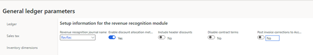](./media/37_rev-rec-scenarios.png)

A sales order is created for customer US\_SI\_0003. The customer is purchasing a laptop (item number S0012), installation services (item number S0001), and a support plan for the laptop (item number S0008, "Sustained Engineering Service"). The revenue for the laptop and installation services is immediately recognized. The revenue for the support plan will be deferred and recognized over 12 months, as defined by the date range in the contract.

[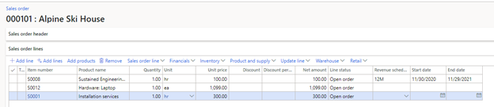](./media/38_rev-rec-scenarios.png)

The sales order is confirmed. Because all three items are set up for revenue price allocation, the revenue price is calculated when the sales order is confirmed. You can view the revenue that will be recognized on the **Revenue price allocation** page (on the **Sales order** page, on the Action Pane, on the **Manage** tab, in the **Revenue recognition** group, select **Revenue price allocation**). The revenue for the laptop will be posted to the Revenue account in the amount of $995.84. The revenue for the installation services will also be posted to the Revenue account, in the amount of $314.47. The revenue for the support plan will be posted to a Deferred revenue account in the amount of $188.69. The sum of the revenue prices must equal the sum of the lines that were set up to capture revenue price allocation ($1,499.00).

[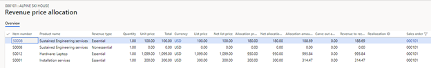](./media/39_rev-rec-scenarios.png)

The customer is invoiced for the laptop and support plan, but not for the installation services. The following illustration shows the accounting entry that is posted for the invoice.

[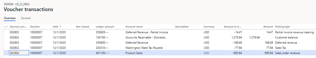](./media/40_rev-rec-scenarios.png)

The accounting entry posts $1,276.94 to Accounts receivable. However, because this invoice is a partial invoice, the revenue or deferred revenue plus the tax doesn't equal the Accounts receivable amount. The difference of -$14.47 is posted to the Partial invoice revenue clearing account.

The revenue recognition schedule is also created.

[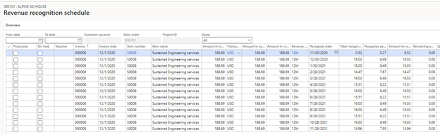](./media/41_rev-rec-scenarios.png)

Later, the customer decides not to purchase installation services. Therefore, that line is removed from the sales order. Note that the sales order can't be confirmed again, because only invoiced lines remain on the sales order.

[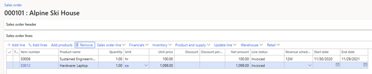](./media/42_rev-rec-scenarios.png)

Even though the sales order can't be confirmed, it can be reallocated. In the sales order, select **Reallocate price with new order lines** to open the **Reallocate price with new order lines** page. Select the two remaining sales order lines, and then select **Update reallocation**. The **Reallocated amount** column shows the new revenue price for each remaining sales order line.

[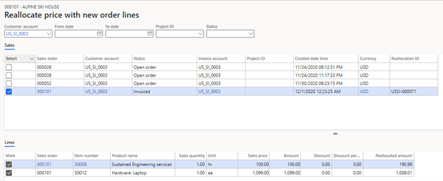](./media/43_rev-rec-scenarios.png)

Next, select **Expected voucher** to view the accounting entries.

[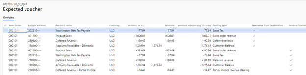](./media/44_rev-rec-scenarios.png)

On the **Expected voucher** page, the last five lines reverse the original accounting entry from the posted invoice. The first four lines are the new accounting entries that are posted for the invoice. It's important that you understand that a new invoice isn't presented to the customer. After the reallocation, the customer still owes $1,276.94, which is the amount that must be posted to Accounts receivable in the new accounting entry. The new revenue or deferred revenue plus tax equals $1,276.94. Therefore, you don't have to post to the Partial invoice revenue clearing account.

To complete the reallocation, select **Process**. A posting date is entered. After the reallocation is completed, the **Revenue price allocation** page shows the price reallocation for the two remaining items.

[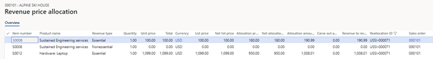](./media/45_rev-rec-scenarios.png)

The revenue recognition schedule was also updated, based on the new revenue reallocation price. From the sales order, open the **Revenue recognition schedule** page. Previously, there were 13 lines for item S0008 (a 12-month schedule was assigned to this item). There are now 39 lines: the 13 original schedule lines, 13 reversal schedule lines, and 13 lines that are based on the new revenue price.

[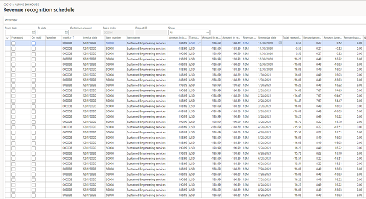](./media/46_rev-rec-scenarios.png)

When you select **Voucher**, the invoice journal shows the original accounting entry. To view the reversing entry and the new accounting entry from the sales order, select **Revenue adjustments** on the Action Pane, and then select **Voucher**.

Next, open the **All customers** page (**Accounts receivable \> Customers \> All customers**), select customer **US\_SI\_0003**, and then select **Transactions**. The **Customer transactions** page shows only the original invoice (000008), together with the original accounting entry. Because the **Post invoice corrections to Accounts receivable** option is set to **No** on the **General ledger parameters** page, only General ledger is updated. Therefore, the reversing and updated accounting entries aren't shown. Note that the revenue adjustment transactions that were created in [scenario 3](rev-rec-reallocation-scenario-3.md) are shown.

[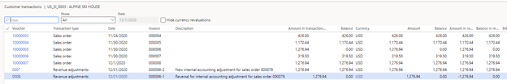](./media/47_rev-rec-scenarios.png)

[!INCLUDE[footer-include](../../includes/footer-banner.md)]