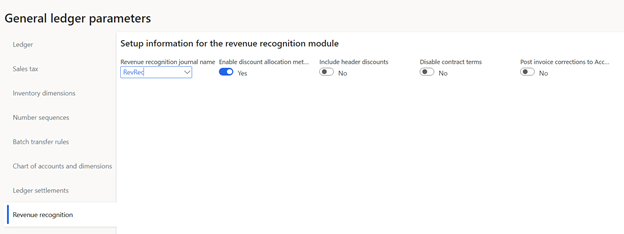
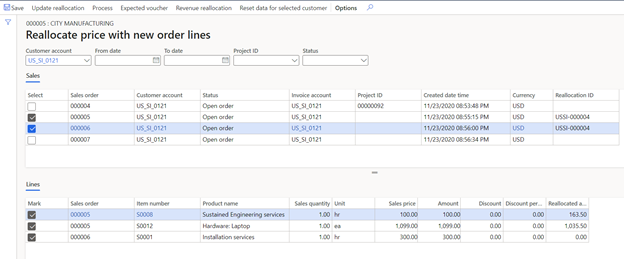
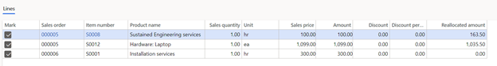
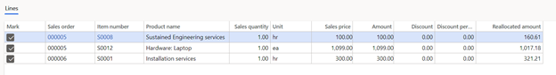
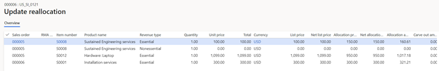

---
# required metadata

title: Revenue recognition reallocation
description: This article provides information about reallocation, which enables organizations to recalculate revenue prices when the terms of a contractual sale are changed. It includes links to other topics that describe how to recognize revenue in multiple scenarios.
author: bking
ms.date: 02/22/2023
ms.topic: index-page
ms.prod: 
ms.technology: 

# optional metadata

ms.search.form: Customer
audience: Application User
# ms.devlang: 
ms.reviewer: twheeloc
# ms.tgt_pltfrm: 
# ms.custom: 
ms.search.region: Global 
# ms.search.industry: 
ms.author: bking
ms.search.validFrom: 2020-12-21
ms.dyn365.ops.version: 10.0.14

---

# Revenue recognition reallocation

[!include [banner](../includes/banner.md)]

Reallocation enables organizations to recalculate revenue prices when the terms of a contractual sale are changed. For the purpose of revenue recognition, the sales order documents are considered the contract.

Your organization must determine for itself whether reallocation is required. The addition of a new line to a sales order, or the addition of a new sales order for a customer, might not constitute a change to the contract. The following scenarios might require reallocation:

- A customer added items to a sales order, or removed items from the sales order, after the order was fully or partially invoiced.
- Multiple sales orders, in either a confirmed state or an invoiced state, were entered for the same negotiated contract.
- A customer returned or received a credit for an item after the original sales order was fully or partially invoiced.

There are a few important limitations on the reallocation process:
- If multiple sales orders are involved, they must be for the same customer account.
- All sales orders that are reallocated must be in the same transaction currency.

## Set up reallocation

One parameter affects the reallocation process.

Because reallocation can be done on a sales order that is partially or fully invoiced, any previous accounting entries for the invoice must be corrected by using the new, reallocated revenue prices. This correction is done by reversing the original invoice's accounting entry and posting a new accounting entry that is based on the reallocated revenue prices.

Every organization must decide whether the correction should update only General ledger, or whether it should also update Accounts receivable. The decision that is reached determines the appropriate setting of the **Post invoice corrections to Accounts receivable** option on the **Revenue recognition** tab of the **General ledger parameters** page (**Revenue recognition \> Setup \> General ledger parameters**). The appropriate setting depends on the specific scenario. For more information about possible scenarios, use the links in the [Scenarios for reallocation](#scenarios-for-reallocation) section later in this article.

If the **Post invoice corrections to Accounts receivable** option is set to **Yes**, the reallocation process produces the following result:

- A credit document is created in Accounts receivable to reverse the invoice that requires correction.

    - The credit document reuses the original invoice number, but "-1" is appended to it.
    - The credit document is automatically settled against the original invoice. If the original invoice was already settled with another credit document or payment, that settlement is automatically reversed.
    - The credit document is posted to General ledger to reverse the accounting entry that was posted on the original invoice. However, the Inventory and Cost of goods sold (COGS) transaction entries aren't reversed.

- A new invoice that is based on the new, reallocated price amounts is created in Accounts receivable.

    - The new invoice reuses the original invoice number, but "-2" is appended to it.
    - The new invoice is automatically settled against any credit document or payments that were previously settled with the original invoice.
    - The new invoice is posted to General ledger by using the new, reallocated revenue price amounts. It isn't posted to the Inventory and COGS accounts again, because those entries are maintained on the original invoice's accounting entry.

If the **Post invoice corrections to Accounts receivable** option is set to **No**, the reallocation process produces the following result:

- A reversing accounting entry is posted only to General ledger. All the accounting from the original invoice is reversed, except the Inventory and COGS account entries.
- A new accounting entry is posted only to General ledger, based on the new, reallocated revenue prices. It isn't posted to the Inventory and COGS accounts again, because those entries are maintained on the original invoice's accounting entry.
- The invoice on the **Customer transactions** page isn't affected or changed, but still reflects the original accounting entry. There is no reference to the reversing or new accounting entries.

As has been mentioned, you can update only General ledger, or you can update both General ledger and Accounts receivable. Both approaches have pros and cons. We recommend that you evaluate your organization's requirements to determine which option you should use. If you update both General ledger and Accounts receivable, the correct accounting entries will be shown on the new invoice and can be viewed from the document on the **Customer transactions** page. Additionally, the settlement process will use the updated accounting entries to post any cash discounts and gains or losses. On the other hand, the credit document and the new invoice will appear on customer statements and aging reports, just as other credit documents and customer invoices do. The description of those documents will indicate that they were created through an accounting correction.

## Run the reallocation process

To start the reallocation process, select **Reallocate price with new order lines** in any sales order that you must reallocate. Alternatively, go to **Revenue recognition \> Periodic tasks \> Reallocate price with new order lines**, and then enter the appropriate filters, such as the customer account.

The upper grid on the **Reallocate price with new order lines** page is named **Sales**. It lists the sales orders for the customer. Select the sales orders that must be reallocated. If a sales order has a reallocation ID, it has already been marked for reallocation by another user. If one or more sales orders were previously reallocated and must be included in another reallocation, the reallocation of those sales orders must first be undone. It can then be included in a new reallocation. For more detailed information, see the [Undo a reallocation](#undo-a-reallocation) and [Reallocate multiple times](#reallocate-multiple-times) sections later in this article.

The lower grid on the page is named **Lines**. After you select one or more sales orders in the **Sales** grid, the **Lines** grid shows the sales order lines. Select the sales order lines that must be reallocated. If you selected only one sales order, lines on the same sales order must be reallocated. This situation can occur when one of the sales order lines was previously invoiced, and then a new line was added, or an existing line was removed or canceled. If a line was removed, it won't appear in the grid. Therefore, it can't be selected. However, it will still be considered when the reallocation process is run.

After you've finished selecting the required sales order lines, use the buttons on the Action Pane as described here:

- **Update reallocation** – Calculate the new revenue price amounts for the selected sales order lines. If a line was removed or canceled, the reallocation will be done only for the existing lines that you selected. The following illustration shows an example of sales order lines before the reallocation is updated.

    

    The new revenue price amounts are shown in the **Reallocated amount** column in the **Lines** grid. At this point, the reallocation has been processed, but it hasn't yet been calculated. The following illustration shows an example of sales order lines after the reallocation is updated.

    

- **Process** – Process or post the reallocated revenue prices. After you select this button, there is no way to reverse the reallocation. If you didn't select **Update reallocation** before you select **Process**, the reallocation is automatically run.

    - If no sales order line has been invoiced, the revenue price amounts are updated on any sales orders that were selected for reallocation.
    - If one or more sales order lines have been invoiced, correcting accounting entries are posted, and any revenue schedule details that were created for the invoiced sales order line are corrected.

- **Expected voucher** – Show a preview of the accounting entries that have been created for any sales order lines that have been invoiced. If no lines have been invoiced, nothing is shown. If you didn't select **Update reallocation** before you select **Expected voucher**, the reallocation is automatically run.
- **Revenue reallocation** – Open a page that shows the revenue price allocation for all the selected lines. You can't change any of the information on the page. It shows the line amounts that were used to do the reallocation.

    

- **Reset data for selected customer** – If the reallocation process was started but wasn't completed, clear the data in the reallocation table for the selected customer only. For example, you mark multiple sales order lines for reallocation, you leave the page open without selecting **Process**, and then the page times out. In this case, the sales order lines will remain marked and won't be available for another user to complete the reallocation process. The page might even be blank when it's opened. In this situation, the **Reset data for selected customer** button can be used to clear unprocessed sales orders so that another user can complete the reallocation process.

## Undo a reallocation

A reallocation is undone by running another reallocation. The reallocation is done again, and the user selects different sales order lines to include in the second reallocation process.

If a reallocation has been done across two or more separate sales orders, it can be undone by selecting **Reallocate price with new order lines** from any sales order that is included in the reallocation. You can't go to **Revenue recognition \> Periodic tasks \> Reallocate price with new order lines** to undo the reallocation, because the page that is opened in this way shows only sales orders that have no reallocation ID. The reallocation ID is assigned after the document has been reallocated.

On the **Reallocate price with new order lines** page, unmark any sales orders that should be excluded from the contractual agreement. Use the appropriate buttons on the Action Pane, such as **Update reallocation** and **Process**, to process the reallocation. If all sales orders except the active sales order are unmarked, the reallocation ID will be removed when the change is processed.

If a reallocation has been done by adding a new line to a fully or partially invoiced sales order, the reallocation can be undone only by removing that line from the sales order and then running the reallocation again. The sales order line must be removed because all lines on a sales order are assumed to be part of the same contract. You can't unmark a sales order line while you're on the **Reallocate price with new order lines** page.

## Reallocate multiple times

Multiple reallocations can be done against the same sales order if multiple changes have been made to the contract. Every reallocation triggers the assignment of a reallocation ID to the sales order or group of sales orders, to group together the changes. If multiple reallocations are done, each additional reallocation uses the same reallocation ID as the first reallocation.

For example, sales order 00045 is entered and has multiple lines. After the sales order is fully invoiced, a new sales order line is added to it. The reallocation is then run by opening the **Reallocate price with new order lines** page either from sales order 00045 or by going **Revenue recognition \> Periodic tasks \> Reallocate price with new order lines**. The reallocation ID **Reall000001** is assigned to the sales order.

A second sales order, 00052, is created for the same contract. The reallocation can be run again by opening the **Reallocate price with new order lines** page from sales order 00045, but not from sales order 00052. If you open the **Reallocate price with new order lines** page from sales order 00052, sales order 00045 won't be shown, because a reallocation ID has been assigned to it. The page shows only sales orders that have no reallocation ID.

There are two ways to do the second reallocation. You can undo the reallocation of sales order 00045. In this case, the reallocation ID is removed, and you can then do the reallocation from either sales order 00045 or sales order 00052. Alternatively, you can open the **Reallocate price with new order lines** page from sales order 00045 and add the second sales order. When the reallocation is processed, reallocation ID **Reall000001** will be assigned to both sales order 00045 and sales order 00052.

## Scenarios for reallocation

The following topics go through various scenarios for revenue recognition:

- [Revenue recognition reallocation – Scenario 1](rev-rec-reallocation-scenario-1.md) – Two sales orders are entered, but they are only confirmed. The same scenario will produce similar results if more than two sales orders are in a confirmed state.
- [Revenue recognition reallocation – Scenario 2](rev-rec-reallocation-scenario-2.md) – Two sales orders are entered, and then the customer adds an item to the contract after first sales order is invoiced.
- [Revenue recognition reallocation – Scenario 3](rev-rec-reallocation-scenario-3.md) – A new line is added to an existing, invoiced sales order.
- [Revenue recognition reallocation – Scenario 4](rev-rec-reallocation-scenario-4.md) – A line is removed from an existing, partially invoiced sales order.

[!INCLUDE[footer-include](../../includes/footer-banner.md)]
