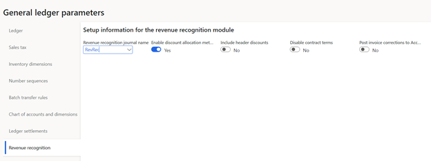
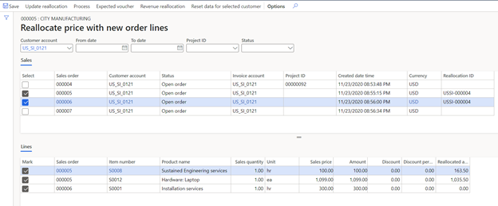
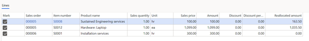
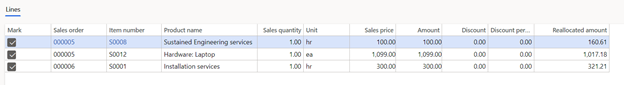
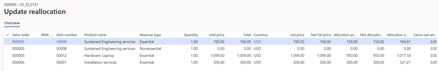

# Revenue recognition reallocation

[!INCLUDE [banner](../includes/banner.md)]

Reallocation enables organizations to recalculate revenue prices when the terms of a contractual sale change. For revenue recognition, consider the sales order documents as the contract.

Your organization must determine whether reallocation is required. Adding a new line to a sales order or adding a new sales order for a customer might not constitute a change to the contract. The following scenarios might require reallocation:

- A customer added items to a sales order, or removed items from the sales order, after the order was fully or partially invoiced.
- Multiple sales orders, in either a confirmed state or an invoiced state, were entered for the same negotiated contract.
- A customer returned or received a credit for an item after the original sales order was fully or partially invoiced.

There are a few important limitations on the reallocation process:

- If multiple sales orders are involved, they must be for the same customer account.
- All sales orders that are reallocated must be in the same transaction currency.

## Set up reallocation

One parameter affects the reallocation process.

Because reallocation can be done on a sales order that is partially or fully invoiced, any previous accounting entries for the invoice must be corrected by using the new, reallocated revenue prices. This correction is done by reversing the original invoice's accounting entry and posting a new accounting entry that is based on the reallocated revenue prices.

Every organization must decide whether the correction should update only General ledger, or whether it should also update Accounts receivable. The decision that is reached determines the appropriate setting of the **Post invoice corrections to Accounts receivable** option on the **Revenue recognition** tab of the **General ledger parameters** page (**Revenue recognition \> Setup \> General ledger parameters**). The appropriate setting depends on the specific scenario. For more information about possible scenarios, see the [Scenarios for reallocation](#scenarios-for-reallocation) section later in this article.

If the **Post invoice corrections to Accounts receivable** option is set to **Yes**, the reallocation process produces the following result:

- A credit document is created in Accounts receivable to reverse the invoice that requires correction.

  - The credit document reuses the original invoice number, but "-1" is appended to it.
  - The credit document is automatically settled against the original invoice. If the original invoice was already settled with another credit document or payment, that settlement is automatically reversed.
  - The credit document is posted to General ledger to reverse the accounting entry that was posted on the original invoice. However, the Inventory and Cost of goods sold (COGS) transaction entries aren't reversed.

- A new invoice that is based on the new, reallocated price amounts is created in Accounts receivable.

  - The new invoice reuses the original invoice number, but "-2" is appended to it.
  - The new invoice is automatically settled against any credit document or payments that were previously settled with the original invoice.
  - The new invoice is posted to General ledger by using the new, reallocated revenue price amounts. It isn't posted to the Inventory and COGS accounts again, because those entries are maintained on the original invoice's accounting entry.

If the **Post invoice corrections to Accounts receivable** option is set to **No**, the reallocation process produces the following result:

- A reversing accounting entry is posted only to General ledger. All the accounting from the original invoice is reversed, except the Inventory and COGS account entries.
- A new accounting entry is posted only to General ledger, based on the new, reallocated revenue prices. It isn't posted to the Inventory and COGS accounts again, because those entries are maintained on the original invoice's accounting entry.
- The invoice on the **Customer transactions** page isn't affected or changed, but still reflects the original accounting entry. There is no reference to the reversing or new accounting entries.

As mentioned, you can update only General ledger, or you can update both General ledger and Accounts receivable. Both approaches have pros and cons. Evaluate your organization's requirements to determine which option to use. If you update both General ledger and Accounts receivable, the correct accounting entries appear on the new invoice and can be viewed from the document on the **Customer transactions** page. Also, the settlement process uses the updated accounting entries to post any cash discounts and gains or losses. On the other hand, the credit document and the new invoice appear on customer statements and aging reports, just as other credit documents and customer invoices do. The description of those documents indicates that they were created through an accounting correction.

## Run the reallocation process

To start the reallocation process, select **Reallocate price with new order lines** in any sales order that you must reallocate. Alternatively, go to **Revenue recognition** > **Periodic tasks** > **Reallocate price with new order lines**, and then enter the appropriate filters, such as the customer account.

The upper grid on the **Reallocate price with new order lines** page is named **Sales**. It lists the sales orders for the customer. Select the sales orders that must be reallocated. If a sales order has a reallocation ID, it is already marked for reallocation by another user. If one or more sales orders were previously reallocated and must be included in another reallocation, you must first undo the reallocation of those sales orders. You can then include them in a new reallocation. For more detailed information, see the [Undo a reallocation](#undo-a-reallocation) and [Reallocate multiple times](#reallocate-multiple-times) sections later in this article.

The lower grid on the page is named **Lines**. After you select one or more sales orders in the **Sales** grid, the **Lines** grid shows the sales order lines. Select the sales order lines that must be reallocated. If you selected only one sales order, you must reallocate lines on the same sales order. This situation can occur when one of the sales order lines was previously invoiced, and then you added a new line or removed or canceled an existing line. If you removed a line, it doesn't appear in the grid and can't be selected. However, the reallocation process still considers it.

After you finish selecting the required sales order lines, use the buttons on the Action Pane as described here:

- **Update reallocation** – Calculate the new revenue price amounts for the selected sales order lines. If you removed or canceled a line, the reallocation process updates only the existing lines that you selected. The following illustration shows an example of sales order lines before the reallocation is updated.

    

    The new revenue price amounts are shown in the **Reallocated amount** column in the **Lines** grid. At this point, the reallocation is processed but not yet calculated. The following illustration shows an example of sales order lines after the reallocation is updated.

    

- **Process** – Process or post the reallocated revenue prices. After you select this button, there's no way to reverse the reallocation. If you didn't select **Update reallocation** before you select **Process**, the reallocation automatically runs.

  - If no sales order line is invoiced, the revenue price amounts are updated on any sales orders that you selected for reallocation.
  - If one or more sales order lines are invoiced, the process posts correcting accounting entries and corrects any revenue schedule details that it created for the invoiced sales order line.

- **Expected voucher** – Show a preview of the accounting entries that the process created for any sales order lines that are invoiced. If no lines are invoiced, nothing is shown. If you didn't select **Update reallocation** before you select **Expected voucher**, the reallocation automatically runs.
- **Revenue reallocation** – Open a page that shows the revenue price allocation for all the selected lines. You can't change any of the information on the page. It shows the line amounts that were used to do the reallocation.

    

- **Reset data for selected customer** – If you started but didn't complete the reallocation process, clear the data in the reallocation table for the selected customer only. For example, you mark multiple sales order lines for reallocation, you leave the page open without selecting **Process**, and then the page times out. In this case, the sales order lines remain marked and aren't available for another user to complete the reallocation process. The page might even be blank when it's opened. In this situation, use the **Reset data for selected customer** button to clear unprocessed sales orders so that another user can complete the reallocation process.

## Undo a reallocation

To undo a reallocation, run another reallocation. Rerun the reallocation process, and select different sales order lines to include in the second reallocation process.

If you reallocate across two or more separate sales orders, you can undo the reallocation by selecting **Reallocate price with new order lines** from any sales order that's included in the reallocation. You can't go to **Revenue recognition** > **Periodic tasks** > **Reallocate price with new order lines** to undo the reallocation, because the page that opens this way shows only sales orders that have no reallocation ID. The system assigns the reallocation ID after the document is reallocated.

On the **Reallocate price with new order lines** page, unmark any sales orders that should be excluded from the contractual agreement. Use the appropriate buttons on the Action Pane, such as **Update reallocation** and **Process**, to process the reallocation. If you unmark all sales orders except the active sales order, the system removes the reallocation ID when you process the change.

If you reallocate by adding a new line to a fully or partially invoiced sales order, you can undo the reallocation only by removing that line from the sales order and then running the reallocation again. You must remove the sales order line because the system assumes all lines on a sales order are part of the same contract. You can't unmark a sales order line while you're on the **Reallocate price with new order lines** page.

## Reallocate multiple times

You can reallocate multiple times for the same sales order if you make multiple changes to the contract. Every reallocation triggers the assignment of a reallocation ID to the sales order or group of sales orders, to group together the changes. If you do multiple reallocations, each additional reallocation uses the same reallocation ID as the first reallocation.

For example, you enter sales order 00045 with multiple lines. After you fully invoice the sales order, add a new sales order line to it. Then run the reallocation by opening the **Reallocate price with new order lines** page from either sales order 00045 or by going to **Revenue recognition** > **Periodic tasks** > **Reallocate price with new order lines**. The system assigns the reallocation ID **Reall000001** to the sales order.

Create a second sales order, 00052, for the same contract. You can run the reallocation again by opening the **Reallocate price with new order lines** page from sales order 00045, but not from sales order 00052. If you open the **Reallocate price with new order lines** page from sales order 00052, sales order 00045 doesn't appear because the system assigned a reallocation ID to it. The page shows only sales orders that have no reallocation ID.

You can do the second reallocation in two ways. You can undo the reallocation of sales order 00045. In this case, the system removes the reallocation ID, and you can then do the reallocation from either sales order 00045 or sales order 00052. Alternatively, you can open the **Reallocate price with new order lines** page from sales order 00045 and add the second sales order. When you process the reallocation, the system assigns reallocation ID **Reall000001** to both sales order 00045 and sales order 00052.

## Scenarios for reallocation

The following articles describe various scenarios for revenue recognition:

- [Revenue recognition reallocation – Scenario 1](rev-rec-reallocation-scenario-1.md) – Two sales orders are entered, but you only confirm them. If more than two sales orders are in a confirmed state, you see similar results.
- [Revenue recognition reallocation – Scenario 2](rev-rec-reallocation-scenario-2.md) – Two sales orders are entered, and then the customer adds an item to the contract after you invoice the first sales order.
- [Revenue recognition reallocation – Scenario 3](rev-rec-reallocation-scenario-3.md) – You add a new line to an existing, invoiced sales order.
- [Revenue recognition reallocation – Scenario 4](rev-rec-reallocation-scenario-4.md) – You remove a line from an existing, partially invoiced sales order.

[!INCLUDE[footer-include](../../includes/footer-banner.md)]
