---
# required metadata

title: Revenue recognition reallocation 
description: Reallocation allows an organization to recalculate the revenue price when to the terms of a contractual sale are changed. The sales order documents are considered the contract for the purpose of recognizing revenue. This topic includes multiple scenarios that describe how to recognize revenue in specific situations.
author: kweekley
manager: aolson
ms.date: 12/21/2020
ms.topic: index-page
ms.prod: 
ms.service: dynamics-ax-applications
ms.technology: 

# optional metadata

ms.search.form: Customer
audience: Application User
# ms.devlang: 
ms.reviewer: roschlom
ms.search.scope: Core, Operations
# ms.tgt_pltfrm: 
# ms.custom: 
ms.search.region: Global 
# ms.search.industry: 
ms.author: kweekley
ms.search.validFrom: 2020-12-21
ms.dyn365.ops.version: 10.0.14

---

# Revenue recognition reallocation

Reallocation allows an organization to recalculate the revenue price when to the terms of a contractual sale are changed.  The sales order documents are considered the contract for the purpose of recognizing revenue. 

The need for a reallocation will be determined by the organization, since adding a new line to a sales order, or adding a new sales order for the customer, may not constitute a change to the contract. The following scenarios could require a reallocation:

- Items on the sales order were added or removed by the customer after the order was fully or partially invoiced
- Multiple sales orders were entered for the same negotiated contract, whether the sales orders were in a confirmed or invoiced state

A customer returned or received a credit for an item after the original sales order has been fully or partially invoiced. A few important restrictions exist for the reallocation process:

- Reallocation can only be run once.  This means it’s important to run this process only after all changes are finalized. 
- Reallocation is not permitted on any project sales orders.
- If multiple sales orders are involved, they must be for the same customer account.
- All sales orders reallocated must be in the same transaction currency. 
- The reallocation process cannot be reversed or undone after it is processed. 

## Reallocation setup
One parameter impacts the reallocation process. Because a reallocation can be performed on a sales order that is partially or fully invoiced, any prior accounting entries for the invoice must be corrected using the new, reallocated revenue prices. This is done by reversing the original invoice’s accounting entry and posting a new accounting entry based on the reallocated revenue prices. 

Each organization needs to decide whether the correction updates only General ledger or whether Accounts receivable will be updated, as well as General ledger.  This is determined by going to **Revenue recognition > Setup > General ledger parameters > Revenue recognition** and setting the “**Post invoice corrections to Accounts receivable** parameter as appropriate. The “appropriate” settings are specified in each of the four scenarios. 

If Post invoice corrections to Accounts receivable is set to Yes, processing of the reallocation will result in the following:
- A credit document is created in the Accounts receivable module to reverse the invoice that needs correcting.
  - The credit document will reuse the original invoice number, but with a “-1” appended to the invoice number. 
  - The credit document is automatically settled against the original invoice. If the original invoice was already settled to another credit document/payment, the settlement will be reversed automatically.
  - The credit document will post to general ledger to reverse the accounting entry of the original invoice. It will reverse the accounting entry posted on the original invoice with the exception of the Inventory and COGS transaction entries.  
- A new invoice is created in the Accounts receivable module based on the new reallocated price amounts. 
  - The new invoice will reuse the original invoice number, but with a “-2” appended to the invoice number. 
  - The new invoice will automatically be settled to any credit document or payments that were previously settled with the original invoice.  
  - The new invoice will post to the general ledger using the new reallocation revenue price amounts. It will not post to Inventory and COGS again, since that is maintained on the original invoice’s accounting entry. 
 If the **Post invoice corrections to Accounts receivable** field is set to **No**, processing the reallocation will result in the following:
- A reversing accounting entry is posted to only General ledger.  All the accounting from the original invoice is reversed, except for the Inventory and COGS account entries.  
- A new accounting entry is posted to only general ledger base d on the new reallocation revenue prices.  It will not post to Inventory and COGS accounts again because those entries are maintained on the original invoice’s accounting entry. 
- The invoice in Customer transactions is not impacted or changed and will still reflect the original accounting entry.  There is no reference to the reversing or new accounting entries. 

There are pros and cons to updating General ledger only vs updating Accounts receivable and General ledger. We recommend that you evaluate the requirements for your organization to determine which option to use. By updating Accounts receivable and General ledger, the correct accounting entries will display on the new invoice and can be viewed from the document in Customer transactions.  Also, the settlement process will now use the updated accounting entries for posting any cash discounts and gains or losses. Some cons include that the credit document and new invoice will appear on customer statements and aging reports, just as any other customer invoice and credit document. The new documents have a description to indicate that they were created as the result of an accounting correction. 

## Perform a reallocation
The reallocation process can be started by selecting **Reallocate price with new order lines** from any sales order you need to reallocate or under Revenue recognition – Periodic tasks.  If opening the page from Periodic tasks, enter the appropriate filters such as the Customer account. 

The top grid is a list of the sales orders for the customer. You start by selecting the sales order(s) that need to be reallocated. Project sales orders and any sales order with a reallocation ID can’t be selected.  That is because project sales orders can’t be reallocated, and non-project sales orders can be reallocated only once. If a reallocation ID exists, that means the sales order is marked for reallocation by another user. 

After selecting one or more sales orders, the sales order lines display in the bottom grid. Select the sales order lines that need to be reallocated.  If you only select one sales order, that means you have lines on the same sales order that need to be reallocated.  This can occur when one of the sales order lines has already been invoiced and then a new line is added, or an existing line is removed or canceled. If a line has been removed, that line won’t display so it can’t be selected, but will still be considered when the reallocation process runs. 

After selecting the necessary sales order lines, use the buttons on the page as follows:

- **Update reallocation** – This button calculates the new revenue price amounts for the selected sales order lines. If a line had been removed or canceled, the reallocation will happen with only the existing lines selected. The new amounts are shown in the **Reallocated amount** column in the sales order **Lines** grid. The reallocation has been processed  but not yet calculated.

Before updating reallocation

After updating reallocation

- **Process** – This button will process or post the reallocated revenue prices.  There is no way to reverse the reallocation after choosing Process. The reallocation will run automatically if the Update reallocation button wasn’t selected prior to selecting the Process button.
  - If none of the sales order lines have been invoiced, the Process button will update the revenue price amounts on any sales orders selected for the reallocation. 
  - If one or more sales order line has been invoiced, the Process button will post correcting accounting entries and correct the revenue schedule details created for the invoiced sales order line (if they exist).
- **Expected voucher** – This button will show a preview of the accounting entries created for any sales order lines that have been invoiced.  If none of the lines have been invoiced, nothing will display here.  The reallocation will run automatically if the Update reallocation button wasn’t selected prior to selecting the Expected voucher button.
- **Revenue reallocation** – This button will open a page displaying the revenue price allocation for all the selected lines. Nothing can be modified here.  It is used to show the line amounts used for performing the reallocation. 

- **Reset data for selected customer** – This button is used to clear the data in the reallocation table for only the selected customer if the process was started and not completed. For example, if multiple sales order lines were marked for reallocation and the page was left open without selecting the **Process** button, the page could time out and the sales order lines would remain marked.  This means the lines wouldn’t be available for another user to complete the process. Sometimes the page may even open blank when this happens. This button can be used to clear unprocessed sales orders, and then allow any user to complete the reallocation process.
 ## Scenarios for reallocation

### Scenario 1
The following scenario walks through a reallocation scenario where two sales orders are entered, but only confirmed. The same scenario can be done with more than two sales orders in a confirmed state, with similar results. 
The General ledger parameter is defined as Post invoice corrections to Accounts receivable = No.

A sales order is created for customer US_SI_0003. The customer is purchasing a laptop (S0012) and a support plan (S0008) for the laptop.  The laptop’s revenue is recognized immediately (no revenue schedule) and revenue for the support plan will be deferred and recognized over 12 months as defined by the date range in the contract. 

The sales order is confirmed. Both items are set up for revenue price allocation so confirmation calculates the revenue price. The Revenue to recognize can be seen from the **Sales order** Action Pane, (**Manage – Revenue recognition – Revenue price allocation**). The laptop’s revenue will post to the Revenue account in the amount of $1,008.01. The sustained engineering service’s revenue will post to the Deferred revenue account in the amount of $190.99.  The sum of the revenue prices must equal the sum of the lines’ that were set up to capture revenue price allocation, which equals $1,199.00. 

[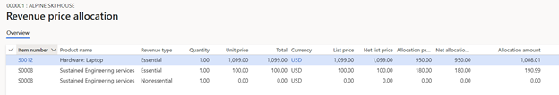](./media/08_rev-rec-scenarios.png)

At the time of the sale, the customer chose to not purchase software installation (S0001), but later changed their mind.  A second sales order is entered for the same customer.

The second sales order is confirmed. Because the sales order only contains one line, revenue price allocation is not performed on confirmation. Revenue price allocation only happens where there are two or more unique items, and the items are set up for revenue price allocation.
If this is the only change to the customer’s contract, the reallocation process can now be run. From either sales order or from Periodic tasks, open the **Reallocate price with new order lines**.  Select the two sales orders and the corresponding sales order lines, then select the **Update reallocation** button.  The Reallocated amount column displays the new revenue prices for each sales order line.  

Nothing is shown under the **Expected voucher** button because no invoices have been posted.  

The reallocation is completed by choosing the **Process** button.  It will prompt for a posting date, even if nothing is posted.  After the reallocation is complete, the **Revenue price allocation** page for both sales orders will show the price allocation for all items across both sales orders.  This means you will see an item in Revenue price allocation that doesn’t exist on the sales order because it’s part of the same contract, but on a different sales order.  

> [!Hint]
> You can add additional columns to the grid, such as **Reallocation ID** and **Sales order**, to give context about why these additional items are displayed. 

### Scenario 2
is  scenario walks through a reallocation example where two sales orders are entered.  After first sales order is invoiced, the customer adds an additional item to the contract. When adding the new item to a contract, the new item can also be added to a new sales order or to the existing sales order, as shown in Scenario 3.
The General ledger parameter, **Post invoice corrections to Accounts receivable**, is set to **No**.

A sales order is created for customer US_SI_0003. The customer is purchasing software installation (S0001) and support (S0008) for a laptop, but they haven’t selected the laptop yet. The software installation’s revenue is deferred until the date the laptop is purchased. The revenue from the support plan will be deferred and recognized over 12 months as defined by the date range in the contract. 

The sales order is confirmed. Both items are set up for revenue price allocation so the revenue price is calculated when the sales order is confirmed.. The revenue to recognize can be seen from the **Sales order** Action Pane (**Manage – Revenue recognition – Revenue price allocation**). The support item will post to a Deferred Revenue account in the amount of $150.00. The software installation will also post to the Deferred Revenue account in the amount of $250.00.  The sum of the revenue prices must equal the sum of the lines’ setup for revenue price allocation, which is equal to $400.00. 

The sales order is fully invoiced.  The following accounting entry is posted.

The Revenue recognition schedule is also created but none of the revenue is recognized yet. 

[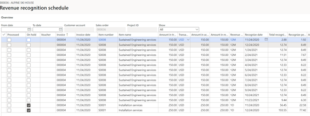](./media/16_rev-rec-scenarios.png)

A few days later the customer selects the laptop, and a second sales order is entered for the customer.

The second sales order is confirmed. Because the sales order only contains one line, revenue price allocation is not performed on confirmation. Revenue price allocation only happens where there are two or more unique items, and the items are setup for revenue price allocation.
If this is the only change to the customer’s contract, the reallocation process can now be run. From either sales order or from Periodic tasks, open **Reallocate price with new order lines**.  Select the two sales orders and the corresponding sales order lines, then select the **Update reallocation** button.  The **Reallocated amount column** displays the new revenue prices for each sales order line.

[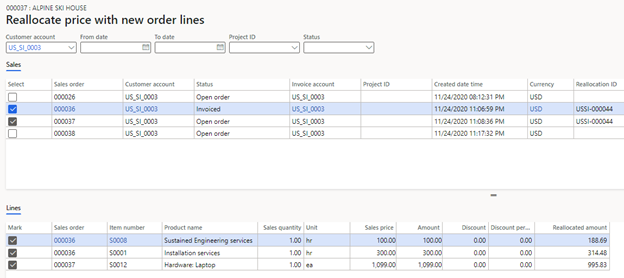](./media/18_rev-rec-scenarios.png)

Next select **Expected voucher** to see the accounting entries that will be posted to General ledger only.  Because of the GL parameter, nothing will change in Accounts receivable when the reallocation is processed.
 
[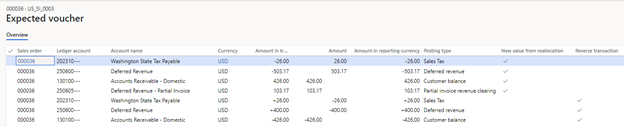](./media/19_rev-rec-scenarios.png)

The last three lines are reversing the original accounting entry from the posted invoice. 
The top four lines comprise the new accounting entry posted for the invoice. It’s important to understand that the customer is not presented with a new invoice.  After the reallocation, the customer still owes $426.00, which is the amount that must post to Accounts receivable in the new accounting entry.  The offsetting tax and deferred revenue is equal to $188.69 + $314.48 + $26.00 = $529.17. The deferred revenue amount has changed due to the reallocation.  The difference of $103.17 is posted to a Partial invoice revenue clearing account.  This balance will be cleared when the invoice is posted for the second sales order that was included in the reallocation. 
The reallocation is completed by choosing the **Process** button.  It will prompt for a posting date, even if nothing is posted. After the reallocation is complete, the **Revenue price allocation** page on both sales orders will show the price allocation for all items across both sales orders. This means you will see an item in Revenue price allocation that doesn’t exist on the sales order because it’s part of the same contract, but on a different sales order.  

> [!Hint]
> Additional columns, such as the **Reallocation ID** and **Sales order**, can be added to the grid to give context as to why these additional items are displayed.  

On sales order 00036, the revenue recognition schedule was also updated based on the new revenue reallocation price.  From the sales order, open the **Revenue recognition schedule** page.  Previously there were 13 lines for the item S0008 which was assigned a 12M schedule. Now there are 39 lines: 13 original schedule lines, 13 reversal schedule lines, and 13 lines based on the new revenue price.  

The same is true for item S0001, which originally had 2 schedule lines and now there are 6 schedule lines.

On sales order 000036, the invoice journal displays the original accounting entry when clicking on **Voucher**. To see the reversing and new accounting entry from the sales order, select the **Revenue adjustments** button from the Action Pane, then **Voucher**.  

[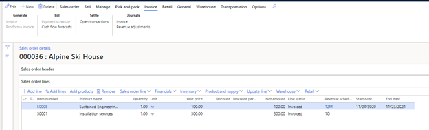](./media/23_rev-rec-scenarios.png)

Next, open the **All customers** age (**Accounts receivable – Customers – All customers**), select customer US_SI_0003, and then choose the **Transactions** button. The open invoice from sales order 000036 will be visible.  If you select the voucher, you can see the original accounting entry, and not the new accounting entry from the reallocation.  The reversing and new accounting entries are not visible from Accounts receivable. 
The second sales order is now invoiced. The total invoice presented to the customer is $1,099.00 + $71.44 tax = $1,170.44.  The following accounting entry will be posted.

[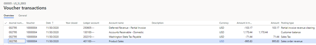](./media/24_rev-rec-scenarios.png)

Because the sum of the revenue and sales is more than $1,170.44, the difference is posted for -$130.17.  This is clearing the balance from the Partial invoice revenue clearing account, which is posted on the new accounting entry after the reallocation.

### Scenario 3
This scenario walks through a reallocation scenario where a new line is added to an existing, invoiced sales order.  When adding a new item to a contract, the new item can be added to a new sales order, as shown in Scenario 2, or added to the existing sales order. This scenario also walks through what happens when Accounts receivable is updated as a result of the reallocation. 

The General ledger parameter, **Post invoice corrections to Accounts receivable**, should be set to Yes.
 
[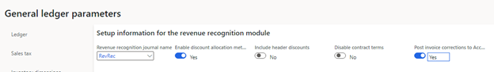](./media/25_rev-rec-scenarios.png)

A sales order is created for customer US_SI_0003. The customer is purchasing a laptop (S0012) and support (S0008) for the laptop.  The laptop’s revenue is recognized immediately, and revenue for the support plan will be deferred and recognized over 12 months as defined by the date range defined in the contract. 

[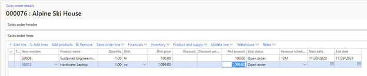](./media/26_rev-rec-scenarios.png)

The sales order is confirmed. Both items are set up for revenue price allocation, so confirmation calculates the revenue price. The revenue to recognize can be seen from the **Sales order** Action Pane, under **Manage > Revenue recognition > Revenue price allocation**. The support item will post to deferred revenue for $190.99. The laptop will also post to revenue for $1,008.01.  The sum of the revenue prices must equal the sum of the lines that have been set up for revenue price allocation, which is equal to $1,199.00.

The sales order is fully invoiced. The following accounting entry is posted for the invoice.

[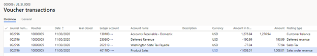](./media/28_rev-rec-scenarios.png)

The Revenue recognition schedule is also created.  After some time passes, two of the months have recognized revenue for the **Sustained engineering services** item. 

The customer decides to add an installation service (S0001). The item is added to the existing sales order. A message asks whether they want to modify the fully invoiced sales order, and they select **Yes**. 

[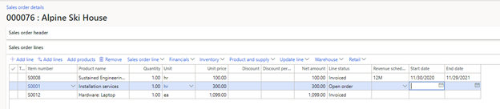](./media/30_rev-rec-scenarios.png)

If this is the only change to the customer’s contract, the reallocation process can be run now. From the sales order, open **Reallocate price with new order lines**.  All sales order lines for this sales order are selected, then click the **Update reallocation** button.  The **Reallocated amount** column displays the new revenue prices for each sales order line.

Next select **Expected voucher** to see the accounting entries. Based on the General ledger parameter settings, these accounting entries will be posted to General ledger through the credit document and a new invoice will be created in Accounts receivable.  

The last four lines reverse the original accounting entry from the posted invoice. 

The top five lines are the new accounting posted for the invoice. It’s important to understand that the customer isn’t presented with a new invoice.  After the reallocation, the customer still owes $1,276.94, whichis the amount that must post to Accounts receivable in the new accounting entry.  The offsetting tax and revenue/deferred revenue is equal to $995.83 + $188.69 + $77.94 = $1,262.46. The revenue or deferred revenue amount changed due to the reallocation.  The difference of -$14.48 is posted to a Partial invoice revenue clearing account.  This balance will be cleared when the invoice is posted for the new item added to the sales order.

The reallocation is completed by choosing the **Process** button. A posting date is entered. The **Revenue price allocation** page now displays the price reallocation for all three items.

[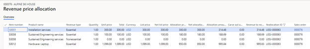](./media/33_rev-rec-scenarios.png)

The revenue recognition schedule was also updated based on the new revenue reallocation price.  From the sales order, open the **Revenue recognition schedule** page.  Previously there were 13 lines for item S0008 which was assigned a 12M schedule. Now there are 39 lines: 13 original schedule lines, 13 reversal schedule lines, and 13 lines based on the new revenue price.  

The Invoice journal displays the original accounting entry when you click **Voucher**. To see the reversing entry and the new accounting entry from the sales order, click the **Revenue adjustments** button from the Action Pane, then click **Voucher**.

Next navigate to **Accounts receivable > Customers > All customers**, select customer US_SI_0003, and then click the **Transactions** button.  You will see the original invoice (000006), the reversing document (000006-1), and the new invoice (000006-2). The original invoice and reversing document are settled against each other and have a balance of zero. View the voucher for each document to see the impact in General ledger. 
  
[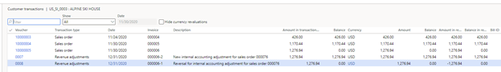](./media/35_rev-rec-scenarios.png)

The sales order is invoiced again for the item that was added. The total invoice presented to the customer is $300.00 + $19.50 tax = $319.50.  The following accounting entry is posted.

Because the sum of the revenue and sales is more than $319.50, the difference is posted for $14.48.  This clears the balance from the Partial invoice revenue clearing account that was updated in the new accounting entry that was posted after the reallocation.

### Scenario 4
The following scenario walks through a reallocation scenario where a new line is removed from an existing, partially invoiced sales order.  The results of this scenario are the same whether the lines is removed from the sales order or is set to a canceled status.

The General ledger parameter, **Post invoice corrections to Accounts receivable** is set to  No.
 

A sales order is created for customer US_SI_0003. The customer is purchasing a laptop (S0012), installation services (S0001) and support (S0008) for the laptop.  The laptop and install services’ revenue will be recognized immediately and revenue from the support plan will be deferred and recognized over 12 months, as defined by the date range defined in the contract. 

The sales order is confirmed. All items are setup for revenue price allocation so confirmation calculates the revenue price. The Revenue to recognize can be seen from the **Sales order** Action Pane, under **Manage > Revenue recognition > Revenue price allocation**. The laptop’s revenue will post to Revenue for $995.84, the installation service’s revenue will post for $314.47, and the sustained engineering service will post to a Deferred revenue account in the amount $188.69.  The sum of the revenue prices must equal the sum of the lines that have been set up for revenue price allocation, which is equal to $1,499.00.  

The customer is invoiced for the laptop and sustained engineering service but not the installation service.  The following accounting entry is posted for the invoice.

The entry posts $1,276.94 to Accounts receivable, but because this is a partial invoice, the revenue or deferred revenue plus the tax does not equal the accounts receivable amount.  The difference of -$14.47 is posted to the Partial invoice revenue clearing account. 
The revenue recognition schedule is also created.  

The customer decides to not purchase the install service so that line is removed from the sales order.  Note that the sales order cannot be confirmed again because there are only invoiced lines remaining on the sales order.

[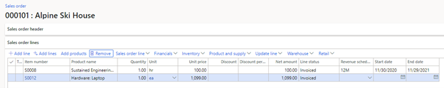](./media/42_rev-rec-scenarios.png)

Even though the sales order can’t be confirmed, it can reallocated. From the sales order, open **Reallocate price with new order lines**.  With the two sales order lines selected, choose **Update reallocation**.  The Reallocated amount column is updated for the two remaining lines. 

[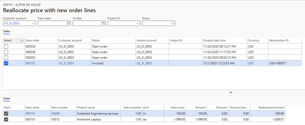](./media/43_rev-rec-scenarios.png)

Next select Expected voucher to see the accounting entries.  
 

The last five lines are reversing the original accounting entry from the posted invoice. 

The top four lines are the new accounting entries that are posted for the invoice. It’s important to understand that the customer is not presented with a new invoice.  After the reallocation, the customer still owes $1,276.94 which is the amount that must post to Accounts receivable in the new accounting entry.  The new revenue or deferred revenue amounts plus tax equals $1,276.94 so you won’t need to post to the Partial invoice revenue clearing account. 

You can he complete the reallocation by clicking the **Process** button. A posting date is entered. The **Revenue price allocation** page now displays the price reallocation for the two remaining items.

The revenue recognition schedule was also updated based on the new revenue reallocation price.  From the sales order, open the **Revenue recognition schedule** page.  Previously there were 13 lines for item S0008 which was assigned a 12-month schedule. Now there are 39 lines: 13 original schedule lines, 13 reversal schedule lines, and 13 lines based on the new revenue price.  

The Invoice journal displays the original accounting entry when you click **Voucher**. To see the reversing and new accounting entry from the sales order, click the **Revenue adjustments** button from the Action Pane, then click **Voucher**.

Next open the **All customers** page (**Accounts receivable >Customers > All customers**, select customer US_SI_0003, and then click the **Transactions** button.  Only the original invoice (000008) can be seen with the original accounting entry. The reversing and updated accounting entries are not shown because the General ledger parameter was set to only update General ledger. Note that you can see the revenue adjustment transactions created from Scenario 3. 

