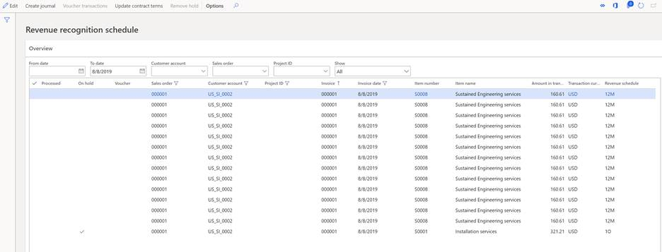
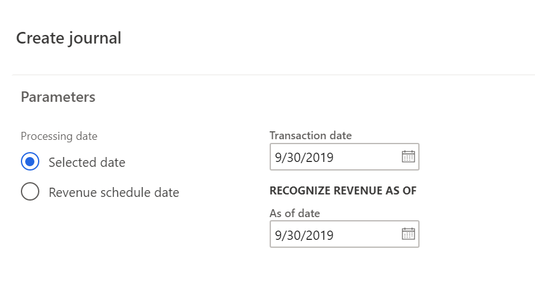
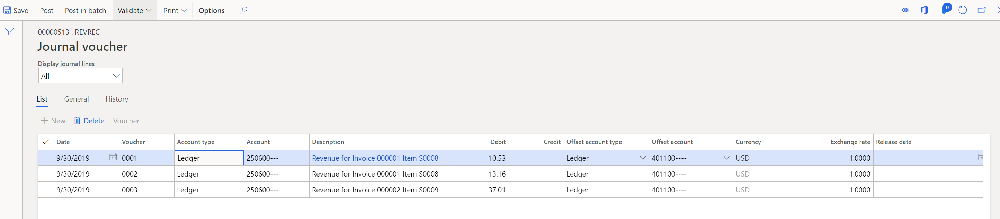
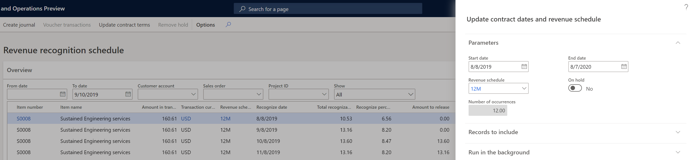
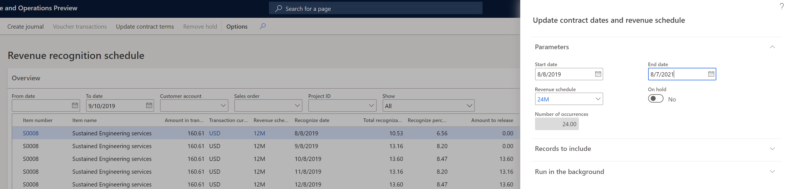

---
# required metadata

title: Recognize deferred revenue 
description: This article provides information about how to recognize revenue by using the Revenue recognition feature. 
author: bking
ms.date: 08/16/2023
ms.topic: index-page
ms.prod: 
ms.technology: 

# optional metadata

ms.search.form: Customer
audience: Application User
# ms.devlang: 
ms.reviewer: twheeloc
# ms.tgt_pltfrm: 
# ms.custom: 
ms.search.region: Global 
# ms.search.industry: 
ms.author: bking
ms.search.validFrom: 2018-08-30
ms.dyn365.ops.version: 8.0.4

---

# Recognize deferred revenue

[!include [banner](../includes/banner.md)]

> [!NOTE]
>This functionality will be deprecated October 2023, new users should use subscription billing.

This article describes the process of recognizing revenue in the revenue recognition schedule. After an invoice has been posted for a sales order, a revenue recognition schedule is created for each sales order line that has a revenue schedule. The revenue schedule on a line is used to determine whether the line's revenue should be deferred.

## View revenue recognition schedule details

There are two ways to access the details of the revenue recognition schedule.

- You can open the revenue recognition schedule directly from an invoiced sales order. In this case, the information in the revenue schedule is filtered to show the details only for the selected sales order. This approach is useful when you're validating the schedule details for a sales order.
- You can open the revenue recognition schedule from the **Revenue recognition \> Periodic tasks** page. This approach is often used when revenue is recognized at the end of a period. When the page is first opened, no information is shown. Use the filters above the grid to define criteria for the schedule details that should be shown. You can filter on the invoice dates by entering a date range, sales order, customer, project ID, or state.

The **Financial dimension** FastTab below the grid shows the financial dimensions of the sales order line. These dimensions were considered during posting to deferred revenue. They are also considered when the revenue is recognized. The dimension values that are used depend on the account structure that is assigned to the revenue and deferred revenue main accounts.

## Recognize revenue

You recognize revenue by running the **Create journal** process from the **Recognize revenue** page. You can open this page from either the sales order or **Periodic tasks**. If the process is run from the sales order, it recognizes revenue only for the selected sales order. Typically, the process is run from **Periodic tasks** instead, so that it recognizes revenue for all posted sales order invoices.

To define the criteria for selecting and posting revenue, select **Create journal** to open the **Create journal** dialog box.

In the dialog box, use the options in the **Processing date** field group to define the posting date that is used when revenue is recognized. If you select **Selected date**, you can enter a posting date in the **Transaction date** field. If you select **Revenue schedule date**, the transaction date isn't used. Instead, the value of the **Recognize date** field on each line of the schedule is used as the posting date.

Next, in the **As of date** field, enter the "as-of" date for recognizing revenue. Any lines of the schedule where the recognize date is on or before the "as-of" date will be recognized, provided that they aren't on hold.

After you've finished defining the dates, select **OK** in the dialog box to create the journal. You receive an informational message that shows the number of transactions that have been created and the journal where they were created. The journal isn't automatically posted. Therefore, the revenue recognition manager has time to validate which lines of the schedule are being recognized.

After the process is run, the lines on the schedule that were transferred to the journal are marked as **Processed**. The **Processed** flag indicates that the lines have been transferred to the journal, but they can be posted or unposted. After the revenue recognition journal is posted, the **Processed** flag remains. If the revenue recognition journal is deleted, or if a line is deleted, the **Processed** flag is removed. In that way, the line can be recognized when the **Create journal** process is run again.

On the **Revenue recognition journal** page (**Revenue recognition \> Journal entries \> Revenue recognition journal**), open **Lines** to view the details of what is being recognized. A separate transaction is always created for each line of the schedule that is being recognized, even if all the lines are posted on the same date by using the same ledger accounts.

The **Account** column shows the deferred revenue ledger account. This ledger account can't be edited. This restriction helps guarantee that the correct deferred revenue ledger account is relieved. This ledger account isn't validated against the account structure, because it might have changed since posting to the referred revenue ledger account last occurred.

The **Offset account** column shows the revenue ledger account. By default, the revenue ledger account is taken from Inventory posting profiles, and the financial dimensions are taken from the sales order line. This ledger account is validated against the current account structure. However, it can be edited if the account structure has changed and requires additional financial dimensions.

The default amount is from the corresponding line of the schedule, and it can't be changed.

BY default, if the sales order is a multicurrency sales order, the exchange rate is set to the exchange rate from the invoice. This behavior helps guarantee that the accounting currency and reporting currency amounts are fully relieved. Because of rounding, the exchange rate for the last line of the schedule might differ slightly from the rate on the invoice.

After the revenue recognition journal is posted, the voucher is entered on the schedule. If there is more than one voucher for the same line of the schedule, an asterisk (\*) appears on the line. To view the vouchers that were posted for that line, select **Voucher transactions**.

## Modify the revenue recognition schedule details

Most of the data in the revenue schedule details can't be edited. New lines can't be added to the schedule, and existing lines can't be deleted. The revenue schedule details for each sales order line must be maintained to help guarantee that, over time, an organization recognizes the same amount that was deferred.

### Edit schedule lines

Some edits are allowed on the lines of the schedule. The following fields can be changed on the lines:

- **On hold** – This flag can be set or cleared before the line is processed. To clear the flag, select the row, and then select **Remove hold**. Revenue can't be recognized on lines that are on hold. Lines can automatically be put on hold if the revenue schedule is set up for automatic holds.

    

- **Recognize date** – The recognize date can be changed before the line is processed. When the process that creates the journal for recognizing revenue is run, a date is entered in the **Recognize revenue as of date** field. That date is compared to the date in the **Recognize date** field to determine which lines should be recognized.
- **Amount to release** – The amount that will be released can be changed before the line is processed. You can decrease the amount of revenue that is recognized, but you can't increase it. This field lets an organization recognize part of the revenue on the recognize date. If the amount is changed, the amount in the **Remaining amount** field shows how much revenue must still be recognized.
- **Quantity to release** – If the revenue schedule is set up for one occurrence or one month, the **Quantity to release** field shows the quantity for the sales order line. This field can also be edited and provides another way to recognize part of the revenue. For example, if the quantity on the line is 5, you can override the quantity so that it's less than 5. The amount in the **Amount to release** field is updated proportionately.

### Update contract terms

The revenue schedule details are created based on the revenue schedule that is assigned to the sales order line when the invoice is posted. If the revenue schedule on the sales order line is incorrect, it can't be changed on the sales order after the sales order is invoiced. Instead, you must use the **Update contract terms** button to change the revenue schedule. The revenue schedule can be changed either before or after revenue has been recognized.

To change the schedule, select any schedule line for the item that you're changing. In the following illustration, the line for item S0008 that was posted by using a 12-month revenue schedule is selected. When you select **Update contract terms**, a dialog box shows the contract start and end dates, and the revenue schedule.

Change the contract start and end dates so that they reflect the correct date range. When you change the date range, the value in the **Number of occurrences** field must match a revenue schedule that has been defined in the system. In this example, because the contract was changed to a 24-month contract, a 24-month revenue schedule must be set up. Because the 24-month revenue schedule exists, it's entered by default, and the contract can be changed. If a revenue schedule that has a matching number of occurrences doesn't exist, the contract can't be changed. After you've finished updating the contract terms and revenue schedule as you require, select **OK** in the dialog box to save your changes.

The contract changes have the following effects on the revenue schedule details:

- If no revenue has been recognized for the product, all the previous schedule details are removed and replaced with the new revenue schedule details. For example, item S0008 originally had 12 lines in the schedule details. Those 12 lines are removed and replaced with 24 lines, based on the new revenue schedule.
- If revenue has been recognized for the product, some revenue was incorrectly recognized because recognition was based on the incorrect revenue schedule. Those lines must be reversed and recognized again, based on the new schedule. In this scenario, new revenue schedule lines are created that have negative amounts on the original recognize date. New lines are then created to recognize the amounts based on the new revenue schedule. For example, on August 8, 2019, you recognized revenue for $10.53. On September 8, 2019, you recognized revenue for $13.16. Therefore, two new lines are created on the same dates. One line is for -$10.53, and the other line is for -$13.16. Twenty-four new lines are then created, and the total deferred revenue of $160.61 is allocated across them. You can post the reversing lines by running the **Create journal** process.

[!INCLUDE[footer-include](../../includes/footer-banner.md)]
