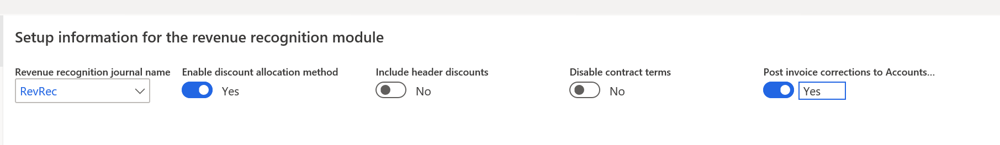
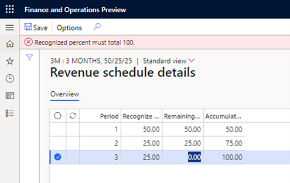
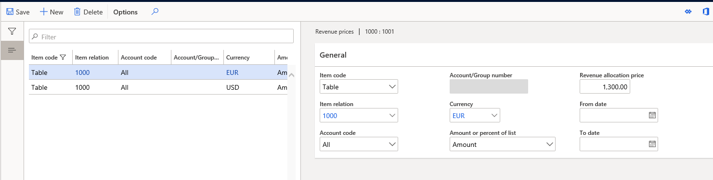
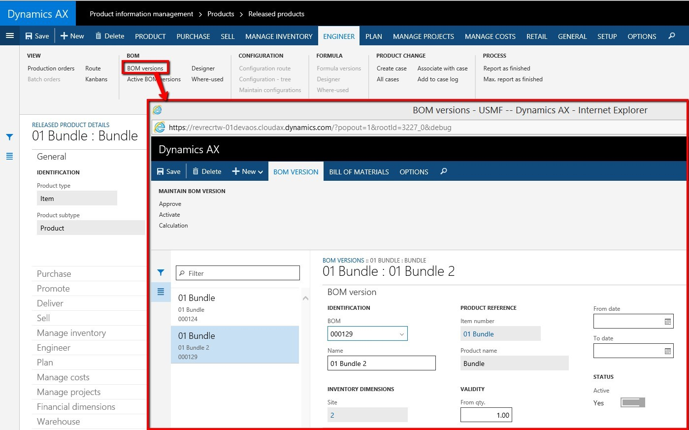

---
# required metadata

title: Revenue recognition setup 
description: This article describes the setup options for Revenue recognition, and their implications.
author: bking
ms.date: 04/28/2022
ms.topic: index-page
ms.prod: 
ms.technology: 

# optional metadata

ms.search.form: Customer
audience: Application User
# ms.devlang: 
ms.reviewer: twheeloc
# ms.tgt_pltfrm: 
# ms.custom: 
ms.search.region: Global 
# ms.search.industry: 
ms.author: bking
ms.search.validFrom: 2018-08-30
ms.dyn365.ops.version: 8.0.4

---

# Revenue recognition setup
[!include [banner](../includes/banner.md)]

A new **Revenue recognition** module has been added that includes menu items for all the setup that is required. This article describes the setup options and their implications.

> [!NOTE]
> The Revenue recognition feature is now enabled by default through Feature management. If your organization doesn't use this feature, you can turn it off in the **Feature management** workspace.
>
> Revenue recognition, including bundle functionality, isn't supported in Commerce channels (e-commerce, POS, and call center). Items that are configured for revenue recognition should not be added to orders or transactions that were created in Commerce channels.

The **Revenue recognition** module has the following setup options:

- Revenue recognition journals
- Parameters for revenue recognition
- Revenue schedules 
- Inventory setup

    - Item groups and released products
    - Defining revenue schedule
    - Defining revenue price
    - Inventory setup

        - Defining revenue schedule
        - Defining revenue price

    - Posting profiles
    - Bundles

        - Bundle components
        - Bundle item

- Project setup

## Revenue recognition journals

A new journal type has been introduced for revenue recognition. The journal is required and is used in two scenarios.

The first scenario occurs after all the contractual obligations are met, when the deferred revenue is recognized by creating a revenue recognition journal that is based on the details of the revenue schedule. The journal contains an accounting entry that moves the balance from the deferred revenue ledger account to the revenue ledger account.

The second scenario occurs when a journal is created after reallocation occurs. Reallocation occurs when a sales order line is added to a previously invoiced sales order, or when a new sales order is created that includes a line that is part of the original contract. If an invoice was posted before the new sales order line is added, a correcting accounting entry must be created for the posted customer invoice.

The journal is set up on the **Journal names** page (**Revenue recognition \> Setup \> Journal names**). The journal type must be set to **Revenue recognition**. 

## Parameters for revenue recognition

Revenue recognition settings are configured on the **Revenue recognition** tab of the **General ledger parameters** page (**Revenue recognition \> Setup \> General ledger parameters**). The following settings are available:

- **Revenue recognition journal name** – Select the journal that was created for revenue recognition. The journal is required when revenue is recognized from the revenue schedule, or when you do reallocation for a sales order that has already been invoiced.
- **Enable discount allocation method** – Set this option to **Yes** to determine the revenue price through allocation of the fair market value that is defined in the revenue price for each released product. This allocation includes allocation of any line discounts across the items. If this option is set to **No**, the system uses the median price that is defined in the revenue price for each released product. If this option is set to **No**, but no median price is set up for the released products, allocation of the revenue price doesn't occur.
- **Include header discounts** – Set this option to **Yes** to determine the revenue price by allocating header discounts across products. If this option is set to **No**, the header discount isn't included in the revenue price allocation.
- **Disable contract terms** – Set this option to **Yes** if products that have a revenue type of **Post contract support** can be released even though contract start and end dates aren't defined for them. Typically, contract start and end dates are required for items of the **Post contract support** revenue type. When the contract start and end dates aren't defined, the details of the revenue schedule on the posting are calculated by using the number of occurrences and the invoice date.
- **Post invoice corrections to Accounts receivable when reallocating** – When you do reallocation for invoices that have already been posted, the accounting entry for the posted invoice must be corrected. Use this option to specify how the correction is done.

    - Set this option to **No** to limit posting of the correcting transaction to General ledger. When this option is set to **No**, no additional documents are created in Accounts receivable for the internal accounting correction. When the invoice is paid, the settlement process uses the old accounting entry to post any cash discounts, or any realized gains or losses.
    - Set this option to **Yes** to automatically create a reversing document and new invoice for the correcting transaction in Accounts receivable. Because this correction is an internal accounting correction, the new documents aren't sent or communicated to the customer. The reversing document is settled to the original invoice, and the new corrected invoice is paid by the customer. Note that all three documents are shown on reports, such as the customer statement.

## Revenue schedules

A revenue schedule must be created for each occurrence that revenue can be deferred for. For example, if your organization offers support over six-month, 12-month, 18-month, and 24-month periods, you must create a revenue schedule for each period. The setup of the revenue schedule determines how the revenue price is allocated across the number of periods that you select. It also determines the default dates that are entered for the revenue schedule that is created when the invoice is posted.

If you recognize revenue by milestone, we recommend that you create a revenue recognition schedule for the number of milestones, regardless of the recognition dates. After you create the schedules, you can edit them so that they reflect the expected milestone dates. These records can be put on hold until you're notified that the milestone has been met and revenue can be recognized.

Revenue schedules are created on the **Revenue schedules** page (**Revenue recognition \> Setup \> Revenue schedules**).

Enter descriptive values in the **Revenue schedule** and **Description** fields. The following additional settings are used to create the revenue schedule when the invoice is posted.

- **Occurrences** – Enter the number of months or occurrences for the revenue deferral.
- **Automatic hold** – Select this check box if all lines of the revenue schedule should automatically be put on hold when the invoice is posted. The hold must be manually removed from each line of the schedule before the line's deferred revenue can be recognized.
- **Automatic contract terms** – Select this check box if the contract start and end dates should automatically be set. These dates are automatically set only for released products of the **Post contract support** revenue type. The contract start date is automatically set to the sales order line's requested ship date, and the contract end date is automatically set to the start date plus the number of months or occurrences that is defined in the setup of the revenue schedule. For example, the product on the sales order line is for a one-year warranty. The default revenue schedule is **12M** (12 months), and the **Automatic contract terms** check box is selected for this revenue schedule. If the sales order line has a requested ship date of December 16, 2019, the default contract start date is December 16, 2019, and the default contract end date is December 15, 2020.
- **Recognition basis** – The recognition basis determines how the revenue price is allocated across the occurrences.

    - **Monthly by days** – The amount is allocated based on the actual days in each calendar month.
    - **Monthly** – The amount is allocated equally across the number of months that is defined in the occurrences.
    - **Occurrences** – The amount is allocated equally across the occurrences, but it can include an extra period if you select **Actual start date** as the recognition convention.
    - **Fiscal period by days** – The amount is allocated based on the actual days in each fiscal period. 

         - The results of **Monthly by days** and **Fiscal period by days** will be the same when the fiscal periods follow calendar months. The only exception is when the recognition convention is set to **End of month/period**, and the **Contract start date** and **End date** fields are left blank on a sales order line.

- **Recognition convention** – The recognition convention determines the dates that are set on the revenue schedule for the invoice.

    - **Actual start date** – The schedule is created by using either the contract start date (for post contract support \[PCS\] items) or the invoice date (for essential and nonessential items).
    - **1st day of month/period** – The date on the first schedule line is the contract start date (or invoice date). However, all subsequent schedules lines are created for the first of the month or fiscal period.
    - **Mid-month split** – The date on the first schedule line depends on the invoice date. If the invoice is posted on the first through fifteenth of the month, the revenue schedule is created by using the first day of the month. If the invoice is posted on the sixteenth or later, the revenue schedule is created by using the first day of the next month.

        - **Mid-month split** can't be selected if the recognition basis is set to **Fiscal period by days**.

    - **1st day of next month/period** – The date that the schedule begins on is the first day of the next month or fiscal period.
    - **End of month/period** – The date on the first schedule line is the contract start date (or invoice date). However, all subsequent schedule lines are created for the last day of the month or fiscal period. 

Select the **Revenue schedule details** button to view the general periods and the percentages that are recognized in each period. By default, the **Recognize percentage** value is equally divided across the number of periods. If the recognition basis is set to **Monthly**, the recognition percentage can be changed. As you change the recognition percentage, a warning message notifies you that the total doesn't equal 100 percent. If you receive that message, you can continue to edit lines. However, the total percentage must equal 100 before you close the page.

## Inventory setup

You can recognize revenue for released products on sales orders, but not with sales categories on the sales orders or with free text invoices, if no items are included on the document. The selections that you make when you set up released products determine how the item's revenue is recognized. For example, the selections determine whether the revenue price is allocated, and whether the revenue is deferred by using a revenue schedule.

The setup can begin on the **Revenue recognition** FastTab of the **Item group** page (**Revenue recognition \> Setup \> Inventory and product setup \> Item group**). This page includes several setup fields. These fields are used to set default values only for new released products that are created in the system. As new products are created, the values that you set here are entered by default for the item group. You can override the default values for released products on the **Released products** page (**Revenue recognition \> Setup \> Inventory and product setup \> Released products**). The default values that are set for the released products are then carried forward to the sales order.

## Item groups and released products

### Define the revenue schedule

Revenue on the sales order line is deferred if a revenue schedule is defined for the released product and used by default on the sales order line. If the setting should be used by default for the product, you can define the revenue schedule on the **Revenue recognition** FastTab of the **Item group** page (**Revenue recognition \> Setup \> Inventory and product setup \> Item group**). You can also define the setting for the released product on the **Revenue recognition** FastTab of the **Released products** page (**Revenue recognition \> Setup \> Inventory setup \> Released products**).

In the **Revenue schedule** field, select the revenue schedule that represents the period that the revenue must be deferred over. The revenue schedule is automatically entered on the sales order line, and the schedule details are created when the sales order invoice is posted.

### Define the revenue price

Item groups and released products can be set up by using either the median price method or the discount allocation method. Both methods require various settings on the **Released products** page:

- **Is revenue allocation active** – Set this option to **Yes** to include the released product in the revenue allocation calculation. If this option is set to **No**, the released product uses the median price method if the median price is defined. If the median price isn't defined, the unit price on the sales order line is used to post to revenue or deferred revenue.
- **Revenue type** – Select the revenue type that defines the released product:

    - **Essential** – The item is a primary source of an organization's revenue. This value is the default setting.
    - **Nonessential** – The item isn't a primary source of an organization's revenue. When the median price settings are used, the price is 'carved out' to the median price and then allocated. For example, an essential item has a fixed price that must be recognized for revenue. If there is a discount, the discount might be carved out of the essential item revenue, but **only** up to the fixed price amount. The rest of the discount is taken out of the revenue for nonessential items. Alternatively, the discount might not be carved out of the essential item revenue.
    - **Post contract support** – The item supports other elements that are included in the sale to the customer. The revenue price is distributed across the essential and nonessential products that are included in the sale. Depending on setup, PCS items might not require that contract start and end dates be defined on the sales order line.

- **Exclude from carve out** – Set this option to **Yes** to indicate that the item's median price can't be adjusted below the minimum percentage that is defined or above the maximum percentage. Any revenue price will be derived from the revenue price of another released product that is included on the sales order. If this option is set to **No**, the item's median price can be adjusted or carved out. Note that if you sell more than one item that is set up as median price, at least one released product must be set up where the **Exclude from carve out** option is set to **No**. In that way, there is at least one item that any differences in the revenue price can be allocated to.
- **Median price** – Set this option to **Yes** to indicate that the item's revenue price should be adjusted so that it equals the median price if it's below the minimum tolerance that you specify or above the maximum tolerance, and that the carve-out amount should be allocated to lines that have products where the **Exclude from carve out** option is set to **No**.

    - **Maximum tolerance** – Enter the percentage over the median price that is permitted.
    - **Minimum tolerance** – Enter the percentage under the median price that is permitted.

After you've finished configuring the settings for the released product, you must manually define the revenue price by entering the fair value price or the median price (if you're using median price method) on the **Revenue prices** page (go to **Revenue recognition \> Setup \> Inventory setup \> Released products**, and then, on the Action Pane, on the **Sell** tab, in the **Revenue recognition** group, select **Revenue prices**).

The revenue price that is manually defined on this page is used to determine the revenue price allocation on each sales order, based on the criteria that are defined. Each criterion is matched to the sales order line to determine the revenue price that should be used in the allocation process.

- **Item code** and **Item relation** – A revenue price can be defined for an individual product or a group of products. If you select **Table** in the **Item code** field, select the released product in the **Item relation** field. If you select **Group** in the **Item code** field, select the item group in the **Item relation** field.
- **Account code** and **Account/Group number** – A revenue price can be defined for all customers, an individual customer, or a group of customers. If you select **All** in the **Account code** field, the price is used for all customers. If you select **Table** in the **Account code** field, select the customer in the **Account/Group number** field. If you select **Group** in the **Account code** field, select the customer group in the **Account/Group number** field.
- **Currency** – You must enter a separate revenue price for each currency that you enter a sales order in. For example, if you currently sell in U.S. dollars, Canadian dollars, and euros, you must define a revenue price in all three currencies. The revenue price isn't translated from one currency, such as the accounting currency, to any other transaction currencies that you're using.
- **Amount or percent of list** – Specify whether the revenue price is set up as an amount or as a percentage of the list price. If you select **Percent of list**, users can enter the median price as a percentage of the list price instead of an amount. The **Percent of list** value is used only for released products that are set up as PCS items.
- **Revenue allocation price** – Depending on the value that you selected in the **Amount or percent of list** field, enter either an amount or a percentage to represent the revenue price that is used to allocate the revenue across the elements on the sales order.
- **From date** and **To date** – Enter the date range that the revenue price is active for. These fields are optional.

If the **Enable discount allocation method** option on the **General ledger parameters** page is set to **Yes**, and if the **Revenue type** field for your released product is set to **Post contract support**, you must also specify the items that are being supported by the released product. This setup is done on the **Setup basis** page (go to **Revenue recognition \> Setup \> Inventory setup \> Released products**, and then, on the Action Pane, on the **Sell** tab, in the **Revenue recognition** group, select **Setup basis**).

On the **Setup basis** page, add a record for each item group that the item is supporting. When the revenue allocation occurs, the revenue price will be distributed across the essential and nonessential parts for the PCS item.

### Posting profiles

Three additional posting types support the ability to defer revenue. These posting types are set up on the **Sales order** tab of the **Posting** page (**Revenue recognition \> Setup \> Inventory and product setup \> Posting**).

- **Deferred revenue** – Enter the main account for the revenue price that posts to deferred revenue (instead of revenue). The revenue price is deferred if the sales order line has a revenue schedule.
- **Deferred cost of goods sold** – Enter the main account for the cost of goods sold amount that posts to deferred cost of goods sold if the revenue is also deferred.
- **Partial invoice revenue clearing** – Enter the main account for the clearing account that is used either when the sales order is partially invoiced or when reallocation occurs. The balance in this account returns to 0 (zero) when the sales orders are fully invoiced.

### Bundles

Bundle items are unique released products that are set up so that they include components. This setup is done by using the bill of materials (BOM) functionality. When a bundle item is entered on a sales order, the individual components are used to determine the revenue prices and revenue schedules. However, printed documents for the customer, such as the sales order and invoice, reflect the bundle item.

#### Bundle components

The components that are included in the bundle must be set up on the **Released products** page (**Revenue recognition \> Setup \> Inventory and product setup \> Released products**). These components are released products, and they must be set up in the same manner as products that are included in a BOM. For example, a released product can be an item of either the **Item** type or the **Service** type, but it must be assigned to an item model group where the **Stocked product** option is set to **Yes**. For more information, see the setup documentation for BOM items.

The components must also be set up for revenue recognition, just as if they are products that can be sold individually on a sales order. For example, make sure that the correct revenue price is defined for each component, and that the price basis is set up for PCS items.

#### Bundle items

When you set up a bundle item, you must set two fields on the **Released products** page (**Revenue recognition \> Setup \> Inventory and product setup \> Released products**):

- On the **Engineer** FastTab, in the **Production type** field, the item must be set up as a BOM item.
- On the **General** FastTab, in the **Bundle** field, the item must be marked as a bundle item.

The components must be then assigned to the bundle/BOM parent item on the **BOM versions** page (go to **Revenue recognition \> Setup \> Inventory and product setup \> Released products**, and then, on the Action Pane, on the **Engineer** tab, in the **BOM** group, select **BOM versions**). For more information, see the setup documentation for BOMs.

If the bundle parent item and bundle components are set to allocate, the bundle revenue price will be distributed to the components, based on their revenue contribution percentages.

## Project setup

Revenue recognition can also be used for sales orders that are created through a Time and materials project. For sales orders that originate from projects, you just have to define the main accounts in the project posting profiles that are used to post project invoices. The main accounts are defined on the **Ledger posting setup** page (**Revenue recognition \> Setup \> Project setup \> Ledger posting setup**).

- **Deferred invoice revenue** (under **Revenue accounts**) – Enter the main account for the revenue price that posts to deferred revenue (instead of revenue). The revenue price is deferred if the sales order line has a revenue schedule.
- **Deferred cost** (under **Cost accounts**) – Enter the main account for the cost of goods sold amount that posts to deferred cost of goods sold if the revenue is also deferred.

[!INCLUDE[footer-include](../../includes/footer-banner.md)]
