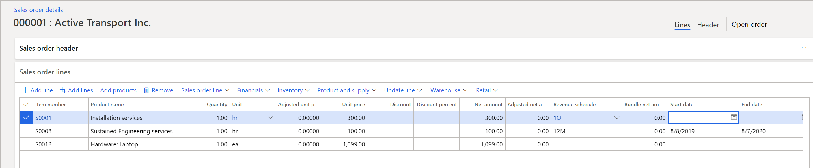
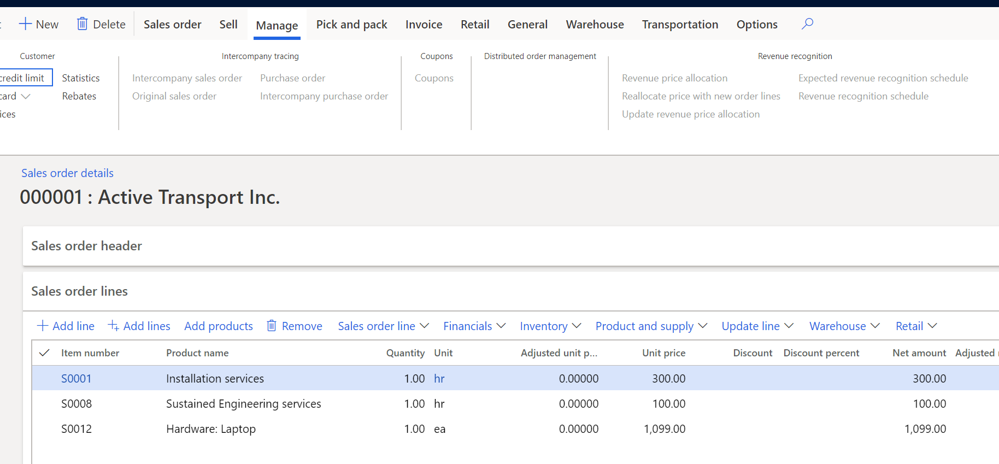
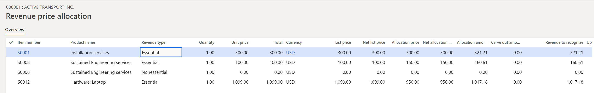
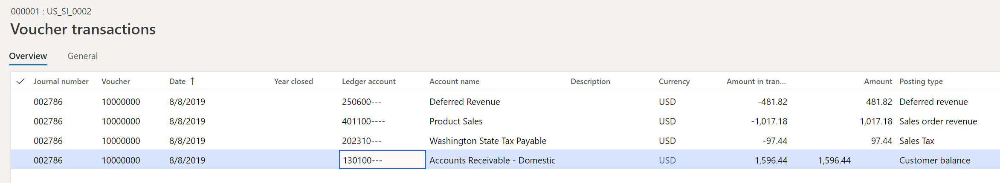
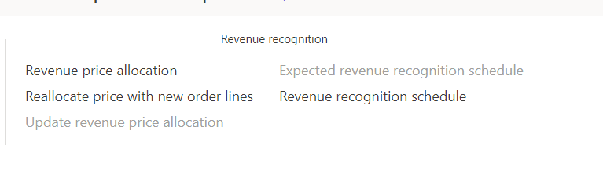
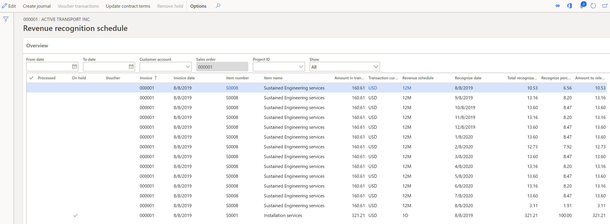

---
# required metadata

title: Revenue recognition on sales orders 
description: This article describes the basic functionality for recognizing revenue on sales orders and invoices. Revenue recognition is available on the sales order and on the corresponding invoice that is created from the sales order.
author: bking
ms.date: 08/16/2023
ms.topic: index-page
ms.prod: 
ms.technology: 

# optional metadata

ms.search.form:  Customer
audience: Application User
# ms.devlang: 
ms.reviewer: twheeloc
# ms.tgt_pltfrm: 
# ms.custom: 
ms.search.region: Global 
# ms.search.industry: 
ms.author: bking
ms.search.validFrom: 2018-08-30
ms.dyn365.ops.version: 8.0.4

---

# Revenue recognition on sales orders

[!include [banner](../includes/banner.md)]

> [!NOTE]
> This functionality will be deprecated October 2023, new users should use subscription billing.

This article describes the basic functionality for recognizing revenue on sales orders and invoices. Revenue recognition is available on a sales order and on the corresponding invoice that is created from the sales order. The sales order can also be created through a Time and materials project.

> [!NOTE]
> In the illustrations in this article, columns have been hidden or added to grids to better show the concepts. Therefore, the pages and data in the illustrations might differ from what you see in the product.

## Enter a sales order

The following sales order is entered and includes three items that are set up for revenue recognition.

There are two concepts for revenue recognition:

- **Determine the revenue price.** The revenue price is calculated based on the setup of the released products. The revenue price is never shown to the customer but is used only for the accounting of the sales order invoice. The sales order lines and the documents that are printed as part of the sale continue to show the unit/list price.
- **Determine when revenue recognition should occur.** A revenue schedule is used to determine when revenue should be recognized.

    In this example, the first item, S0001, is assigned to a **1O** (one-occurrence) revenue schedule. This line represents a milestone-type scenario, where the revenue will be recognized after the installation occurs in the future. Therefore, revenue will be deferred until the installation is completed.

    The second item, S0008, is a service item that is set up as a post contract support (PCS) item. The sustained engineering services are provided to the customer over a 12-month period. Therefore, a **12M** revenue schedule is assigned to the product by default. Because this item is a PCS item, contract start and end dates must be defined. By default, the contract start and end dates are found on Item details – Setup tab. On the revenue schedule, the setup for **12M** is defined so that the contract terms are automatically filled in as shown in the following illustration.

    

    The third item, S0012, is hardware, and no revenue schedule is assigned by default. The revenue for the hardware is recognized as soon as the item is invoiced.

## Confirm the sales order

To view additional details about the revenue price and revenue schedule, use the buttons in the **Revenue recognition** group on the **Manage** tab on the Action Pane of the sales order. Because the sales order isn't confirmed at this point, the buttons that are used for revenue recognition are unavailable. These buttons become available or unavailable as the sales order progresses through the stages that lead to fulfillment.

The first three buttons provide details about the revenue price for the items on the sales order setup for revenue recognition.

- **Revenue price allocation** – This button becomes available after the sales order is confirmed or the invoice is posted. Both sales order confirmation and invoice posting calculate the revenue to recognize the price that will be recognized or deferred on the accounting entry. Depending on the setup, the revenue price that is calculated can differ from the unit price that is shown to the customer.
- **Reallocate price with new order lines** – This button becomes available after the sales order is confirmed or the invoice is posted. The reallocation process is used to recalculate the revenue that must be recognized after a new line is added either to the current sales order, after it's invoiced, or to a new sales order. In both scenarios, the addition of a new item causes a change to the contract. Therefore, the revenue price must be reallocated.
- **Update revenue price allocation** – This button becomes available after the sales order is confirmed, but it becomes unavailable after the sales order is invoiced. The update is used to rerun the revenue price allocation without having to confirm the sales order. After the sales order is invoiced, the revenue price can't be recalculated.

The last two buttons provide details about the revenue schedule for those items on the sales order that have a revenue schedule.

- **Expected revenue recognition schedule** – This button becomes available after the sales order is confirmed, but it becomes unavailable after the sales order is invoiced. It opens a page that shows the expected revenue schedule. The final schedule might change, because the expected schedule uses the requested ship date, whereas the final schedule uses the actual ship date.
- **Revenue recognition schedule** – This button becomes available after the sales order is invoiced. The final revenue recognition schedule isn't created when confirmation occurs or a packing slip is created. It's created only when the sales order is invoiced.

In the following example, revenue price allocation occurred when the sales order was confirmed. Note that, even though the revenue prices are allocated differently, the total amount in the **Revenue to recognize** field must still equal the sum of the sales order lines that are invoiced to the customer. For example, the sum of the sales order lines, excluding tax, is $,1499. Therefore, the sum of the **Revenue to recognize** values must also be $,1499.

The expected revenue recognition schedule is also created. The revenue schedule uses the **Revenue to recognize** value as the amount to defer. Item S0001 defers $321.21 instead of $300, and item S0008 defers $160.61 instead of $100. Item S0012 isn't shown in the expected schedule because the revenue isn't deferred. When posting occurs, item S0012 posts $1,017.18 directly to the revenue ledger account.

## Create the packing slip

Next, the packing slip can be created for the sales order. No revenue is recognized when the packing slip is posted. If the sales order wasn't confirmed, posting of the packing slip doesn't trigger revenue price calculation. It also doesn't trigger creation of the expected or final revenue recognition schedule. If the item model group is set up to defer revenue on the packing slip, it will continue to post by using the current posting profile ledger accounts, not the new deferred revenue accounts that are used on the invoice posting.

## Create the invoice

The final step is to invoice the sales order. If you look at the invoice's voucher, you will notice that the revenue for items S0001 and S0008 was deferred ($321.21 + 160.61 = 481.82), and the remaining amount for item S0012 was posted to revenue (1,017.18). These values add up to $1,499, which matches the sum of the sales order lines.

After the invoice is created, the **Revenue price allocation**, **Reallocate price with new order lines**, and **Revenue recognition schedule** buttons for revenue recognition become available, but the **Update revenue price allocation** and **Expected revenue recognition schedule** buttons are unavailable.

The **Revenue price allocation** button is still available so that you can view the revenue price calculation. If nothing changed on the sales order after it was confirmed, posting of the invoice won't change the calculated amount in the **Revenue to recognize** field.

The expected revenue recognition schedule is removed and replaced with the final revenue recognition schedule. The revenue schedule details are maintained for each sales order line and are used to release the deferred revenue to actual revenue as the contractual obligations are met.

[!INCLUDE[footer-include](../../includes/footer-banner.md)]
