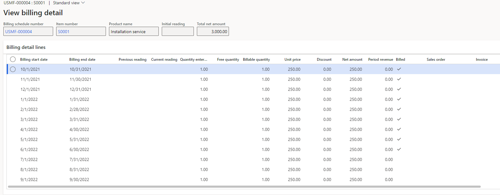
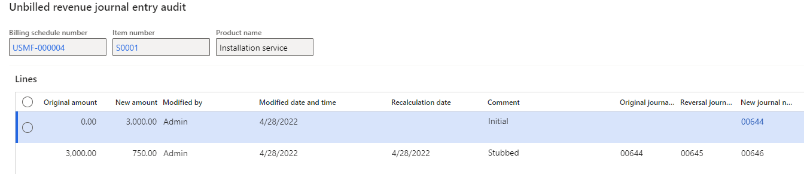

---
# required metadata

title: Periodic tasks in Recurring contract billing
description: This article describes the periodic tasks that are available in Recurring contract billing.
author: JodiChristiansen
ms.date: 02/22/2023
ms.topic: article
ms.prod: 
ms.technology: 

# optional metadata

ms.search.form: 
# ROBOTS: 
audience: Application User
# ms.devlang: 
ms.reviewer: twheeloc
ms.search.scope: Core, Operations
# ms.tgt_pltfrm: 
ms.custom: 539093
ms.search.region: Global
# ms.search.industry: 
ms.author: jchrist
ms.search.validFrom: 2021-11-05
ms.dyn365.ops.version: 10.0.24

---
# Periodic tasks in Recurring contract billing

This article describes the periodic tasks that are available in Recurring contract billing.

## Generate invoice

Use the **Generate invoice** page to create mass monthly recurring invoices from the information that you set up on the **All billing schedules** and **View billing detail** pages. When an invoice is created, the item description for the sales order processing line is updated with the item description and the billing start and end dates for the schedule line that's invoiced. 

## Generate invoice batch processing

Use the **Generate invoice batch processing** page to create recurring invoices through a recurring batch process. The **Date range** filter lets you select the billing schedules by start date or end date. To use a start date or end date other than today's date, set the **Add the number of days or months** option to **Yes**. Then, in the **Select by days or months** field, select **Days** or **Months**, and enter the number of days or months. For days, a value of **0** represents today. For months, **0** represents the first day through the last day of the current month.

For example, the current month is January, and you want to include billing schedule lines that have a start date through March 1. In this case, select **Months**, and then set the number of months to **2**. (For months, the current month is always included.) If today is January 15, and you want to include billing schedule lines from January 1 through December 31 of the previous year, select **Days**, and then set the number of days to **-350** (= 365 – 15).

The batch processing flag is set to **Yes** and can't be changed to **No**.

## Generate quotation

Use the **Generate quotation** page to create a **Sales quotation** report for multiple billing schedules at the same time. Each billing schedule will print a **Sales quotation** report.

## Price update

Use the Price update utility to update the prices of several items on multiple billing schedules in a single action. The prices can be updated based on either a specified percentage or a specified amount. The list of lines shows only the current unit prices of the items. It doesn't show the prices after the price update.

Note the following points about the Price update utility:

- If the sales order for a specific year has already been created (that is, the items have been billed), the price of the line items isn't affected.
- The Price update utility can be used for line items that have a status of **Active** or **On hold**. For items that are on hold, the **Adjust schedule** option must have been set to **No** when the hold was placed.
- The Price update utility can't be used for line items that are usage items, that use escalation, milestone billing, or revenue splitting.

### Price update example

A billing schedule is created, and a renewal item is added. The unit price is $750. The first year of the item is paid on December 15, 2021. The billing schedule is created for the period from January 1 through December 31, 2022.

At renewal time, the **Generate invoice** process creates the sales order for the year 2022. After the Price update utility is run, the price is updated from $750 to $800.

The sales order and billing schedule for 2022 aren't affected, and the unit price remains $750, because the billing schedule for 2022 has already been billed. The billing schedule line and line detail for 2023 are updated to $800, because the billing schedule for 2023 hasn't been billed yet.

### Update prices – Flat pricing method

When you update prices for items that use the flat pricing method, you can specify a percentage or amount to increase the price.

To run the Price update utility for items that use the flat pricing method, follow these steps.

1. On the **Price update** utility page, select the **Flat** pricing method.
2. In the **Increase method** field, select the increase method that is used to update the price of the items.
3. Depending on the increase method that you selected, specify the percentage in the **Percent** field or the amount in the **Amount** field.
4. On the **Records to include** FastTab, use the **Filter** button to add data filters.
5. Select **View preview** to view the range of records.
6. If you don't want to process some of the lines, mark them, and then select **Remove**.
7. Select **OK**.

### Update prices – Standard pricing method

If the price of an item has been changed in the item record, it can be updated for all billing schedule lines if the item uses the standard pricing method.

1. On the **Price update** utility page, select the **Standard** pricing method.
2. On the **Records to include** FastTab, use the **Filter** button to add data filters.
3. Select **View preview** to view the range of records.
4. If you don't want to process some of the lines, mark them, and then select **Remove**.
5. Select **OK**.

## Mass hold processing

Use the **Mass hold** page to apply hold options to several billing schedules at the same time.

To put just one billing schedule or one billing schedule line on hold, open the **All billing schedules** page, and select **Place hold**. To remove a hold, use the **Remove hold** page.

### Put billing schedules on hold

To put a hold on several billing schedules, follow these steps.

1. On the **Mass hold** page, set the **Process option** field to **Apply hold**.
2. In the **Reason code** field, select a reason code.
3. Set the **Adjust schedule** option:

    - **Yes** – If you set the option to **Yes**, specify a hold date in the **Hold date** field. Any billing schedule lines after the hold date are removed.
    - **No** – The billing schedule lines aren't changed. Only the status is changed. It's updated to **On hold**.

4. On the **Records to include** FastTab, use the **Filter** button to add data filters.
5. Select **View preview** to view the range of records.
6. If you don't want to process some of the lines, mark them, and then select **Remove**.
7. Select **OK**.

When you return to the list of billing schedules, you should see that the status of the billing schedules has been changed to **On hold**.

### Remove a hold from several billing schedules

1. On the **Mass hold** page, set the **Process option** field to **Remove hold**.
2. In the **Reason code** field, enter a reason code.
3. In the **Remove date** field, select the date when the hold should be removed.
4. Set the **Resumption date** and **Deferral date** fields as you require. The deferral date is added to all lines that are deferrable.
5. On the **Records to include** FastTab, use the **Filter** button to add data filters.
6. Select **View preview** to view the range of records.
7. If you don't want to process some of the lines, mark them, and then select **Remove**.
8. Select **OK**.

> [!NOTE]
> To remove a hold, you must set the **Remove hold user group override** value on the **Recurring contract billing parameters** page.

For example, a billing line has a start date of February 1, 2022, and an end date of February 28, 2022. The billing amount is $200. The **Hold date** field is set to February 10, 2022. Therefore, the February period is adjusted to exclude any date after February 10. The new period is from February 1 through February 9, and the amount is $64.29 (through daily proration). All billing schedule lines on or after February 10 are removed.

If the **Remove hold** process is completed, and the **Remove date** field is set to February 10, 2022, there will be two billing periods. The first billing period is from February 1 through February 9, and the amount is $64.29. The second billing period is from February 10 through February 28, and the amount is $135.71.

## Mass termination processing

Use the **Mass termination** page to terminate billing schedule lines that are currently shown by specifying a termination date and reason code. 

If you're using revenue and expense deferrals, billing schedules where the **Termination date** field is set to **Adjust schedule** on the **All billing schedules** page are eligible for a refund.

Billing schedules that use the multiple element allocation (MEA) functionality don't appear on the **Mass termination** page. You can still terminate an individual billing schedule by using the termination functionality on the billing schedule.

> [!NOTE]
> Billing schedule lines that are currently included in a **Generate invoice** batch aren't available for this process.

On the **Mass termination process** page, in **Process options**, select **Remove termination** to remove the termination from multiple billing schedules or billing schedule lines that have been terminated. Use the filter for the **Billing schedule** to select which billing schedules to remove the termination from. If a billing schedule line was terminated with a credit that has been invoiced, it can't be removed and those lines will not appear in the preview.

For information about each field and the process, see [Terminate billing schedules](terminate-billing-schedule.md).

## Mass termination table clean up

Use the **Mass termination table clean up** process to clear the mass termination tables after you use the mass termination entity.

## Mass archive process

Use the **Mass archive** page to archive multiple billing schedules. Only terminated billing schedules can be archived.

After a billing schedule has been archived, the following events occur:

- The status is changed to **Archived**.
- The billing schedules are permanently locked.
- The billing schedule lines are no longer available on inquiry pages.

> [!NOTE]
> Archiving of a billing schedule is a permanent action and can't be reversed.

To archive billing schedules, follow these steps.

1. On the **Mass archive** page, in the **Billing end date** field, specify a billing end date. To view all terminated billing schedules, leave this field blank.
2. On the **Records to include** FastTab, use the **Filter** button to limit the records that are shown.
3. Select **View preview**.
4. If you don't want to archive some of the records, mark them, and then select **Remove**.
5. Select **OK** to archive the records on the page.

## Mass stubbing process

Use the **Mass stubbing** page to mark all selected billing schedule lines as billed (stub) or unbilled (reverse stub). Stubbing or reverse stubbing are most often performed on imported billing schedule lines that were previously billed in another system. Stubbed billing schedule lines appear as stubbed and won't create an invoice for the customer.

### Stub records

1. On the **Mass stubbing** page, in the **Process options** field, select **Stub**.
2. In the **Cutoff date** field, set a cutoff date to specify the lines that you want to apply the process to. Only records where the billing start date is on or before the cutoff date specified will be shown.
3. Select **View preview** to show the lines that you want to stub.
4. To exclude a line from the process, mark it, and then select **Remove**.
5. Select **Process** to stub the lines.

### Reverse stub records

1. On the **Mass stubbing** page, in **Process options** field, select **Reverse stub**.
2. In the **Cutoff date** field, set a cutoff date to specify the lines that you want to apply the process to. Only records where the billing start date is on or before the cutoff date specified will be shown.
3. Select **View preview** to show the lines that you want to reverse stub.
4. To exclude a line from the process, mark it, and then select **Remove**.
5. Select **Process** to reverse stub the lines.

## Update completion date process

Use the **Update completion date** page to update the completion date for specific milestone items for multiple billing schedules or users. You can also update the completion percentage for items on milestone templates that use the **Percent completed** method.

1. On the **Update completion date** page, go to **Milestone processing**, and select **Update completion percentage**.
2. In the **Percentage amount** field, enter the total percentage that has been completed.
3. Select the item number that is related to the milestone template.
4. On the **Records to include** FastTab, select **Filter** to select a specific **End user account**, **Billing schedule number**, or **Item numbers** value as a filter criterion.
5. Select **OK** to process the change. When the processing is completed, a new line is added to the milestone allocation. This line represents the percentage that has been completed for the milestone template.

## Unbilled revenue mass processing

Use the **Unbilled revenue mass processing** page to create the unbilled revenue journal entry or stub the journal entry for one or more selected billing schedules or billing detail lines.

- **Create journal entry** – Create unbilled revenue journal entries for multiple billing schedule lines. Use the **Filter** button on the **Records to include** FastTab to select the range of records that appear in the list. The list shows only billing schedule lines that unbilled revenue journal entries haven't been created for. The initial journal entries are created. For deferral items, the deferral schedules are also created.
- **Stub journal entry** – Mark the billing schedule lines that the unbilled journal entries have already been created for. This option is used if the unbilled journal entry was already posted in another system. It marks the unbilled revenue journal as stubbed and doesn't post a transaction to the general ledger.
- **Reverse stub journal entry** – Reverse stub journal entries that have been processed. If a mistake was made during the processing for **Stub journal entry**, this option will clear the **Stubbed** checkbox for the billing schedule line.
- **Stub billing detail line** – Use this process when unbilled revenue was processed in an external system, and some of the billing detail lines have already been billed. This process will ensure that the correct amount appears in the unbilled revenue accounts.
- **Reverse stub billing detail line** – Reverse any **Stub billing detail line** actions.

The **Journal name** field is used to post **Create journal entry** to the general ledger.

> [!NOTE]
> The stub process doesn't post amounts to the general ledger. The **Journal name** field isn't available for all stub and reverse stub processes.

### Unbilled revenue stub example

A billing schedule is set up for one year, from October 2021 through September 2022. The unbilled revenue was already processed in an external system. Nine months of the billing schedule have already been billed. The amount for each billing period is $250. At the beginning of the year, the total amount that has been posted to unbilled revenue is $3,000. After nine months, $2,250 has already been billed, and $750 in unbilled revenue remains.

To set up the billing schedule where only three months' worth of unbilled revenue remains, follow these steps.

1. On the **View billing detail** page, create a billing schedule for the period from October 2021 through September 2022, item number S0001, and an amount of $250 per month.
2. Select **Create journal entry** for the billing schedule. The amount of $3,000 is posted to unbilled revenue.
3. Select **Stub billing detail line**, and specify a transaction date of June 2022 (nine months). The billing schedule lines won't appear in the preview. The lines that are affected are based on the transaction date.
4. Select **OK**.

The first nine months that have been billed are stubbed.

The $3,000 is reversed from unbilled revenue, and the $750 in unbilled revenue that remains is posted. To view the unbilled revenue postings, select **Unbilled revenue journal entry audit** on the **Renewals** tab of the line details page.

> [!NOTE]
> The unbilled revenue journal entry can be created for any renewal term, provided that all billing detail lines from the previous term have been billed. For example, a billing schedule line has a monthly billing frequency for a 12-month period, from January through December 2021. The line has three terms: the initial term, a second term (January through December 2022), and a third term (January through December 2023). After the invoice has been created for all billing detail lines from the initial 12 months in 2021, the journal entry for unbilled revenue can be created for the second term.
>
> For deferral items that use the unbilled revenue feature, the billing line and the discount lines are processed. For these items, the unbilled revenue journal entry and the deferral schedule for the billing line and the discount line are created.
>
> The journal entries that are created for non-deferrable items and deferrable items post a credit to different revenue accounts.
