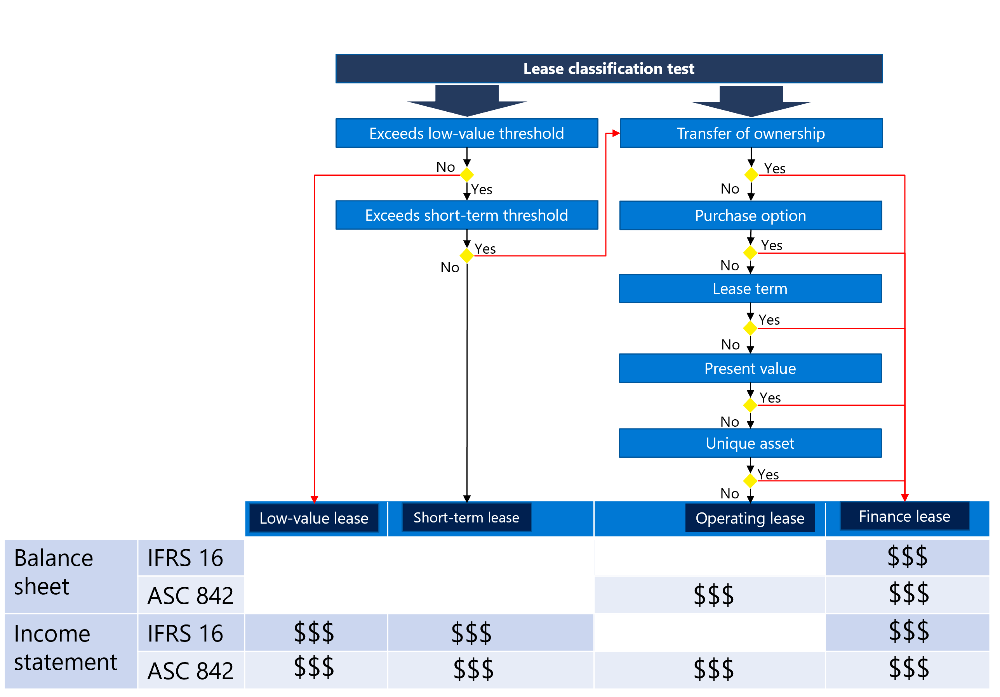
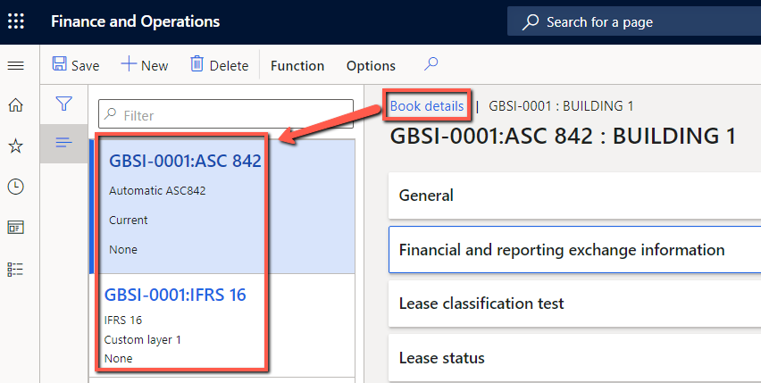
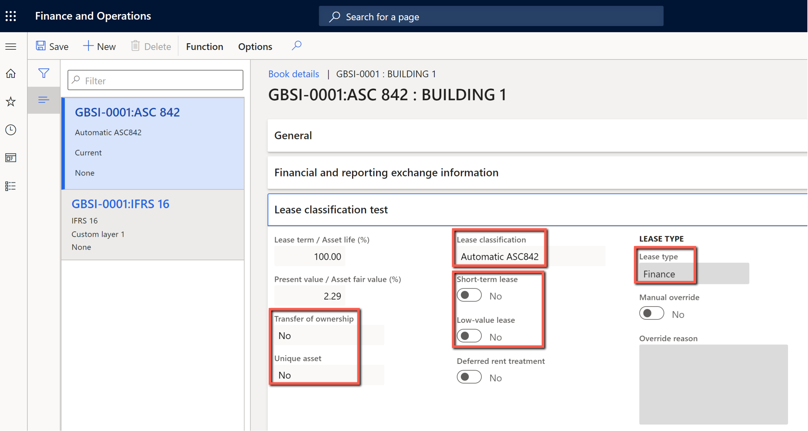
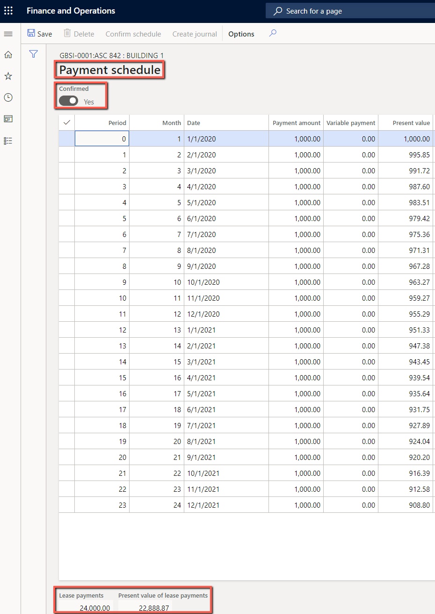
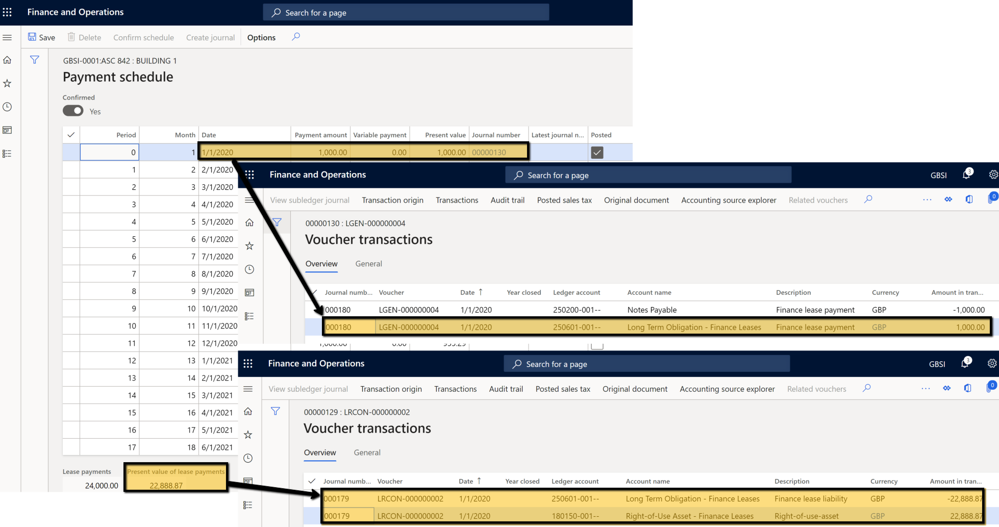
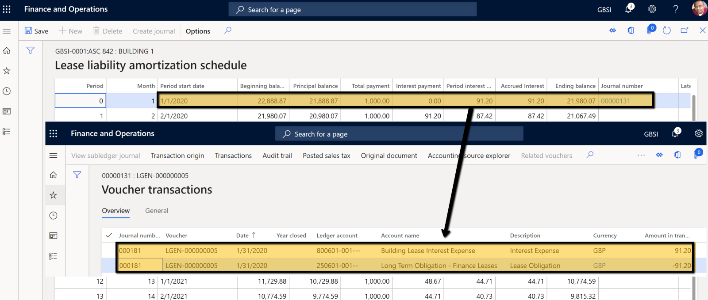
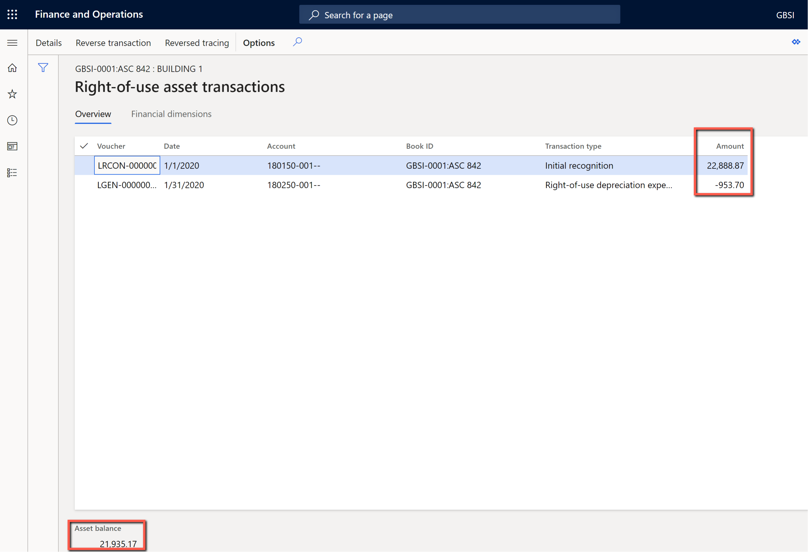
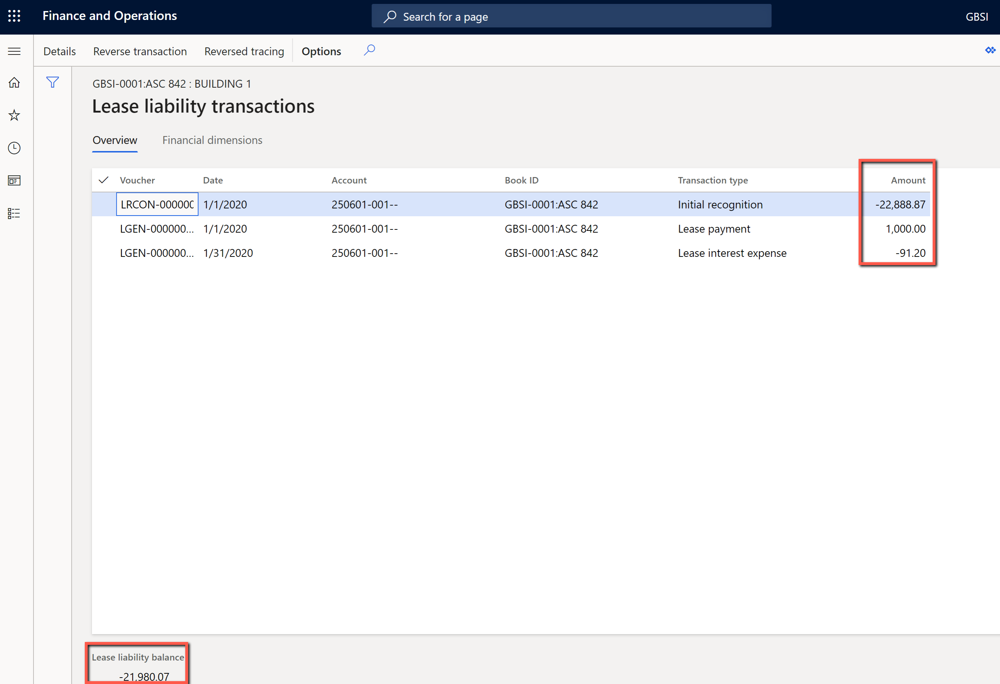

---
# required metadata

title: Asset leasing overview
description: This topic describes the Asset leasing capability and defines the terminology used in the user interface and the documentation. 
author: moaamer
manager: Ann Beebe
ms.date: 09/01/2020
ms.topic: article
ms.prod: 
ms.service: dynamics-ax-applications
ms.technology: 

# optional metadata

ms.search.form: 
# ROBOTS: 
audience: Application User
# ms.devlang: 
ms.reviewer: roschlom
ms.search.scope: Core, Operations, Retail

# ms.tgt_pltfrm: 
ms.custom: 4464
ms.assetid: 5f89daf1-acc2-4959-b48d-91542fb6bacb
ms.search.region: Global
# ms.search.industry: 
ms.author: vstehman
ms.search.validFrom: 2020-09-01
ms.dyn365.ops.version: 10.0.14
---

# Asset leasing overview

[!include [banner](../includes/banner.md)]
[!include [preview banner](../includes/preview-banner.md)]

This topic describes the Asset leasing capability and defines the terminology used in the user interface and the documentation. Asset leasing is an advanced capability for managing, tracking, and automating financial transactions for leased assets in Microsoft Dynamics 365 Finance. Asset leasing complies with International accounting standards (IFRS 16) and US GAAP standards (ASC 842). Asset leasing captures and processes information about the leases and helpd generate journal entries throughout the lifecycle of the lease, from initial recognition, monthly journal entries, to impairment and termination of the lease. Asset leasing integrates seamlessly with other components of Dynamics 365 Finance, including Fixed assets, Accounts payable and General ledger.

For more information regarding accounting standards, refer to the standard documentation of IFRS 16 and US GAAP ASC 842.

## Asset leasing elements
The following diagram shows the main elements of the business process for leases.

The main components that define a leased asset include the following:

**Lease agreement** The lessor owns the asset and agrees with the lessee to lease an asset for specific period in exchange for periodic lease payments. In addition to the legal contract between the lessor and lessee, the lease agreement captures management decisions such as the likelihood of exercising a renewal option and transfer of ownership.

**Lease calculation and classification per accounting standard** The lease calculation and classification identify the accounting standard that will be applied in the initial and subsequent measurement, as well as the classification test that determines what the lease type will be. A lease can be a finance lease, an operating lease, a short-term lease or a low-value lease. The system also calculates the present value of future minimum lease payments for the purpose of valuation and classification.

**Lease transactions** Asset leasing supports the initial recognition of the right-of-use asset for leases on the balance sheet, as well as subsequent measurement for either on-balance sheet leases or off-balance sheet leases. The initial recognition transaction measures the present value of future minimum lease payments. This data is used to determine the value of the initial right-of-use asset and lease liability, which affect the organization's balance sheet. The subsequent measurement of monthly lease transactions involves the accumulation of interest on the lease liability, which increases the lease liability. It also measures the accrual of lease payments that decrease the lease liability, and that will subsequently be paid to the lessor. The measurement also includes the amortization of the right-of-use asset.

For off-balance sheet leases, the system calculates the straight-line lease expense over whichever is less: the economic life of the asset, or the lease term. Finally, lease adjustments measure contract modifications such as a lease extension or expansion, and the impairment transaction that writes down the right-of-use asset for non-recoverable costs.

Asset leasing is integrated with General ledger, which ensures that all posted lease transactions update your chart of accounts. Asset leasing is integrated with accounts payable to track lessor invoices in Accounts payable and take future payments from there. The integration with Fixed assets lets you track leases in the fixed assets register and post right-of-use assets transactions, including the initial recognition, depreciation, and impairment of the asset, from within Fixed assets.   

## Asset leasing components in Microsoft Dynamics 365 Finance.
Asset leasing maps lease information, payment schedules, starting and ending dates, and the payment frequency. It also automates calculations for present value, monthly lease payments, interest, and lease amortization. The system performs lease classification tests, depending on the configuration. The system also creates and posts the corresponding lease transactions, that are based on the framework defined by the accounting standard you’re following.

The following diagram shows the lease book, the lease, calculated payment schedule, books and lease classification tests and the corresponding accounting transactions.

**Lease book** The lease books includes all the lease contract information such as lease terms, fair value, and lease payments. It also includes the accounting standard that you're following, the lease type and thresholds that are considered in lease classification test. The lease book also contains the lease transactions that posted to general ledger. 
  
**Lease** The lease carries the asset lease information that represents the foundation of the asset leasing, lease information source is lease contract and management decision that are both are done outside of Microsoft Dynamics 365 Finance. The asset's fair value is the price that would be paid for an asset in a transaction at the measurement date. This value might depend on the asset type, market conditions, and other criteria that can be taken into consideration in the assessment. The asset fair value will be considered in the classification test equation.

The **asset useful life** represents the remaining periods of the useful life of an asset, from the lease commencement date. The useful life of an asset will be considered in the classification test equation. It differes from the useful life as defined in Fixed assets.

The **incremental borrowing rate** represents the interest rate that will be used to calculate the present value. The system will use the implicit rate if it's defined in the lease data to calculate the present value of the lease payments. If the implicit rate isn't defined, the system will use the incremental borrowing rate.

The **annuity type** represents the lease payment due either at the beginning of the payment period or at the end of the period. This could be payment-in-advance (annuity due) (at the beginning of the lease payment period), or ordinary annuity  (at the end of the lease payment period).

The first month will be considered period number zero for payment in advance; the first month will be considered period one for payment arrears.

The **compounding interval** represents the number periods that interest is compounded per year. This could be monthly (12 period per year), quarterly (4 periods per year), semi-annually (2 periods per year) or annually (1 period per year). The number of periods will be considered in the present value calculation.

The **commencement date** is the date that the lessor makes the asset available for use by the lessee. This will be the base date of all lease calculations and posting transactions.

The **lease term** represents the length of lease period, in months.

> [!NOTE] 
> The definition of the lease term is based on the number of periods, or intervals, in the payment schedule lines. The defined number of intervals will be converted to months.

The **payment schedule line** captures the lease payments per period. It also specifies whether a renewal period will be exercised and included in the initial measurement of the right-of-use asset and lease liability. You can also define the start date of the lease due payments, and the period intervals that represent the length of the lease, which can be days, months, or years.

The **payment frequency** indicates whether the payment is monthly, quarterly, semiannually, or annually. The end date is calculated automatically based on the start date and the number of periods entered.

**Payment schedule** represents the calculated present value, based on the length of time covered by the lease payments, the amount of the payments, the compounding periods and the annuity type.

**Periods** represent the lease periods that reflect the compounding internal and annuity type. The compounding interval determines how periods will be divided. You can set the following compounding intervals:
- Monthly, 12 periods per year
- Quarterly, 4 periods per year
- Semiannually, 2 periods per year
- Annually, 1 period per year. 

The first period will start with period zero, if the annuity type is annuity due. Otherwise the first period will start with one, if the annuity type is payment arrears.

**Months** indicates the number of calendar months over the length of the lease. The payment amount is the amount due as defined in the payment frequency. The calculated present value is the present value-based lease payment per period, the compounding intervals, and the incremental borrowing rate.

> [!NOTE] 
> The present value is calculated based on the discounted cash flow equation.

**Books** are the pre-configured setup that will be associated with each lease. The book defines the applied accounting standard, lease types, and threshold that are used as the basis for the classification tests. The result of the classification tests are used to automatically specify the lease type.

The **accounting framework** shows the selected accounting standard, either IFRS 16 and ASC 842, that you're supporting. The accounting standard is designated on the book that’s associated with the lease. The accounting standard will determine the ledger accounts that are specified in the posting profile.

**Lease types** indicate which of the two types of leases will be used, either a finance lease or an operating lease. Under a finance lease, risks and rewards that are related to the leased asset are transferred to the lessee. Under an operating lease, risks and rewards that are related to leased asset remain with the lessor. A third option is an automated identification of the lease type, either finance or operating, based on the defined thresholds in the book. This automatic identification is performed during the lease reclassification test.

**Thresholds** are used in the lease classification tests to determine if the asset classified as one of the following.

- **Lease term** is the percentage of the useful life to be used in the classification test. The system will classify the lease as finance if the lease type is set to automatic, and if the lease term over the asset’s useful life is greater than or equal to the percentage defined here.

- **Present value** is the percentage of the asset’s fair value to be used in the classification test. The system will classify the lease as finance if the lease type is set to automatic and if present value of future lease payments over the asset’s fair value is greater than or equal to the percentage defined here.

- **Short-term lease** If the lease term is less than or equal to the defined value, the lease will be classified as a short-term lease.

- **Low value** If the asset fair value is less than or equal to the value defined, the lease will be classified as a low-value lease.

- **Lease classification and transactions** The lease classification is an automated process to classify the leases based on the defined thresholds in books besides other classification test criteria to identify if the lease if finance lease or operating lease or short term lease or low value lease, in addition to identify if the deferred rent process is followed.

Classification tests include Transfer of ownership, Purchase option, Lease term, Present value, and Unique asset. The following diagram illustrates the lease classification tests.

Each lease type handles accounting differently for different lease transactions. The transactions include initial recognition, interest expense, lease due payment and lease depreciation, and they’re based on the accounting standards you’re following (IFRS 16/ASC 842). Ledger accounts are defined under the lease posting profile for each transaction type and accounting framework.

**Initial recognition**
The initial recognition of a leased asset is recognized using the calculated present value so that it can be reported on the balance sheet. The accounting entry for this is generated automatically. This transaction debits the right-of-use asset account and credits the Operating lease liability as follows. If a fixed asset is associated to the lease the initial recognition entry will be reflected as fixed asset acquisition, in this scenario you'll need to define fixed assets posting profile to post to right-of-use asset account. 

> [!NOTE]
> Operating leases are supported only by US GAAP ASC 842.

Operating lease entry of US GAAP  
   Debit: Right-of-use asset  
     Credit: Operating lease liability  
  
Finance lease entry for IFRS and US GAAP:  
   Debit: Right of use asset  
     Credit: Operating lease liability  

**Lease liability amortization (Interest expense)**: The interest for a lease is recognized by calculating interest for the lease’s beginning balance, period lease payment, interest borrowing rate and compound interval periods per year. The interest amount increases the operating lease liability account by crediting it, which will be reflected on the organization’s balance sheet. The transaction also includes a debit entry to the interest expense account, which is reflected on the profit and loss statement for finance leases, and to the lease expense account for operating leases.

Operating lease entry of US GAAP  
 Debit: Lease expense  
    Credit: Operating lease liability  

Finance lease entry for IFRS and US GAAP  
Debit: Interest expense  
Credit: Finance lease liability  

**Accrued lease payment**: An accrued lease payment is recognized as a lease future payment that’s due to process as a payment transaction from the bank or cash accounts. The lease payment due decreases the lease liability by debiting lease liability account against whether vendor subledger in case of the lessor is defined as a vendor or posting the credit side to notes payable ledger account then the payment will be executed against either vendor or notes payable.

Operating lease entry of US GAAP   
Debit: Operating lease liability   
Credit: Vendor liability (subledger)/Notes payable     

Finance lease entry for IFRS and US GAAP   
Debit: Finance lease liability   
Credit: Vendor liability (subledger)/Notes payable   

**Asset depreciation**: The right-of-use asset is depreciated over whichever is less the asset useful life, or the lease term. The method for calculating depreciation for US GAAP (ASC 842) is based on the difference between straight-line lease expense and the interest amount. Interest on finance leases is calculated using a standard straight-line method. The lease depreciation affects the profit and loss statement by debiting interest expense. The balance sheet is affected by crediting accumulated right-of-use asset account for finance leases. For operating leases, the depreciation is crediting the lease expense account. If the lease is linked to a fixed asset the depreciation transactions will be executedfrom  fixed assets module only. 

Operating lease entry of US GAAP  
   Debit: Lease expense  
     Credit: Right of use asset accumulated depreciation  

Finance lease entry for IFRS and US GAAP:  
   Debit: Depreciation of right of use asset expense  
     Credit: Right of use asset accumulated depreciation    

**Short term lease** A short-term lease is recognized as an expense, which will affect organization’s income statement. The generated lease payment due will debit the lease expense account, and credit the notes payable or vendor subledger account.

Short term lease entry for IFRS and US GAAP  
   Debit: Lease expense  
     Credit: Vendor liability (subledger)/ Notes payable  

**Low value lease** A low-value lease is recognized as an expense that will affect your organization’s income statement. The generated lease payment due will debit the lease expense and crediting notes payable or vendor subledger.

Short term lease entry for IFRS and US GAAP  
   Debit: Lease expense  
     Credit: Vendor liability (subledger)/Notes payable  

**Index revaluation** Asset leasing  accounts for variable lease payments measured by an index rate. Changes in lease payments caused by index rate fluctuations constitute a lease adjustment under IFRS 16. The lease liability and right-of-use assets will be adjusted to account for the new payments. 

Index revaluation entry for IFRS in case of increase  
   Debit: Right of use asset  
     Credit: Operating lease liability

Index revaluation entry for IFRS in case of decrease  
   Debit: Operating lease liability  
     Credit: Right of use asset  
     
When payments change because of a change in the index rate, only the variable payments will change unless there are additional changes to cash flows, such as a change in lease terms related to interest rates, under US GAAP ASC 842.

**Lease adjustment**: Asset leasing allows leases to be adjusted if the lease terms are modified, the lease is extended, or if there are additional circumstances under which a lease requires an adjustment. Lease adjustments are posted to increase or decrease right-of-use asset and lease liability. The adjustment process takes carryover ending balances of liability amortization and asset balance at the adjustment date. When a lease is linked to fixed asset, the right-of-use adjustment will be posted using the ID that's assigned in Fixed assets. 

Lease adjustment entry for IFRS and US GAAP in case of increase:  
   Debit: Right of use asset  
     Credit: Operating lease liability  

Lease adjustment entry for IFRS and US GAAP in case of decrease: 
   Debit: Operating lease liability  
     Credit: Right of use asset  

**Lease impairment**: represents the carrying over balance reduction of the right-of-use asset. Identify the impairment amount, transaction date and periods remaining. The remaining right-of-use asset will be amortized on a straight-line bases.  The lease impairment logic considers the asset carryover value of which exist in asset depreciation schedule.  

Impairment entry for IFRS and US GAAP:  
  Debit: Impairment expense  
     Credit: Right of use asset  

>[!NOTE]
> In case of the lease is linked to fixed asset the lease impairment should be posted from Fixed assets since asset depreciation is run from fixed assets module.

To create a New lease, go to **Asset leasing > Common > Lease summary**. 

Enter the mandatory fields under the **General** FastTab. 

Move to the **Payment schedule lines** FastTab and enter a payment line, then click the **Create schedules** button.

Click the **Books** button. 

Switch to **General** FastTab; the **Initial right-of-use asset** and **lease liability** are calculated. 

Move to the **Lease classification test** FastTab to check the value in the **Lease type** field. 

The automatic **Lease type** is classified based on the defied criteria that's defined on the **Books** page.

Go to **Payment schedule** under the **Function** section. 

The **Payment schedule** page lists future payment schedules for a lease ID. 

Then **Confirm schedule** to be able to post the **Initial recognition** transactions. 

Click **General journal** to post the initial recognition transaction. 

The payment schedule for the right-of-use asset transactions are shown in the following illustration. 

The **Lease liability amortization schedule** shows the interest amount that's calculated for each period. 

Create the journal, and then go to **General journals**.

The **Lease liability amortization schedule** also shows in the interest transactions.

The **Asset depreciation schedule** page shows the depreciation transactions for the selected lease ID. 

The **ROU asset transactions** page lists initial recognition, accumulated depreciation, and the asset balance. 

The **Lease liability transactions** page shows the initial recognition, lease interest payment, lease payment, and the lease liability balance. 

The **Lease liability transactions** page showsthe initial recognition, lease interest payment, lease payment, and the lease liability balance. 

