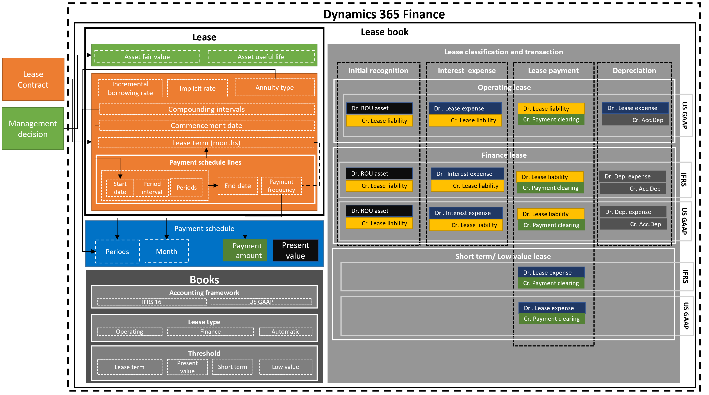

---
# required metadata

title: Asset leasing overview
description: This topic describes the Asset leasing capability in Microsoft Dynamics 365 Finance. 
author: moaamer
manager: Ann Beebe
ms.date: 09/01/2020
ms.topic: article
ms.prod: 
ms.service: dynamics-ax-applications
ms.technology: 

# optional metadata

ms.search.form: 
# ROBOTS: 
audience: Application User
# ms.devlang: 
ms.reviewer: roschlom
ms.search.scope: Core, Operations, Retail

# ms.tgt_pltfrm: 
ms.custom: 4464
ms.assetid: 5f89daf1-acc2-4959-b48d-91542fb6bacb
ms.search.region: Global
# ms.search.industry: 
ms.author: vstehman
ms.search.validFrom: 2020-09-01
ms.dyn365.ops.version: 10.0.14
---

# Asset leasing overview

[!include [banner](../includes/banner.md)]
[!include [preview banner](../includes/preview-banner.md)]

This topic describes the Asset leasing capability in Microsoft Dynamics 365 Finance. Asset leasing is an advanced capability for managing, tracking and automating financial transactions for leased assets in Microsoft Dynamics 365 Finance. The asset leasing module complies with International accounting standards (IFRS 16) and US GAAP standards (ASC 842). Asset leasing captures and processes significant information about the lease and help in generating journal entries for the lifecycle of the lease, from initial recognition, monthly journal entries, to impairment and termination of the lease. Asset leasing integrates seamlessly with other components of Dynamics 365 Finance, including Fixed assets, Accounts payable and General ledger.

Note: For more information regarding accounting standards, refer to the standard documentation of IFRS 16 and US GAAP ASC 842.

## Asset leasing elements
The following diagram illustrates the main elements of the business process for leases.

The main components that define a leased asset include the following:

Lease agreement: The lessor owns the asset and agrees with the lessee to lease an asset for specific period in exchange for periodic lease payments. In addition to the legal contract between the lessor and lessee, management decisions such as the likelihood of exercising a renewal option and transfer of ownership must to be captured.

Lease calculation and classification per accounting standard: The lease calculation and classification identifies the accounting standard that will be applied in the initial and subsequent measurement, as well as the classification test that determines what the lease type will be. A lease can be a finance lease, operating lease, short-term lease or low-value lease. The system also calculates the present value of future minimum lease payments for the purpose of valuation and classification.

Lease transactions: Asset leasing supports the initial recognition of the right-of-use asset for leases on the balance sheet, as well as subsequent measurement for either on-balance sheet leases or off-balance sheet leases. The initial recognition transaction measures the present value of future minimum lease payments. This data is used to determine the value of the initial right-of-use asset and lease liability, which affect the organization's balance sheet. The subsequent measurement of monthly lease transactions involves the accumulation of interest on the lease liability, which increases the lease liability, as well as the accrual of lease payments that decrease the lease liability, and that will subsequently be paid to the lessor. The measurement also includes the amortization of the right-of-use asset.

For off-balance sheet leases, the system calculates the straight-line lease expense over whichever is less: the economic life of the asset, or the lease term. Finally, lease adjustments measure contract modifications such as a lease extension or expansion, and the impairment transaction that writes down the right-of-use asset for non-recoverable costs.
Asset leasing module is integrated with general ledger where all lease transactions are posted to general ledger. Also, the asset leasing is integrated with accounts payable to track lessor invoices in accounts payable module and take future payments from there. The integration with fixed assets is to track leases in the fixed assets register and post right-of-use assets related transactions (initial recognition, depreciation and impairment) from fixed assets module.   

## Asset leasing components in Microsoft Dynamics 365 Finance.
Asset leasing in is designed to map lease information, payment schedules, and start and end dates in addition to the payment frequency. Asset leasing automates the calculations of present value, monthly lease payments, interest and lease amortization. The system performs lease classification tests, depending on the configuration. The system also creates and posts the corresponding lease transactions, based on the framework defined by the accounting standard you’re following.

The following diagram illustrates the lease book, the lease, calculated payment schedule, books and lease classification tests and the corresponding accounting transactions.

