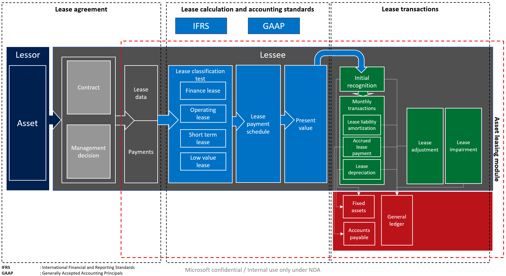
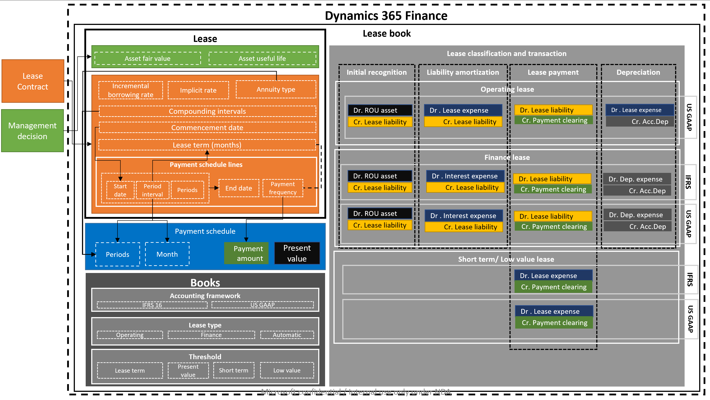
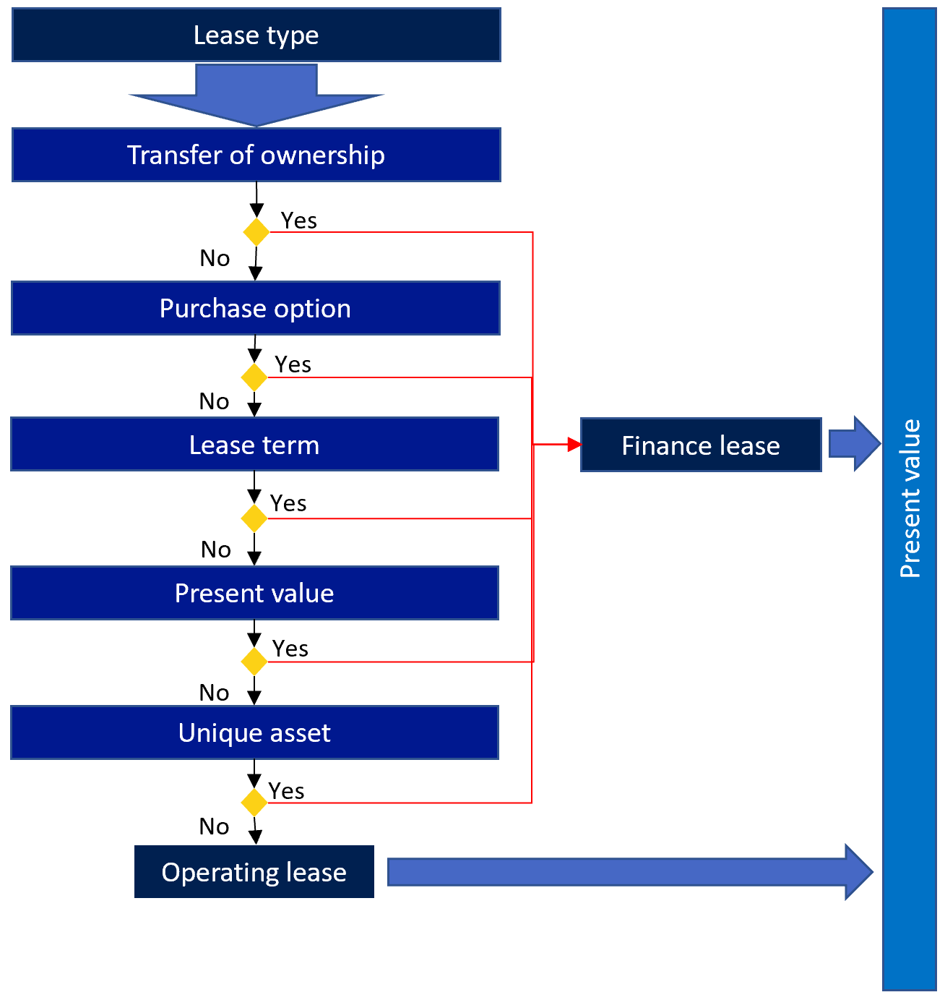
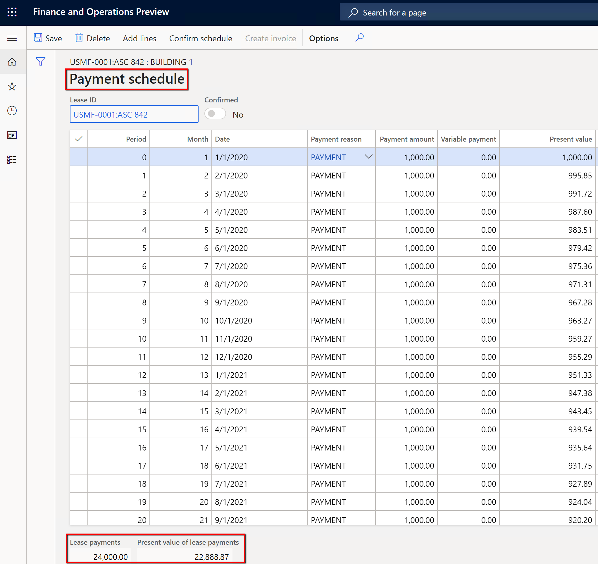
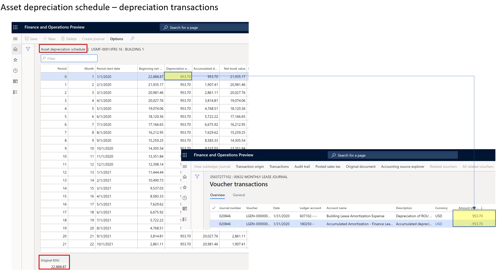

---
# required metadata

title: Asset leasing get started
description: This article describes the Asset leasing capability and walks through the steps for creating an asset lease and view information for those leases. 
author: moaamer
ms.date: 04/12/2021
ms.topic: article
ms.prod: 
ms.technology: 

# optional metadata

ms.search.form: AssetLeaseLeasingWorkspace
# ROBOTS: 
audience: Application User
# ms.devlang: 
ms.reviewer: kfend

# ms.tgt_pltfrm: 
ms.custom: ["4464"]
ms.collection: get-started
ms.assetid: 5f89daf1-acc2-4959-b48d-91542fb6bacb
ms.search.region: Global
# ms.search.industry: 
ms.author: moaamer
ms.search.validFrom: 2020-09-24
ms.dyn365.ops.version: 10.0.14
---

# Asset leasing get started

[!include [banner](../includes/banner.md)]

This article describes the Asset leasing capability and walks through the steps for creating an asset lease and view information for those leases. The article also defines the terminology used in the user interface and the documentation. Asset leasing is an advanced capability for managing, tracking, and automating financial transactions for leased assets in Microsoft Dynamics 365 Finance. Asset leasing complies with International accounting standards (IFRS 16) and US GAAP standards (ASC 842). Asset leasing captures and processes information about the leases and helps generate journal entries throughout the lifecycle of the lease, from initial recognition, monthly journal entries, to impairment and termination of the lease. Asset leasing integrates seamlessly with other components of Dynamics 365 Finance, including Fixed assets, Accounts payable, and General ledger.

Before you can use this feature, it must be turned on in your system. Admins can use the **Feature management** workspace to check the status of the feature and turn it on if it's required. In the **Feature management** workspace, find and select the feature that's named **Asset leasing**, and then click the **Enable now** button.

For more information regarding accounting standards, refer to the standard documentation for IFRS 16 and US GAAP ASC 842.

## Asset leasing elements
The following diagram shows the main elements of the business process for leases.

A leased asset contains the following main components:

- **Lease agreement** - The lessor owns the asset and agrees with the lessee to lease an asset for specific period in exchange for periodic lease payments. In addition to the legal contract between the lessor and lessee, the lease agreement captures management decisions such as the likelihood of exercising a renewal option and transfer of ownership.

- **Lease calculation and classification per accounting standard** - The lease calculation and classification identify the accounting standard that will be applied in the initial and subsequent measurement, as well as the classification test that determines what the lease type will be. A lease can be a finance lease, an operating lease, a short-term lease, or a low-value lease. The system also calculates the net present value of future minimum lease payments for the purpose of valuation and classification.

- **Lease transactions** - Asset leasing supports the initial recognition of the right-of-use asset for leases on the balance sheet, as well as subsequent measurement for either on-balance sheet leases or off-balance sheet leases. The initial recognition transaction measures the net present value of future minimum lease payments. This data is used to determine the value of the initial right-of-use asset and lease liability, which affect the organization's balance sheet. The subsequent measurement of monthly lease transactions involves the accumulation of interest on the lease liability, which increases the lease liability. It also measures the accrual of lease payments that decrease the lease liability, and that will subsequently be paid to the lessor. The measurement also includes the amortization of the right-of-use asset.

  For off-balance sheet leases, the system calculates the straight-line lease expense over whichever is less: the economic life of the asset, or the lease term. Lease adjustments measure contract modifications such as a lease extension or expansion, and the impairment transaction that uses the right-of-use asset for non-recoverable costs.

  Asset leasing integrates with General ledger to ensure that all posted lease transactions update your chart of accounts. Asset leasing integrates with Accounts payable to track lessor invoices in Accounts payable and take future payments from there. The integration with Fixed assets lets you track leases in the fixed assets register and post right-of-use assets transactions, including the initial recognition, depreciation, and impairment of the asset, from within Fixed assets.   

## Asset leasing components 
Asset leasing maps lease information, payment schedules, starting and ending dates, and the payment frequency. It also automates calculations for net present value, monthly lease payments, interest, and lease amortization. The system performs lease classification tests, depending on the configuration. The system also creates and posts the corresponding lease transactions, which are based on the framework defined by the accounting standard you’re following.

The following diagram shows the lease book, the lease, calculated payment schedule, the classification tests for leases and lease books, and the corresponding accounting transactions.

- **Lease book** - The lease book includes all the lease contract information such as lease terms, fair value, and lease payments. It also includes the accounting standard that you're following, the lease type and thresholds that are considered in the lease classification test. The lease book also contains the lease transactions that posted to general ledger. 
  
- **Lease** - The lease carries the asset lease information that represents the foundation of the asset leasing, lease information source is lease contract and management decision that are both are done outside of Dynamics 365 Finance. The asset's fair value is the price that would be paid for an asset in a transaction at the measurement date. This value might depend on the asset type, market conditions, and other criteria that can be taken into consideration in the assessment. The asset fair value will be considered in the classification test equation.

- **Asset useful life** - This represents the remaining periods of the useful life of an asset, from the lease commencement date. The useful life of an asset will be considered in the classification test equation. It differs from the useful life as defined in Fixed assets.

- **Incremental borrowing rate** - This is the interest rate that will be used to calculate the net present value. The system will use the implicit rate if it's defined in the lease data to calculate the net present value of the lease payments. If the implicit rate isn't defined, the system will use the incremental borrowing rate.

- **Annuity type** - This is the lease payment due either at the beginning of the payment period or at the end of the period. This could be payment-in-advance or annuity due (at the beginning of the lease payment period), or ordinary annuity (at the end of the lease payment period).

  The first month will be considered period number zero for payment in advance; the first month will be considered period one for payment arrears.

- **Compounding interval** - This represents the number periods that interest is compounded per year. This could be monthly (12 period per year), quarterly (4 periods per year), semi-annually (2 periods per year), or annually (1 period per year). The number of periods will be considered in the net present value calculation.

- **Commencement date** - This is the date that the lessor makes the asset available for use by the lessee. All lease calculations and transactions will be based on the commencement date. The commencement date should be at the beginning of a period (first of the month) to ensure the accuracy of subsequent calculations. You can use the **Contract signature date** field to enter the actual date when the contract was signed.

- **Lease term** - This is the length of the lease period, in months.

> [!NOTE] 
> The definition of the lease term is based on the number of periods, or intervals, in the payment schedule lines. The defined number of intervals will be converted to months.

- **Payment schedule line** - This captures the lease payments per period. It also specifies whether a renewal period will be exercised and included in the initial measurement of the right-of-use asset and lease liability. You can define the start date of the lease due payments, and the period intervals that represent the length of the lease, which can be days, months, or years.

- **Payment frequency** - This indicates whether the payment is monthly, quarterly, semiannually, or annually. The end date is calculated automatically based on the start date and the number of periods entered.

- **Payment schedule** - This is the calculated net present value, based on the length of time covered by the lease payments, the amount of the payments, the compounding periods, and the annuity type.

- **Periods** - These are the lease periods that reflect the compounding internal and annuity type. The compounding interval determines how periods will be divided. You can set the following compounding intervals:

  - Monthly, 12 periods per year
  - Quarterly, 4 periods per year
  - Semiannually, 2 periods per year
  - Annually, 1 period per year

The first period will start with period zero, if the annuity type is annuity due. Otherwise the first period will start with one, if the annuity type is payment arrears.

- **Months** - This indicates the number of calendar months over the length of the lease. The payment amount is the amount due as defined in the payment frequency. The calculated net present value is the net present value-based lease payment per period, the compounding intervals, and the incremental borrowing rate.

> [!NOTE] 
> The net present value is calculated based on the discounted cash flow equation.

- **Books** - This is the pre-configured setup that will be associated with each lease. The book defines the applied accounting standard, lease types, and threshold that's used as the basis for the classification tests. Classification tests are used to specify the lease type automatically.

- **Accounting framework** - This shows the selected accounting standard, either IFRS 16 and ASC 842, that you're supporting. The accounting standard is designated on the book that’s associated with the lease. The accounting standard will determine the ledger accounts that are specified in the posting profile.

- **Lease types** This indicates which of the two types of leases will be used, either a finance lease or an operating lease. Under a finance lease, risks and rewards that are related to the leased asset are transferred to the lessee. Under an operating lease, risks and rewards that are related to leased asset remain with the lessor. A third option is an automated identification of the lease type, either finance or operating, based on the defined thresholds in the book. This automatic identification is performed during the lease reclassification test.

- **Thresholds** - This is used in the lease classification tests to determine if the asset is classified as one of the following:

  - **Lease term** - This is the percentage of the useful life to be used in the classification test. The system will classify the lease as finance if the lease type is set to automatic, and if the lease term over the asset’s useful life is greater than or equal to the percentage defined here.

  - **Net present value** - This is the percentage of the asset’s fair value to be used in the classification test. The system will classify the lease as finance if the lease type is set to automatic and if net present value of future lease payments over the asset’s fair value is greater than or equal to the percentage defined here.

  - **Short-term lease** - If the lease term is less than or equal to the defined value, the lease will be classified as a short-term lease.

  - **Low value** - If the asset fair value is less than or equal to the value defined, the lease will be classified as a low-value lease.

  - **Lease classification and transactions** The lease classification is an automated process to classify the leases based on the defined thresholds in books besides other classification test criteria to identify if the lease is a finance lease, operating lease, short term lease, or low value lease. This is also used to identify if the deferred rent process is followed.

Classification tests include Transfer of ownership, Purchase option, Lease term, Net present value, and Unique asset. The following diagram illustrates the lease classification tests.

Each lease type handles accounting differently for different lease transactions. The transactions include initial recognition, interest expense, lease due payment and lease depreciation, and they’re based on the accounting standards you’re following (IFRS 16 or ASC 842). Ledger accounts are defined under the lease posting profile for each transaction type and accounting framework.

## Asset leasing transactions

#### Initial recognition 
The initial recognition of a leased asset uses the calculated net present value so that it can be reported on the balance sheet. The accounting entry for this is generated automatically. This transaction debits the right-of-use asset account and credits the operating lease liability account as follows. If a fixed asset is associated with the lease, the initial recognition entry will be reflected as a fixed asset acquisition. In this scenario, you must define a fixed assets posting profile  to post to the right-of-use asset account. 

> [!NOTE]
> Operating leases are supported only by US GAAP ASC 842.

|     Type                                      	|     Debit                   	|     Credit                         	|
|-----------------------------------------------	|-----------------------------	|------------------------------------	|
|     Operating lease under  US GAAP          	|     Right-of-use asset    	|     Operating lease liability    	|
|     Finance lease under IFRS and US GAAP    	|     Right-of-use asset    	|     Finance lease liability    	|

#### Lease liability amortization (interest expense) 
The interest for a lease is recognized by calculating interest for the lease’s beginning balance, period lease payment, interest borrowing rate, and compound interval periods per year. The interest amount increases the operating lease liability account by crediting it, which will be reflected on the organization’s balance sheet. The transaction also includes a debit entry to the interest expense account, which is reflected on the profit and loss statement for finance leases, and to the lease expense account for operating leases.

|     Type                                      	|     Debit                   	|     Credit                         	|
|-----------------------------------------------	|-----------------------------	|------------------------------------	|
|     Operating lease liability entry under  US GAAP ASC 842  	|     Lease expense    	    |     Operating lease liability       	|
|     Finance lease liability entry under IFRS and US GAAP    	|     Interest expense    	    |     Finance lease liability         	|

#### Accrued lease payment
An accrued lease payment is recognized as a lease future payment that’s due to process as a payment transaction from the bank or cash accounts. The lease payment due decreases the lease liability by debiting the lease liability account against whether a vendor subledger in case of the lessor is defined as a vendor, or posting the credit side to a notes payable ledger account then the payment will be executed against either vendor or notes payable.

|     Type                                      	|     Debit                   	|     Credit                         	|
|-----------------------------------------------	|-----------------------------	|------------------------------------	|
|     Operating   lease under  US GAAP          	|  Operating lease liability    |   Vendor liability (subledger)/Notes payable  |
|     Finance lease   under IFRS and US GAAP    	|  Finance lease liability      |   Vendor liability (subledger)/Notes payable 	|

#### Asset depreciation
The right-of-use asset is depreciated over whichever is less - the asset useful life or the lease term. The method for calculating depreciation for US GAAP operating lease (ASC 842) is based on the difference between the straight-line lease expense and the interest amount. Depreciation on finance leases is calculated using a standard straight-line method. The lease depreciation affects the profit and loss statement by debiting interest expense. The balance sheet is affected by crediting accumulated right-of-use asset account for finance leases. If the lease is linked to a fixed asset, the depreciation transactions will be executed from fixed assets module only. 

|     Type                                      	|     Debit                   	|     Credit                         	|
|-----------------------------------------------	|-----------------------------	|------------------------------------	|
|     Operating   lease under  US GAAP          	|  Lease expense                |   Right-of-use asset accumulated depreciation 	|
|     Finance lease   under IFRS and US GAAP    	|   Depreciation of right-of-use asset expense   |   Right-of-use asset accumulated depreciation 	|

#### Short-term lease
A short-term lease is recognized as an expense, which will affect an organization’s income statement. The generated lease payment due will debit the lease expense account, and credit the notes payable or vendor subledger account.

|     Type                                      	|     Debit                   	|     Credit                         	|
|-----------------------------------------------	|-----------------------------	|------------------------------------	|
|     Short-term lease entry under IFRS and US GAAP    	|  Lease expense                |   Vendor liability (subledger)/Notes payable 	|

#### Low value lease
A low-value lease is recognized as an expense that will affect your organization’s income statement. The generated lease payment due will debit the lease expense and crediting notes payable or vendor subledger.

|     Type                                      	|     Debit                   	|     Credit                         	|
|-----------------------------------------------	|-----------------------------	|------------------------------------	|
|     Low-value lease entry under IFRS and US GAAP    	|  Lease expense                |   Vendor liability (subledger)/Notes payable 	|

#### Index revaluation
This is the asset leasing account for variable lease payments measured by an index rate. Changes in lease payments caused by index rate fluctuations constitute a lease adjustment under IFRS 16. The lease liability and right-of-use assets will be adjusted to account for the new payments. 

|     Type                                      	|     Debit                            	|     Credit                	|
|-----------------------------------------------	|-------------------------------------	|----------------------------	|
|   Index revaluation entry under IFRS in case of increase 	|  Right-of-use   asset       |   Operating lease liability |
|   Index revaluation entry under IFRS in case of decrease 	|  Operating lease liability  |   Right-of-use   asset      |

When payments change because of a change in the index rate, only the variable payments will change unless there are additional changes to cash flows, such as a change in lease terms related to interest rates under US GAAP ASC 842.

#### Lease adjustment
Asset leasing allows leases to be adjusted if the lease terms are modified, the lease is extended, or if there are additional circumstances under which a lease requires an adjustment. Lease adjustments are posted to increase or decrease right-of-use asset and lease liability. The adjustment process takes carryover ending balances of liability amortization and asset balance at the adjustment date. When a lease is linked to fixed asset, the right-of-use adjustment will be posted using the ID that's assigned in Fixed assets. 

|     Type                                      	|     Debit                            	|     Credit                	|
|-----------------------------------------------	|-------------------------------------	|----------------------------	|
|   Lease adjustment entry for IFRS and US GAAP in case of increase 	|  Right-of-use   asset       |   Operating lease liability |
|   Lease adjustment entry for IFRS and US GAAP in case of decrease 	|  Operating lease liability  |   Right-of-use   asset      |

#### Lease impairment
This represents the carrying over balance reduction of the right-of-use asset. Identify the impairment amount, transaction date, and periods remaining. The remaining right-of-use asset will be amortized on a straight-line basis. The lease impairment logic considers the asset carryover value of which exist in the asset depreciation schedule.  

|     Type                                      	|     Debit                            	|     Credit                	|
|-----------------------------------------------	|-------------------------------------	|----------------------------	|
|   Impairment entry for IFRS and US GAAP       	|  Impairment expense                   |    Right-of-use   asset     |

>[!NOTE]
> If the lease is linked to a fixed asset, the lease impairment should be posted from Fixed assets because asset depreciation is run from the Fixed assets module.

**Dual currency**
Lease transactions can be posted in a currency other than the accounting and reporting currency. The currency exchange rate is defined in General ledger at the commencement date. You can change the exchange rates by setting the **Fixed rate** field to **Yes** when you create the lease. When you enter lease transactions, the initial recognition and subsequent depreciation transactions will use the exchange rate as of the commencement date. The subsequent payment and interest transactions will use the current active exchange rate. 

## Create an asset lease
Complete the following steps to create a new lease. 

1. To use **Asset leasing**, you must enable it in the **Feature management** workspace. From the **Feature management** workspace, select **All** so that all features are listed on the page. Select **Asset leasing**, and then select **Enable now**.
2. Go to **Asset leasing > Common > Lease summary**. Enter the required fields on the **General** FastTab. 
   - **Lease details**
   - **Asset useful life (Months)**
   - **Lease group**
   - **Incremental borrowing rate (%)**
   - **Compounding interval**
   - **Annuity type**
   - **Currency**
   - **Commencement date**

3. Move to the **Payment schedule lines** FastTab and enter a payment line, then select **Create schedules**.

4. Select **Books**. 

5. Switch to the **General** FastTab. The **Initial right-of-use asset** and **lease liability** are calculated. 

6. Move to the **Lease classification test** FastTab to check the value in the **Lease type** field. 

   The automatic **Lease type** is classified based on the criteria that are defined on the **Books** page.

7.  Go to **Payment schedule** under the **Function** section.  

   The **Payment schedule** page lists future payment schedules for a lease ID. Select **Confirm schedule** to be able to post the **Initial recognition** transactions. 

8. Select **Initial recognition** to create initial recognition journal. 

9. Select **Asset leasing journals** to post the initial recognition transaction. 

   From the payment schedule you can open a detailed page that lists the right-of-use asset transactions. 
 
   The **Lease liability amortization schedule** shows the interest amount that's calculated for each period.
   
10. Create the journal, and then go to **Asset leasing journals**. The **Lease liability amortization schedule** also shows in the interest transactions.

   The **Asset depreciation schedule** page shows the depreciation transactions for the selected lease ID. 

   

   The **ROU asset transactions** page lists initial recognition, accumulated depreciation, and the asset balance. 

   The **Lease liability transactions** page shows the initial recognition, lease interest payment, lease payment, and the lease liability balance. 

[!INCLUDE[footer-include](../../includes/footer-banner.md)]
