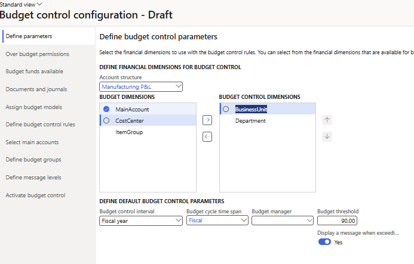
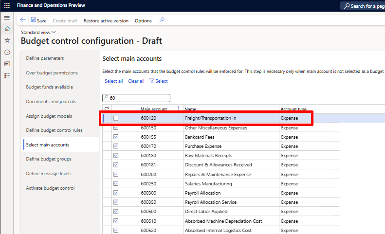
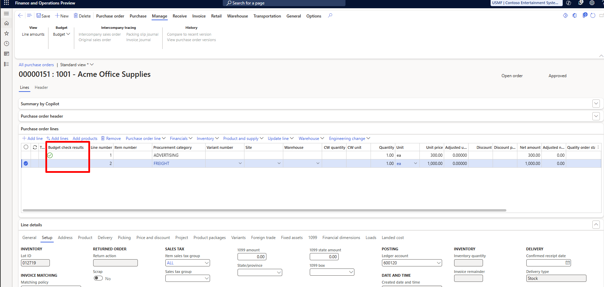

# Budget control overview

[!include [banner](../includes/banner.md)]

This article introduces the budget control feature and provides information to help you configure budget control to optimize management of your organization's financial resources.

Budget control supports the management of an organization's financial resources through the chart of accounts, workflows, user groups, source documents, and journals. It also supports the configurable calculation of available funds, budget cycles, and thresholds. When you put controls in place, your organization can plan, measure, manage, and forecast its financial resources throughout its fiscal year.

After you approve budgets in the system, use budget plans to generate budget register entries that record the expenditure budget for an organization. Alternatively, you can create or import budget register entries from a third-party program instead of using budget planning functionality.

Record expenditures by using main accounts and financial dimensions. You can configure control of the overall expenditure to meet your organization's policies and requirements by grouping combinations of financial dimensions and main accounts.

The following chart shows the place of budget control in the stages of a typical budget cycle.

:::image type="content" source="./media/budgetingcycle.png" alt-text="Screenshot of Typical budgeting cycle.":::

You can configure budget control according to several factors:

- **Financial dimensions** – What financial dimensions must be used to report budget and actuals, and what financial dimensions are required to control budgets? Are there specific dimension combinations or main accounts that require particular attention? For example, is there a requirement to track budget to actuals by cost center and program? Do travel expenses require special attention?
- **Time** – What time frame (fiscal period, fiscal period to date, and so on) will be used to evaluate available budget funds?
- **Source documents** – What source documents must be evaluated for budget control? Should the documents be evaluated per line or per document?
- **Funds available calculation** – Should documents such as purchase requisitions (preencumbrances) and purchase orders (encumbrances) be considered in the calculation of available funds? Should documents that are in a draft state be considered in the calculation?
- **Override permission** – Who has permission to exceed the available budget?

Budget control is fully integrated with the application. Therefore, you can evaluate the available budget for both planned purchases and actual purchases. Budget inquiries and reports are available. Users can evaluate the budget throughout the budget cycle, and can make any adjustments that are required, in the form of budget revisions or transfers. A budget manager can also export the budget and actuals into Microsoft Excel to better analyze and forecast as required.

## Configuring budget control

### Budget cycle time span

After you configure basic budgeting, define the time, or the starting and ending periods, for budgeting and budget control on the **Budget cycle time span** page. Budget cycles often correspond to fiscal calendars but can span fiscal years.

Complete the next steps in the configuration on tabs that you open from the **Budget control configuration** page.

### Define parameters

Based on the financial dimensions that you enable for the budget, you can use all the financial dimensions for budget control or a subset of them.

In addition, specify the default time interval (for example, **Fiscal year**, **Fiscal year to date**, **Fiscal period**, or **Quarterly**) that budget control runs for during the time span of the related budget. You can also specify a default budget manager and the threshold that is used to notify users when the threshold is reached. The values in these fields are used as default values in any new budget control rule or budget group that you create. However, you can change the default values for individual groups or rules.

The ways that you create budgets and record them in the budget register determine the time span that is selected when available budget funds are evaluated. If you develop and use an annualized amount for a dimension value combination, a fiscal-year or fiscal-year-to-date approach might make sense. However, if an organization creates budgets by fiscal period or allocates to fiscal periods and wants more detailed control, it might want to consider fiscal-period-to-date or quarterly time spans.

An organization's culture, as it relates to budgeting and budgetary control, also helps define the configuration.

### Over budget permissions

On the **Over budget permissions** tab, specify user groups. Specify whether users who are members of a group have permission to exceed the budget. You can prevent users from exceeding the budget past the budget threshold that you set on the **Budget parameters** page, or you can prevent them from exceeding the budget by any amount, regardless of the threshold. Depending on how proactively an organization manages its spending, these permissions can help it manage its financial resources.

### Budget funds available

On the **Budget funds available** tab, define the formula that is used to calculate available budget funds. Depending on how conservatively an organization manages its financial resources, or depending on regulations or industry requirements, the calculation can include draft or unposted documents.

> [!NOTE]
> If you modify the calculation during a budget cycle, the changes don't affect any documents that previously passed the budget control checks and were posted or completed.

> [!IMPORTANT]
> The **Only track amounts in the budget funds available calculation** feature changes what data is tracked in the `BudgetSourceTracking` tables. When this feature is on, amounts are stored only if they're selected for use in the available budget funds calculation. Some budget control configuration options must have specific settings to work correctly. For more information, see [Budget funds available](budget-funds-available.md).

### Documents and journals

On the **Documents and journals** tab, select which source documents and journals are subject to budget control checks. Choose whether the checks occur at the level of the line entry or the whole document. In addition, the new **Budget control document filtering enhancement** feature provides a query-based filter option for each document that is included in budget control. Therefore, you can specify which budget control documents are budget checked. In this way, the feature enables only a subset of a document type to be budget checked. For example, you can check only purchase orders where the **Pool** field is set to **01**. A new column that is added to the **Documents and journals** tab indicates whether a query is defined for the selected document type. In addition, two new buttons that are added to the toolbar above the document grid let you add, edit, or delete filtering.

Match the source documents that you select with the check boxes for balances that are included in the calculation of available budget funds. For example, if you select **Budget reservations for encumbrances**, select the **Purchase orders** option. When you perform a budget check for the amounts and accounts on a purchase line, the budget control category that you assign to the reservation is **Encumbrance**. When you perform a budget check for the amounts and accounts on a purchase requisition, the budget control category that you assign to the reservation is **Preencumbrance**.

If you include **Budget reservations for encumbrance** and **Budget reservations for pre-encumbrance** in the calculation of available budget funds and you must reflect them through postings in the general ledger, mark those selections in the **Commitment accounting** group on the **General ledger parameters** page.

### Assign budget models

On the **Assign budget models** tab, assign budget models to the budget cycle time spans that should be included in budget control.

### Define budget control rules

On the **Define budget control rules** tab, create specific rules, based on the financial dimensions that are enabled for budget control. For example, if there's a focus on the expenditure or range of expenditures for a department, use the settings on this tab to define and evaluate those expenditures, like Department = Sales, and Cost Center = *, where the asterisk (`*`) is a wildcard character that includes any cost center. You can define different thresholds for each budget control rule.

> [!NOTE]
> If your financial dimensions include any wildcard characters, such as underscore (`_`), when defining budget control rules, users should use asterisk (`*`) for the criteria definition to ensure the accurate expression is found. For example, if you have Department as Department_1, when defining budget control rule, you should use expression Department is like Department*1. The asterisk (`*`) matches any number of characters, for example, *Department_1* as well as *Department_A1* or *DeparmentA_1*.

> [!IMPORTANT]
> Budget control is enabled for any main account of the **Profit and Loss**, **Expense**, **Revenue**, **Balance sheet**, **Liability**, **Equity**, or **Asset** type. If the **Define budget control rules** tab contains a rule that has empty criteria, budget control is enabled for **all** financial dimension combinations that include main accounts of those types. Therefore, make sure that you create budget control rules that define only the ranges of financial dimension combinations where it's important for budget control to be turned on.

### Select main accounts

If you don't select **Main account** as a budget control dimension on the **Define parameters** page, but you want to manage specific expenditures, select those expenditures on the **Select main accounts** tab. The **Select main accounts** option ensures budget control checks are only performed for selected main accounts (or aren't performed on unselected main accounts) even when **Main account** isn't part of **Defined parameters** in budget control.

Example:
On the **Define parameters** page, you select **Budget control dimensions**. The budget is controlled only at the *Business Unit* and *Department* levels.

:::image type="content" source="./media/budgetcontrolconfiguration.png" alt-text="Screenshot of Define parameters.":::

In this example, budget control is required on all accounts, except 600120, which shouldn't have budget control enabled. This scenario could be achieved by marking all main accounts, except 600120, in **Select main accounts** tab.

:::image type="content" source="./media/budgetcontrolconfigurationmainaccounts.png" alt-text="Screenshot of Select main accounts.":::

If you create a purchase order for expenses associated to main account 600120, the budget check isn't performed for these lines. Every other main account that you select in the **Select main accounts** tab is controlled. In this example, the *FREIGHT* procurement category is associated to the main account 600120.

:::image type="content" source="./media/budgetcheckpurchaseorder.png" alt-text="Screenshot of Purchase order.":::

When you select the **Main account** as a budget control dimension, you don't need to configure the **Select main accounts** tab.

### Define budget groups

Define **Budget groups** to create a budget pool, or a collection of financial dimension values whose budgets are pooled for a secondary budget check.
The financial dimension combinations you enter in the **Budget control rule** are checked for budget amounts. If a financial dimension combination is also found in a **Budget group**, a second budget check happens at the budget group level.

> [!IMPORTANT]
> The **User group budget permissions** parameter you define on the **Budget control rules** determines if both budget rules and budget groups are checked for specific scenario for certain dimension combinations. If you set over budget permissions as **Prevent budget group check when budget funds are not available**, the **Budget group** checks aren't performed.

If you want a budget to be checked for specific rule or scenario, adjust:

- the **Budget group** criteria to exclude specific dimension combinations that you don't want checked at both budget control rules and budget control groups level.
   or
- the **User group budget permissions**.

### Activate budget control

After you configure budget control, turn it on and activate it on the **Activate budget control** tab. The draft version then becomes effective.

> [!IMPORTANT]
> An **Active** configuration doesn't enforce budget checks, it ensures that the rules are applied after budget control is activated. The **Turn On/Off** budget control setting determines whether budget control checks are actually enforced during transaction processing. When you select the budget control setting, budget checks occur on purchase orders, journals, and other configured documents. Transactions that exceed available funds trigger warnings or errors based on your setup. When the budget control setting is **Turned off**, no budget checks are performed, even if the configuration is marked as **Active**. The **Perform budget check** button doesn't validate budgets when the control is off.
> After budget control is on and active, and after transactions are posted, don't turn it off mid-year. When you turn off budget control, activities aren't recorded for budget control purposes, and budget checks are no longer performed. Therefore, documents that you already posted might not correctly reflect any relieving amounts or balances in inquiries and reports that are related to budget control. These documents include budget control statistics for any downstream or adjusting documents and journals.

Transactions, including budget register entries, that you posted before budget control is turned on aren't considered for budget control. Therefore, turn on budget control only at the beginning of a new budget cycle. Make sure that budget register entries that contain beginning budget balances for budget control have their budget balances updated only after budget control is turned on. Any open document (for example, a purchase order) is checked for available budget funds and gets a budget reservation for budget control when a user manually triggers a budget control check in the document.

> [!NOTE]
> When the **Only track amounts in the budget funds available calculation** feature is on, budget control must have specific rule configurations to work correctly. Otherwise, the defined budget control configuration can't be activated. For more information, see [Budget funds available](budget-funds-available.md).

The following table shows the guidelines to follow.

| If this option is selected | This option must also be selected |
| -------------------------- | --------------------------------- |
| **Budget reservations for preencumbrances** | **Budget reservations for encumbrances** *and* **Actual expenditures** |
| **Budget reservations for encumbrances** | **Actual expenditures** |
| **Budget reservations for encumbrances with Purchase requisition type documents** | **Budget reservations for preencumbrances** |

## Using budget control

After budget control is turned on, you receive budget control warning and error messages in documents and journals that are configured for budget control. You can configure budget control so that users are warned when they exceed the budget funds, but they can still continue to confirm or post transactions. You can view the details of failed budget checks on the **Budget control errors and warnings** page.

From this page, users can drill into the **Budget control statistics by period** page to view budget availability details and reservations for a selected budget control dimension combination. Users can drill into the **Budget control statistic** page to view the budget availability for all financial dimension combinations that are used in budget control.

If budget control is turned on for purchase orders, the budget manager can use the **Ledger budgets and forecasts** workspace to review the queue of all unconfirmed purchase orders that have budget check warnings and errors. If the budget manager has permissions over budgets configured, the purchase orders can be confirmed directly in the workspace.

> [!NOTE]
> **Allocation terms** aren't supported when budget control is enabled. Budget control requires understanding of all accounting distributions that affect the ledger before the document is posted. Allocations, which affect this scenario, aren't supported with budget control.
> If the **Use sales tax taxation rules** feature is enabled for your organization and **Budget reservations for encumbrances** is selected, sales taxes between purchase order and its invoices must match to correctly perform budget checks. You should either update the sales tax group in the purchase order before creating the invoice, or use sales tax adjustment functionality to update the sales tax amount directly on the invoice.
> Purchase requisitions can be canceled within the same fiscal year even if their accounting period is closed. In this case, the cancellation (finalized date) is automatically moved to the next open period in the same fiscal year. During year‑end close of the final fiscal period, the system validates that no open, budget‑controlled purchase requisitions remain and alerts users to cancel or move them to the next fiscal year before closing.

[!INCLUDE[footer-include](../../includes/footer-banner.md)]
