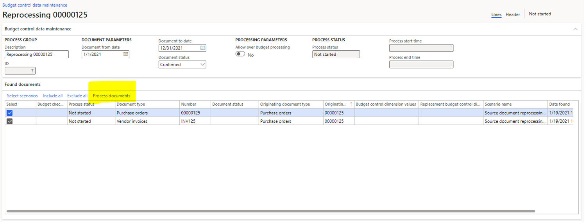

# Budget control statistics by period vs. Budget analysis report

[!include [banner](../includes/banner.md)]

This article provides information about **Budget control statistics** and **Budget analysis** reports/inquiries available for customers in the Budgeting module.

The **Budget control statistics** page provides detailed insights into budget availability and reservations for selected budget control dimension combinations. This report is used to monitor and control budget usage over specific periods provide detailed statistics on budget consumption, helping ensure that expenditures do not exceed allocated budgets. This page is useful when user would like to analyze a single budget account or a combination or group of accounts by period and budget control dimension. The report displays the available budget for each period, helping user to track how much budget remains.

The **Budget analysis** page allows user to query in any dimension order across the chart of accounts or to query a subset of an account. For example, user could view a list of year-to-date fund totals, drill down to a specific fund to view department totals, and then drill down to a specific department to view account totals. It is useful to check summary comparing budgeted amounts to actual expenses and revenue, review overall budget performance and identify variances.
The following transaction details are available in the **Budget analysis** page: 
- **Revised budget** amounts (the sum of original budget, revision, transfer, and carry-forward amounts)
- **Actual expenditures** (the sum of the debits and credits that were posted for the financial dimension values)
- **Encumbrances** and **Pre-encumbrances** (including original and relieving transactions)

Below table explains the differences between these two reports/inquiries:

| Budget control statistics |	Budget analysis|
|-----|-----|
|Shows the budget balances for a budget cycle and a budget model for a single financial dimension value or budget group.|	Shows the combined budget amounts for multiple financial dimension values at the same time.|
|Includes data from both confirmed and unconfirmed encumbrances. Includes draft transactions.| Includes data from confirmed encumbrances only. Displays only posted transactions.|
|Includes data from expense accounts only.	| Includes data from both revenue and expense accounts, and details for revenue accounts that aren't budget controlled.|

> [!NOTE] 
> The **Budget analysis** page does not distinguish between operating periods and closing periods.

## Troubleshooting budget control issues

### Budget control data maintenance

**Budget control data maintenance** tool is typically a good place to start when encountering data inconsistencies with a specific budget controlled documents.
This tool allows users to delete and recreate existing source document budget data. It also can check budget for documents that were not budget checked previously, but should be checked now either due to configuration changes or turning budget control on/off. 
The tool uses the accounting distributions to determine the correct budget amounts. If there are issues with the distributions, then the budget data will be incorrect.

To run **Budget control data maintenance**, go to **Budgeting** > **Periodic** > **Budget control data maintenance**, define a date range, click **Select scenarios** and select **Source document reprocessing provider**. A new dialog will appear that will let the user to choose which document type and document number to specify. Document number field allows for wildcards or you can specify a comma-separate list as well whoch allows multiple documents to be retrieved at a time.
The tool finds all documents that relieve each other (a relieving chain). If the user chooses, for example, PO00123 which relieves PR005678, then you will see both of those documents in the grid and they will get processed as a group. To process the document(s) click on **Process document** and follow the remaining dialogs.

### Budget control dimension values provider

The **Budget control dimension values provider** is a scenario in a **Budget control data maintenance** that allows users to adjust dimension values used in budget data. This is typically used when a new segment has been added to the ledger account structure. 
The scenario will find all dimension values currently used by budget data and *transfer* them to match the current account structure. If customer would like to preserve historical data (keep the previous account structure), the date range can be adjusted so that only data in the specified range will be updated.

To run **Budget control dimension values provider**, go to **Budgeting** > **Periodic** > **Budget control data maintenance**, define a date range (it can be set to years before Go-Live date or several years in the future), click **Select scenarios** and select **Budget control dimension values provider**. 
If there are documents to process, the grid will populate with the records that need to be updated. Select the records to update and click **Process documents**. Depending on the number of records that need to process, this could take some time.
Note that the records displayed are only the unique combinations of budget control dimension values that need to be updated. There could be one or many transactions for each combination.

> [!NOTE] 
> **Document Status** field is defaulted to *Confirmed*. If there is budget data in a draft state, user will need to perform steps again and select *Draft*.

### Budget control check fails

If user experience the issue with budget checks, or budget check fails noting there are not enough funds available, but the **Budget control statistics by period** page shows available funds for the given dimension combination, or if the above mentioned steps do not apply or yield expected results, the following steps and scenarios could be considered:
- **Budget control threshold** defines the level of a budget usage at which system prevents posting or displays warnings. If a budget threshold in the **Budget control configuration** form is set to, for example, 80%, and *Display a message when exeeding budget threshold* is set to **Yes**, the user will be shown a message about exceeding the threshold defined. 
- **Budget groups** - if a dimension combination runs out of budget, it may try to use funds from the budget group. There might be scenarios where a dimension combination is overbudget and the budget could be pulled from the budget group.
- **Overbudget permissions** - if there are any over budget permissions, there might be an overbudget scenario, but the user will not get a failure on the budget check.
- **Budget control interval** setup on the **Budget control configuration** groups - if the budget control interval is set to **Fiscal year to date** in the **Budget control configuration**, funds validation end date might be different than the date defined in the **Budget control statistics by period** page.
