---
# required metadata

title: Budget planning
description: The objective of this lab is to provide a guided view of Microsoft Dynamics 365 Finance functionality updates in Budget planning area. The intent of this lab is to illustrate a quick configuration example of budget planning module and showcase how budget planning can be accomplished using this configuration. 
author: panolte
ms.date: 06/25/2018
ms.topic: article
ms.prod: 
ms.technology: 

# optional metadata

ms.search.form: BudgetPlanningConfiguration
audience: Application User
# ms.devlang: 
ms.reviewer: kfend
# ms.tgt_pltfrm: 
ms.assetid: 0f2ba752-1f6d-4f28-b9e9-b2e97d10b6d1
ms.search.region: Global
# ms.search.industry: 
ms.author: sigitac
ms.search.validFrom: 2016-02-28
ms.dyn365.ops.version: AX 7.0.0

---

# Budget planning

[!include [banner](../includes/banner.md)]

The objective of this lab is to provide a guided view of Microsoft Dynamics 365 Finance functionality updates in Budget planning area. The intent of this lab is to illustrate a quick configuration example of budget planning module and showcase how budget planning can be accomplished using this configuration.  This lab will focus specifically on the following business processes or tasks:
- Creating organizational hierarchy for budget planning and configuring user security
- Defining budget plan scenarios, budget plan columns, layouts and Excel templates
- Creating and activating budget planning process
- Creating budget plan document by pulling in actuals from General ledger
- Using allocations to adjust budget plan document data
- Editing budget plan document data in Excel 

## Prerequisites 

For this tutorial, you’ll need to access the Microsoft Dynamics 365 Finance environment with Contoso demo data, and be provisioned as an administrator on the instance. Do not use In Private browser mode for this lab - sign out from any other account in the browser if needed and sign in with administrator credentials. When signing in, you **MUST** check the “Keep me signed in” checkbox. This creates a persistent cookie that the Excel App currently needs. If you sign in to the application using a browser other than IE, then you’ll be prompted to sign in within the Excel App. When you click “Sign in” in the Excel App, an IE popup window will open and when signing in you **MUST** check the “Keep me signed in” check box. If clicking “Sign in” in the Excel App doesn’t appear to do anything then you should clear the IE cookie cache.

## **Scenario overview**
Julia works as a finance manager in Contoso Entertainment Systems in Germany (DEMF). As FY2016 approaches, Julia needs to work on setting up the company’s budget for the upcoming year. Budget preparation looks as follows:

1.  Julia uses previous year actuals amounts as a starting point to create the budget.
2.  Based on the previous year actuals, Julia creates estimates for 12 months in the upcoming year
3.  Julia reviews the budget with CFO. Once done Julia makes necessary adjustments for the budget plan and finalizes budget preparation.

Budget planning configuration schema for the scenario looks as follows:

Julia uses the following Excel template to prepare the budget:

## Exercise 1: Configuration

### **Task 1: Create organizational hierarchy**
As all the budgeting process happens in the Finance department, therefore Julia needs to create a very simple organizational hierarchy – consisting of Finance department only. 

1.1. Navigate to Organization hierarchies (Organization administration &gt; Organizations &gt; Organization hierarchies) and click the New button.

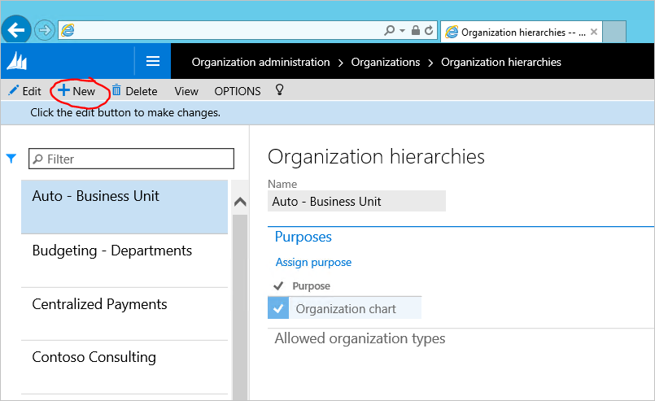 

1.2. Type the name for the organizational hierarchy in the Name box and click Assign purpose.

1.3. Select the Budget planning purpsose, click Add, and assign the newly created organizational hierarchy. 

[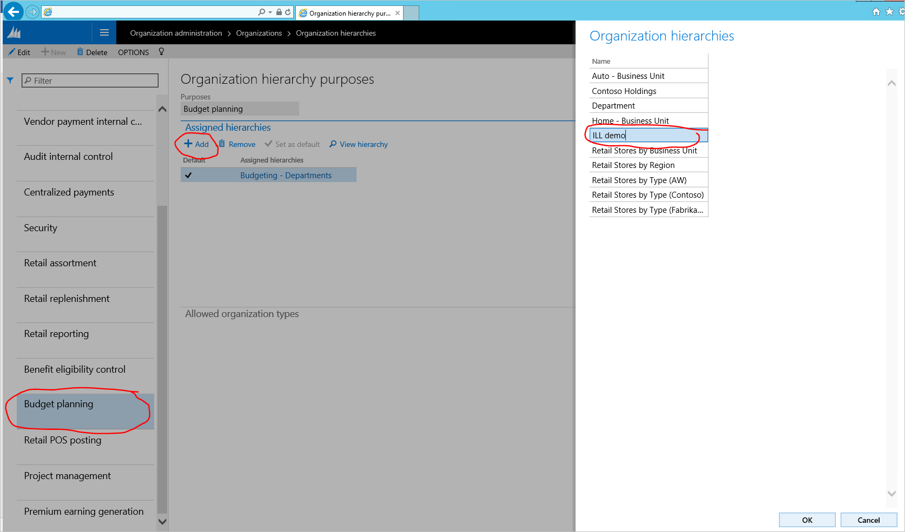](./media/screenshot5.png)

1.4. Repeat the step above for the Security organizational purpose. Close the form when done.

1.5. In the Organizational Hierarchies form, click View. Click Edit in the Hierarchy designer, and create a hierarchy by clicking Insert.

[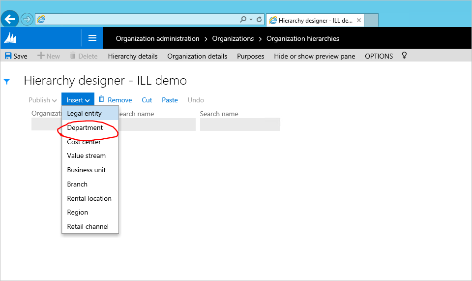](./media/screenshot7.png) 

1.6. Select Finance department for the budgeting hierarchy. 

[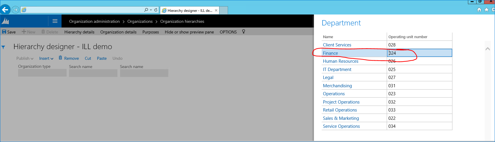](./media/screenshot8.png)

1.7. When done, click Publish and Close. Select 1/1/2015 as the effective date for hierarchy publishing.

[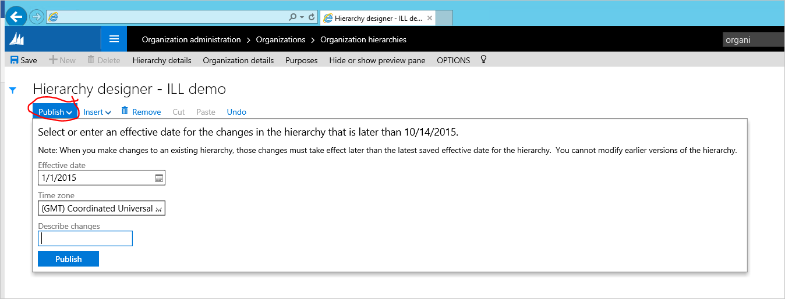](./media/screenshot9.png)

### Task 2: Configure user security
Budget planning uses special security policies to configure access to budget plans data. Julia needs to give access to Finance budget plans for herself. 

2.1. Switch to DEMF legal entity context. 

2.2. Navigate to Budgeting &gt; Setup &gt; Budget planning &gt; Budget planning configuration. In the Parameters tab, set the Security model value to Based on security organizations. 

[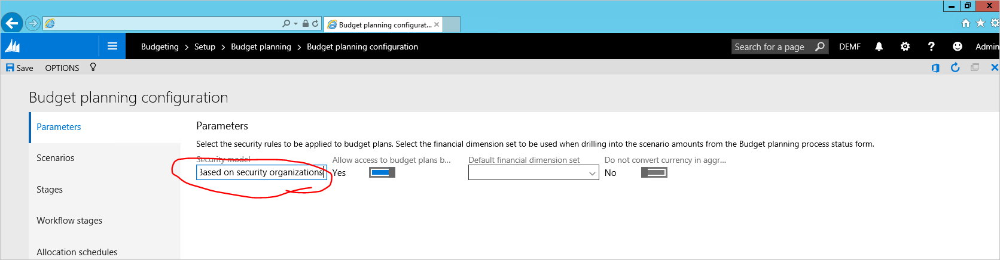](./media/screenshot11.png) 

2.3. Navigate to System administration &gt; Users &gt; Users. Give user Admin (Julia Funderburk) Budget manager role. 

[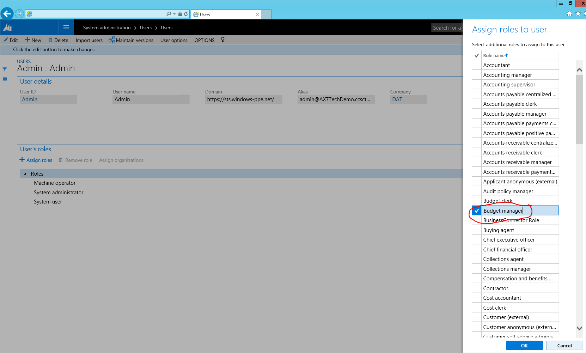](./media/screenshot12.png) 

2.4. Pick user role and click Assign organizations. 

[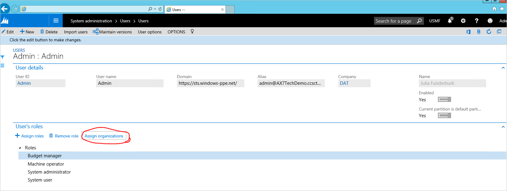](./media/screenshot13.png)

2.5. Select “Grant access to specific organizations”. Pick the Organizational hierarchy created in the first step. Pick Finance node, and click the Grant with children button. 

***Important!*** *Make sure you are in DEMF legal entity context when performing this task, as Organizational security is applied per legal entity* 

### Task 3: Create scenarios
3.1. Navigate to Budgeting&gt;Setup &gt; Budget planning &gt; Budget planning configuration. In the Scenarios page note the scenarios we are going to use further in this lab: Previous year actuals and Budgeted. 

*Note: You can create new scenarios for this exercise if desired and use those instead.* 

[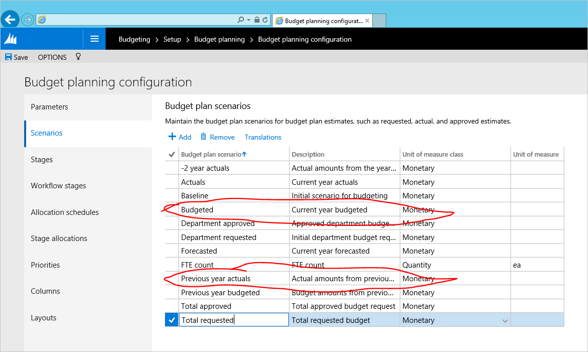](./media/screenshot15.png) 

*Note: as Julia is not using formal approval process for budget preparation, we will skip Workflows, Stages and Workflow stages setup in this lab and will use existing setup for Auto – approve workflow. See appendix for this workflow configuration.*

### Task 4: Create budget plan columns
Budget plan columns are either Monetary or quantity based columns that can be used in budget plan document layout. In our example we need to create a column for Previous year actuals and 12 columns to represent each month in a budgeted year. Columns can be created either by simply clicking Add button and filling in the values, or with a help of Data entity. In this lab we will use Data entity to fill in the values. 

4.1. In Budgeting&gt;Setup &gt; Budget planning &gt; Budget planning configuration, open the Columns page. Click the Office button on the top right corner of the form, and pick Columns (unfiltered). 

[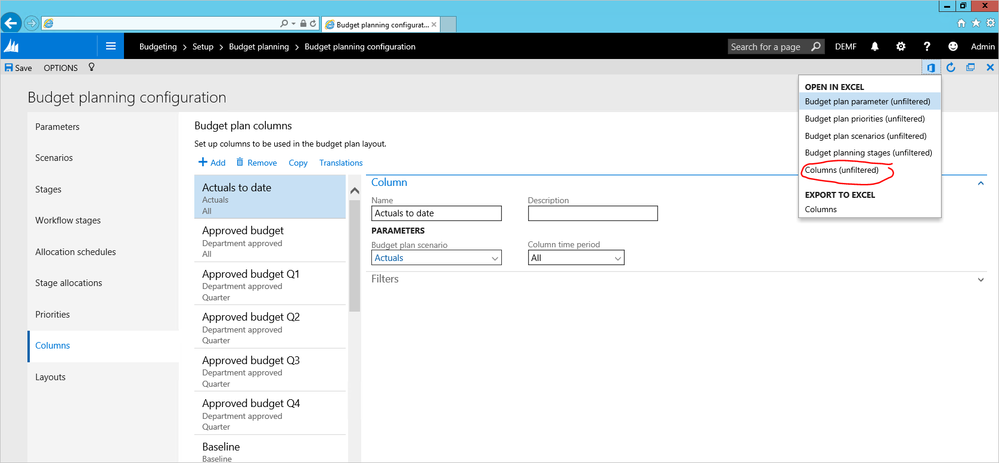](./media/screenshot16.png) 

4.2. The system will open an Excel workbook to be used for filling in the values. If prompted, click Enable Editing and Trust this app. 

4.3. We will need more columns to fill the values in. Click Design on the right side pane to add the columns to the grid. 

 

4.4. Click the pencil button next to PlanColumns to see available columns to add to the grid. 

 

4.5. Double click on each available field to add them to Selected fields, and click Update. 

4.6. In the Excel table, add all the columns that need to be created. Use the AutoFill feature in Excel to add the lines quickly. Make sure the lines are added as a part of the table (when using vertical scroll, you should be able to see column headers on the top of the grid). 

4.7. Return to the application, and refresh the page. Published values will appear. 

[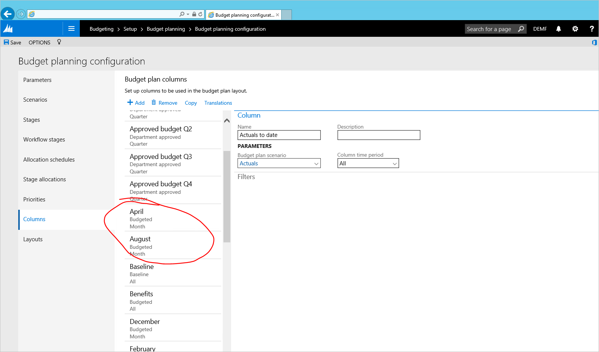](./media/screenshot23.png)

### Task 5: Create budget plan document layouts and templates
Layout defines how budget plan document lines grid is going to look like when user opens budget plan document. It is also possible to switch the layout for budget plan document to see the same data in different angles. Now, with columns defined to be used with our budget plan document, Julia needs to create a budget plan document layout, that would look similar to the Excel table used to create budget data (see section Scenario overview in this lab) 

5.1. In the Budgeting&gt;Setup &gt; Budget planning &gt; Budget planning configuration, open the Layouts page. Create a new layout for Monthly budget entry:

-   Pick MA+BU dimension set to include Main accounts and Business units to the layout.
-   List all budget plan columns created in the previous step in the Elements section. Make all but Previous year actuals editable.
-   Click Descriptions button to select which financial dimensions should display Descriptions in the grid.

[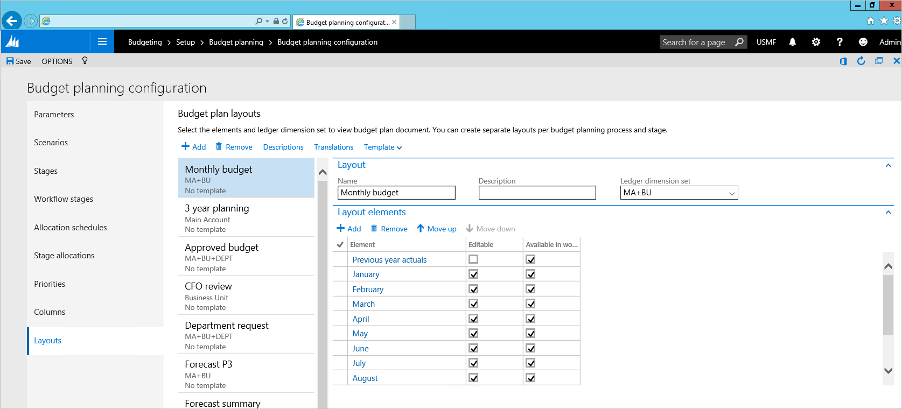](./media/screenshot24.png) 

Based on the budget plan layout definition we can create an Excel template to be used as an alternative way to edit Budget data. As Excel template has to match budget plan layout definition, you won’t be able to edit budget plan layout after generating Excel template, therefore this task should be done after all layout components are defined. 

5.2. For the layout created in the 5.1. step, click button Template &gt; Generate. Confirm the warning message. To view the template, click Template &gt; View. 

*Note: Make sure to select “Save as” and select the place where template should be stored in order to edit it. If user selects “Open” in the dialog without saving, the changes done to the file will not be retained when the file is closed.* 
[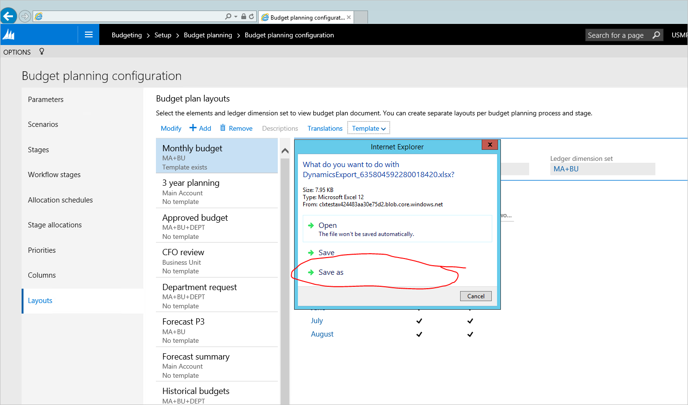](./media/screenshot25.png) 

5.3. &lt; Optional step&gt; Modify Excel template to make it look more user friendly – add total formulas, header fields, formatting, etc. Save the changes and upload the file to budget plan layout by clicking Layout &gt; Upload. 

### Task 6: Create a budget planning process
Julia needs to create and activate a new budget planning process combining all the setup above to start entering budget plans. Budget planning process defines what budgeting organizations, workflow, layouts and templates will be used for creating budget plans. 

6.1. Navigate to Budgeting &gt; Setup &gt; Budget planning &gt; Budget planning process, and create a new record.

-   Budget planning process – DEMF budgeting FY2016
-   Budget cycle – FY2016
-   Ledger – DEMF
-   Default account structure – Manufacturing P&L
-   Organization hierarchy – pick the hierarchy created in the beginning of the lab
-   Budget planning workflow – assign Auto – Approve workflow for Finance department
-   In budget planning stage rules and templates, for each workflow Budget planning stage pick if Adding lines and Modifying lines is allowed and what Layout should be used by default

*Note: You can create additional document layouts and assign them to be available in budget planning workflow stage by clicking Alternate layouts button.* 

[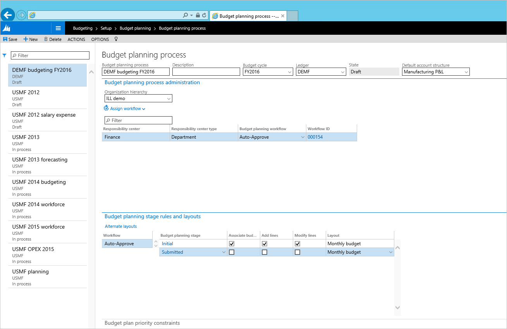](./media/screenshot27.png) 

6.2. Select Actions &gt; Activate to activate this budget planning workflow. 

[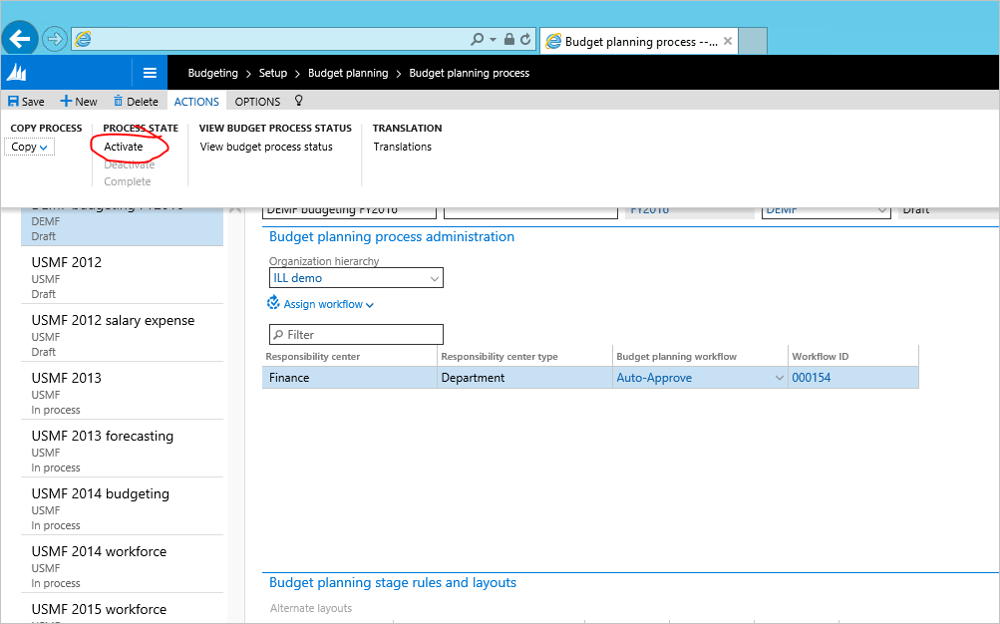](./media/screenshot28.png)

## Exercise 2: Process simulation

### Task 7: Generate initial data for budget plan from General ledger
7.1. Navigate to Budgeting &gt; Periodic &gt; Generate budget plan from General ledger. Fill in the periodic process parameters, and click Generate. 

7.2. Navigate to Budgeting &gt; Budget plans to find a budget plan created by the Generate process. 

[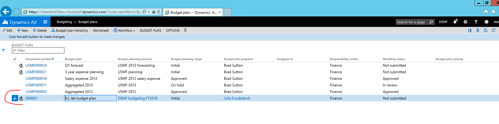](./media/screenshot30.png) 

7.3. Open document details by clicking on Document number hyperlink. Budget plan is displayed as defined in the layout created during this lab. 

[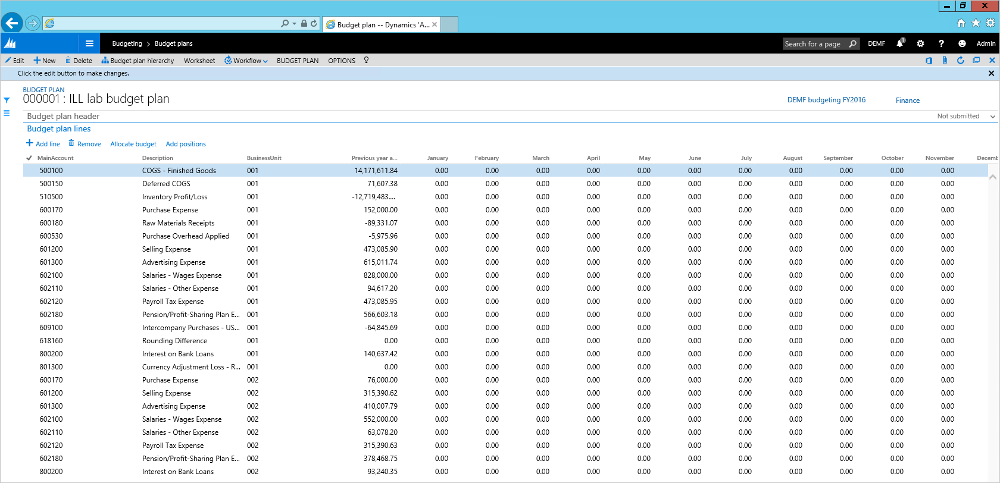](./media/screenshot31.png)

### Task 8: Create current year budget based on previous year actuals
Allocation methods can be used in budget plan to easily copy information for budget plans from one scenario to another/ spread them across periods/ allocate to dimensions. We will use allocations to create current year budget from previous year actuals. 

8.1. Pick all lines in the budget plan document grid and click Allocate budget. 

[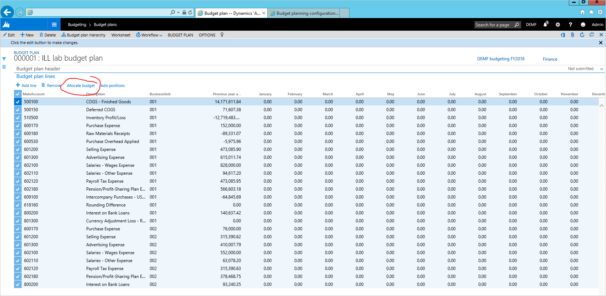](./media/screenshot32.png) 

8.2. Select allocation method, Period key, Source and destination scenarios, and click Allocate. 

[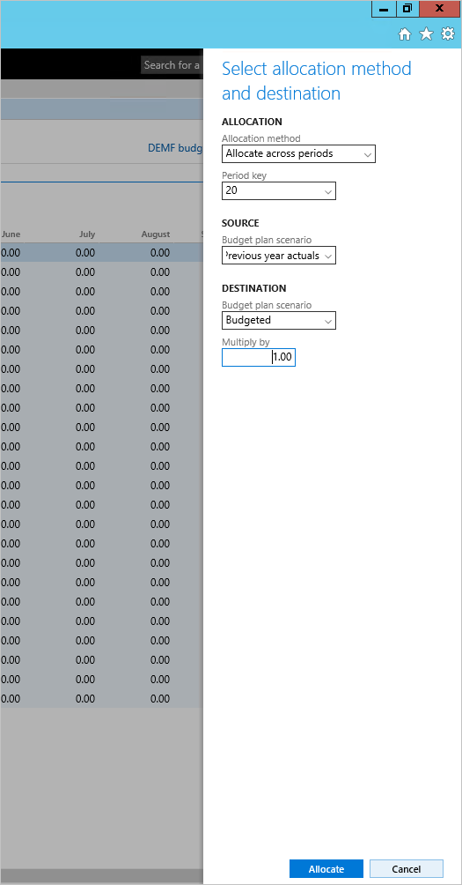](./media/screenshot33.png)

The previous year actual amounts will be copied to the current year budget and allocate them across periods using the Sales curve period key. 

### Task 9: Adjust budget plan document using Excel and finalize the document
9.1. Click the Worksheet button to open document contents in Excel.

9.2. When the Excel workbook opens, adjust the numbers in the budget plan document, and click the Publish button.

9.3. Return to budget plan document. Click Workflow &gt; Submit to Auto-approve the document.

[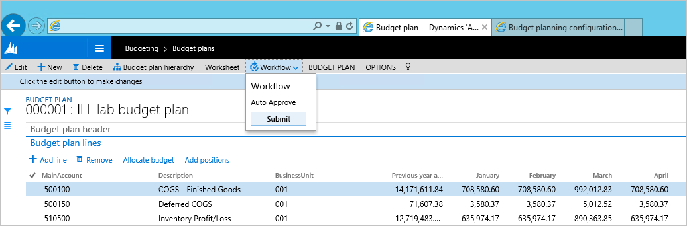](./media/screenshot37.png) 

Once workflow completes, the budget plan document stage changes to Approved. [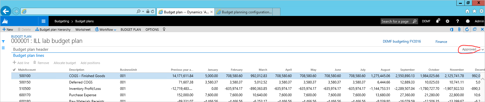](./media/screenshot38.png)

## Appendix

### Auto-Approve workflow configuration

A. Budgeting &gt; Setup &gt; Budget planning &gt; Budgeting workflows. Create a new workflow using template Budget planning workflows:

[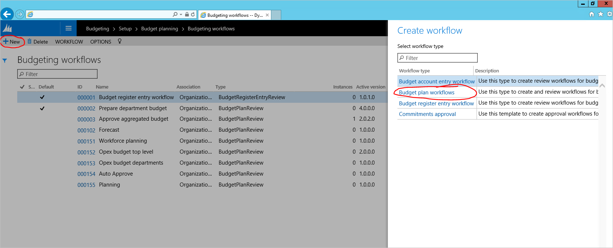](./media/screenshot39.png)

This workflow will contain only one task – Stage transition budget plan. 

 

Save and activate the workflow. 

B. Navigate to Budgeting &gt; Setup &gt; Budget planning &gt; Budget planning configuration. In the Stages tab, create 2 stages – Initial and Submitted. 

[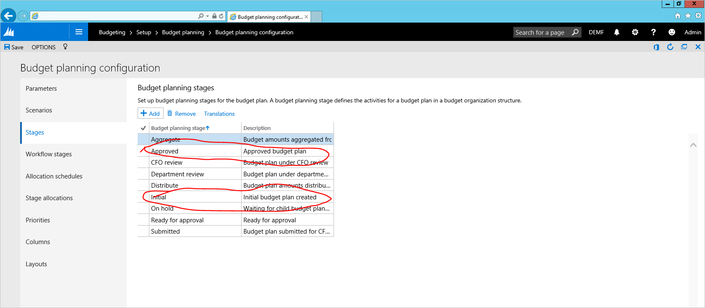](./media/screenshot41.png)

C. Navigate to Budgeting &gt; Setup &gt; Budget planning &gt; Budget planning configuration. In the Workflow Stages tab, associate the workflow Auto–approve created in step A with the stages Initial and Submitted.

[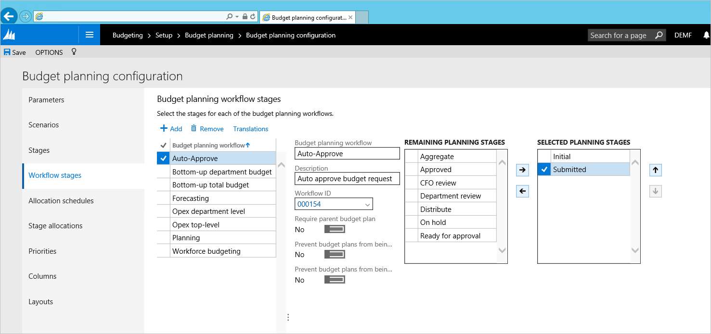](./media/screenshot42.png)  

[!INCLUDE[footer-include](../../includes/footer-banner.md)]
