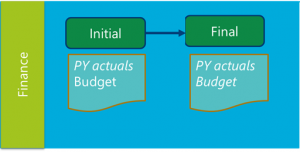
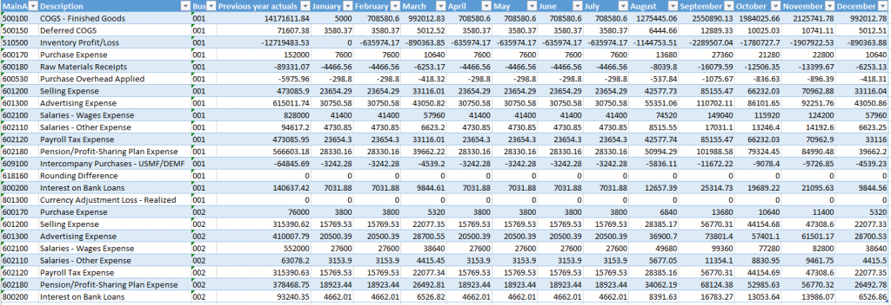
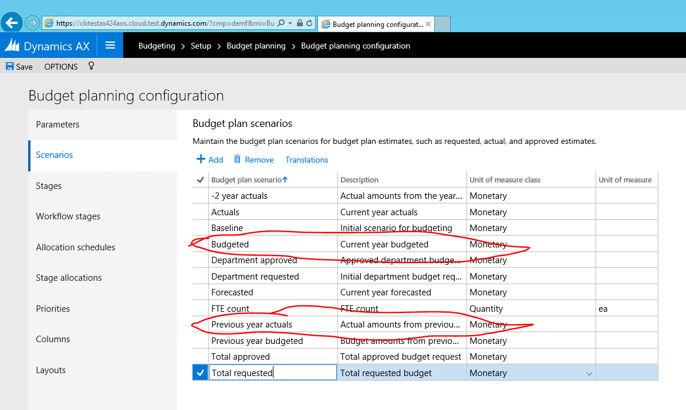
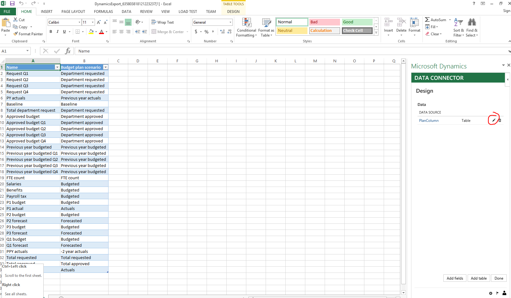
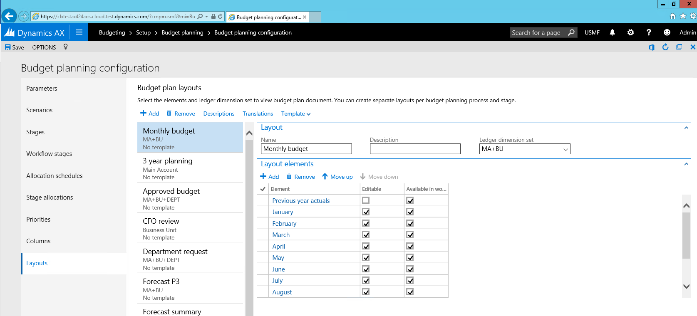

# Budget planning

[!INCLUDE [banner](../includes/banner.md)]

This article provides a guided view of Budget planning in Microsoft Dynamics 365 Finance. This shows how to configure budget planning and how to budget plan using this configuration. This article focuses specifically on the following business processes or tasks:

- Creating an organizational hierarchy for budget planning and configuring user security
- Defining budget plan scenarios, budget plan columns, layouts, and Excel templates
- Creating and activating a budget planning process
- Creating a budget plan document by pulling in actuals from the General ledger
- Using allocations to adjust budget plan document data
- Editing budget plan document data in Excel

## Prerequisites

For this example, access the Microsoft Dynamics 365 Finance environment with Contoso demo data, and be an administrator. Don't use In Private browser mode - sign out from any other account in the browser if needed and sign in with administrator credentials. When signing in, select the **Keep me signed in** checkbox. This selection creates a persistent cookie that the Excel App currently needs. If you sign in to the application by using a browser other than Edge, you're prompted to sign in within the Excel App. When you select **Sign in** in the Excel App, a popup window opens. When signing in, select the **Keep me signed in** checkbox. If selecting **Sign in** in the Excel App doesn't do anything, clear the cookie cache.

## Scenario 

Julia works as a finance manager in Contoso Entertainment Systems in Germany (DEMF). As FY2026 approaches, Julia needs to set up the company’s budget for the upcoming year. Budget preparation follows these steps:

1. Julia uses the previous year's actual amounts as a starting point to create the budget.
1. Based on the previous year's actuals, Julia creates estimates for 12 months in the upcoming year.
1. Julia reviews the budget with the CFO. Once done, Julia makes necessary adjustments to the budget plan and finalizes budget preparation.

The budget planning configuration schema for the scenario looks as follows:

Julia uses the following Excel template to prepare the budget:

## Configuration

### Create organizational hierarchy

Because the entire budgeting process happens in the Finance department, Julia needs to create a simple organizational hierarchy that consists of only the Finance department.

1. Go to **Organization hierarchies** and select **New**.
1. Enter a name for the organizational hierarchy in the **Name** field and select **Assign purpose**.
1. Select the **Budget planning purpose**, select **Add**, and assign the newly created organizational hierarchy.
1. Repeat the preceding step for the Security organizational purpose. Close the page when done.
1. In the **Organizational hierarchies** page, select **View**. Select **Edit** in the **Hierarchy designer**, and create a hierarchy by selecting **Insert**.
1. Select Finance department for the budgeting hierarchy.
1. When done, select **Publish and Close**. Select 1/1/2025 as the effective date for hierarchy publishing.

### Configure user security

Budget planning uses special security policies to configure access to budget plans data. Julia needs to give access to Finance budget plans for herself.

1. Switch to DEMF legal entity context.
1. Go to **Budgeting** > **Setup** > **Budget planning** > **Budget planning configuration**. In the **Parameters** tab, set the **Security model value** to **Based on security organizations**.
1. Go to **System administration** > **Users** > **Users**. Give user Admin (Julia Funderburk) Budget manager role.
1. Pick user role and click **Assign organizations**.
1. Select **Grant access to specific organizations**. Pick the Organizational hierarchy created in the first step. Pick Finance node, and click **Grant with children**.

Make sure you're in DEMF legal entity, as Organizational security is applied per legal entity.
The budget plan uses role-based security. To view the **Budget plan** page, a user must have one of the following roles:

- Budget clerk
- Budget contributor
- Budget manager

### Create scenarios

1. Go to **Budgeting** > **Setup** > **Budget planning** > **Budget planning configuration**.
2. On the **Scenarios** page, note the Previous year actuals and Budgeted scenarios.

You can create new scenarios if desired and use those instead.

### Create budget plan columns

**Budget plan** columns are either monetary or quantity-based columns that you can use in a budget plan document layout. In this example, you create a column for previous year actuals and 12 columns to represent each month in a budgeted year. You can create columns by clicking **Add** and filling in the values, or by using a data entity. You can use a data entity to fill in the values.

1. In **Budgeting** > **Setup** > **Budget planning** > **Budget planning configuration**, open the **Columns** page.
2. Select the **Office** button in the upper-right corner of the page, and select **Columns (unfiltered)**.
1. An Excel workbook opens for filling in the values. If prompted, select **Enable editing** and **Trust this app**.
1. Select **Design** on the right side pane to add the columns to the grid.
1. Select the pencil button next to **PlanColumns** to see available columns to add to the grid.

1. Double-click each available field to add it to **Selected fields**, and select **Update**.
1. In the Excel table, add all the columns that you need to create. Use the AutoFill feature in Excel to add the lines quickly. Make sure you add the lines as part of the table.
1. Return to the application, and refresh the page. Published values appear.

### Create budget plan document layouts and templates

A layout defines how the budget plan document lines grid looks when you open the budget plan document. You can switch the layout for the budget plan document to see the same data from different perspectives. After you define the columns for your budget plan document, create a budget plan document layout that looks similar to the Excel table used to create budget data. 

1. Go to **Budgeting** > **Setup** > **Budget planning** > **Budget planning configuration**, and open the **Layouts** page. Create a new layout for **Monthly budget entry**:

- Select the MA+BU dimension set to include main accounts and business units in the layout.
- List all budget plan columns you created in the previous step in the **Elements** section. Make all but **Previous year actuals** editable.
- Select the **Descriptions** button to choose which financial dimensions display descriptions in the grid.

Based on the budget plan layout definition, you can create an Excel template to use as an alternative way to edit budget data. Because the Excel template has to match the budget plan layout definition, you can't edit the budget plan layout after generating the Excel template. Therefore, complete this task after you define all layout components.

1. For the layout you created, select **Template** > **Generate**. Confirm the warning message. To view the template, select **Template** > **View**.

>[!Note]
>Select **Save as** and choose the location where you want to store the template to edit it. If you select **Open** in the dialog without saving, the changes you make to the file aren't retained when the file is closed.

1. (Optional) Modify the Excel template to make it more user friendly by adding total formulas, header fields, formatting, and other elements.
1. Save your changes and upload the file to the budget plan layout by selecting **Layout** > **Upload**.

### Create a budget planning process

Julia needs to create and activate a new budget planning process that combines all the preceding setup steps to start entering budget plans. The budget planning process defines which budgeting organizations, workflow, layouts, and templates to use for creating budget plans.

1. Go to **Budgeting** > **Setup** > **Budget planning** > **Budget planning process**, and create a new record.

- Budget planning process – DEMF budgeting FY2026
- Budget cycle – FY2026
- Ledger – DEMF
- Default account structure – Manufacturing P&L
- Organization hierarchy – select the hierarchy you created 
- Budget planning workflow – assign Auto – Approve workflow for Finance department
- In **budget planning stage rules and templates**, for each workflow **Budget planning stage**, select if adding lines and modifying lines are allowed and choose the default layout

>[!Note]
>You can create additional document layouts and assign them to be available in budget planning workflow stage by clicking **Alternate layouts**.

Select **Actions** > **Activate** to activate this budget planning workflow.

## Process simulation

### Generate initial data for budget plan from General ledger

1. Go to **Budgeting** > **Periodic** > **Generate budget plan from General ledger**. Fill in the periodic process parameters, and select **Generate**.
1. Go to **Budgeting** > **Budget plans** to find a budget plan created by the generate process.
1. Open document details by selecting the **Document number** hyperlink. The Budget plan is displayed.

### Create current year budget based on previous year actuals

Use allocation methods in a budget plan to easily copy information for budget plans from one scenario to another, spread it across periods, or allocate it to dimensions. Use allocations to create the current year budget from the previous year actuals.

1. Select all lines in the budget plan document grid, and then select **Allocate budget**.
1. Select **Allocation method**, **Period key**, **Source**, and **Destination** scenarios, and then select **Allocate**.

The previous year actual amounts are copied to the current year budget. The system allocates these amounts across periods by using the Sales curve period key.

### Adjust budget plan document using Excel and finalize the document

1. Select **Worksheet** to open document contents in Excel.
1. When the Excel workbook opens, adjust the numbers in the budget plan document, and then select **Publish**.
1. Return to budget plan document. Select **Workflow** > **Submit** to auto-approve the document.

After the workflow completes, the budget plan document stage changes to **Approved**.

### Auto-approve workflow configuration

1. Go to **Budgeting** > **Setup** > **Budget planning** > **Budgeting workflows**. Create a new workflow by using the **Budget planning workflows** template.
1. This workflow contains only one task – **Stage transition budget plan**.
1. Save and activate the workflow.
1. Go to **Budgeting** > **Setup** > **Budget planning** > **Budget planning configuration**.
1. In the **Stages** tab, create two stages – **Initial** and **Submitted**.
1. Go to **Budgeting** > **Setup** > **Budget planning** > **Budget planning configuration**.
1. In the **Workflow stages** tab, associate the Auto-approve workflow with the stages **Initial** and **Submitted**.

[!INCLUDE[footer-include](../../includes/footer-banner.md)]
