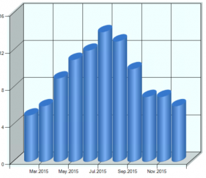
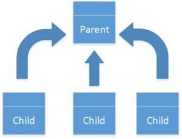
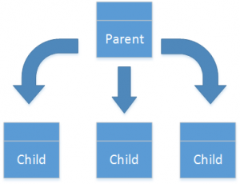
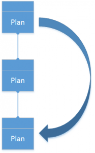
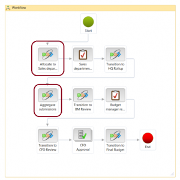

# Budget planning data allocation

[!INCLUDE [banner](../includes/banner.md)]

This article describes the allocation methods that are available in Microsoft Dynamics 365 Finance and how you can use them.  

You can distribute the data in a budget plan in many ways to accurately portray the projected amounts.

## Allocation methods

Use three allocation methods (Allocate across periods, Allocate to dimensions, and Use ledger allocation rules) to create budget plan lines that are based on lines in the same budget plan. Use three other methods (Aggregate, Distribute, and Copy from budget plan) to create budget plan lines in other budget plans. For all six allocation methods, you specify the destination scenario. The destination scenario can be either the same as the source scenario or different from the source scenario. Additionally, you can specify whether new lines are appended to the budget plan or replace the current lines in the budget plan.

> [!NOTE]
> Use a unique scenario for aggregation that's different from the scenario that you used for distribution or other modifications that you previously performed in the parent plan.  

**Allocate across periods** – Use a period allocation category to allocate the budget plan lines from the source budget plan scenario across periods in the destination scenario. The source amount is assigned to multiple lines in the destination scenario, based on the percentage and date that you define in the period allocation category.

**Allocate to dimensions** – Allocate the budget plan lines from the source budget planning scenario to one or more lines in the destination scenario, based on the percentages and financial dimensions that you define in a selected budget allocation term.

**Aggregate** – Aggregate the budget plan lines from the source budget plan scenario in the associated (child) budget plans to the destination scenario in the parent budget plan. This method enables budget amounts that are prepared at a lower level in the organization to be consolidated at a higher level.

**Distribute** – Distribute the budget plan lines from the source budget planning scenario in the parent budget plan to the destination scenario in the associated (child) budget plans, based on the financial dimensions of the organization units of the associated plans. This method enables budget amounts that are prepared at a higher level in the organization to be spread out for more localized review.

**Use ledger allocation rules** – Distribute the budget plan lines from the source budget planning scenario to the destination scenario, based on the ledger allocation rule that you select.

**Copy from budget plan** – As in the Distribute allocation method, create budget plan lines in the destination, based on lines in a related budget plan. However, for this method, the source budget plan doesn't have to be the parent but can be at any higher level in the budget plan hierarchy. This allocation method is useful if consolidated amounts are originally budgeted at a much higher level, and must be transferred to a lower level of the organization for detailed review and adjustment before they can receive upper-level approval.

## Using allocation methods in a budget plan

To perform allocations on the budget plan page, select the lines to allocate, and then click **Allocate budget**.

Next, select an allocation method. The system sets the remaining fields based on the method that you selected. These fields include the source and destination of the budget plan data, and an option that you can use to multiply the source by a specified factor when the system creates the destination amounts, to simplify bulk adjustment. You can also set the **Append to plan** option. Select **No** to replace the existing budget plan lines, or select **Yes** to retain the existing budget plan lines and add new lines for the allocated amounts.

## Automating allocations during a workflow

One powerful feature enables you to perform allocations automatically as part of a budget planning workflow. As a budget plan moves through its workflow, automated tasks can invoke an allocation at a specified budget planning stage.

To set up automated allocation, first create an allocation schedule on the **Budget planning configuration** page. The allocation schedule defines the allocation method that the system uses when it runs the automated allocation, and the values of the various allocation options (see the previous section for descriptions).

Next, create a stage allocation on the **Budget planning configuration** page. The stage allocation assigns an allocation schedule to the budget planning workflow and stage.

Finally, add an automated task for budget planning stage allocation at the desired workflow stage. In the following example, two budget planning stage allocations (outlined in red) are inserted into the workflow.

[!INCLUDE[footer-include](../../includes/footer-banner.md)]
