# Budget planning templates for Excel

[!include [banner](../includes/banner.md)]

This article describes how to create Microsoft Excel templates that can be used with budget plans.

This article shows how to create Excel templates that will be used with budget plans using the standard demo data set and the Admin user login. For more information about budget planning, see [Budget planning overview](budget-planning-overview-configuration.md). 
You can also follow the [Budget planning](budget-plan.md) tutorial to learn basic module configuration and usage principles.

## Generate a worksheet using budget plan document layout

Budget plan documents can be viewed and edited using one or more layouts. Each layout can have an associated budget plan document template to view and edit the budget plan data in an Excel worksheet. In this article, a budget plan document template will be generated using an existing layout configuration. 

1. Open the **Budget plans list** (**Budgeting** &gt; **Budget plans**). 
2. Click **New** to create a new budget plan document. 

   [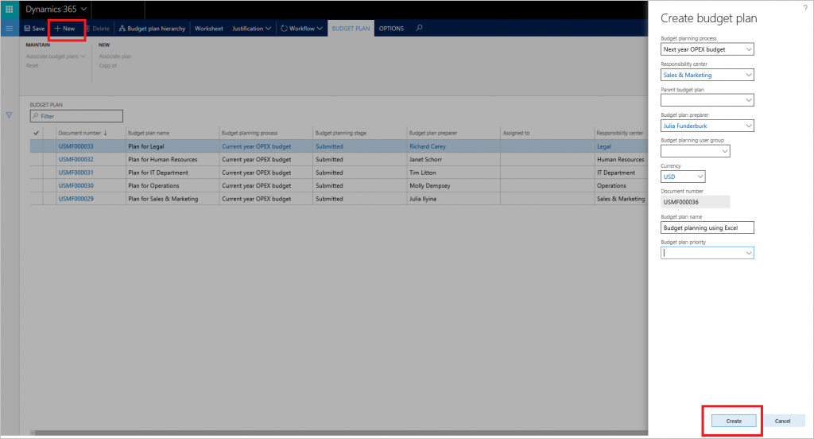](./media/bpt11.png) 

3. Use the **Add** line option to add lines. Click **Layouts** to view the budget plan document layout configuration. 

   [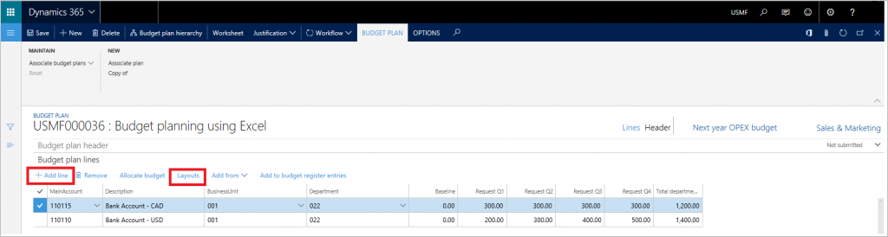](./media/bpt2.png) 

You can review the layout configuration and adjust it as needed. 
1. Go to **Template** &gt; **Generate** to create an Excel file for this layout. 
2. After the template is generated, go to **Template** &gt; **View** to open and review the budget plan document template. You can save the Excel file to your local drive. 

[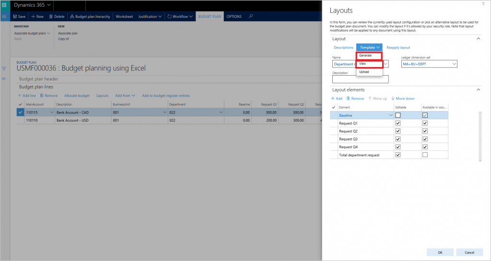](./media/bpt3.png)

> [!NOTE] 
> The Budget plan document layout cannot be edited after an Excel template is associated with it. To modify the layout, delete the associated Excel template file and regenerate it. This is required to keep the fields in the layout and the worksheet synchronized. 

The Excel template will contain all of the elements from the budget plan document layout, where the **Available in Worksheet** column is set to True. Overlapping elements are not allowed in the Excel template. For example, if the layout contains Request Q1, Request Q2, Request Q3, and Request Q4 columns, and a total request column that represents a sum of all 4 quarterly columns, only the quarterly columns or total column is available to be used in the Excel template. The Excel file cannot update overlapping columns during the update because data in the table could become out of date and inaccurate.

> [!NOTE] 
> To avoid potential issues with viewing and editing budget plan data using Excel, the same user should be logged into both Microsoft Dynamics 365 Finance and the Microsoft Dynamics Office Add-in Data Connector.

## Add a header to budget plan document template
To add header information, select the top row in the Excel file and insert empty rows. Click **Design** in the **Data Connector** to add header fields to the Excel file.

In the **Design** tab, click **Add** fields, and then select **BudgetPlanHeader** as the entity data source.

Point the cursor to the desired location in the Excel file. Click **Add label** to add the field label to the selected location. Select **Add Value** to add the value field to the selected place. Click **Done** to close the designer.

## [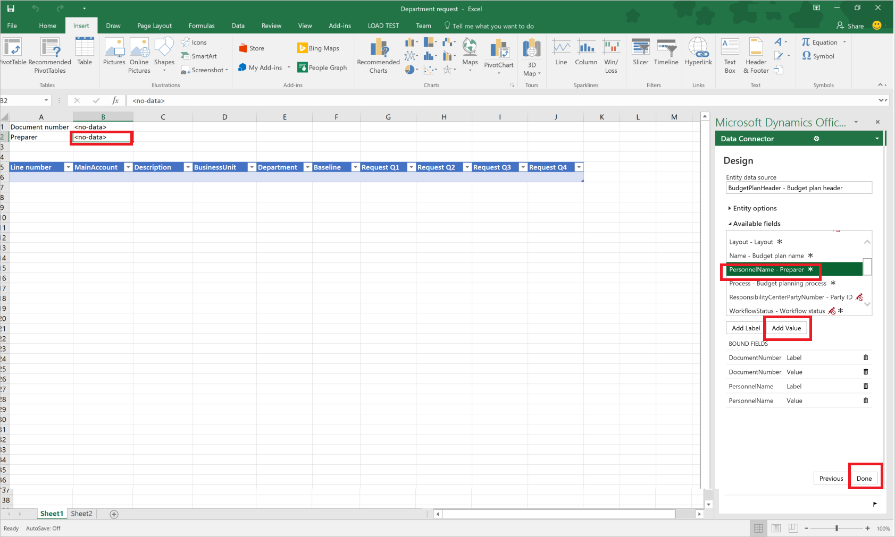](./media/bpt7.png)

## Add a calculated column to budget plan document template table

Next, calculated columns will be added to generated budget plan document template. A **Total request** column, which summarizes Request Q1: Request Q4 columns, and an **Adjustment** column, which recalculates the **Total Request** column by a predefined factor.

Click **Design** in the **Data connector** to add columns to the table. Click **Edit** next to **BudgetPlanWorksheet** data source to start adding columns.

[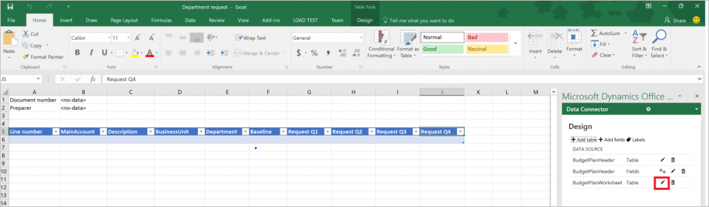](./media/bpt8.png) 

The selected field group displays the columns that are available in the template. Click **Formula** to add a new column. Name the new column and then paste the formula into the **Formula** field. Click **Update** to insert the column.

[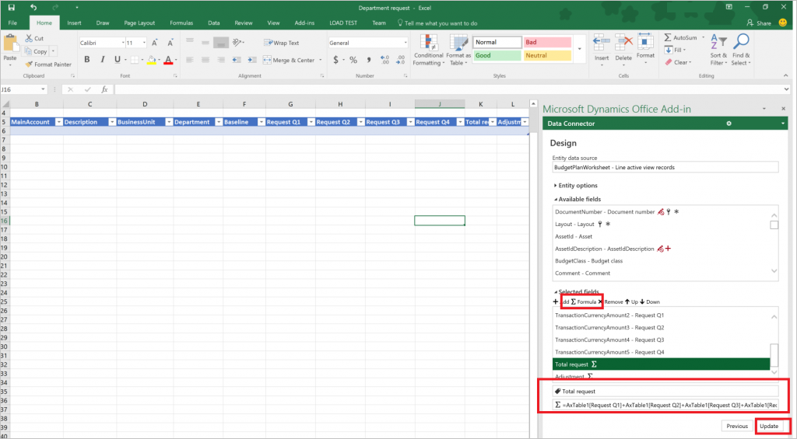](./media/bpt12.png)

> [!NOTE] 
> To define the formula, create the formula in the spreadsheet, and then copy it to the **Design** window. A finance and operations bound table will typically be named "AXTable1". For example, to summarize Request Q1 : Request Q4 columns in the spreadsheet, the formula = AxTable1\[Request Q1\]+AxTable1\[Request Q2\]+AxTable1\[Request Q3\]+AxTable1\[Request Q4\].

Repeat these steps to insert the **Adjustment** column. Use formula = AxTable1\[Total request\]\*$I$1 for this column. This will take the value in cell I1 and multiply the values in the **Total request** column to calculate adjustment amounts.

Save and close the Excel file. In **Layouts**, click **Template &gt; Upload** to upload the saved Excel template to be used for the budget plan. 

[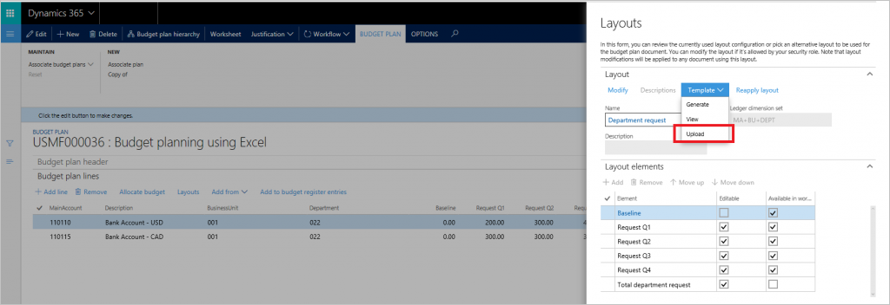](./media/bpt10.png) 

Close the **Layouts** slider. In **Budget plan** document, click **Worksheet** to view and edit the document in Excel. Note that the adjusted Excel template was used to create this budget plan worksheet and calculated columns are updated using the formulas that were defined in the previous steps. 

[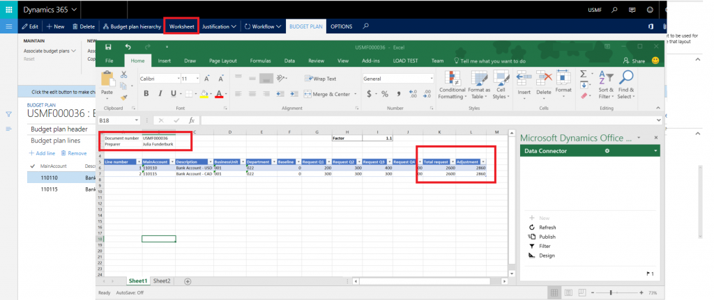](./media/bpt111.png)

## Tips & tricks for creating budget plan templates
### Can I add and use additional data sources to a budget plan template?

Yes, you can use the **Design** menu to add additional entities to the same or other sheets in the Excel template. For example, you can add the **BudgetPlanProposedProject** data source to create and maintain a list of proposed projects at the same time when working with budget plan data in Excel. Note that including high-volume data sources might impact performance of the Excel workbook. 

You can use the **Filter** option in the **Data Connector** to add desired filters to additional data sources.

### Can I hide the Design option in the Data connector for other users?

Yes, open the **Data Connector** options to hide the **Design** option from other users.

[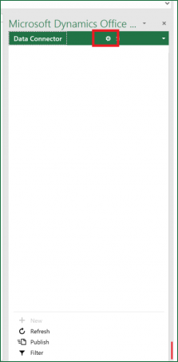](./media/bpt13.png)

Expand **Data connector options** and clear the **Enable design** check box. This will hide the **Design** option from the **Data connector**.

### Can I prevent users from accidently closing the Data connector while working with data?

We recommend locking the template to prevent users from closing it. To turn on the lock, click the **Data connector**, in the top right corner an arrow appears. 

[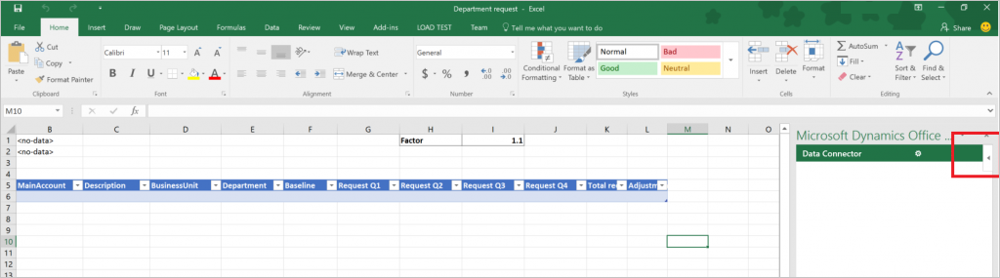](./media/bpt15.png) 

Click the arrow for an additional menu. Select **Lock**.

### [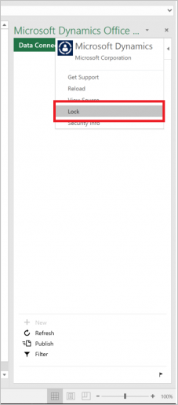](./media/bpt16.png)

### Can I use other Excel features, like cell formatting, colors, conditional formatting, and charts with my budget plan templates?

Yes, most of the standard Excel capabilities will work in budget plan templates. We recommend using color-coding for users to distinguish between read-only and editable columns. Conditional formatting can be used to highlight problematic areas of the budget. Column totals can easily be presented by using standard Excel formulas above the table.

You can also create and use pivot tables and charts for additional groupings and visualizations of budget data. On the **Data** tab, in the **Connections** group, click **Refresh All**, and then click **Connection Properties**. Click the **Usage** tab. Under **Refresh**, select the **Refresh data when opening the file** check box. 

[!INCLUDE[footer-include](../../includes/footer-banner.md)]

