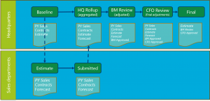
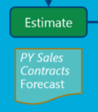

---
# required metadata

title: Budget planning overview
description: This article describes budget planning. It contains information that can help you configure budget planning and set up budget planning processes.
author: panolte
ms.date: 01/11/2018
ms.topic: overview
ms.prod: 
ms.technology: 

# optional metadata

ms.search.form: BudgetPlanningConfiguration
# ROBOTS: 
audience: Application User
# ms.devlang: 
ms.reviewer: kfend
# ms.tgt_pltfrm: 
ms.collection: get-started
ms.assetid: a2e06633-a800-4840-a962-88fed8462104
ms.search.region: Global
# ms.search.industry: 
ms.author: panolte
ms.search.validFrom: 2016-02-28
ms.dyn365.ops.version: AX 7.0.0

---

# Budget planning overview

[!include [banner](../includes/banner.md)]

This article describes budget planning. It contains information that can help you configure budget planning and set up budget planning processes.

## Overview of budget planning

An organization can configure budget planning, and then set up budget planning processes to meet its policies, procedures, and requirements for budget preparation. By understanding the concepts and terminology that are used in Microsoft Dynamics 365 Finance, you can more easily and effectively implement budget planning in your organization.

### Key terms

- **Budget planning processes** – Budget planning processes determine how budget plans can be updated, routed, reviewed, and approved in the budgeting organization hierarchy. A budget planning process is linked to a budget cycle and an organization through a legal entity.
- **Budget plans** – Budget plans contain the budget data for a budget cycle. You can have multiple budget plans that are used for various purposes. For example, you can use budget plans to create budget amounts for different organizational units. You can also use them to do comparisons and make informed decisions.
- **Budget plan scenarios** – Budget plan scenarios define categories of data for the budget plans. You define budget plan scenarios to support monetary classes and other unit-of-measure classes, such as quantities. Examples of monetary budget plan scenarios include "Department previous year" and "Department requests." Examples of budget plan scenarios that use quantities include "Previous year support calls" and "Full-time equivalent (FTE) count."
- **Budget planning stages** – Budget planning stages define the steps that a budget plan follows from its beginning through final approval. Budget planning stages are arranged in budget planning workflows.
- **Budget planning workflows** – Budget planning workflows consist of and define budget planning stages. Budget planning workflows are associated with budgeting workflows. Budgeting workflows are the automated and manual processes that move budget plans through the budget planning stages.

### Typical tasks

You can use budget planning to perform the following tasks:

- Create budget plans to define the expected revenue and expenditures for a budget cycle.
- Analyze and update budget plans for multiple scenarios.
- Automatically route the budget plans, together with worksheets, justification documents, and other attachments, for review and approval.
- Consolidate multiple budget plans from a lower level of the organization into a single parent budget plan at a higher level. You can also develop a single budget plan at a higher level of the organization and allocate the budget to lower levels.

Budget planning is integrated with other modules. Therefore, you can include information from previous budgets, actual expenditures, fixed assets, and Human resources. Because budget planning is also integrated with Microsoft Excel and Microsoft Word, you can use those programs to work with budget planning data. For example, a budget manager can export a department's budget request from a budget plan scenario into an Excel worksheet. The data can then be analyzed, updated, and charted in the worksheet, and then published back to the budget plan lines.

## Configuring budget planning

Functionality that was introduced in Dynamics 365 Finance version 10.0.9 (April 2020) includes a feature that helps improve performance when you use the **Publish** button to update existing records in Excel and then publish them back to the client. This feature speeds up the update process and also helps reduce the likelihood that an update will be blocked when you update many records at the same time. To make this functionality available, go to the **Feature management** workspace, and turn on the **Budget planning query optimization for performance** feature under **Budgeting**. We recommend that you turn on this feature.

The **Budget planning configuration** page contains most of the settings that are required to set up budget planning. The following sections describe some of the factors that you should consider as you configure budget planning. After you've completed the configuration, you can set up budget planning processes.

### Budget planning schema (optional)

An optional but recommended first step is to create a schema that shows your organization's procedure for formulating a budget. You can use any method that you want to create this schema.

The following illustration shows a generic example, where separate budget planning workflows are created for different levels of the organization. Stages are defined in each workflow, and specific scenarios are assigned to each stage to hold the budget data. Tasks are completed to move the data from one stage to the next. For example, amounts can be allocated or aggregated to different accounts, approvals, or other reviews. In this illustration, italic text indicates a scenario that can't be edited during the stage, or data that is historical or has been approved at an earlier stage and therefore should not be changed.

 

The following illustration shows an example where the corporate headquarters estimate the baseline amounts for the initial budget and distribute them to Sales departments. The Sales departments then estimate and submit their forecast back to the headquarters, where the budget manager aggregates and adjusts the forecast. Finally, the budget manager sends the adjusted budget amounts to the chief financial officer (CFO) for review, final adjustments, and approval.

### Organization hierarchy for budget planning

On the **Organization hierarchy** page, you can specify an organization hierarchy as a budget planning hierarchy for each budget planning process. The budget planning hierarchy doesn't have to match the standard organization hierarchy that is used for other purposes. Because this hierarchy is used to aggregate and distribute data, you might want it to have a different structure. In the example schema, the Sales departments are under a headquarters level that includes Budget and Finance departments. This structure likely differs from the structure that is used to manage operations for the Sales departments. Only one organization hierarchy can be assigned to each budget planning process.

For more information, see [Organizations and organizational hierarchies](../../fin-ops-core/fin-ops/organization-administration/organizations-organizational-hierarchies.md).

### User security

Budget planning can follow one of two security models to define user permissions. To specify the security model, you set a budget planning parameter on the **Budget planning configuration** page.

### Budget planning workflows stages

Budget planning workflows are used together with budgeting workflows to manage the creation and evolution of budget plans.

A budget planning workflow consists of an ordered set of stages that a budget plan moves through. Each budget planning workflow is associated with a budgeting workflow. Budgeting workflows are one of the types of workflow that are used throughout Dynamics 365 Finance. They route the budget plans, together with worksheets, justifications, and attachments, through the organization for review and approval.

You create a budget planning workflow in the **Workflow stages** section of the **Budget planning configuration** page. There, you can select the stages and the budgeting workflow that will be used, and you configure additional settings.

A good practice is to create a budget planning workflow for each level of a budgeting hierarchy. You then assign a budgeting workflow that contains elements that correspond to the stages in the budget planning workflow. In the example schema that appears earlier in this article, one budget planning workflow will be created for the Sales departments, and another will be created for the headquarters. A budgeting workflow moves the budget plans through the stages.

You create a budgeting workflow for budget planning on the **Budgeting workflows** page. The process resembles the process for creating other workflows. The following illustration shows an example of a workflow for the headquarters.

 

The workflow includes the following elements:

- Allocation to the Sales departments and aggregation of their submissions
- Budget manager review
- CFO approval
- Staging transitions between each stage of the budget planning workflow

You assign the budgeting workflow to each budget planning workflow in the **Workflow stages** section of the **Budget planning configuration** page.

### Parameters, scenarios, and stages

The initial settings on the **Budget planning configuration** page let you create some building blocks for later configuration steps:

- **Parameters** – Parameters define the security rules that you want to apply to budget plans and the default financial dimensions that should be used when users drill into the amounts in budget plan scenarios.
- **Scenarios** – Scenarios encompass the categories of data that you want for the budget plans. You define budget plan scenarios to support monetary classes and other unit-of-measure classes, such as quantity. In a budget plan, scenarios represent one version of budget planning data. Examples of monetary budget plan scenarios include "Prior year sales" and "Contracts signed." Examples of scenarios that use quantities include "Number of sales calls" and "Full-time equivalent (FTE) count."
- **Stages** – Stages define the steps that a budget plan follows from its beginning to final approval. Examples of budget planning stages include "HQ Rollup," "CFO Review," and "Final."

### Allocation schedules

In budget planning, you can allocate the amounts or quantities on budget plan lines from one scenario to another scenario, or even to the same scenario. For example, you might allocate amounts or quantities to the same scenario if you want to apply changes to the financial dimensions or the dates of the amounts in that scenario. An allocation can be done within a budget plan or from one budget plan to another.

Allocation schedules automatically allocate budget plan lines during workflow processing. You can do allocations by using any of the following methods in the **Allocation method** list:

- **Allocate across periods** – You use a period allocation key to allocate budget plan lines from the source budget plan scenario across periods in the destination scenario.

    > [!NOTE]
    > Before you can allocate across periods, you must set up period allocation keys on the **Period allocation categories** page.

- **Allocate to dimensions** – The budget plan lines are allocated from the source budget plan scenario across the financial dimensions in the destination scenario.

    > [!NOTE]
    > Before you can allocate to dimensions, you must set up budget allocation terms on the **Budget allocation terms** page.

- **Aggregate** – The budget plan lines are aggregated from the source budget plan scenario in the associated budget plans to the destination scenario in the parent budget plan.
- **Distribute** – The budget plan lines are distributed from the source budget plan scenario in the parent budget plan to the destination scenario in the associated budget plans.
- **Use ledger allocation rules** – The budget plan lines are distributed from the source budget plan scenario to the destination scenario, based on the ledger allocation rule that is selected.
- **Copy from budget plan** – You can select another budget plan to use as the source of the allocation.

### Stage allocations

Stage allocations are used to automatically allocate budget plan lines during workflow processing. When stage allocations are used, budget plan lines in the destination scenario can be created and modified without the intervention of the person who prepared the budget plan, or the reviewer.

When you set up a stage allocation, you associate the budget planning workflow and stage with the allocation schedule. The budget planning workflow must be associated with a budgeting workflow that uses the **Budget planning stage allocation** automated workflow task. When the workflow reaches the specified stage, the allocation occurs automatically. This automated task can be used to create budget plan lines in a new scenario.

In the example schema that appears earlier in this article, an allocation is done to transfer amounts from a budget plan and scenarios in the "Baseline" stage for the headquarters to another budget plan and scenarios in the "Estimate" stage for the Sales departments. The following illustration shows the relevant section of the example schema.

 

Additionally, in the example schema, an aggregation is done from budget plans and scenarios in the "Submitted" stage for the  Sales departments to a parent plan in the "Rollup" stage for the headquarters. The following illustration shows the relevant section of the example schema.

### Priorities

You can optionally use budget plan priorities to define categories and objectives for the budget plans that you've set up. You can also use priorities to organize, classify, and evaluate several budget plans. For example, you can create a budget planning priority for health and safety, and then evaluate budget plans that are assigned to that priority. You can also assign a number to your budget plans to indicate a ranking.

### Columns and layouts

In a budget plan, budget figures appear in rows and columns. You first define the columns, and then you can create a layout to define the presentation of those columns.

To define a column, select a budget plan scenario. The line amounts from that scenario are shown in the budget plan. You can select a period to filter the amount, and you can also apply filters that are based on the ledger account.

When you're defining a layout, select a ledger dimension set to create the budget plan rows that you want to show, and select the columns as layout elements. You can create multiple layouts, so that a budget plan shows the desired data at different stages of the budget planning process.

In addition to columns for budget amounts, you can define columns for the project, proposed project, asset, and proposed asset fields from the budget plan. You can also define a column for budgeted positions. This option is useful when you must analyze personnel budgets.

For the example schema, you might want to create columns for the "PY Sales," "Contracts," and "Forecast" scenarios. (The following illustration shows the relevant section of the schema.) You can then break out one or all of these scenarios into separate columns for each quarter of the fiscal year, so that the Sales department manager can accurately enter forecast amounts for each period.

You also specify whether each layout element (column) is editable, and whether it's available in any worksheet template that is created for that layout. For the example schema, in the layout that is used for the "Estimate" stage, the "Forecast" columns are editable, but the "PY Sales" and "Contracts" columns are read-only.

> [!NOTE]
> By default, you're limited to 36 columns, unless you extend budgeting planning by following the steps in [Extend the budget planning layout](./extending-budget-planning-layout.md).

### Templates

In the **Layouts** section of the **Budget planning configuration** page, you can generate, view, or upload an Excel template for each layout. These templates are the workbooks that are linked to each budget plan to provide additional analysis, charting, and data entry capabilities.

When a template is generated, the layout is locked and can't be edited. This lock helps ensure that the template format matches the layout of the budget plan and includes the same data. After a template is generated, it can be viewed and edited. For example, you can add charts to the template or further customize its appearance.

> [!NOTE]
> A template should be saved to a location that the user has access to, so that it can be uploaded to the layout after editing is completed. In that way, the template will be used with budget plans that use the layout.

### Descriptions

In the **Layouts** section, you can assign descriptions to show the name of a financial dimension that is included in a layout. For example, an organization might want to show the name of the main account next to the main account number in a budget plan. However, it might want to omit the names of other financial dimensions, to avoid cluttering the display.

## Setting up budget planning processes

After you've finished configuring budget planning, you can set up budget planning processes on the **Budget planning process** page. Budget planning processes are sets of rules that determine how budget plans can be updated, routed, reviewed, and approved in the budgeting organization hierarchy.

For each budget planning process, you first select a budget cycle and a ledger. Each budget planning process is related to only one budget cycle and one ledger. You then select the budget organization hierarchy on the **Budget planning process administration** FastTab, and assign a budget planning workflow to all the responsibility centers in the organization that appear in the grid.

To assign or change the budget planning workflow for similar responsibility centers, select **Assign workflow**, and then select the organization type to target and the budget planning workflow to use. The budgeting workflow ID that is associated with each budget planning workflow is automatically added to the grid.

When you define the stage rules and templates on the **Budget planning stage rules and layouts** FastTab, you can define a different set of rules and default layouts for each budget planning stage. For example, the "Estimate" stage for the Sales departments can let users modify the lines in a budget plan but prohibit users from adding lines. The "Submitted" stage can let users view lines, but not add or modify them, because the work at that stage has been completed, and changes to the budget plans must be prevented. To select the layouts that are available for budget plans, select **Alternate layouts**.

You can optionally select budget planning priorities on the **Budget plan priority constraints** FastTab. Priorities can then be selected on budget plans.

The final step is to activate the budget planning process by using the **Actions** menu. A budget planning process can't be used until it has been activated.

You can also use the **Actions** menu to create a new process by copying an existing process. This feature is useful for organizations that follow the same process flow each budget cycle, and make few changes or no changes.

Another useful command on the **Actions** menu is **View budget process status**. This command graphically shows the budget plans in a process, together with relevant data, such as the workflow status of the plans, summaries by amount and unit, and one-click navigation to the budget plans themselves.

[!INCLUDE[footer-include](../../includes/footer-banner.md)]
