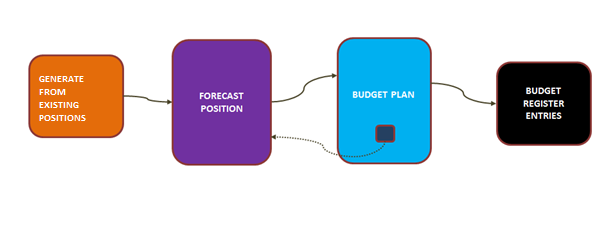
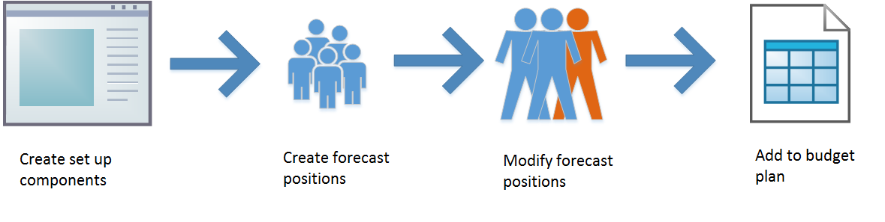
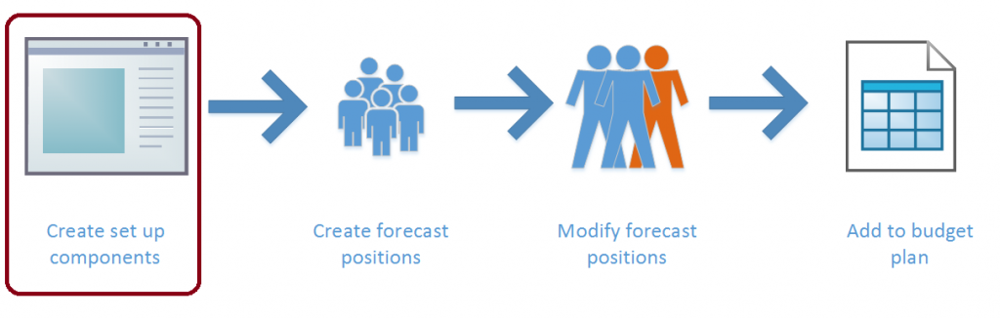
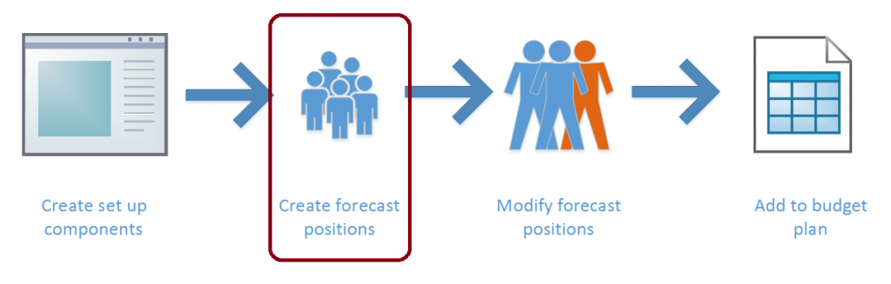
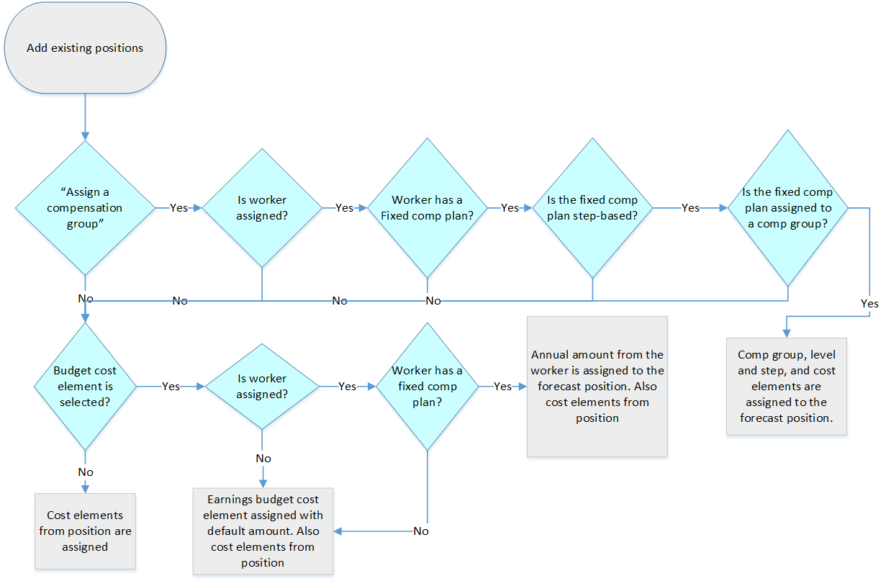
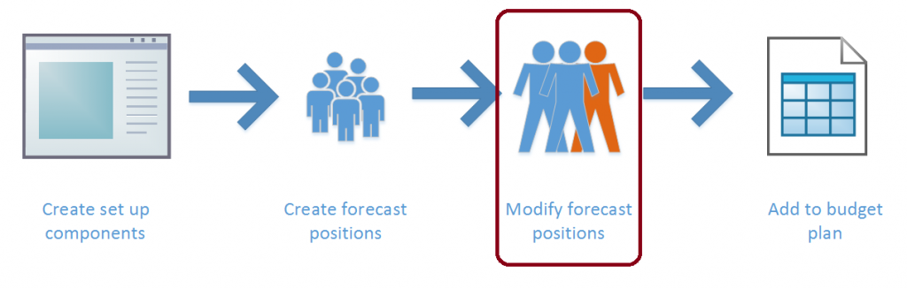
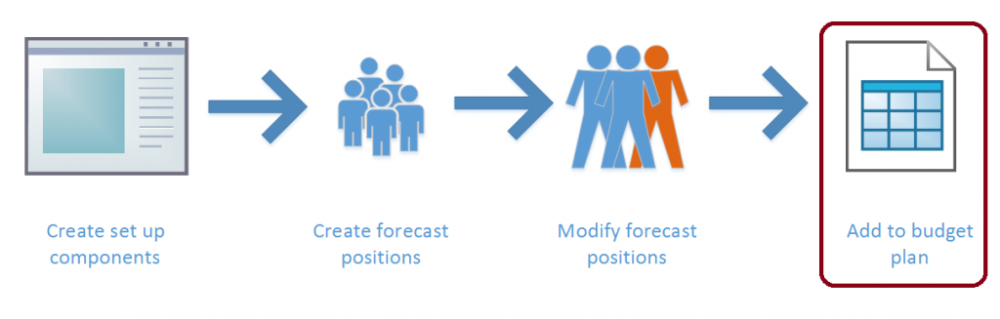

# Position forecasting

[!INCLUDE [banner](../includes/banner.md)]

Expenses related to workers often make up a large proportion of an organization's costs. Position forecasting helps you plan these expenses and include them in the budget planning process.

## Position forecasting in budget planning

Position forecasting uses three main components to provide accurate budget amounts for position expenses. You can bring these amounts into a budget plan for budget calculations.

The primary component is the **forecast position**, which represents all cost data related to a single position. You can create multiple versions of a forecast position by assigning a different budget plan scenario to each version. Use multiple versions for an iterative approach to budgeting and to compare what-if scenarios. Each forecast position corresponds to a position in Human resources.

A **budget cost element** is a setup component that represents a specific cost associated with a position, such as base pay, employer-paid health insurance, cell phone allowances, and other expenses. A budget cost element includes the main account used for the cost and options for calculation. You can assign each budget cost element to multiple forecast positions.

A **compensation group** is an optional setup component that you use to apply a set of budget cost elements and pay calculations to positions that have similar pay characteristics. A compensation group can include a compensation grid of pay rates. When you assign the group to a forecast position, a level and step in the grid can assign the forecast position’s earnings. The set of cost elements is automatically added.

### Position forecasting processes

In a typical process for position forecasting, you first create the setup components (budget cost elements and compensation groups). Then, generate forecast positions based on existing positions. You can make adjustments. For example, you can add or end positions, change pay rates and benefit costs, and add wage increases. Create multiple versions of a forecast position to facilitate comparisons between different budgeting scenarios. Next, include the forecast positions in budget plans and bring in the costs from the forecast positions as budget plan lines.

You can create additional forecast position versions as budget plans are revised. These new versions provide a basis for the revisions.

## Position forecasting setup

### Budget cost elements

Use budget cost elements to define cost details for a forecast position. These details include the type of cost, how the cost is calculated, and whether the cost is allocated to multiple dates when the forecast position is included in a budget plan.

Specific fields define the behavior of the budget cost element. Assign each budget cost element a budget cost type of **Earning**, **Benefit**, **Taxes**, or **Other**. Use the budget cost types primarily to calculate totals. The **Forecast position override** value specifies whether you can modify the amounts on the element on the forecast position. Use the **Allocation method** field when you add a forecast position to a budget plan. You can split the cost amount onto separate budget plan lines that have different dates, on a monthly, quarterly, weekly, or biweekly basis. By selecting a start date, you assign the cost as a single amount on the start date that is set on the forecast position.

The calculation of the budget cost element’s cost amount uses effective dates to enable the same cost element to be used in different periods. You assign a single main account in each period, together with a percentage or annual amount that indicates the cost amount. A budget cost element can use a percentage of other cost elements or an annual amount, but not both. You can also specify an annual limit.

If the cost element is based on a percentage, you must specify the budget cost elements that are used as the basis for the calculation.

**Example**

Jodi’s organization provides a training allowance of 5 percent of an employee’s base pay. Jodi wants to create a budget cost element for this cost. Jodi creates a new budget cost element and assigns the **Benefit** budget cost type.

Jodi doesn't want managers to change the amount of the benefit. Therefore, Jodi selects **Do not allow cost changes** in the **Forecast position override** field. The organization wants this cost to be assigned evenly to each month. Therefore, Jodi selects **Quarterly** in the **Allocation method** field.

Next, Jodi adds a cost calculation line, sets the dates and a main account, and enters **5.00** as the percentage. The organization has a cap of $5,000 per year for this benefit. Therefore, Jodi enters that amount as the annual limit.

Finally, Jodi adds all the earning cost elements that are used for base pay as calculation bases. The budget cost element is now ready to be used.

### Compensation groups

Use compensation groups to group forecast positions that have similar compensation attributes. Use them to define a forecast position’s earnings and annual increases, and to assign a set of common budget cost elements.

A basic function of compensation groups is to assign a set of budget cost elements to a forecast position. Therefore, use compensation groups to add common costs, such as benefit plans and taxes. A manager who is creating a forecast position doesn't need to know all the cost elements that must be added. Instead, add the cost elements when selecting the compensation group. Add the elements to the compensation group setup on the **Budget cost elements** tab.

Compensation groups can also determine the earning rates for a forecast position. Set up a group to use either an hourly basis or an annual salary basis to calculate forecast position earnings. On the **Compensation rate tables** tab, a compensation grid of pay rates determines the earnings that are added to a forecast position, based on an assigned level and step. These grids can be based on existing compensation grids in Human resources. Alternatively, you can create new compensation grids for budget planning.

The effective dates and expiration dates on the compensation rate tables let you change pay rates on any date. This feature is useful when a bargaining unit negotiates for an across-the-board increase in the middle of a budget cycle. In this case, change the expiration date of the existing table to the day before the date of the rate change and add a new rate table that starts on the new date. When you create a new rate table, if you select **Create a new compensation grid from an existing grid**, you can select an existing rate table from Human resources. On the rate table that you create, the **Mass Change** option lets you apply a percentage or flat amount increase or decrease to all rates in the grid.

Use the **Increase schedule** and **Date of increase** fields on the compensation group when you must create pay increases because positions go from one step to the next. An annual pay increase is a typical scenario. The increase schedule determines whether the position’s anniversary date or a single common date is used for the step increase. The increase schedule applies to all forecast positions in the compensation group.

Use the earning cost element that you select on the compensation group when you create earnings for the forecast positions in the group, including their base pay and any step increases. The **Compensation fixed plan** field links the compensation group to a fixed compensation plan in Human resources. This link can assign a worker’s fixed compensation information to a forecast position, and can therefore make budget planning more accurate. Remember that the structure of the compensation grid (the levels and steps) for the compensation group should match the structure of the fixed compensation plan. Otherwise, the system can't correctly link the compensation group and the fixed compensation plan.

## Creating forecast positions

### Creating forecast positions for existing positions

For the most accurate budget planning, create forecast positions by using details from existing positions, regardless of whether the position is currently filled or unfilled.

The **Add existing positions** function displays all the positions for an organization. By setting the **As of** date, you can change the list of positions so that it contains the positions that existed at a date in the past or, more commonly, in the future (for example, the start of the next budget cycle). Select a budget planning process and budget plan scenario, select positions in the list, and then select **OK** to create forecast positions for the selected positions. You can create only one forecast position for each existing position in a budget planning process and scenario. However, you can create additional versions by assigning different budget plan scenarios.

If you assign budget cost elements to the position in Human resources, those budget cost elements are also assigned to the forecast position and use the default amounts. The **Assigned worker** field on the forecast position is set to the name of the worker who is assigned to the position, if a worker is assigned. This field is a simple text field. No direct link is created.

If you select a budget cost element, the fixed compensation annual amount is assigned to the forecast position by using the selected cost element, provided that the assigned worker has a fixed compensation plan. If the worker doesn't have a fixed comp plan, or if no worker is assigned, the default amount is used for the budget cost element.

When you set the **Assign a compensation group** option to **Yes**, if the worker who is assigned to the position has a step-based fixed compensation plan that is linked to a compensation group (as described earlier), the level and step from the worker are assigned to the forecast position, together with the compensation group. The earnings budget cost element from the compensation group is added to the forecast position, and the pay rate at the level and step from the compensation group are used.

The setting of the **Assign a compensation group** option takes precedence over the **Budget cost element assignment** setting. You can use the two settings at the same time.

Another option is to assign an anniversary date. The selected date (adjusted start date, worker start date, employment start date, or seniority date) from the assigned worker is set as the forecast position’s anniversary date, and is used for information and when pay increases are generated.

### Creating new forecast positions

You can create new forecast positions in two ways: by copying an existing forecast position and by creating a completely new forecast position.

When you select a forecast position, select **Copy the selected forecast position** to create a new forecast position that has a forecast state of **Proposed**. This forecast position has all of the same data as the forecast position that you copied, except the assigned worker and any notes on the budget cost elements. A corresponding new position is also created in Human resources. This position has a description of **Created by forecast**.

You can also create a completely new forecast position. Select an existing job, and also select the budget planning process and budget plan scenario. You can then add any other details that you want to add. Once again, a new position is created in Human resources at the same time.

## Working with forecast positions

### Multiple versions of a forecast position

You can modify forecast positions to apply known changes for the budget cycle or to model proposed changes. A common practice is to create a baseline set of forecast positions, create copies of those forecast positions, and then use the copies to model different sets of changes. Assign the copies to a different budget plan scenario but, at least until you make changes, the copies are otherwise identical to the forecast positions that you copied from. The originals and the copies share the same position in Human resources.

The **Copy to scenario** function provides this functionality. Each Human resources position can have only one forecast position in each budget plan scenario.

### Modifying forecast positions

You can only make changes to forecast positions. These changes don't affect the position records in Human resources. Most changes only affect the forecast position that you're editing. In other words, the changes are specific to the budget planning process and budget plan scenario that you assign. The exceptions are changes to fields that are shared for the position across processes and scenarios. These fields include the fields on the **General** tab and the **Financial dimensions** tab. When you change these fields, the new values apply to the position in all budget planning scenarios. Therefore, these fields let you quickly update all versions.

#### Budget cost elements

Budget cost elements provide the main information for budget plans: the budget amount and the main account. The budget amount is the amount that you send to the budget plan when you include a forecast position in a plan. You calculate the budget amount and can't directly change it. This amount is either the annual amount or a calculation of the percentage of the annual amount's basis elements (as defined on the setup of the budget cost element). You factor the amount by the number of days in the element’s date range (start date to end date) and also by the **Full-time equivalent** (FTE) value for the forecast position.

For example, a budget cost element line from January 1, 2025, to June 30, 2025, that has an annual amount of 100,000 and an FTE value of **0.50** is calculated as 100,000 × (181 days ÷ 365 days) × 0.50 = 24,794.52.

You must recalculate the budget cost element lines when you change the FTE value on the forecast position. You must also recalculate the lines when you change the activation dates or retirement dates. Changes to these dates can cause an update of the budget cost element's start and end dates, which must be within the forecast position’s dates. When recalculation is required, the **Recalculate** button becomes available, and a "Requires calculation" message is displayed. Recalculation is also required if you add or remove a budget cost element.

**Example**

The organization is considering two options for reducing the cost of an accountant position. One option is to end the position part of the way through the year. The other option is to change the position to half-time for the whole year. Brad creates a forecast position for the existing accountant position in a baseline scenario. Brad copies this baseline forecast position to scenario A, sets the retirement date to May 31, and recalculates. Brad then copies the baseline forecast position to scenario B, changes the FTE value to **0.50**, and recalculates. Brad now has three versions, each of which has cost totals that are aligned with the options.

#### Assigning a compensation group

When you first assign a compensation group to a forecast position, the default budget cost elements from the compensation group are added. If you already assigned cost elements to the forecast position, those cost elements remain. If you change an assigned compensation group, the existing budget cost elements are removed and replaced by the set from the compensation group.

When you select a compensation level and step, an earnings budget cost element (as defined in the compensation group) is added. You calculate the annual amount by using the rate in the selected level and step, and the annual hours in the compensation group (or, for an annual based salary, the full amount in the level and step). Once again, you factor this amount by the cost element line’s date range and the forecast position’s FTE value.

#### Generating increases

You can automatically create annual increases (one per calendar year) for forecast positions that have a step-based compensation group assigned. Select **Generate increases** to add an earnings budget cost element at the next highest step. The start date of the new earnings budget cost element is the scheduled increase date that is shown on the forecast position. This date is set from the compensation group in one of two ways. If the compensation group’s increase schedule is set to **Common date**, the date of increase is specified on the compensation group. If the increase schedule is set to **Anniversary date**, the anniversary date field on the forecast position is used, and the budget cycle supplies the year. If there are multiple calendar years in a budget cycle, multiple increases are added.

The end date of the current earnings budget cost element is updated with the day before the increase date. The recalculation process is automatically used when increases are generated. Therefore, you don't have to recalculate manually.

If you select **Generate increases** a second time, the process runs again but doesn't add more records. Only one increase per calendar year is created.

#### Changes from other pages

Updates to forecast positions can also come from other areas, such as the budget cost element and the compensation group setup pages. You can also modify forecast positions by using the mass update process.

Two options are available on the **Budget cost element** setup page: **Add to positions** and **Update positions**. The **Add to positions** option adds the budget cost element to selected forecast positions. If the element is already assigned to a forecast position, that forecast position is skipped. The **Update positions** option applies the current values (the main account, percent, annual amount, and so on) to the selected forecast positions.

Each process has a similar page where you can select forecast positions. The **Add to positions** page shows all forecast positions that are available for selection, whereas the **Update positions** page shows only those forecast positions that already have the budget cost element assigned. (Therefore, the **Update positions** page gives you a way to find out which forecast positions already have the cost element attached.) You move forecast positions from an upper grid to a lower grid to include them in the update.

The **Change dates** function on the **Cost calculation** tab immediately changes the budget cost element’s start and end dates on the forecast positions. No selection options are available.

On the **Compensation group** page, the **Update position rates** function applies the current compensation rate table rates to forecast positions that are assigned to the group. The rates are updated, and additional cost element lines are added for any new rate table lines (based on dates). However, the budget cost elements and the increase dates aren't updated. You can select which budget planning process and budget plan scenario to update. Therefore, you can update one scenario but leave other scenarios unchanged for comparison.

By selecting forecast positions and then clicking **Mass update**, you can add or change more than one forecast position at that same time. Many options are available. One option on the **Financial dimensions** tab differs slightly from the others and is related to budget cost elements. You can add budget cost elements by setting the **Budget defaults** option to **Yes**. If you don't select budget cost elements but set **Budget defaults** to **Yes**, all budget cost elements that are currently assigned are removed.

The recalculation process is automatically used on any forecast position that you change.

## Bringing forecast positions into budget plans

Create and modify forecast positions to add them to budget plans, so the budget plans include the most accurate budget amounts. You can add forecast positions to budget plans by using either a generation process or a selection process on the budget plan.

### Generating a budget plan from forecast positions

The **Generate budget plan from forecast positions** function creates or updates budget plans so they include the budget amounts and FTE counts from forecast positions. The budget amounts from the forecast position become the budget plan line amounts and are aggregated by financial dimension values and effective date. The generation process assigns the source forecast position to the budget plan line. To view the position, you can either add the forecast position as a row in the budget plan layout or use the **Budget plan lines** inquiry. To skip this assignment, set the **Include position in budget plan line** option to **No**.

You can select a budget plan FTE scenario to include the number of FTEs in the budget plan. You can select only scenarios of the quantity type that the layout of the target budget plan includes. When you select an FTE scenario, you must also specify an FTE main account. This account is used to create the quantity budget plan lines.

The budget planning process and budget plan scenario that you select in the source determine the target scenario budget planning process and scenario. Because these attributes are assigned to forecast positions, they must be synchronized with the budget plan. Therefore, you can't edit these attributes on the target.

As with other generation processes, three options are available:

- **Create a new budget plan** – Create a new plan that has the attributes that you select in the **Target** section.
- **Replace the existing budget plan scenario** – Delete all data in the target budget plan in the selected budget plan scenario and create new lines that have the selected forecast position data.
- **Update the existing budget plan scenario, and append new data** – Update existing lines in the target plan that match the source lines, and also add new lines for new data. The matching is based on the ledger account, date, budget class, and other values, such as the forecast position. All lines that have a position number that matches the source position number are replaced with the new lines from the source.

### Selecting forecast positions

You can add forecast position budget amounts directly to a budget plan. Use the **Add positions** function, located above the budget plan lines, to select the forecast positions to include.

You can select as the source only budget plan scenarios that the plan’s layout includes. One option on the **Target** tab lets you specify that the FTE scenario and main account are available to include FTE counts, but aren't required.

This selection process behaves like the **Update existing budget plan scenario, and append new data** option for a generation process. The process removes all existing budget plan lines where the forecast position is being added and replaces them with new lines that are based on the current state of the forecast position.

#### Date options

For both the generation process and the selection process, the start date on the budget cost element line determines the effective date of the corresponding budget plan line. The **Allocation method** field on the budget cost element setup page specifies the allocation method:

- **Start date** – The budget cost element's start date is used as the budget plan line's effective date.
- **Monthly** – The budget amount is evenly divided by the number of months in the date range to produce a typical monthly amount that is assigned on the first day of each month. If the first period is a partial month, the amount for that month is factored by the number of days that the cost is active in that month, and the result is assigned to the start date. The amount for the last month is the difference between the total budget amount and the sum of all other months. Therefore, rounding might affect the amount for the last month.
- **Quarterly** – This method is the same as **Monthly**, but the calculations are done for three-month periods.
- **Weekly** – The logic resembles the logic of the **Monthly** and **Quarterly** methods. The budget amount is evenly divided by the number of weeks in the date range to produce a typical weekly amount that is assigned on the first day of each week. If the first period is a partial week, the amount for that week is factored by the number of days that the cost is active in that week, and the result is assigned to the start date. The amount for the last week is the difference between the total budget amount and the sum of all other weeks. Therefore, rounding might affect the amount for the last week.
- **Biweekly** – This method is the same as **Weekly**, but the calculations are done for two-week periods.

#### Changing budget plan lines that have forecast positions

Budget plan lines show the source of the budget amounts (the forecast position number) but aren't linked. Therefore, changes to the forecast position aren't shown on the budget plan line, and changes to the budget plan line are shown in the forecast position. If you change a forecast position and want the updates to be included in a budget plan, you must bring the forecast position into the plan again. However, remember that this process removes all lines where that forecast position is assigned. Therefore, any changes that you made to those lines are removed.

To see which budget plans include a forecast position, you can generate the **Forecast positions by budget plan** report. Alternatively, on the forecast position, you can open the **Associated budget plans** FactBox to view the plans.

[!INCLUDE[footer-include](../../includes/footer-banner.md)]
