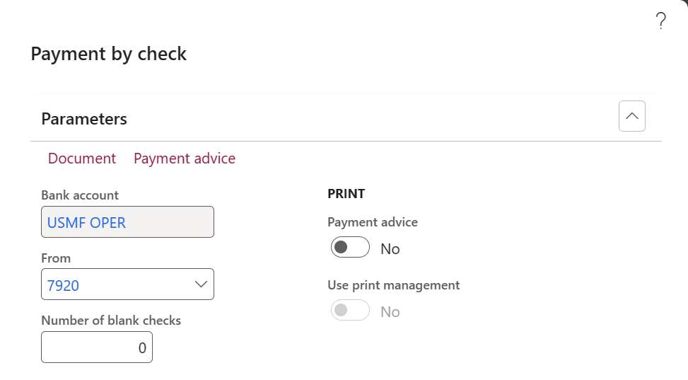
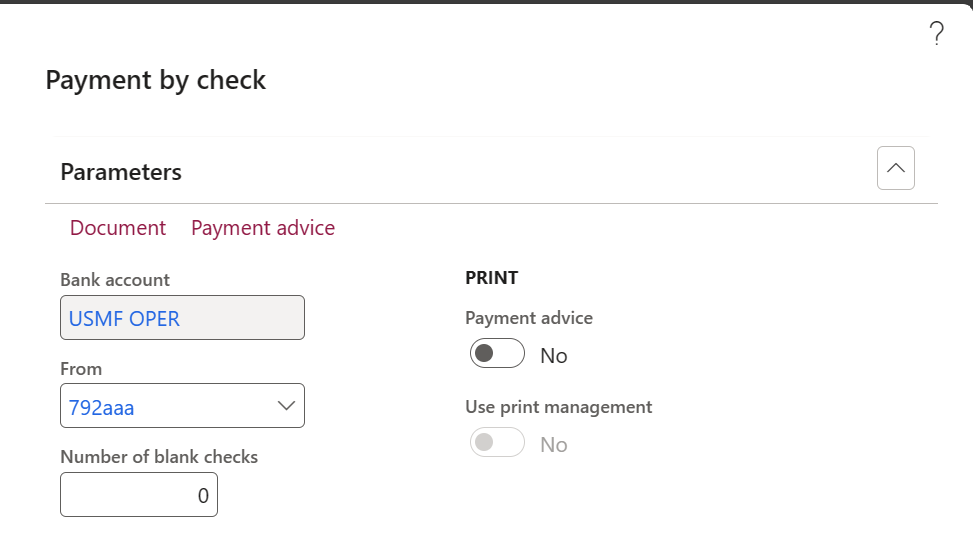
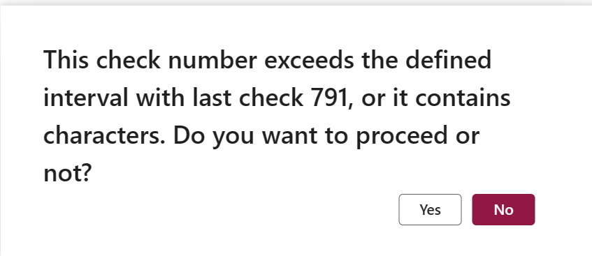

---
# required metadata

title: Check number validation 
description: This article provides an overview of check number validation in cash and bank management module.
author: wangchen
ms.date: 11/06/2023
ms.topic: article
ms.prod: 
ms.technology: 

# optional metadata

ms.search.form: 
# ROBOTS: 
audience: Application User
# ms.devlang: 
ms.reviewer: twheeloc
# ms.tgt_pltfrm: 
# ms.custom: 
# ms.assetid: 
ms.search.region: Global
# ms.search.industry: 
ms.author: wangchen
ms.search.validFrom: 2019-03-08
ms.dyn365.ops.version: 10.0

---
# Check number validation

This feature enables the capability to validate check number when user generates payment. With the parameter turned on, firstly, it will validate if check number exceeds the defined interval with last check number. Users can set up the check number interval. If the check number exceeds the defined interval with last check number, user needs to confirm before proceeding to avoid entering wrong check number manually. Secondly, it will validate if there is any character in the check number.

## Set up validation parameters

Turn on feature **Enable check number validation** in Feature management workspace.

Two parameters are introduced in **Cash and bank management parameters** > **General** > **Check setup** page.

- **Allow check number validation**: Turn on this parameter if you want to validate check number when generating payment document in vendor payment journal. This parameter enables two validations:
  - Check number interval validation
  - Check number character validation
- **Check number interval**: Define the interval which will trigger check number validation when the user defined check number on vendor payment journal exceeds the interval with last check number.

## Validate check number

Here are two scenarios how this feature works. 

Scenario 1: Wrong check number

When you generate payment on a vendor payment journal and the method of payment is Check, you enter the check number as 7920 by mistake

Scenario 2: Characters in the check number

When you generate payment on a vendor payment journal and the method of payment is Check, you enter the check number as 792aaa by mistake

System will validate the check number. A warning message will be populated to ask for user confirmation.

