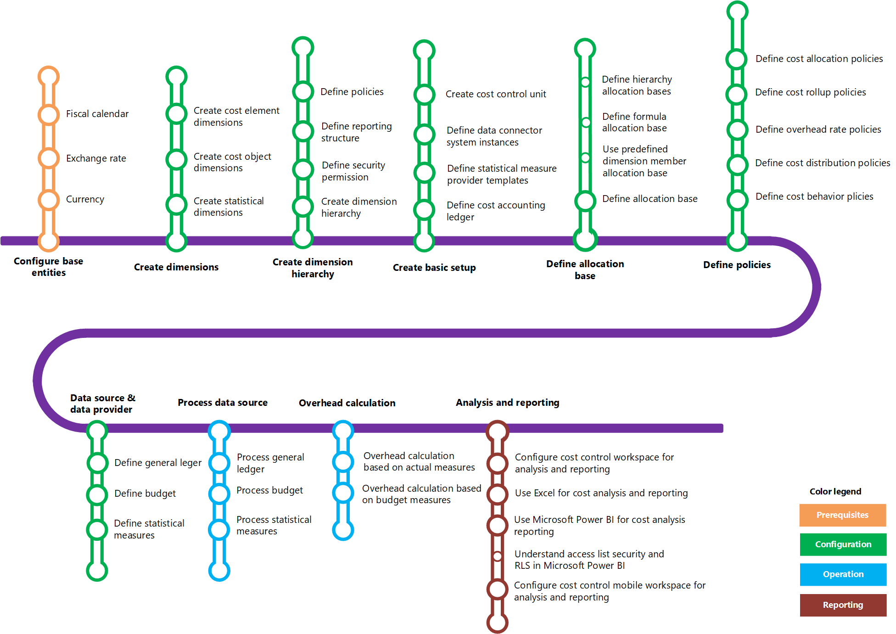

---
# required metadata

title: Cost accounting home page
description: This article provides a list of the help topics and other resources that are available for Cost accounting.
author: aprilolson
ms.date: 04/25/2018
ms.topic: article
ms.prod: 
ms.technology: 

# optional metadata

ms.search.form: CAMCostControlWorkspace, CAMCostControlWorkspaceConfiguration, CAMCostAccountingLedgerAdminWorkspace, CAMAXCostAccountingSetupWizard
# ROBOTS: 
audience: Application User
# ms.devlang: 
ms.reviewer: twheeloc
# ms.tgt_pltfrm: 
ms.custom: ["256254"]
ms.collection: get-started
ms.assetid: e1b0a6e3-0c72-4a7d-90e1-20f870c6dbad
ms.search.region: Global
# ms.search.industry: 
ms.author: aolson
ms.search.validFrom: 2016-11-30
ms.dyn365.ops.version: Version 1611

---

# Cost accounting home page

[!include [banner](../includes/banner.md)]

## Learning map 

The following learning map shows the major concepts and tasks that make up the framework of the Cost accounting module. Click the links in the [Quick links](#quick-links) section to learn how to use the module.

## Quick links

| &nbsp; | &nbsp;  |
|------|---|
|  [Get started with cost accounting (Learn)](/training/modules/get-started-cost-accounting-dyn365-finance/)  |[Cost element dimensions](cost-elements.md)  |
|  [Dimension hierarchy](dimension-hierarchy.md)  |[Define cost control units](./tasks/define-cost-control-units.md)| 
| [Allocation bases](allocation-bases.md)|[Create and assign a cost allocation policy to a cost control unit](./tasks/create-assign-cost-allocation-policy-cost-control-unit.md) | 
| [Manage a data source for the cost accounting ledger](./tasks/manage-data-source-cost-accounting-ledger.md) |                                           [Process and trace source data](./tasks/process-trace-source-data.md)     | 
|[Overhead calculation](overhead-calculation.md)  | [Cost control workspace](cost-control-workspace.md)   |

## Get started videos 

| &nbsp; | &nbsp;  | &nbsp;  |
|------------------------|--------------------|-----------------------------|
| [Get started with cost accounting](https://www.youtube.com/watch?v=1pUDtJQZ8FU&t=35s)  | [Cost accounting mobile workspace](https://www.youtube.com/watch?v=imsuTg8rUVk&t=7s)  |   [Use Excel for cost accounting analysis](https://www.youtube.com/watch?v=-HKHYdClvx8)  |

[!INCLUDE[footer-include](../../includes/footer-banner.md)]
