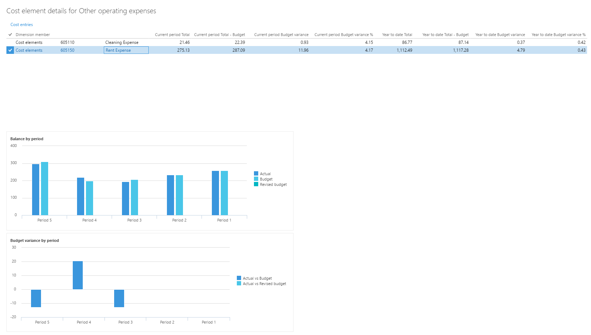

---
# required metadata

title: Cost control workspace
description: This article provides information about the Cost control workspace. This workspace is a central point where managers who are responsible for controlling a cost object or a set of cost objects within a dimension or across dimensions can access reports. 
author: AndersGirke
ms.date: 06/16/2017
ms.topic: article
ms.prod: 
ms.technology: 

# optional metadata

ms.search.form: CAMCostControlWorkspaceConfiguration, CAMCostControlWorkspace, CAMCostControlWorkspaceConfigurationPerUser
# ROBOTS: 
audience: Application User
# ms.devlang: 
ms.reviewer: twheeloc
# ms.tgt_pltfrm: 
ms.custom: 
ms.assetid: 
ms.search.region: global
ms.search.industry: Manufacturing
ms.author: twheeloc
ms.search.validFrom: 2016-11-30
ms.dyn365.ops.version: Version 1611

---

# Cost control workspace 

[!include [banner](../includes/banner.md)]

The **Cost control** workspace is a central point where managers who are responsible for controlling a cost object or a set of cost objects within a dimension or across dimensions (for example, cost centers and product groups) can access reports. The reports in the workspace are fully managed by cost accountants, so that the layout and data that are used for reporting can be consistent across the whole organization.

## Cost control workspace configuration

Cost accountants can define as many report configurations as they require for the desired data composition or layout. A report configuration consists of six sections, each of which contributes to either the selection of the targeted data composition or the layout.

To configure a cost control workspace, click **Cost accounting** \> **Setup** \> **Cost control workspace configuration**.

### General

On the **General** FastTab, you can create a unique report layout. The name of the report will be a unique identifier that users will be able to recognize in the **Cost control** workspace. You can also specify whether the report should be shared or kept internal for cost accountants.

| Field       | Description |
|-------------|-------------|
| Name        | Enter a unique name for the layout. |
| Description | Enter a detailed description. |
| Published   | If you set this field to **Yes**, a user who is assigned one of the following roles can see the report in the **Cost control** workspace:<ul><li>Cost accounting manager</li><li>Cost accountant</li><li>Cost accountant clerk</li><li>Cost object controller</li></ul>If you set this field to **No**, only users who are assigned one of the following roles can see the report in the **Cost control** workspace:<ul><li>Cost accounting manager</li><li>Cost accountant</li><li>Cost accountant clerk</li></ul> |

### Data filtering

On the **Data filtering** FastTab, you define the data foundation for the report. Users of this report will see values on the report after source data has been processed.

| Field                                                             | Description |
|-------------------------------------------------------------------|-------------|
| Cost accounting ledger                                            | The **Cost accounting ledger** that the report is based on. The value is derived from the **Cost control unit** field. |
| Cost control unit                                                 | The value that you select determines the cost accounting ledger and cost objects that this report will be based on. |
| Statistical dimension hierarchy, Cost element dimension hierarchy | A **Cost control** workspace configuration record can report either non-monetary or monetary values, but not in the same layout. Select a value in the **Cost element dimension hierarchy** field to report monetary values. Select a value in the **Statistical dimension hierarchy** field to report non-monetary values. The dimension hierarchy record that you select determines the structure of the reporting and aggregation levels.**NOTE:** To view non-monetary and monetary values side by side, you can export data to Microsoft Excel for the Microsoft Power BI content pack. |
| Cost object dimension hierarchy      | Select the dimension hierarchy of the cost object dimension that suits the purpose of the reporting that you're defining. |
| Budget original version                                           | Select the budget version ID that acts as the original budget in the context of this report. |
| Budget revised version                                            | Select the budget version ID that acts as the revised budget in the context of this report. |

### Assign calculation records

The overhead calculation performs several calculation steps on the source data, such as cost behavior classification, cost distribution, and cost allocation. Multiple overhead calculations can be done for the same fiscal period, in case missing source data is discovered or rules must be updated. Each overhead calculation is saved with a unique ID. The cost accountant can select a specific overhead calculation ID. Users of the report, such as managers, will see the results of the overhead calculation in the **Cost control** workspace.

| Field                  | Description |
|------------------------|-------------|
| Fiscal calendar period | Select the fiscal calendar period to assign an overhead calculation ID to.**NOTE:** The fiscal periods that are listed in the field come from the fiscal calendar that is associated with the cost accounting ledger. |
| Actual version         | Select the appropriate overhead calculation ID. |
| Budget version         | Select the appropriate overhead calculation ID. |
| Revised budget version | Select the appropriate overhead calculation ID. |

### Fiscal periods per column

On the **Fiscal periods per column** FastTab, the cost accountant decides which fiscal period should be shown in the report layout.

The values in the selected columns will be multiplied by the selected values on the **Fiscal periods per column** FastTab.

| Field                | Description |
|----------------------|-------------|
| Current period       | The balance of the current fiscal period is shown.**NOTE:** By default, the current period is determined by the session date. In the **Cost control** workspace, a specific fiscal period can be selected. The selected value then represents the current period. |
| Previous period      | The balance of the previous fiscal period is shown. The following formula is used: Current fiscal period – 1**NOTE:** By default, the previous period is derived from the session date. In the **Cost control** workspace, a specific fiscal period can be selected as the current period. **Previous period** will then be recalculated accordingly. |
| Year to date         | The for the year to date is shown. The following formula is used: YearToDate (Current fiscal period)**NOTE:** By default, the current period is determined by the session date. In the **Cost control** workspace, a specific fiscal period can be selected. The selected value then represents the current period, and the **Year to date** value will be updated accordingly. |
| Year to date average | The average for the year to date is shown. The following formula is used: (YearToDate [Current fiscal period]) ÷ (Count [Current fiscal period]) **Example** - **Statistical dimension member:** Full time employees - **Current date:** 3-21-2017 - **Period:** Fiscal period 1, Fiscal period 2, Fiscal period 3 - **Magnitude:** 10, 10, 12 In this case, **Year to date average** = (10 + 10 + 12) ÷ 3 = 10.67 The **Year to date average** value can be calculated for cost element dimension members and statistical dimension members. **NOTE:** By default, the current period is determined by the session date. In the **Cost control** workspace, a specific fiscal period can be selected. The selected value then represents the current period, and the **Year to date** and **Year to date average** values will be updated accordingly. |

### Columns to display for costs

On the **Columns to display for costs** FastTab, the cost accountant decides which columns the report layout should contain. There are three categories: Fixed cost, Variable cost, and Unclassified cost.

| Field                 | Description |
|-----------------------|-------------|
| Fixed cost            | This column type shows the fixed cost, based on the selected overhead calculation ID.**NOTE:** This column type will show a balance only when an overhead calculation ID is selected for the fiscal period. |
| Variable cost         | This column type shows the variable cost, based on the selected overhead calculation ID.**NOTE:** This column type will show a balance only when an overhead calculation ID is selected for the fiscal period. |
| Fixed + variable cost | This column type shows the fixed cost and variable cost, based on the selected overhead calculation ID.**NOTE:** This column type will show a balance only when an overhead calculation ID is selected for the fiscal period. |
| Total cost            | This column type shows the total cost (unclassified cost, fixed cost, and variable cost).**NOTE:** The column type will show the balance at all times. |
| Unclassified cost     | This column type shows the unclassified cost.**NOTE:** This column can be used to validate whether all costs have been correctly classified by the overhead calculation, or whether the cost behavior rules must be adjusted. |

### Columns to display for budgeted costs

On the **Columns to display for budgeted costs** FastTab, the cost accountant decides which columns should be shown for the selected budget versions. Individual selections can be made for the original and revised budget.

> [!NOTE]
> Because the following fields behave in the same manner for original budget and revised budget, they will be explained only one time.

| Field                     | Description |
|---------------------------|-------------|
| Budget                    | Budget balances will be shown per the selected columns.**NOTE:** The balances will be based on the budget versions that are selected on the **Data filtering** FastTab. |
| Budget variance           | Calculate and show the difference between budget and actual. The following formula is used: Budget balance – Actual balance |
| Budget variance in %      | Calculate and show the difference in percentage between budget and actual. The following formula is used: (Budget balance – Actual balance) ÷ Budget balance |
| Variance period threshold | Set a threshold for the variance in monetary amount for the current period. If the threshold is exceeded, the line will be highlighted in red in the **Cost control** workspace.**NOTE:** This field applies only to the cost elements that represent expenditures. |
| Variance year threshold   | Set a threshold for the variance in monetary amount for the year. If the threshold is exceeded, the line will be highlighted in red in the **Cost control** workspace. |
| Variance threshold %      | Set a threshold for the variance in percentage. If the threshold is exceeded, the line will be highlighted in red in the **Cost control** workspace.**NOTE:** The same percentage threshold applies to the current period and year. |

## Cost control workspace

The **Cost control** workspace is designed as a web report. Therefore, all managers who are responsible for a cost object can be granted access as described in [Define access rights for cost object controllers](access-rights-cost-object-controller.md).

The list of reports that are available for users, such as managers, is controlled by the setting of the **Published** option on the **Cost control workspace configurations** page.

A manager can select the fiscal calendar period to view. The session date is used to determine the default current period.

The values in the fiscal calendar period are determined by the report name and the fiscal calendar that is selected for the cost accounting ledger that is associated with the report name on the **Cost control workspace configurations** page.

In the cost object dimension hierarchy, users can select the aggregation level at which balances should be shown. By enabling access-level security, you control the permissions, so that users can select only the hierarchy levels that they have been granted access to. Therefore, they can see only the aggregated balances that they have been granted access to.

### Add or remove columns

Users can customize the columns on a report to fit their requirements.

### View details

Users can drill into the details behind the balances that are shown in the workspace. If users select a cost element dimension hierarchy node, and then click **View details**, the **Cost element details** dialog box shows detailed information for the node.

A grid shows each cost element that is associated with the cost element dimension hierarchy node, and its values. The columns that appear in the grid match the workspace settings.

Two charts show a summary of actual versus budget and budget variance by period.

Users can click **Cost entries** to drill down into the entry details as required.

For example, rent is an expenditure that is distributed to cost centers. A user who wants to understand the rent cost that their cost center must carry can drill down to see how rent has been calculated.

If users click **Allocation base** on the **Cost entries** page, a dialog box appears. Users can then assign the allocation base to the rule and view the corresponding statistical measures that are registered for the period.

In the following example, the allocation base is of the **Formula allocation base** type, and the formula is shown. The factors that define the formula are listed. Additionally, a grid shows the calculation that is done per cost object.

Additional resources 

[Define access rights for cost object controllers](access-rights-cost-object-controller.md)

[!INCLUDE[footer-include](../../includes/footer-banner.md)]
