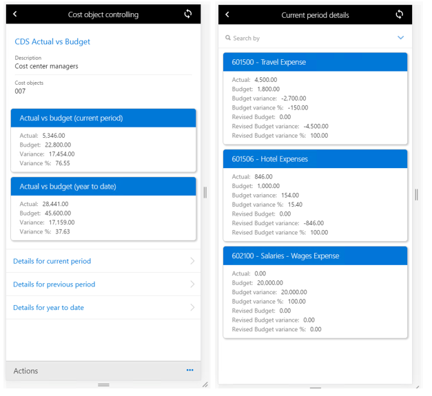

# Cost controlling mobile workspace

[!include [banner](../includes/banner.md)]
[!include [mobile app deprecation](../../fin-ops-core/dev-itpro/includes/mobile-app-deprecation-banner.md)]

This article provides information about the **Cost controlling** mobile workspace. This workspace lets cost center managers view information about cost center performance anytime and anywhere.

This mobile workspace is intended to be used with the finance and operations (Dynamics 365) mobile app.

## Overview
The **Cost controlling** mobile workspace provides an instant view of the current performance of cost centers by comparing actual costs against the budgeted costs. You can drill down to the status of individual cost elements.

For example, an employee receives an invitation to an international conference, but the organization must cover all the travel expenses. The employee asks their manager whether they can attend the conference. The manager opens the **Cost controlling** mobile workspace on their mobile device to see whether there is budget for the employee to attend the conference.

### Data security
The data in the **Cost controlling** mobile workspace is secured through user credentials. Cost center managers are allowed to see data only for their own cost center. The access-level security is managed in the **Cost accounting** module.

Cost accountants define the configuration of the **Cost controlling** mobile workspace in the **Cost accounting** module. After the workspace is published to the mobile app, it's available in the app. Therefore, all cost center managers in the organization can view data in the same format.

### Actions, views, and links
The **Cost controlling** mobile workspace provides the following actions, views, and links:

-   **Actions:**

    -   Use **Select configuration** to select a layout.
    -   Use **Select cost object** to select the cost centers to filter data on.
    
        > [!NOTE]
        > The cost centers that appear in the list depend on the access that is granted in the **Cost accounting** module.

-   **Views:** Based on the actions that are selected and the configuration in the **Cost accounting** module, you can view the following information on the cards:

    -   Actual vs budget (current period)
    -   Actual vs revised budget (current period)
    -   Actual vs budget (previous period)
    -   Actual vs revised budget (previous period)
    -   Actual vs budget (year to date)
    -   Actual vs revised budget (year to date)

    The following amounts are shown on every card: Actual, Budget, Variance, and Variance %.

-   **Links:**

    -   Details for current period
    -   Details for previous period
    -   Details for year to date

    When you select a link, a card is shown for each cost element. The following amounts are shown on every card: Actual, Budget, Budget variance, Budget variance %, Revised budget, Revised budget variance, and Revised budget variance %.
    
    

## Prerequisites
The prerequisites differ, based on the version of Microsoft Dynamics 365 that has been deployed for your organization.

### Prerequisites if you use Microsoft Dynamics 365 Finance
If Finance has been deployed for your organization, the system administrator must publish the **Cost controlling** mobile workspace. For instructions, see [Publish a mobile workspace](../../fin-ops-core/dev-itpro/mobile-apps/publish-mobile-workspace.md).

### Prerequisites if you use version 1611 with Platform update 3 or later
If version 1611 with Platform update 3 or later has been deployed for your organization, the system administrator must complete the following prerequisites.

<table>
<thead>
<tr class="header">
<th>Prerequisite</th>
<th>Role</th>
<th>Description</th>
</tr>
</thead>
<tbody>
<tr class="odd">
<td>Implement KB 4013633.</td>
<td>System administrator</td>

<td>KB 4013633 is an X++ update or metadata hotfix that contains the <strong>Cost controlling</strong> mobile workspace. To implement KB 4013633, your system administrator must follow these steps.
<ol>
<li><a href="/dynamics365/fin-ops-core/dev-itpro/migration-upgrade/download-hotfix-lcs">Download the metadata hotfix from Microsoft Dynamics Lifecycle Services (LCS)</a>.</li>
<li><a href="/dynamics365/fin-ops-core/dev-itpro/migration-upgrade/install-metadata-hotfix-package">Install the metadata hotfix</a>.</li>
<li><a href="/dynamics365/fin-ops-core/dev-itpro/deployment/create-apply-deployable-package">Create a deployable package</a> that contains the <strong>SCMMobile</strong> model, and then upload the deployable package to LCS.</li>
<li><a href="/dynamics365/fin-ops-core/dev-itpro/deployment/apply-deployable-package-system">Apply the deployable package</a>.</li>

</ol></td>
</tr>
<tr class="even">
<td>Publish the <strong>Cost controlling</strong> mobile workspace.</td>
<td>System administrator</td>
<td>See <a href="/dynamics365/fin-ops-core/dev-itpro/mobile-apps/publish-mobile-workspace">Publish a mobile workspace</a>.</td>
</tr>
</tbody>
</table>

## Download and install the mobile app
Download and install the finance and operations (Dynamics 365) mobile app:

-   [For Android phones](https://go.microsoft.com/fwlink/?linkid=850662)
-   [For iPhones](https://go.microsoft.com/fwlink/?linkid=850663)

## Sign in to the mobile app

1.  Start the app on your mobile device.
2.  Enter your Dynamics 365 URL.
3.  The first time that you sign in, you're prompted for your user name and password. Enter your credentials.
4.  After you sign in, the available workspaces for your company are shown. Note that if your system administrator publishes a new workspace later, you will have to refresh the list of mobile workspaces.

## View the performance of your cost center by using the Cost controlling mobile workspace

1.  On your mobile device, select the **Cost controlling** workspace.
2.  Select **Cost object controlling**.
3.  Select **Actions**.
4.  Select **Select configuration** to select a cost controlling layout.
5.  Select **Done**.
6.  Select **Actions**.
7.  Select **Select cost object** to select the cost centers that you've been granted access to.
8.  Select **Done**.
9.  View the overall performance of your cost center.
10. Select the **Details for current period** link.
11. View the performance of individual cost elements.
12. You can also search for specific cost elements.

[!INCLUDE[footer-include](../../includes/footer-banner.md)]

