# Extend tax engine configurations for slab price
[!include [banner](../includes/banner.md)]

This article describes how to extend the Tax engine configuration for slab price. Before extending the tax engine, complete the following: [Prerequisites step](extend-tax-engine-configurations.md#prerequisites).

## Activate the tax configuration
### Create extension configurations
1. Create a new taxable document derived from a taxable document (India).
2. Go to the **Electronic reporting** workspace.
3. Click **Tax configurations**.
4. Navigate to the **Taxable Document (India)** configuration, and then click **Create configuration**.

   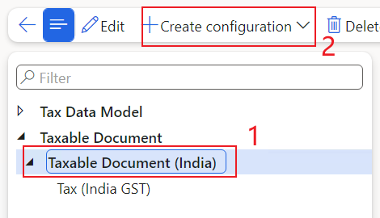
   
5. Select **Taxable document model derived from Name: Taxable Document (India), Microsoft** option, and then enter a name (i.e., **Taxable Document (India Contoso)**) and description for the derived taxable document.

   
   
6. Click **Create configuration** and create a new tax document that is derived from Tax (India GST).
7. Go to **Tax (India GST)** configuration, and click **Create configuration**.

   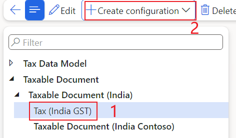
   
8. Select **Tax configuration derived from Name: Tax (India GST), Microsoft** option.
9. Enter a name (i.e., **Tax (India GST Contoso)**) and description for the derived tax document.
10. Click **Create configuration**.

    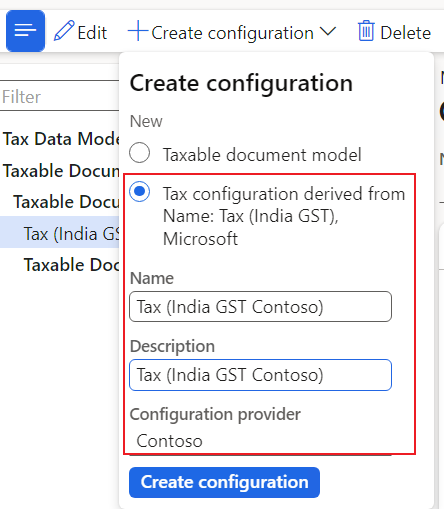

### Add the net price to Taxable Document (India Contoso)
1. Go to **Taxable Document (India Contoso)** configuration, and click **Designer**.

   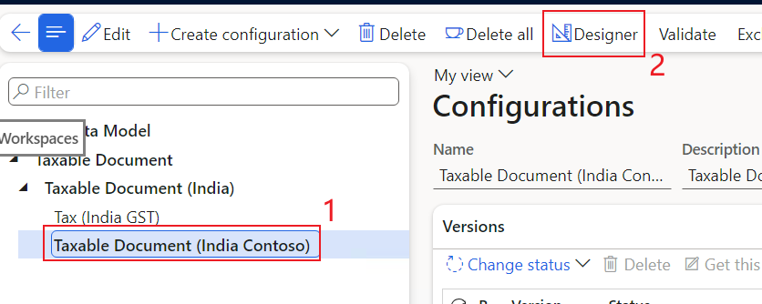
   
2. Navigate to **Tax document > Header > Lines**, and click **New** to create a new node.
3. Enter a name for the node, and select the item type:
   - **Name:** Net Price
   - **Item type:** Real

     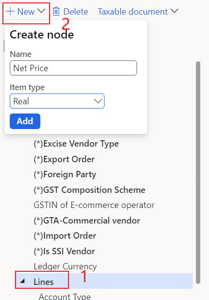
     
4. Open **Map model to datasource** to bind **Net Price** with data model.

   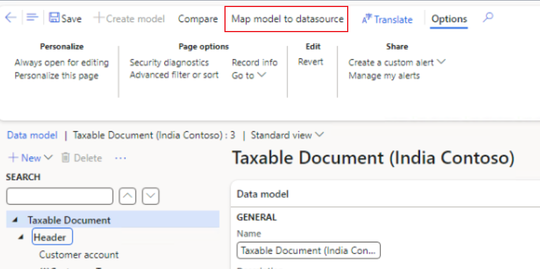
   
5. Here takes sales order as an example, select **Sales order document type** and open **Designer**.

   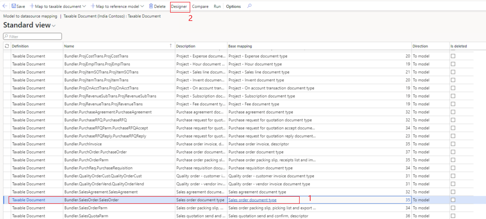
   
6. Expand the **DATA MODEL > Header = 'Sales order'.Header > Lines = 'Sales order'.Header.Lines**, find the **Net price** and click **Edit**.

   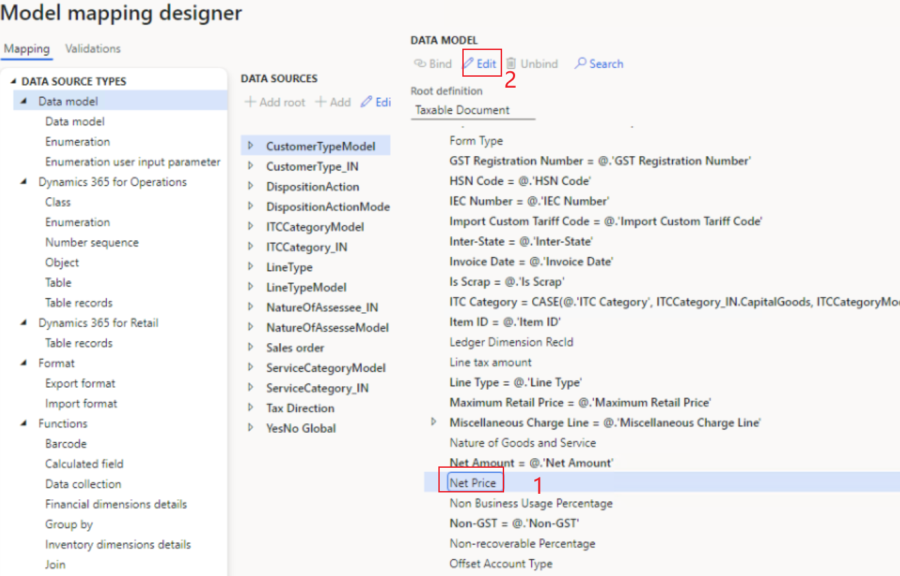
   
7. Click **Go to @**, and find the **Net Price**.

   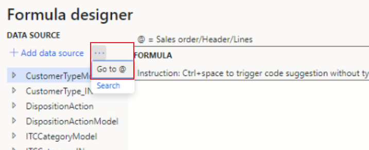
   
8. Add **Net Price** formula.

   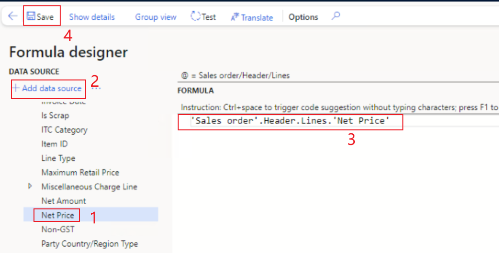

9. In the **Configurations** workspace, click **Change status**, and select **Complete**.

    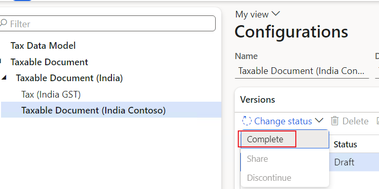
   
10. Enter a description such as **Slab price**, and click **OK**.
11. If there are any errors, open the designer, click **Validate**, and fix the errors.

After the status is updated to **Complete**, the configuration is ready for deployment.

### Change the data model of Tax (India GST Contoso)
1. Navigate to the **Tax (India GST Contoso)** configuration, and then click **Designer**.

   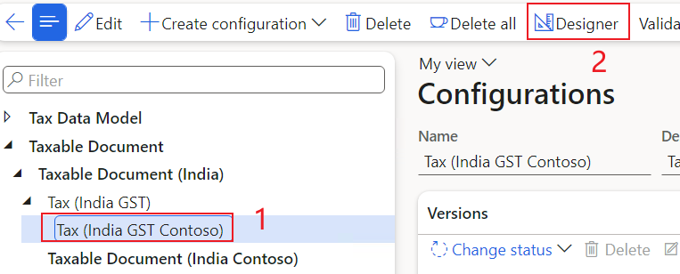
   
2. Click **Tax document**, and then select **Taxable Document (India Contoso)** as the data model and **1** as the data model version.

   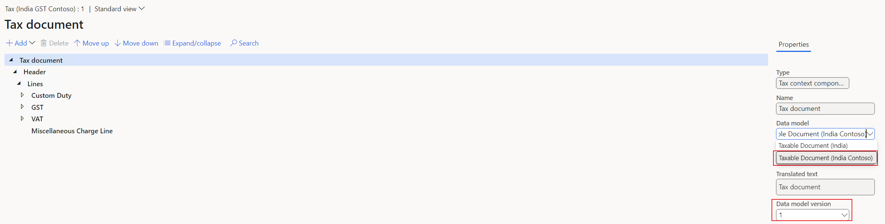
   
3. Click **Save** to save the configuration.

### Modify rate/percentage lookups
1. Expand the **CGST** tax component node.
2. Select the measure of the **Rate**.
3. Go to **Lookups** tab, click **Columns** to add **Net Price** as condition of rate table.

   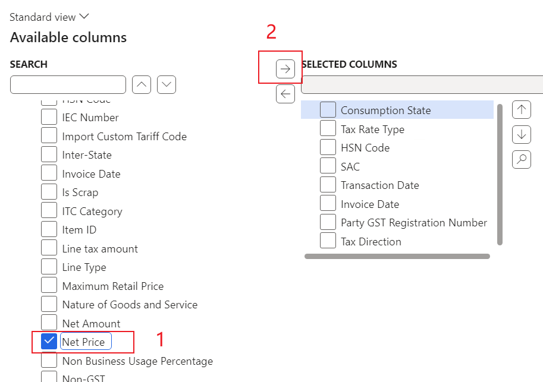
   
4. Select the same attributes that SGST uses.

> [!NOTE]
> Don't click **Add**. Values that you enter here have no effect on the actual rate table. The table should be completed at **Tax > Tax configuration > Tax setup**.

5. Save the tax document.

### Complete the tax document configuration
1. Save the configuration, and close the designer.
2. In the **Configurations** workspace, click **Change status**, and select **Complete**.

   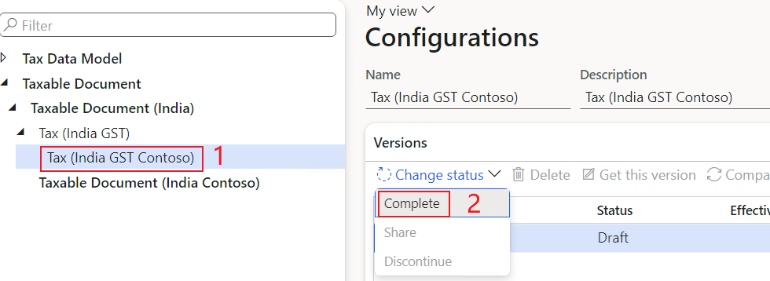
   
3. Enter a description such as **Slab price**, and click **OK**.
4.  If there are any errors, open the designer, click **Validate**, and fix the errors.

After the status is updated to **Complete**, the configuration is ready for deployment.

### Import the configuration and deploy it to a specific company
1. Go to **Tax > Setup > Tax configuration > Tax setup**.
2. Select the current working tax setup.
3. Click **Configurations**.

   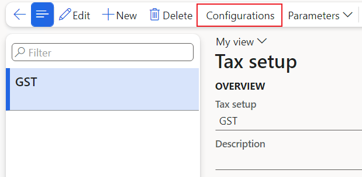
   
4. Click the **Tax configuration** tab > **Available configurations**, click **New** to create a tax configuration.

   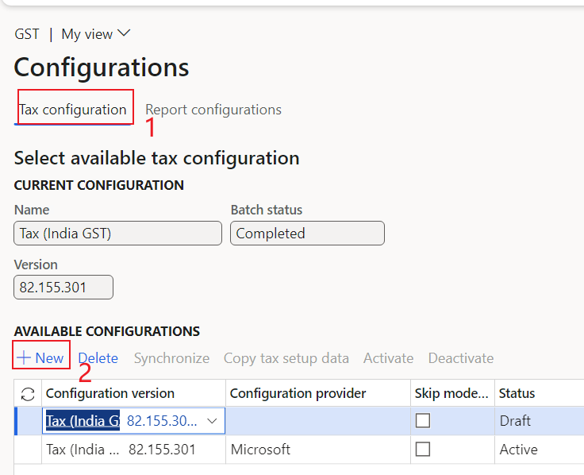

> [!NOTE]
> Any tax configurations that you add are listed in the **Available configurations** grid.

 5. Select the required configuration (for example, **Tax (India GST Contoso)** and version (for example, **1**)), and then click **Save** and **Synchronize**.

    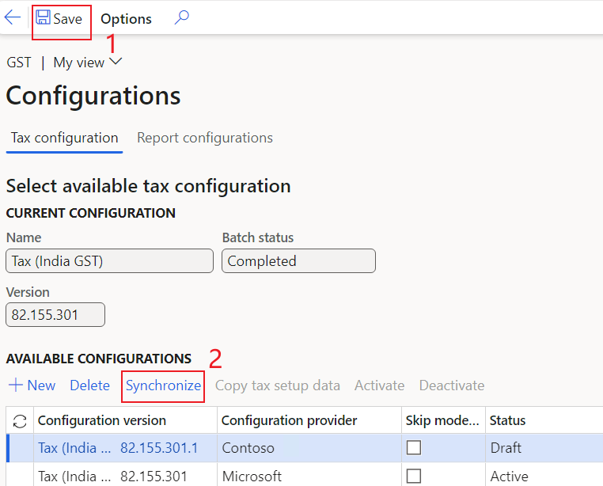

> [!NOTE]
> If you want to copy the tax setup data from original configuration, you can check the **Copy tax setup data from** button and choose the configuration you want to copy.

6. Click **Activate**.

   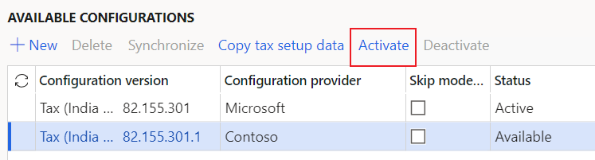
   
7. Back to **Tax setup** page and go to the **Companies** FastTab.
8. Click **New** and then select **INMF** in the **Companies** field.
9. Click **Save**.
10. Click **Activate** to activate the configuration for the company.

    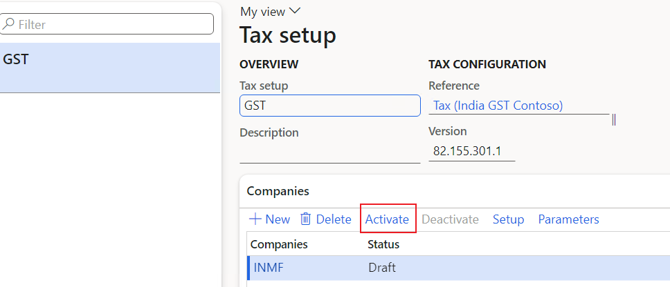
    
11. Click **Setup** to set up data for the new version.
12. Setup tax rate as per business requirement as below.

    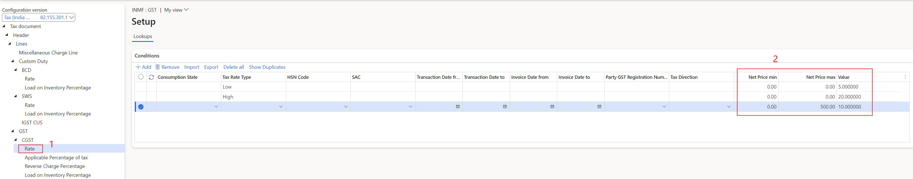
 
## Modify the data provider in Microsoft Dynamics AX
### Implement logic to determine Net Price
1. In the AOT, open Classes > TaxEngineModelFields. Add a new constant variable for Net Price.
   
   ```
   public static const str NetPrice = 'Net Price';
   ```


2. Add a new method for the **TaxModelDocLineBaseImpl_IN** class, and implement the determination logic in the method.
   
   ```
    public Amount getNetPrice()
    {
        if (this.getQuantity())
        {
            return this.getLineAmount() / this.getQuantity();
        }
        else
        {
            return this.getLineAmount();
        }

    }
   ```

### Pass the Net Price to GTE
1. Pass the Net Price to GTE in `TaxableDocumentRowDataProviderLine_IN_Extension.fillInFields()`.
   
   ```
   this.addFieldValue(_lineObj, TaxEngineModelFields::NetPrice, taxModelDocLineBaseImpl.getNetPrice());
   ```
   
   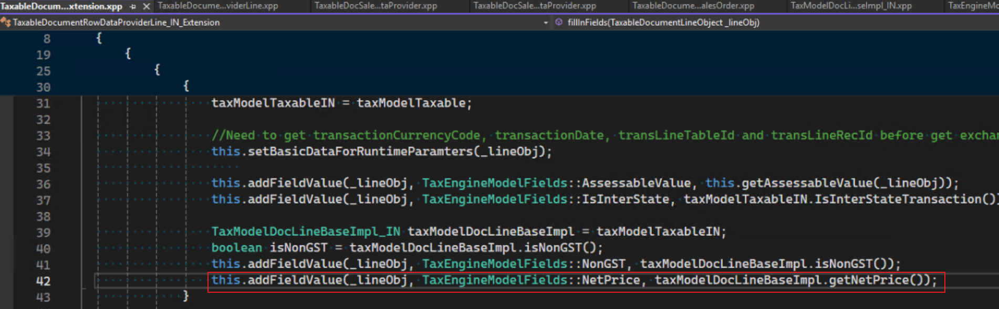

2. Add the Net Price to the method `TaxableDocumentRowDataProviderLine_IN_Extension.initValidFields()`.

   ```
   validFields.add(TaxEngineModelFields::NetPrice, Types::Real);
   ```


[!INCLUDE[footer-include](../../includes/footer-banner.md)]
