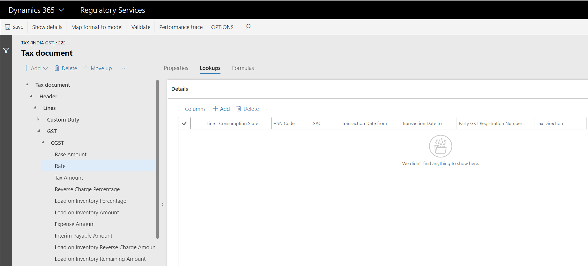
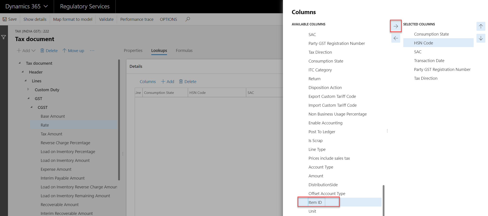

# Tax engine applicability

[!include [banner](../includes/banner.md)]

The [Tax engine](../general-ledger/tax-engine.md) (also referred to as GTE) lets you configure tax rules that determine tax applicability, calculation, posting, and settlement, based on legal and business requirements. This article walks you through a tax engine configuration to help you understand how GTE handles tax applicability.

> [!NOTE]
> The Tax engine functionality is only available for legal entities with a primary address in India.

## Prerequisites                                               
This document uses India Goods and Services Tax configuration to explain the tax applicability. For more information, see [India Goods and Services Tax (GST) overview](../localizations/india/apac-ind-gst.md).

## Overview
Tax applicability is the condition under which tax type, tax component, or tax rate are applicable. For example, for India GST, if you sell goods from one state to another state, you need to charge IGST, and the goods you are selling will determine the tax rate. 
The tax engine provides two ways to handle the tax applicability, lookup and condition. A lookup is mainly used to handle the dynamic applicability rules, and a condition is used to handle the static applicability rules.

The following GTE components are relevant to tax applicability.

|GTE component | Lookup/Condition | Comments |
|--------------|------------------|----------|
| Tax type | Lookup & Condition |  |
| Tax component | Lookup & Condition | Both tax component and tax type can have applicability logic. Because the tax component is under tax type, applicability logic is used to determine whether a specific tax component is applicable. |
| Tax measure | Lookup | The measure type should be **Tax rate**, **Percentage**, or **Percentage group**. |
| Formula | Condition | For a specific transaction type, not all tax formulas are relevant. For example, the formula that is used to calculate the non-deductible tax is only relevant for document purchases. |
| Posting | Condition | Different transaction types have different posting logic. In this case, a condition is used to ensure that the correct posting profile is used. | 
| Accounting | Lookup | Accounting is the same as tax accounts. With a lookup, you can maintain different sets of tax accounts for different scenarios. For example, different tax registration numbers have different tax accounts. |
| Credit pool | Lookup | Use a lookup to determine how to settle tax. For example, you can settle tax based on different tax registration numbers. |
| Tax period | Lookup | Use a lookup to determine which tax period should be used for different scenarios. |


## Condition
If the applicability rule is always static, you need to use a condition. For example, GST is not applicable for intra-state inventory transfer in India.  

Open Tax (India GST) by clicking the **Designer** button. 


Select the tax component CGST, and click the pencil icon, to check the detailed condition. 


The condition is actually an [Electronic Reporting](../../fin-ops-core/dev-itpro/analytics/general-electronic-reporting.md) expression. It is comprised of the fields on the left in **Data source**, and **Functions** on the right. For a list of supported functions, see [Formula designer in Electronic reporting (ER)](../../fin-ops-core/dev-itpro/analytics/general-electronic-reporting-formula-designer.md). 

The following condition means that *Taxable Document Type* cannot be "Invent transfer order receive", "Invent transfer order shipment", or "Invent transfer order". This also means that either HSN Code or SAC should be specified.

```sql
AND(Header.'Taxable Document Type'<>"Invent transfer order receive",
    Header.'Taxable Document Type'<>"Invent transfer order shipment",
    Header.'Taxable Document Type'<>"Invent transfer order", 
    OR(NOT(Header.Lines.'HSN Code'=""), NOT(Header.Lines.SAC=""))
   )
```

### Enable GST for intra-state inventory transfer order
In this scenario, suppose that the Indian government requires you to calculate GST for intra-state inventory transfer orders if the GST registration numbers are different between the ship from and ship to warehouse. 

#### Structure of the Data source in the formula designer
On the leftmost side of the formula designer, you can find all the fields that are defined in the taxable document and tax document, and the reference model that is defined in the taxable document.

```Text
Header
└───Header fields
└───Lines
|   └───Lines field
|       └───Tax types
|           └───Tax components
|               └───Tax measures
Reference models
```

#### Change the applicability condition
To change the applicability condition, go to **Header > Lines > GST Registration number** and **Header > Lines > Party GST Registration number**. These represent the GST registration numbers for the ship from and ship to warehouse. The condition can be changed to the following.

```Text
AND(
    OR(
       AND(
           OR(
              Header.'Taxable Document Type'="Invent transfer order receive",
              Header.'Taxable Document Type'="Invent transfer order shipment",
              Header.'Taxable Document Type'="Invent transfer order"
             ),
             'GST Registration Number'<>'Party GST Registration Number'
           ),
       AND(
           Header.'Taxable Document Type'<>"Invent transfer order receive",
           Header.'Taxable Document Type'<>"Invent transfer order shipment",
           Header.'Taxable Document Type'<>"Invent transfer order"
          )
      ), 
    OR(NOT(Header.Lines.'HSN Code'=""), NOT(Header.Lines.SAC=""))
   )
```

Select the field from the data source, and use **Add data source** to add the field into the formula. Make sure to use single quotes for the data source field if there is an empty space in the name, like 'Taxable Document Type'. Use a double quote for the value if there is an empty space, like "Inventory transfer order".

Click **Test** to test your formula after you are done with editing.

## Lookup
If the static applicability rules are complex, or it is a dynamic applicability rule, you need to use a lookup.

### Lookup for static applicability rules
Select **GST**, click **Lookups**.


Because a lookup can handle both static applicability rules and dynamic applicability rules, the **Source type** drop-down list is for this purpose. Use **Configuration** for the static applicability rule, which means that the data used in the lookup comes from the configuration. Use **User data** for the dynamic applicability rule, which means that the data used in the lookup comes from the runtime environment.

A lookup is a matrix. The relation of each line is *OR*, and the relation of each column within the line is *AND*. If the value of the cell is empty, it means that all of the values satisfy the condition. 

In the screenshot above, all the data for the lookup of tax type GST comes from the configuration, so the **Source type** is **Configuration**.

If you convert the lookup of GST into a condition, it will look like following.

```Text 
OR(
    AND(Exempt=Exempt.No,
        AND('Tax Direction' = "Sales tax receivable",
            'GST Composition Scheme' = NoYes.No,
            'Party GST Registration Number' <> ""
        ),
        AND('Tax Direction' = "Sales tax payable",
            'Export Order' = NoYes.No,
            'GST Registration Number' <> ""
        ),
        AND('Tax Direction' = "Sales tax receivable",
            'GST Composition Scheme' = NoYes.No,
            'GST Registration Number' <> ""
        )
    )
)
```

### Lookup for dynamic applicability rules
Many applicability rules depend on the runtime data. For example, some tax components are only applicable for a certain good or service, so a different type of tax transaction results in a different tax rate. 

Select **CESS**, click **Lookups**.

In India, CESS is applicable for certain goods and services. In Dynamics 365 Finance, HSN represents goods, and SAC represents services, so the HSN Code and SAC are used in the lookup. The **Source type** is **User data**, because the real value of the HSN Code and SAC comes from Finance.

Now, let's check how the CGST rate is determined. Select **CGST > Rate**, click **Lookups**.



Runtime data is required to determine the tax rate, so the system hides the **Source type**, and the **User data** value.

Different goods and services result in different tax rates, so there are **HSN Code** and **SAC**. **Party GST Registration Number** and **Tax Direction** are used to handle the scenario of purchasing from an unregistered GST supplier. **Transaction Date from** and **Transaction Date to** are used to handle different tax rate per periods.

### Enable different tax rate for different goods
Different goods can share one HSN code, so the lookup cannot satisfy this scenario. A different lookup column is needed to handle this.

Click **Columns**. On the left side, you can find all of the **Available columns**. The structure is the same as the **Data source** in the formula designer, except that there are no reference models.



Select **Item ID** in **Available columns** to uniquely determine the goods. Click the right-arrow icon to add it to the **Selected columns** side. If HSN is not needed, you can select **HSN Code** in **Selected columns**, and click the left-arrow icon to remove it. 


[!INCLUDE[footer-include](../../includes/footer-banner.md)]
