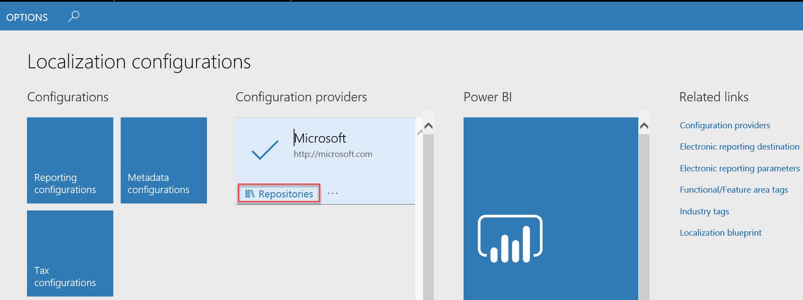
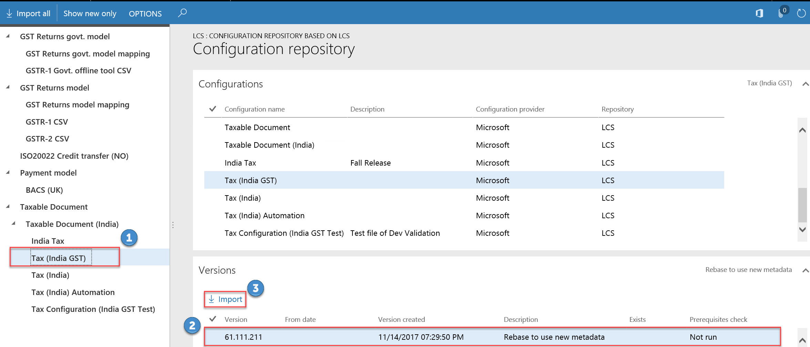

# Tax engine import configuration

[!include [banner](../includes/banner.md)]
[!INCLUDE [lcs-freeze-banner](../../includes/lcs-freeze-banner.md)]

This article provides information about import tax engine configuration.

### Create a Lifecycle Services (LCS) configuration repository

1. Go to **Organization administration** > **Workspaces** > **Electronic reporting**.
2. In the **Configuration providers** section, click **Repositories** on the **Microsoft** provider tile.

1. Click **Add**.
2. Select the **LCS** option.
3. Click **Create repository** to create an LCS configuration repository.
4. Enter a name and description for the repository and then click **OK**.

### Import configurations from LCS

1. Go to **Organization administration** > **Workspaces** > **Electronic reporting**.
2. In the **Configuration providers** section, click **Repositories** on the **Microsoft** provider tile.
3. Select the configuration repository that you just created.
4. Click **Open**.
5. In the tree, select the latest tax document (for example, select **Tax (India GST)**).
6. In the **Versions** section, click **Import**.

1. Click **Yes** to confirm the import.

[!INCLUDE[footer-include](../../includes/footer-banner.md)]
