# Tax engine integration

[!include [banner](../includes/banner.md)]

To integrate the [Tax engine](../general-ledger/tax-engine.md) (GTE) with Dynamics 365 Finance, you must implement X++ code that interacts with the Tax engine for tax calculation, and that consumes the results to show, account, and post tax for voucher and tax transactions. The tax calculation can either include or exclude tax adjustments. 

> [!NOTE]
> The Tax engine functionality is only available for legal entities with a primary address in India.

## Tax engine integration models
There are three models for Tax engine integration:

- Tax engine interfaces with the Tax engine service
- Tax business service
- Finance application integration:
    - Application integration
    - Accounting integration

###  Tax engine interfaces with the Tax engine service model

This model is part of the Finance integration framework. Therefore, almost no uptake is required for partners or customers.

The ITaxEngine interface and its implementation contain the basic operations of the Tax engine. These operations include calculating tax through the tax engine, persisting the calculated result to Finance tables, retrieving the tax document for the transaction, and deleting the tax document from both the Tax engine cache and Finance tables.

The set of ITaxDocument interfaces and implementations enables information to be read from a tax document that the Tax engine calculates and returns. This set includes ITaxDocument, ITaxDocumentLine, ITaxDocumentField, ITaxDocumentComponentLine, and ITaxDocumentMeasure.

These interfaces provide methods for retrieving a specified field value (**ITaxDocumentField**) from ITaxDocumentLine and an expected measure value (**ITaxDocumentMeasure**) from ITaxDocumentComponentLine.

- The set of ITaxDocumentMetaData interfaces enables model information to be read from a tax document. This set includes ITaxDocumentMetaData, ITaxDocumentLineMetaData, ITaxDocumentComponentLineMetaData, and ITaxDocumentMeasureMetaData.
- The set of ITaxDocumentEnumerator and ITaxDocumentMeataDataEnumerator interfaces provides an enumerator to read a list of tax document–related objects, such as ITaxDocumentLine, ITaxDocumentField, ITaxDocumentComponentLine, and ITaxDocumentMeasure.

### Tax business service model

The Tax business service model is part of the Finance integration framework, and almost no uptake is required for partners or customers. This model supports the interactions that the Finance application has with the Tax engine for basic operations. It uses both the interface model and the application model to calculate, account, and post tax. The Tax business service model provides the following methods:

<table>
<tr>
<td><strong>Method</strong></td>
<td><strong>Description</strong>
</td>
</tr>
<tr>
<td>CalculateTax</td>
    <td> Delete a tax document if it&#39;s marked as <strong>Dirty</strong>, and then calculate tax.<ul>
<li><strong>Input</strong>: Taxable document identifier</li>
<li><strong>Output</strong>: Tax document object</li>
</ul>
</td>
</tr>
<tr>
<td>RecalculateTax</td>
<td>Explicitly recalculate a tax document.
<ul>
<li><strong>Input</strong>: Taxable document identifier</li>
<li><strong>Output</strong>: Tax document object</li>
</ul>
</td>
</tr>
<tr>
<td>SaveTaxDocument</td>
<td>Persist a tax document to the Finance database.
 <ul>
<li><strong>Input</strong>: Taxable document identifier</li>
<li><strong>Output</strong>: Not applicable</li>
</ul>
</td>
</tr>
<tr>
<td>GetTaxDocumentBySource</td>
<td>Read a tax document, based on the source transaction identifier. <ul>
<li><strong>Input</strong>: Taxable document identifier</li>
<li><strong>Output</strong>: Tax document object</li>
</ul>
</td>
</tr>
<tr>
<td>GetTaxDocumentLineBySource</td>
<td>Read a tax document line, based on the source transaction line identifier. <ul>
<li><strong>Input</strong>: Transaction line identifier</li>
<li><strong>Output</strong>: Tax document line object</li>
</ul>
</td>
</tr>
<tr>
<td>GetTaxDocumentTaxStatus</td>
<td>Read the status of a tax document for the associated transaction.
 <ul>
<li><strong>Input</strong>: Taxable document identifier</li>
<li><strong>Output</strong>: Tax document object</li>
</ul>
</td>
</tr>
<tr>
<td>MarkTaxDocumentTaxStatus</td>
<td>Mark a tax document as <strong>Dirty</strong> when the underlining transaction is updated. <ul>
<li><strong>Input</strong>: Taxable document identifier, Tax document status</li>
<li><strong>Output</strong>: Not applicable</li>
</ul>
</td>
</tr>
<tr>
<td>DeleteTaxDocument</td>
<td>Delete a tax document when the transaction is deleted. <ul>
<li><strong>Input</strong>: Taxable document identifier</li>
<li><strong>Output</strong>: Not applicable</li>
</ul>
</td>
</tr>
<tr>
<td>PostTax</td>
<td>Post tax for the transaction. <ul>
<li><strong>Input</strong>: Ledger voucher for the tax that must be posted, Taxable document identifier</li>
<li><strong>Output</strong>: Not applicable</li>
</ul>
</td>
</tr>
<tr>
<td>TransferTaxDocument</td>
<td>Transfer a tax document from one transaction that the source supports to another transaction.
<ul>
<li><strong>Input</strong>: Source transaction, Target transaction</li>
<li><strong>Output</strong>: Not applicable</li>
</ul>
</td>
</tr>
<tr>
<td>PostTaxDocument</td>
<td>Just change the status of the tax document to <strong>Posted</strong>. <ul>
<li><strong>Input</strong>: Taxable document identifier</li>
<li><strong>Output</strong>: Not applicable</li>
</ul>
</td>
</tr>
</table>

### Finance application integration

Transaction information from Finance should be sent to the Tax engine. At the same time, the accounting and posting of tax should be aligned with the Finance implementation. Therefore, three parts are created in the Finance application:

- Taxable document
- Tax accounting
- Tax posting

Meanwhile, the integration uses the transit document framework to maintain the relationship between the Finance transaction and the tax document.

#### Application integration

##### Taxable document

A taxable document encapsulates transaction information by using a set of data providers. Transaction information is wrapped by a TaxableDocument object. A TaxableDocumentDescriptor object in this object should describe what the transaction is, and it should list a set of data providers that bind tax model attributes with transaction data.

**TaxableDocumentDescriptor** is the class that implements a set of TaxableDocumentTypeDefinition interfaces and describes what the transaction is. Technically, TaxableDocumentDescriptors are the Finance table bases, whereas TaxableDocumentTypeDefinitions are more business-driven and are used mainly for tax configuration conditions.

In the following example, TaxableDocumentDescriptorPurchaseOrderParm implements three interfaces that share the same PurchParmTable table.

If additional attributes are added to a tax configuration, and they are used for lookup, condition, formula, or other configurations, you should bind the attributes with transaction data. Therefore, you should modify the corresponding data provider classes for a transaction so that they do this type of data binding.

> [!NOTE]
> If additional transactions should support GTE, you should create related TaxableDocumentTypeDefinitions, TaxableDocumentDescriptors, and TaxableDocumentDataProviders.

##### Transit document

A transit document is an existing framework in Finance that is used for the following two purposes:

- Maintain the relationship between a transaction and a transit document.
- Transfer the document from one transaction to another transaction.

This framework lets you easily find a transaction's document and track the transit history. For example, a tax document is created from VendInvoiceInfoTable, and then the transit document maintains the relationship between VendInvoiceInfoTable and TaxDocument. When a purchase order is invoiced, the tax document from VendInvoiceInfoTable is transferred to VendInvoiceJour.

> [!NOTE] 
> If additional transactions should support the Tax engine, you should define a rule for the transit document framework to describe which transaction should have a tax document from both the header level and the line level. The rule should also define the transit action from the source transaction to the target transaction.

#### Transaction integration

Transaction integration occurs only on a case-by-case basis. For each transaction and scenario, the Tax business service should be called in the appropriate manner for tax calculation, tax assumption, and tax posting. For an example, see the [Finance integration example – Purchase order invoice](#example-finance-integration--purchase-order-invoice) section later in this article.

#### Accounting integration

##### Tax accounting

The accounting of Finance transactions has two parts: source document accounting and nonsource document accounting. The same behavior applies to Tax engine tax accounting, which is integrated with the Finance implementation on both sides:

- For source document transactions, such as a purchase order or free text invoice, the account information for tax is fetched when the tax document is created.
- For nonsource document transactions, such as a sales order or general journal, the account information is determined when tax is posted.

> [!NOTE]
> If any additional source document transaction requires Tax engine support, you should create source document–related classes to extend AccountingJournalizationRule and AccountingDistributionRule for the specified business event and monetary amount.

##### Tax engine tax posting

Currently, Tax engine tax posting generates TaxTrans, TaxTrans\_IN (if you're running under the India country/region code), and a related voucher for TaxTrans. In order for the **taxTrans** field to be filled with attributes or measures from the tax document, the mapping should be provided via **TaxAcctTaxTransTaxDocAttrMapping** and **TaxAcctTxTransTaxDocMeasureMapping**.

The following illustration shows how TaxTrans and the voucher are created.

> [!NOTE]
> If **taxTrans** fields should be filled with additional fields from the tax document, you should update the **TaxAcctTaxTransTaxDocAttrMapping** class, the **TaxAcctTxTransTaxDocMeasureMapping** class, or the extended classes of one of these classes in the appropriate manner for data binding.

## Example: Finance integration – Purchase order invoice

This section provides an example of how the Tax engine is integrated with purchase order invoices. Related transaction tables include VendInvoiceInfoTable, VendInvoiceInfoLine, VendInvoiceJour, and VendInvoiceTrans.

### Integration checklist

The following table summarizes all relevant changes that are related to the integration with purchase order invoices.

<table>
<tr>
<th colspan="2">Transaction uptake checklist</th>
<th>Description</th>
<th>AOT object</th>
</tr>
<tr>
<td rowspan="2">Definition</td>
<td>Define a taxable document.</td>
<td>Create the taxable document type and description to describe what the transaction is.</td>
<td>TaxableDocumentTypeDefinitionPurchaseInvoice 
TaxableDocumentDescriptorPurchaseInvoice</td>
</tr>
<tr>
<td>Define data providers.</td>
<td>Create data providers to provide transaction data to GTE.</td>
<td>TaxableDocumentTypeDefinitionPurchaseInvoice 
TaxableDocumentDescriptorPurchaseInvoice</td>
</tr>
<tr>
<td rowspan="3">Creation</td>
<td>Add the <strong>Tax document</strong> button on a transaction.</td>
<td>Add the <strong>Tax document</strong> button to the transaction pages.</td>
<td>VendEditInvoice 
VendInvoiceInfoListPage</td>
</tr>
<tr>
<td>Integrate with transaction totals.</td>
<td>Create the tax document when the <strong>Totals</strong> button is clicked.</td>
<td>PurchTotals_ParmTrans.calcTax() 
PurchTotals_ParmTransEdit.calcTax() 
PurchTotals_ParmTransEditInvoice.calcTax()</td>
</tr>
<tr>
<td>Integrate with a source document.</td>
<td>Because a purchase invoice is a source document transaction, create a source document when tax is calculated.</td>
<td>AccDistRuleProductTaxMeasure 
AccJourRuleVendPaymReqTaxMeasure</td>
</tr>
<tr>
<td rowspan="2">Deletion</td>
<td>Delete a transaction.</td>
<td>Delete the tax document when a transaction is deleted.</td>
<td>VendInvoiceInfoTable.delete()</td>
</tr>
<tr>
<td>Delete a transaction line.</td>
<td>Recalculate tax when a transaction line is deleted.</td>
<td>VendInvoiceInfoLine.delete()</td>
</tr>
<tr>
<td rowspan="3">Update</td>
<td>Update transaction header information.</td>
<td>Recalculate tax when fields that affect tax are updated at the transaction header level.</td>
<td>VendInvoiceInfoTable.update()</td>
</tr>
<tr>
<td>Update transaction line information.</td>
<td>Recalculate tax when fields that affect tax are updated on a transaction line.</td>
<td>VendInvoiceInfoLine.update()</td>
</tr>
<tr>
<td>Update tax information.</td>
<td>Recalculate tax when tax information fields are updated.</td>
<td>TransTaxinformation.Write() (page data source)</td>
</tr>
<tr>
<td rowspan="5">Posting</td>
<td>Define a tax document transition rule.</td>
<td>Define a rule for the transfer of a tax document from one transaction to another transaction.</td>
<td>TaxDocumentTransitRuleEventHandler.initTransitDocumentTransactionRuleList()</td>
</tr>
<tr>
<td>Transfer a tax document.</td>
<td>Transfer the tax document from one transaction to another transaction during posting.</td>
<td>PurchaseInvoiceJournalCreate.endCreate()</td>
</tr>
<tr>
<td>Post tax.</td>
<td>Post tax during transaction posting.</td>
<td>PurchaseInvoiceJournalPost.PostTax()</td>
</tr>
<tr>
<td>Add inventory tax.</td>
<td>Add tax to inventory if a tax load on inventory is available.</td>
<td>PurchaseInvoiceJournalPost.PostInventory()</td>
</tr>
<tr>
<td>Post a tax document.</td>
<td>Post the tax document after the transaction voucher is posted. As a result, the tax document status is updated to <strong>Posted</strong>, and records are generated in relation tables.</td>
<td>PurchaseInvoiceJournalPost.endUpdate()</td>
</tr>
<tr>
<td>Inquiry</td>
<td>Add the <strong>Tax document</strong> button on a journal.</td>
<td>Add the <strong>Tax document</strong> button to the journal page for inquiry purposes.</td>
<td>VendInvoiceJournal</td>
</tr>
</table>

### Define a taxable document

**TaxableDocumentTypeDefintionPurchaseInvoice** and **TaxableDocumentDescriptorPurchaseInvoice** are the classes that define a purchase invoice as a taxable document for the Tax engine.

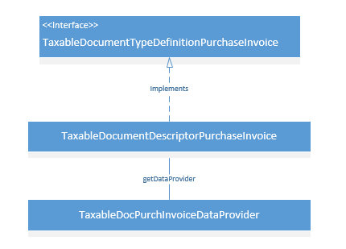

TaxableDocumentTypeDefinitionPurchaseInvoice is the interface that defines a purchase invoice as a taxable document.

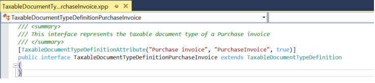

**TaxableDocumentDescriptorPurchaseInvoice.getDataProvider()** specifies the data provider class that is used for a purchase invoice.

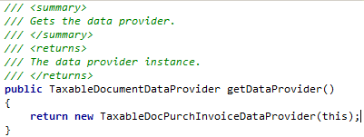

### Define data providers

The following illustration shows the data providers that are used to send transaction data to the Tax engine for any tax-related operation.

**TaxableDocPurchaseInvoiceDataProvider.buildQuery()** provides a query for all related transactions, such as VendInvoiceInfoTable and VendInvoiceInfoLine. It also registers each data source with a row data provider. For example, the VendInvoiceInfoTable data source is registered with TableDocVendInvoiceInfoTableRowDP.

TaxableDocVendInvoiceInfoTableRowDP extends the **TaxableDocPurchTableRowDataProvider** class to set up transaction header–related information, whereas TaxableDocVendInvoiceInfoLineRowDP extends **TaxableDocPurchLineRowDataProvider** to set up invoice line–related information.

The following table lists the taxable document fields that are mapped in Finance.

| Taxable document field         | Logic in the AOT object                                                     | Required                     | Default value |
|--------------------------------|-----------------------------------------------------------------------------|------------------------------|---------------|
| SubLines                       | TaxableDocumentLineObject.getSubLines                                       | Yes                          | |
| Fields                         | TaxableDocumentLineObject.getFields                                         | Yes                          | |
| ModelFieldName                 | TaxableDocumentLineObject.parmModelFieldName                                | Yes                          | |
| TaxAdjustment                  | TaxEngineIntegrationAXContractEventHandler.getLineAdjustment                | No                           | |
| TableId                        | TaxableDocumentLineObject.getTransactionLineTableId                         | Yes                          | |
| RecId                          | TaxableDocumentLineObject.getTransactionLineRecordId                        | Yes                          | |
| Taxable Document Type          | TaxableDocumentDescriptor.createRow                                         | Yes                          | |
| Skipped (Document level)       | TaxableDocumentDescriptor.createRow                                         | Yes                          | No |
| DistributionSide               | TaxableDocumentObject.getDistributionSide                                   | Yes                          | Auto |
| ExchangeRates                  | TaxEngineIntegrationAXContractEventHandler.getExchangeRate                  | Yes                          | |
| ReportingCurrencyExchangeRates | TaxEngineIntegrationAXContractEventHandler.getReportingCurrencyExchangeRate | Yes                          | |
| Tax Document Purpose           | TaxableDocumentRowDataProviderLine.fillInFrameworkFields                    | Yes                          | Transaction |
| Transaction Currency           | TaxableDocumentRowDataProviderLine.fillInFrameworkFields                    | Yes                          | |
| Transaction Date               | TaxableDocumentRowDataProviderLine.fillInFrameworkFields                    | Yes                          | |
| Skipped (Line level)           | TaxableDocumentRowDataProviderLine.fillInFrameworkFields                    | Yes                          | No |
| Tax Direction                  | TaxableDocumentRowDataProviderLine.fillInFrameworkFields                    | Yes                          | Sales tax receivable |
| Post To Ledger                 | TaxableDocumentRowDataProviderLine.fillInFrameworkFields                    | Yes                          | Yes |
| Enable Accounting              | TaxableDocumentRowDataProviderLine.fillInFrameworkFields                    | Yes                          | Yes |
| Line Type                      | TaxableDocumentRowDataProviderLine.fillInFrameworkFields                    | Yes                          | Line |
| Import Order                   | TaxableDocumentRowDataProviderHeader.fillInFields                           | Yes                          | No |
| Export Order                   | TaxableDocumentRowDataProviderHeader.fillInFields                           | Yes                          | No |
| GST Composition Scheme         | TaxableDocumentRowDataProviderHeader.fillInFields                           | Yes                          | No |
| Composition Scheme             | TaxableDocumentRowDataProviderHeader.fillInFields                           | No                           | No |
| Customer Type                  | TaxableDocumentRowDataProviderHeader.fillInFields                           | Yes                          | None |
| Provisional Assessment         | TaxableDocumentRowDataProviderHeader.fillInFields                           | No                           | No |
| Foreign party                  | TaxableDocumentRowDataProviderHeader.fillInFields                           | No                           | No |
| Nature of Assessment              | TaxableDocumentRowDataProviderHeader.fillInFields                           | No                           | Company |
| Preferential Party            | TaxableDocumentRowDataProviderHeader.fillInFields                           | No                           | No |
| GTA-Commercial vendor          | TaxableDocumentRowDataProviderHeader.fillInFields                           | No                           | No |
| Ledger Currency                | TaxableDocumentRowDataProviderHeader.fillInFields                           | Yes                          | |
| Total Discount Percentage      | TaxableDocumentRowDataProviderHeader.fillInFields                           | No                           | |
| Exempt                         | TaxableDocumentRowDataProviderLine.fillInFields                             | Yes                          | No |
| Purpose                        | TaxableDocumentRowDataProviderLine.fillInFields                             | Yes                          | Transaction |
| Prices include sales tax       | TaxableDocumentRowDataProviderLine.fillInFields                             | Yes                          | No |
| Delivery Date                  | TaxableDocumentRowDataProviderLine.fillInFields                             | No                           | |
| DiscountAmount                 | TaxableDocumentRowDataProviderLine.fillInFields                             | No                           | |
| Net Amount                     | TaxableDocumentRowDataProviderLine.fillInFields                             | No                           | |
| Quantity                       | TaxableDocumentRowDataProviderLine.fillInFields                             | No                           | |
| Consumption State              | TaxableDocumentRowDataProviderLine.fillInFields                             | No                           | |
| Return                         | TaxableDocumentRowDataProviderLine.fillInFields                             | Yes                          | No |
| Disposition Action             | TaxableDocumentRowDataProviderLine.fillInFields                             | No (Yes for a return)        | Credit |
| Assessable Value               | TaxableDocumentRowDataProviderLine.fillInFields                             | Yes                          | |
| Inter-State                    | TaxableDocumentRowDataProviderLine.fillInFields                             | Yes                          | No |
| Import Custom Tariff Code      | TaxableDocumentRowDataProviderLine.fillInFields                             | No (Yes for an import order) | |
| Export Custom Tariff Code      | TaxableDocumentRowDataProviderLine.fillInFields                             | No (Yes for an export order) | |
| IEC Number                     | TaxableDocumentRowDataProviderLine.fillInFields                             | No                           | |
| Maximum Retail Price           | TaxableDocumentRowDataProviderLine.fillInFields                             | No                           | |
| Party GST Registration Number  | TaxableDocumentRowDataProviderLine.fillInFields                             | Yes                          | |
| GST Registration Number        | TaxableDocumentRowDataProviderLine.fillInFields                             | Yes                          | |
| HSN Code                       | TaxableDocumentRowDataProviderLine.fillInFields                             | Yes                          | |
| SAC                            | TaxableDocumentRowDataProviderLine.fillInFields                             | Yes                          | |
| Service Category               | TaxableDocumentRowDataProviderLine.fillInFields                             | Yes                          | Inward |
| ITC Category                   | TaxableDocumentRowDataProviderLine.fillInFields                             | Yes                          | Input |
| Is Scrap                       | TaxableDocumentRowDataProviderLine.fillInFields                             | No (Yes for a sales order)   | No |

### Add the Tax document button on a transaction

One way to trigger tax calculation in the Tax engine is through a **Tax document** button that you add on the transaction. When this button is clicked, transactional data is sent to the Tax engine as a predefined taxable document object, and tax calculation is triggered in the Tax engine. The button is usually added to a transaction page, such as **VendEditInvoice**. Immediately after tax is calculated, the result appears in the tax document user interface.

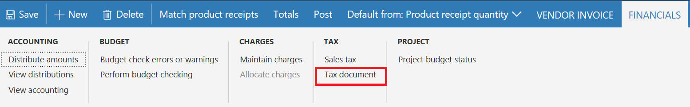

### Integrate with transaction totals

The **Totals** button displays a transaction's financial information, such as the tax amount, discount amount, and total amounts. The tax amount that appears on the total page will also be added to the invoiced amount of the journal.

For an existing implementation of Finance, a set of **PurchTotals** classes is created to handle this functionality. Therefore, Tax engine-related code is inserted into the class's **calcTax** method to help guarantee that the expected tax total amount is initiated.

For alignment with the existing logic, the existing **taxTotal** parameter is used to show the tax amount for the whole transaction. A new parameter that is named **taxTotalGTE** is used to show the tax that is posted to the vendor. In some cases, such as a reverse charge, the **taxTotal** value doesn't equal the **taxTotalGTE** value. Therefore, **taxTotal** will be used for journal posting, whereas **taxTotalGTE** will be used on **Totals** pages to show the total tax amount.

### Integrate with a source document

A purchase invoice is a source document transaction. Therefore, the calculated tax result from the Tax engine should be integrated with the existing source document framework in Finance. The main logic is already completed and handled by the Tax engine integration framework. However, for each source document transaction, the distribution and journalization rules should still be defined for accounting purposes.

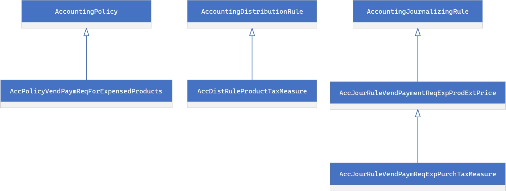

Three classes are created for a purchase invoice: **AccPolicyVendPaymReqForExpensedProducts**, **AccDistRuleProductTaxMeasure** and **AccJourRuleVendPaymReqExpPurchTaxMeasure**.

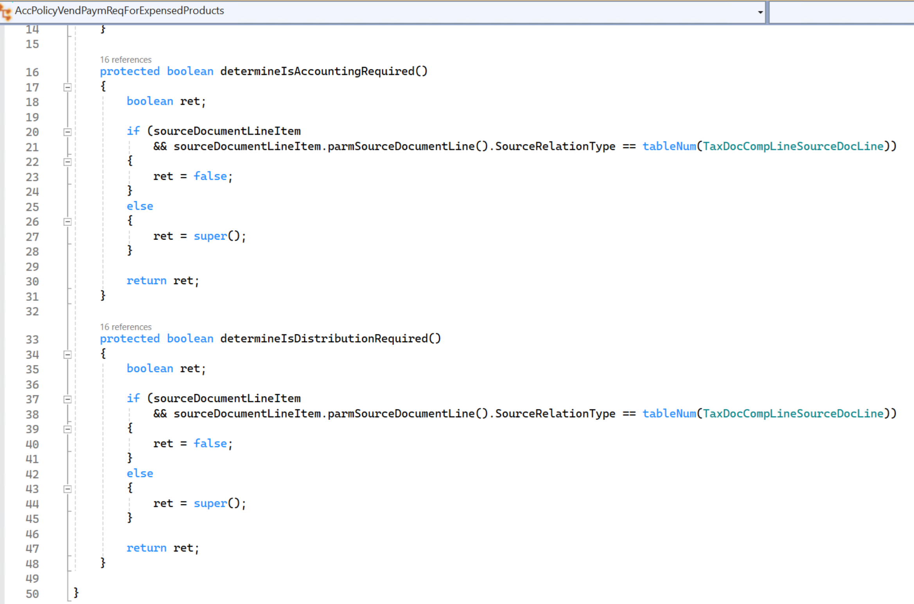

When the source document classes are created correctly, the distribution page should show calculated tax together with the component label, tax amount, and ledger account.

### Delete a transaction

When a purchase invoice is deleted, the associated tax document should also be deleted. To delete an associated tax document, call TaxBusinessService in the **delete** method of VendInvoiceInfoTable.

### Delete a transaction line

When a transaction line is deleted, the tax document should be recalculated. For performance reasons, GTE doesn't recalculate tax immediately after a transaction line is deleted. Instead, it updates the tax document's status to **Dirty**. When a tax document is retrieved so that it can be viewed or posted, GTE checks whether the status is **Dirty**. Depending on the status, recalculation occurs.

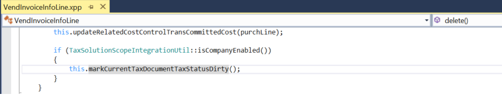

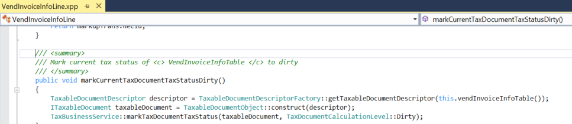

### Update transaction header information

Some transaction header information can affect tax calculation. Examples include the transaction date and currency. Therefore, when this type of information is updated to a different value, the tax document should be marked as **Dirty** so that it can be recalculated later.

The following method lists fields that might affect tax calculation for a purchase invoice.

### Update transaction line information

Similarly, the update of some transaction line fields also affects tax calculation.

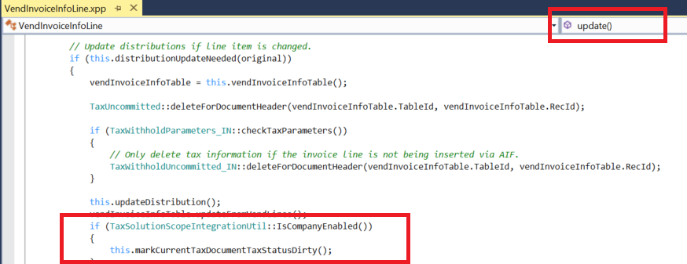

### Update tax information

The tax information of a transaction line has a major effect on tax calculation. The logic is maintained on the Application Object Tree (AOT) **TransTaxInformation** page. This page might not require further uptake.

### Define a tax document transit rule

A rule should be defined to associate a purchase invoice and journal with the tax document. In **TaxDocumentTransitRuleEventHandler::initTransitDocumentRuleList()**, rules are defined for VendInvoiceInfoTable, VendInvoiceInfoLine, VendInvoiceJour, and VendInvoiceTrans to specify that the tax document or tax document row should be associated with the transaction table.

**TaxDocumentTransitRuleEventHandler::initTransitDocumentRuleExtList()** includes extended rule definitions of a transit action from the transaction to the journal.

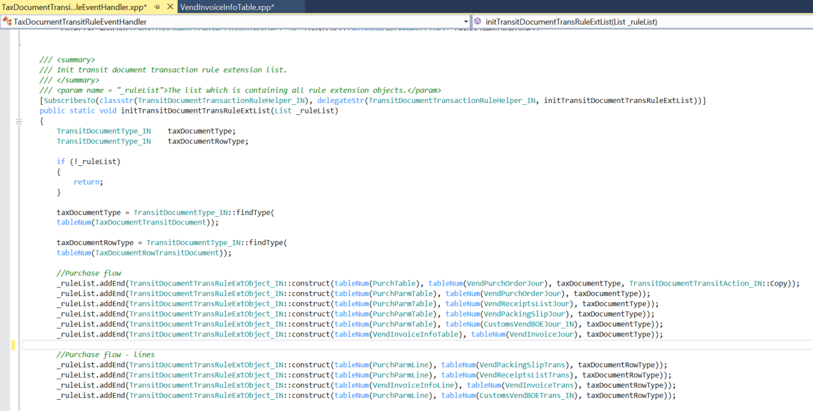

### Transfer a tax document

When a journal is created from a transaction, the tax document should be transferred to the journal. The following code transfers a tax document from a purchase invoice to a purchase invoice journal.

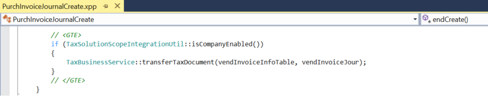

### Post tax

Tax posting occurs when the purchase invoice journal is posted. Therefore, **TaxBusinessService::PostTax()** is called in the **FormLetterJournalPost.postTax()** base class to post the purchase invoice journal.

### Add inventory tax

Tax that must be posted to inventory should be added to an inventory transaction.

The following example shows logic in the **Inventory** module that posts tax for inventory by using the **taxEngineInventMovement().updateTaxFinancial()** class method.

### Post a tax document

After tax is posted, the tax document should be updated to a status that indicates that the tax document has been posted.

When the preceding method is called, an additional record is created in the TaxDocumentGeneralJournalEntryLink table to maintain the relationship between GeneralJournalEntry and the journal transaction. This record will help GTE easily fetch the tax document at the GeneralJournalEntry level.

## Debugging

Debugging of the Tax engine is done mainly on the validation of transaction data and the calculated tax document result. Both the transaction data and the calculated result are in JavaScript Object Notation (JSON) string format.

### Debugging transaction data

Put a breakpoint in **TaxEngineServiceProxy.calculate()**, as shown in the following illustration.

**JsonStr** contains all the transaction data information that is prepared by data providers. You can use any online JSON viewer to easily identify whether data is correctly set for tax model attributes.

### Debugging the tax document

If the Tax engine returns errors for a calculation, all the results will be set to the **RET** attribute in the preceding method. By using a Quick Watch command on the attribute, you can easily understand the full error from the Tax engine.

If the Tax engine returns no issues, the tax document result will be persisted into the following tables:

- TaxDocument
- TaxDocumentRow
- TaxDocumentJson

By querying these tables to obtain the JSON string, you can easily check the result details via any online JSON viewer.

## Additional resources

- [Tax engine overview](../general-ledger/tax-engine.md)
- [Extend tax engine configurations](extend-tax-engine-configurations.md)

[!INCLUDE[footer-include](../../includes/footer-banner.md)]
