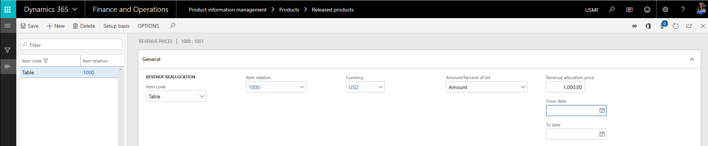
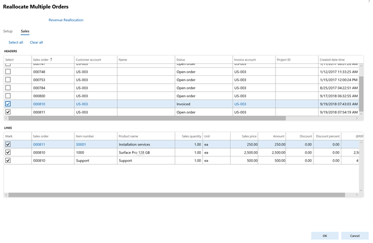
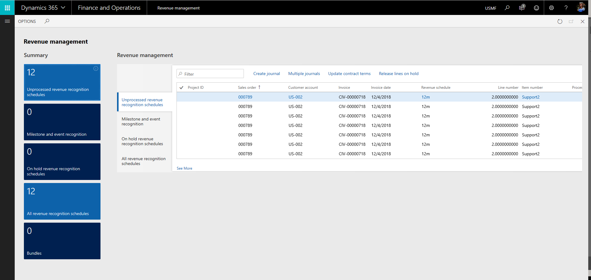

# What's new or changed in Dynamics 365 Finance 10.0.6 (November 2019)

[!include [banner](../includes/banner.md)]

This article describes features that are either new or changed in Microsoft Dynamics 365 Finance 10.0.6. This version has a build number of 10.0.234. While the general availability date is in November, the new features are available for early release in October. For more information about version 10.0.6, see [Additional resources](#additional-resources).

## Feature management enhancements
Feature management now allows you to enable all new features by default, require confirmation to enable a feature, and enable all features that have not already been enabled. 

## “Select consolidation amount from” control on the consolidate online for dual currency consolidation
This features helps you control the currency (either the accounting or reporting currency) that's used as the transaction currency in the consolidation company and can automatically copy amounts from the source company to the consolidation company if the currencies are the same.

## Cancel bank reconciliation
Users will be able to cancel bank reconciliations in chronological order of reconciliation starting with the most recent. History is tracked to show when and by whom the reconciliation was reversed. This will prevent users from having to manually adjust journals to correct any errors that occurred during the periodic process.

## Create checks with a blank status on the Checks page
The **Checks** page is where you perform maintenance tasks on checks, such as creating new check numbers and deleting checks. During the payment process, when this feature is enabled, you can't create checks with a blank status during the payment process. This enhancement helps prevent wasting checks unnecessarily.

## Reset workflow status for vendor invoices from Unrecoverable to Draft
You can use the Workflow history page to reset the workflow status to Draft. This page can be opened from the Vendor invoice page or by going to Common > Inquires > Workflow. To reset the workflow status to Draft, select Recall. You can also reset the workflow status to Draft by selecting the Recall action on either the Vendor invoice or Pending vendor invoices page. After the workflow status is reset to Draft, it becomes available for editing on the Vendor invoice page.

## Revenue recognition
Revenue recognition management helps accounting and finance professionals automate the steps they take to comply with International Financial Reporting Standard (IFRS) 15 and Accounting Standards Codification (ASC) 606.

New capabilities will include support for product bundles and kits such as:

- Software and maintenance
- Software and services
- Software
- Hardware and service

These capabilities will handle the following features:

- Revenue pricing 
- Revenue schedules
- Bundle setup 
- Multiple sales order reallocation
- Workspace navigation and reporting

## Revenue pricing
Users can enter a different price that they will recognize as different from what they charge the customer.

## Revenue schedules
Revenue schedules determine the number of months for the revenue deferral. Options are available to create the schedule based on actual days of the month, splitting equally across month or based on a set number of occurrences.

## Multiple sales order reallocation

## Workspace 
The new workspace is used to look at the status of the revenues schedule records created for deferred revenue.

## Project contract committed detail
You can now drilldown into the details of the committed amount on the funding source of a project contract, allowing the user to easily see the activity that makes up the committed amount.

## Additional resources

### Bug fixes
For information about the bug fixes included in each of the updates that are part of 10.0.6, sign in to Lifecycle Services (LCS) and view the [KB article](https://fix.lcs.dynamics.com/Issue/Details?bugId=369581&dbType=3&qc=ba058110be40fe16a39469298041b1a7baf82eb65bb9df4d864602d2c6bf93d7).

### Platform update 30
Dynamics 365 Finance 10.0.6 includes Platform update 30. To learn more about Platform update 30, see [What's new or changed in Platform update 30 for finance and operations apps (November 2019)](../../fin-ops-core/fin-ops/get-started/whats-new-platform-update-30.md).

### Dynamics 365: 2019 release wave 2 plan
Wondering about upcoming and recently released capabilities in any of our business apps or platform?

Check out the [Dynamics 365: 2019 release wave 2 plan](/dynamics365-release-plan/2019wave2/). We've captured all the details, end to end, top to bottom, in a single document that you can use for planning.

### Removed and deprecated features
The [Removed or deprecated features for finance and operations](../../fin-ops-core/dev-itpro/migration-upgrade/deprecated-features.md) article describes features that have been removed or deprecated for Dynamics 365 forfin-ops-core/ finance and operations.

- A *removed* feature is no longer available in the product.
- A *deprecated* feature is not in active development and may be removed in a future update.

Before any feature is removed from the product, the deprecation notice will be announced in the [Removed or deprecated features](../../fin-ops-core/dev-itpro/migration-upgrade/deprecated-features.md) article 12 months prior to the removal.

For breaking changes that only affect compilation time, but are binary compatible with sandbox and production environments, the deprecation time will be less than 12 months. Typically, these are functional updates that need to be made to the compiler.

[!INCLUDE[footer-include](../../includes/footer-banner.md)]

