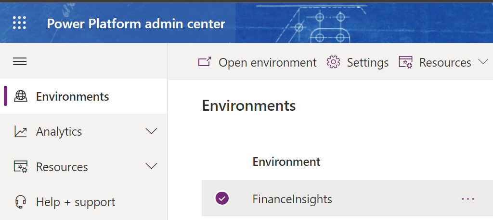

---
# required metadata

title: Configuration for Finance Insights (preview)
description: This topic explains the configuration steps that will enable your system to use the capabilities that are available in Finance insights.
author: ShivamPandey-msft
manager: AnnBe
ms.date: 11/25/2020
ms.topic: article
ms.prod: 
ms.service: dynamics-ax-applications
ms.technology: 

# optional metadata

ms.search.form: 
# ROBOTS: 
audience: Application User
# ms.devlang: 
ms.reviewer: roschlom
# ms.search.scope: Core, Operations
# ms.tgt_pltfrm: 
ms.custom: 14151
ms.assetid: 3d43ba40-780c-459a-a66f-9a01d556e674
ms.search.region: Global
# ms.search.industry: 
ms.author: shpandey
ms.search.validFrom: 2020-07-20
ms.dyn365.ops.version: AX 10.0.13

---
# Configuration for Finance insights (preview)

[!include [banner](../includes/banner.md)]
[!include [preview banner](../includes/preview-banner.md)]

Finance insights combines functionality from Microsoft Dynamics 365 Finance with Common Data Service, Azure, and AI Builder to provide powerful forecasting tools for your organization. This topic explains the configuration steps that will enable your system to use the capabilities that are available in Finance insights.

## Deploy Dynamics 365 Finance

Deploy the environments by following these steps.

1. In Microsoft Dynamics Lifecycle Services (LCS), create or update a Dynamics 365 Finance environment. The environment requires app version 10.0.11/Platform update 35 or later.
2. The environment must be a high-availability (HA) environment in Sandbox. (This type of environment is also known as a Tier-2 environment.) For more information, see [Environment planning](../../fin-ops-core/fin-ops/imp-lifecycle/environment-planning.md).
3. If you're using Contoso demo data, you will require additional sample data to use the Customer payment predictions, Cash flow forecasts, and Budget forecasts features. 

## Configure Common Data Service

You can complete the manual configuration steps that follow, or you can speed up the configuration process by using the Windows PowerShell script that is provided. When the PowerShell script has finished running, it will give you values to use to configure Finance insights. 

> [!NOTE]
> Open PowerShell on your PC to run the script. You may need PowerShell version 5. The Microsoft Azure CLI "Try it" option may not work.

# [Manual configuration steps](#tab/configuration-steps)

1. Open the [Power Platform admin center](https://admin.powerplatform.microsoft.com/), and follow these steps to create a new Common Data Service environment in the same Active Directory tenant:

    1. Open the **Environments** page.

        [](./media/power-pltfrm-admin-center.png)

    2. Select **New environment**.
    3. In the **Type** field, select **Sandbox**.
    4. Set the **Create Database** option to **Yes**.
    5. Select **Next**.
    6. Select the language and currency for your organization.
    7. Accept the default values for the other fields.
    8. Select **Save**.
    9. Refresh the **Environments** page.
    10. Wait until the value of the **State** field is updated to **Ready**.
    11. Make a note of the Common Data Service organization ID.
    12. Select the environment, and then select **Settings**.
    13. Select **Resources \> All Legacy Settings**.
    14. On the top navigation bar, select **Settings**, and then select **Customizations**.
    15. Select **Developer Resources**.
    16. Set the **Instance Reference Information ID** field to the Common Data Service organization ID value that you made a note of earlier.
    17. In the browser's address bar, make a note of the URL for the Common Data Service organization. For example, the URL might be `https://org42b2b3d3.crm.dynamics.com`.

2. If you plan to use the Cash flow forecasts or Budget forecasts feature, follow these steps to update the annotation limit for your organization to at least 50 megabytes (MB):

    1. Open the [Power Apps portal](https://make.powerapps.com).
    2. Select the environment that you just created, and then select **Advanced settings**.
    3. Select **Settings \> Email Configuration**.
    4. Change the value of the **Maximum file size** field to **51,200**. (The value is expressed in kilobytes \[KB\].)
    5. Select **OK** to save your changes.

# [Windows PowerShell configuration script](#tab/powershell-configuration-script)

```azurecli-interactive
Write-Output 'The following modules need to be present for execution of this script:'
Write-Output '  Microsoft.PowerApps.Administration.PowerShell'
Write-Output '  Microsoft.PowerApps.PowerShell'
Write-Output '  Microsoft.Xrm.Tooling.CrmConnector.PowerShell'

try {
    $moduleConsent = Read-Host 'Is it ok to install or update these modules as needed? (yes/no)'
    if ($moduleConsent -ne 'yes' -and $moduleConsent -ne 'y') {
        Write-Warning 'User declined to install required modules.'
        return
    }

    $module = 'Microsoft.PowerApps.Administration.PowerShell'
    if (-not (Get-InstalledModule -Name $module -MinimumVersion '2.0.61' -ErrorAction SilentlyContinue)) {
        Install-Module -Name $module -MinimumVersion '2.0.61' -Force
        Write-Output ('Installed {0} module.' -f $module)
    }
    else {
        Write-Output ('{0} module found.' -f $module)
    }

    $module = 'Microsoft.PowerApps.PowerShell'
    if (-not (Get-InstalledModule -Name $module -MinimumVersion '1.0.9' -ErrorAction SilentlyContinue)) {
        Install-Module -Name $module -MinimumVersion '1.0.9' -AllowClobber -Force
        Write-Output ('Installed {0} module.' -f $module)
    }
    else {
        Write-Output ('{0} module found.' -f $module)
    }

    $module = 'Microsoft.Xrm.Tooling.CrmConnector.PowerShell'
    if (-not (Get-InstalledModule -Name $module -MinimumVersion '3.3.0.892' -ErrorAction SilentlyContinue)) {
        Install-Module -Name $module -MinimumVersion '3.3.0.892' -Force
        Write-Output ('Installed {0} module.' -f $module)
    }
    else {
        Write-Output ('{0} module found.' -f $module)
    }

    Write-Output '================================================================================='

    $useMfa = $false
    $useMfaPrompt = Read-Host "Does your organization require the use of multi-factor authentication? (yes/no)"
    if ($useMfaPrompt -eq 'yes' -or $useMfaPrompt -eq 'y') {
        $useMfa = $true
    }
    if(-not $useMfa) {
        $credential = Get-Credential -Message 'Power Apps Credential'
    }

    $orgFriendlyName = Read-Host "Enter the name of the CDS Organization to use or create: (blank for 'FinanceInsightsOrg')"
    if ($orgFriendlyName.Trim() -eq '') {
        $orgFriendlyName = 'FinanceInsightsOrg'
    }

    $isDefaultOrgPrompt = Read-Host ("Is '" + $orgFriendlyName + "' the default organization for your tenant? (yes/no)")
    if ($isDefaultOrgPrompt -eq 'yes' -or $isDefaultOrgPrompt -eq 'y') {
        $isDefaultOrg = $true
    }

    if ($credential) {
        Add-PowerAppsAccount -Username $credential.UserName -Password $credential.Password
    }
    else {
        Add-PowerAppsAccount
    }

    if ($isDefaultOrg) {
        $orgMatch = ('(default)')
        $environment = (Get-AdminPowerAppEnvironment | Where-Object { $_.IsDefault -eq $true })
    }
    else {
        $orgMatch = ('{0} (*)' -f $orgFriendlyName)
        $environment = (Get-AdminPowerAppEnvironment | Where-Object { ($_.IsDefault -eq $false -and ($_.DisplayName -eq $orgFriendlyName -or $_.DisplayName -like $orgMatch)) })
    }

    $getCrmOrgParams = @{ 'OnlineType' = 'Office365' }
    if ($credential) {
        $getCrmOrgParams.Credential = $credential
    }

    if ($null -eq $environment) {
        Write-Output '================================================================================='
        Write-Output 'PowerApps environment not found. A new one will be provisioned.'

        $invalid = 'invalid'

        $location = $invalid
        $cdsLocations = (Get-AdminPowerAppEnvironmentLocations | Select-Object LocationName).LocationName
        while (-not ($location -in $cdsLocations)) {
            $location = (Read-Host -Prompt "Enter the location in which to create the new PowerApps environment: ('help' to see values)")
            if ($location -eq 'help') {
                $cdsLocations
            }
        }

        $currency = $invalid
        $cdsCurrencies = (Get-AdminPowerAppCdsDatabaseCurrencies -Location $location | Select-Object CurrencyName).CurrencyName
        while ($currency -ne '' -and -not ($currency -in $cdsCurrencies)) {
            $currency = (Read-Host -Prompt "Enter the currency to use for the new PowerApps environment: ('help' to see values, blank for default)")
            if ($currency -eq 'help') {
                $cdsCurrencies
            }
        }

        $language = $invalid
        $cdsLanguages = (Get-AdminPowerAppCdsDatabaseLanguages -Location $location | Select-Object LanguageName, LanguageDisplayName)
        while ($language -ne '' -and -not ($language -in $cdsLanguages.LanguageName)) {
            $language = (Read-Host -Prompt "Enter the language name to use for the new PowerApps environment: ('help' to see values, blank for default)")
            if ($language -eq 'help') {
                $cdsLanguages | Format-Table -Property LanguageName, LanguageDisplayName
            }
        }

        Write-Output 'Provisioning PowerApps environment. This may take several minutes.'

        $sleep = 15

        $envParams = @{ 'DisplayName' = $orgFriendlyName; 'EnvironmentSku' = 'Sandbox'; 'ProvisionDatabase' = $true; 'Location' = $location; 'WaitUntilFinished' = $true }
        if ($language.Trim() -ne '') {
            $envParams.LanguageName = $language
        }
        if ($currency.Trim() -ne '') {
            $envParams.CurrencyName = $currency
        }
        $newEnvResult = New-AdminPowerAppEnvironment @envParams
        if (($null -eq $newEnvResult) -or ($newEnvResult.CommonDataServiceDatabaseProvisioningState -ne 'Succeeded')) {
            Write-Warning 'Failed to create to PowerApps environment'
            if ($null -ne $newEnvResult) {
                $newEnvResult
            }
        }
        else {
            $environment = $null
            $retryCount = 0
            while (($null -eq $environment) -and ($retryCount -lt 5)) {
                Start-Sleep -Seconds $sleep
                $environment = (Get-AdminPowerAppEnvironment | Where-Object { ($_.DisplayName -like $orgMatch) })
            }
            Write-Output ("Provisioned PowerApps environment with name: '" + $environment.DisplayName + "'")
        }

        Write-Output 'Waiting for CDS organization provisioning. This may take several minutes.'
        if (-not $credential) {
            $sleep = 120
            Write-Output 'You may be prompted for credentials multiple times while checking the status of the provisioning.'
        }

        while ($null -eq $crmOrg) {
            Start-Sleep -Seconds $sleep
            $crmOrg = (Get-CrmOrganizations @getCrmOrgParams) | Where-Object { $_.FriendlyName -eq $orgFriendlyName }
        }
    }
    else {
        $crmOrgs = Get-CrmOrganizations @getCrmOrgParams
        if ($UseDefaultOrganization -eq $true) {
            $crmOrg = $crmOrgs | Where-Object { $_.FriendlyName -match $orgMatch }
        }
        else {
            $crmOrg = $crmOrgs | Where-Object { $_.FriendlyName -eq $orgFriendlyName }
        }
    }

    Write-Output '================================================================================='
    Write-Output 'Values for PowerAI LCS Add-In:'
    Write-Output ("  CDS organization url:             " + $crmOrg.WebApplicationUrl)
    Write-Output ("  CDS organization ID:              " + $crmOrg.OrganizationId)
}
catch {
    Write-Error $_.Exception.Message
    Write-Warning $_.Exception.StackTrace
    $inner = $_.Exception.InnerException
    while ($null -ne $inner) {
        Write-Output 'Inner Exception:'
        Write-Error $_.Exception.Message
        Write-Warning $_.Exception.StackTrace
        $inner = $inner.InnerException
    }
}
```
---

## Configure the Azure setup

### Enter the Common Data Service directory ID and the user's Azure AD object ID

1. Enter the Common Data Service directory ID:

    1. Open the [Azure portal](https://portal.azure.com).
    2. Sign in by using the user ID that was used to create the Common Data Service environment.
    3. Go to **Azure Active Directory**.
    4. Copy the **Tenant ID** value.

2. Enter the user's Azure Active Directory (Azure AD) object ID:

    1. In the [Azure portal](https://portal.azure.com), go to **Users**, and search for the user by email address.
    2. Select the user's name.
    3. Copy the **Object ID** value.

### Use Azure Cloud Shell to set up Finance insights Data Lake resources

# [Use a Windows PowerShell script](#tab/use-a-powershell-script)

A Windows PowerShell script has been provided, so that you can easily set up the Azure resources that are described in [Configure export to Azure Data Lake](https://docs.microsoft.com/dynamics365/fin-ops-core/dev-itpro/data-entities/configure-export-data-lake). If you prefer to do manual setup, skip this procedure, and continue with the procedure in the [Manual setup](#manual-setup) section.

> [!NOTE]
> Follow the steps below to run the PowerShell script. The Azure CLI "Try it" option, or running the script on your PC may not work.

Follow these steps to configure Azure by using the Windows PowerShell script. You must have rights to create an Azure resource group, Azure resources, and an Azure AD application. For information about the required permissions, see [Check Azure AD permissions](https://docs.microsoft.com/azure/active-directory/develop/howto-create-service-principal-portal#permissions-required-for-registering-an-app).

1. In the [Azure portal](https://portal.azure.com), go to your target Azure subscription. Select the **Cloud Shell** button to the right of the **Search** field.
2. Select **PowerShell**.
3. Create storage, if you're prompted to do so. Then upload the Windows PowerShell script to the session.
4. Run the script.
5. Follow the prompts to run the script.
6. Use the information from the script output to install the **Export to Data Lake** add-in in LCS.
7. Use the information from the script output to enable the entity store on the **Data connections** page in Finance (**System administration \> System parameters \> Data connections**).

### Manual setup

#### Add applications to the Azure AD tenant

1. In the [Azure portal](https://portal.azure.com), go to **Azure Active Directory**.
2. Select **Manage \> Enterprise applications**.
3. Search for the following applications by app ID.

    | Application                              | App ID                               |
    |------------------------------------------|--------------------------------------|
    | Microsoft Dynamics ERP Microservices     | 0cdb527f-a8d1-4bf8-9436-b352c68682b2 |
    | Microsoft Dynamics ERP Microservices CDS | 703e2651-d3fc-48f5-942c-74274233dba8 |
    | AI Builder Authorization Service         | ad40333e-9910-4b61-b281-e3aeeb8c3ef3 |

If you can't find any of the preceding applications, try the following steps.

1. On your local machine, select the **Start** menu, and search for **powershell**.
2. Select and hold (or right-click) **Windows PowerShell**, and then select **Run as administrator**.
3. Run the following command to install the **AzureAD** module.

    `Install-Module -Name AzureAD`

4. If a NuGet provider is required to continue, select **Y** to install it.
5. If an "Untrusted repository" message appears, select **Y** to continue.
6. For each application that must be added, run the following commands to add the application to Azure AD. When you're prompted, sign in as the Azure AD administrator.

    `Connect-AzureAD`

    `New-AzureADServicePrincipal –AppId <AppId>`

#### Create Azure resources

> [!NOTE]
> Make sure that you create the following resources in the same Azure AD instance as the Common Data Service environment. You can't use resources from a different Azure AD instance.

1. Create a new storage account:

    1. In the [Azure portal](https://portal.azure.com), create a storage account.
    2. In the **Create storage account** dialog box, set the following fields:

        - **Location** – Select the data center where your environment is located.
        - **Performance** – We recommend that you select **Standard**.
        - **Account kind** – You must select **StorageV2**.

    3. In the **Advanced options** dialog box, for the **Data Lake storage Gen2** option, select **Enable** under the **Hierarchical namespaces** feature. If you disable this feature, you can't consume data that Finance and Operations apps write by using services such as Power BI data flows.
    4. Select **Review and create**. When the deployment is completed, the new resource will be shown in the Azure portal.
    5. Go to the storage account that you created.
    6. On the left menu, select **Access keys**.
    7. Copy and save the connection string for either **Key1** or **Key2**.
    8. Copy and save the storage account name.

2. Create a new key vault:

    1. In the [Azure portal](https://portal.azure.com), create a key vault.
    2. In the **Create key vault** dialog box, in the **Location** field, select the data center where your environment is located.
    3. After key vault is created, select it in the list, and then select **Secrets**.
    4. Select **Generate/Import**.
    5. In the **Create a secret** dialog box, in the **Upload options** field, select **Manual**.
    6. Enter a name for the secret. Make a note of the name, because you will have to provide it later.
    7. In the **Value** field, enter the connection string that you obtained from the storage account in the previous procedure.
    8. Select **Enabled**, and then select **Create**. The secret is created and added to Key Vault.
    9. Go to the **Key Vault Overview**, and make a note of the DNS name.

3. Create and register an Azure AD application:

    1. In the [Azure portal](https://portal.azure.com), go to **Azure Active Directory**, and then select **App registrations**.
    2. Select **New application registration**, and set the following fields:

        - **Name** – Enter the name of the app.
        - **Application type** – Select **Web API**.
        - **Redirect URI setup** – Enter the URL for your Dynamics 365 instance, such as, `https://yourdynamicsinstance.dynamics.com/auth`.

    3. Go to the app that you just created, and copy and save its **Application (client) ID** value. You will have to provide this value later, when you set up the key vault.
    4. Go to **API permissions**, and follow these steps:

        1. Select **Add a permission**.
        2. Select **Azure Key vault**.
        3. After you select delegated permissions, select **user\_impersonation**.
        4. Select **Add permissions**.

    5. On the menu for the app, select **Certificates \& secrets**, and then follow these steps to create Key Vault secrets:

        1. Select **New client secret**.
        2. In the **Key Description** field, enter a name.
        3. Select a duration, and then select **Add**. A secret is generated in the **Value** field.
        4. Copy and save the secret value.

4. Create Key Vault secrets:

    1. Go to the key vault that you created earlier, and select **Secrets**.
    2. For each secret name in the following table, follow these steps:

        1. Select **Generate/Import**.
        2. In the **Create a secret** dialog box, in the **Upload options** field, select **Manual**.
        3. Create the secret name and value from the following table.
        4. Select **Enabled**, and then select **Create**. The secret is created and added to Key Vault.

        | Secret name                       | Secret value                                                                                |
        |-----------------------------------|---------------------------------------------------------------------------------------------|
        | app-id                            | The app ID of the application that you created earlier                                      |
        | app-secret                        | The client secret that you saved earlier                                                    |
        | storage-account-name              | The name of the storage account that you created earlier, such as **storageaccount1**       |
        | storage-account-connection-string | The connection string that you copied from the **Access keys** page for the storage account |

5. Authorize the application to access the key vault:

    1. In the [Azure portal](https://portal.azure.com), open the key vault that you created earlier.
    2. Select the access policies.
    3. For each application in the following table, follow these steps:

        1. Select **Add Access Policy** to create an access policy.
        2. In the **Secret permissions** field, select the permissions from the following table.
        3. In the **Select principal** field, search for the application display name from the following table.
        4. Select **Select**.
        5. Select **Add**.
        6. Select **Save**.

        | Application                                              | Permissions |
        |----------------------------------------------------------|-------------|
        | The display name of the new application that you created | Get, List   |
        | **Microsoft Dynamics ERP Microservices**                 | Get, List   |

6. Assign roles to access the storage account:

    1. In the [Azure portal](https://portal.azure.com), open the storage account that you created earlier.
    2. Select **Access Control (IAM)**, and then select **Role Assignments**.
    3. Select **Add, Add Role Assignment**.
    4. For each application in the following table, follow these steps:

        1. Select the role from the following table.
        2. Leave the **Assign access to** field set to **Azure AD user, group, or service principal**.
        3. In the **Select** field, enter the application from the following table.
        4. Select **Save**.

        | Application                                              | Role                        |
        |----------------------------------------------------------|-----------------------------|
        | The display name of the new application that you created | Owner                       |
        | The display name of the new application that you created | Contributor                 |
        | The display name of the new application that you created | Storage Account Contributor |
        | The display name of the new application that you created | Storage Blob Data Owner     |
        | **AI Builder Authorization Service**                     | Storage Blob Data Reader    |

# [Azure CLI](#tab/azure-azure-cli)

```
function New-FinanceDataLakeAzureResources {
    $defaultSecretExpiryInYear = 1

    $MicrosoftDynamicsERPMicroservicesAppId = '0cdb527f-a8d1-4bf8-9436-b352c68682b2'
    $MicrosoftDynamicsERPMicroservicesCDSAppId = '703e2651-d3fc-48f5-942c-74274233dba8'
    $AIBuilderAuthorizationServiceAppId = 'ad40333e-9910-4b61-b281-e3aeeb8c3ef3'
    $KeyVaultServicePrincipalAppId = 'cfa8b339-82a2-471a-a3c9-0fc0be7a4093'
    $GraphServicePrincipalAppId = '00000003-0000-0000-c000-000000000000'

    Import-Module AzureAD.Standard.Preview
    $connectAzureADParameters = @{ 'Identity' = $true; 'TenantId' = $env:ACC_TID }
    $azContext = AzureAD.Standard.Preview\Connect-AzureAD @connectAzureADParameters
    $userContext = ConvertFrom-Json ((az ad signed-in-user show) -join '')
    $user = Get-AzureADUser -Filter ("UserPrincipalName eq '" + $userContext.UserPrincipalName + "'")

    $subscriptionId = (Read-Host -Prompt "Enter the Azure Subscription ID: (blank for default)")
    if ($subscriptionId.Trim() -ne '') {
        $azSubscription = Select-AzSubscription -SubscriptionId $subscriptionId
    }

    $resourceGroupName = (Read-Host -Prompt "Enter the Azure Resource Group name: (blank for 'FinanceDataLake')")
    if ($null -eq $resourceGroupName -or $resourceGroupName.Trim() -eq '') {
        $resourceGroupName = 'FinanceDataLake'
    }
    $resourceGroup = Get-AzResourceGroup -Name $resourceGroupName -ErrorAction SilentlyContinue

    if (-not ($resourceGroup)) {
        $resourceLocation = ''
        $azResourceLocations = (Get-AzLocation | Select-Object Location).Location
        while ($resourceLocation.Trim() -eq '' -or (-not ($resourceLocation -in $azResourceLocations))) {
            $resourceLocation = (Read-Host -Prompt "Enter the location in which to create the Azure Resource Group: ('help' to see values)")
            if ($resourceLocation -eq 'help') {
                $azResourceLocations
                $resourceLocation = ''
            }
        }
        $resourceGroup = New-AzResourceGroup -Name $resourceGroupName -Location $resourceLocation
    }
    else {
        $resourceLocation = $resourceGroup.Location
    }

    $clientAppName = (Read-Host -Prompt "Enter the name of the application registration: (blank for 'Finance Data Lake Application')")
    if ($clientAppName.Trim() -eq '') {
        $clientAppName = 'Finance Data Lake Application'
    }

    Write-Output '================================================================================='

    $service = Get-AzureADServicePrincipal -Filter ("AppId eq '" + $MicrosoftDynamicsERPMicroservicesAppId + "'")
    if (-not $service) {
        New-AzureADServicePrincipal -AppId $MicrosoftDynamicsERPMicroservicesAppId | Format-Table -AutoSize
        $service = Get-AzureADServicePrincipal -Filter ("AppId eq '" + $MicrosoftDynamicsERPMicroservicesAppId + "'")
        Write-Output ("Added AAD Enterprise Application 'Microsoft Dynamics ERP Microservices' with Application ID {0}" -f $MicrosoftDynamicsERPMicroservicesAppId)
    }
    else {
        Write-Output ("Found AAD Enterprise Application 'Microsoft Dynamics ERP Microservices' with Application ID {0}" -f $MicrosoftDynamicsERPMicroservicesAppId)
    }
    $MicrosoftDynamicsERPMicroservicesAppObjectId = $service.ObjectId

    $service = Get-AzureADServicePrincipal -Filter ("AppId eq '" + $MicrosoftDynamicsERPMicroservicesCDSAppId + "'")
    if (-not $service) {
        New-AzureADServicePrincipal -AppId $MicrosoftDynamicsERPMicroservicesCDSAppId | Format-Table -AutoSize
        Write-Output ("Added AAD Enterprise Application 'Microsoft Dynamics ERP Microservices CDS' with Application ID {0}" -f $MicrosoftDynamicsERPMicroservicesCDSAppId)
    }
    else {
        Write-Output ("Found AAD Enterprise Application 'Microsoft Dynamics ERP Microservices CDS' with Application ID {0}" -f $MicrosoftDynamicsERPMicroservicesCDSAppId)
    }

    $service = Get-AzureADServicePrincipal -Filter ("AppId eq '" + $AIBuilderAuthorizationServiceAppId + "'")
    if (-not $service) {
        New-AzureADServicePrincipal -AppId $AIBuilderAuthorizationServiceAppId | Format-Table -AutoSize
        $service = Get-AzureADServicePrincipal -Filter ("AppId eq '" + $AIBuilderAuthorizationServiceAppId + "'")
        Write-Output ("Added AAD Enterprise Application 'AI Builder Authorization Service' with Application ID {0}" -f $AIBuilderAuthorizationServiceAppId)
    }
    else {
        Write-Output ("Found AAD Enterprise Application 'AI Builder Authorization Service' with Application ID {0}" -f $AIBuilderAuthorizationServiceAppId)
    }
    $aibuilderAuthorizationServiceObjectId = $service.ObjectId

    Write-Output '================================================================================='

    $clientAppSPN = Get-AzureADServicePrincipal -Filter ("DisplayName eq '" + $clientAppName + "'")
    if (-not ($clientAppSPN)) {
        $keyVaultPrincipal = Get-AzureADServicePrincipal -Filter ("AppId eq '" + $KeyVaultServicePrincipalAppId + "'")
        if (-not $keyVaultPrincipal)
        {
            New-AzureADServicePrincipal -AppId $KeyVaultServicePrincipalAppId | Format-Table -AutoSize
            Write-Output "Added Key Vault principal to AAD"
            $keyVaultPrincipal = Get-AzureADServicePrincipal -Filter ("AppId eq '" + $KeyVaultServicePrincipalAppId + "'")
        }
        $keyVaultAccess = New-Object -TypeName "Microsoft.Open.AzureAD.Model.RequiredResourceAccess"
        $keyVaultAccess.ResourceAppId = $keyVaultPrincipal.AppId
        $keyVaultAccess.ResourceAccess = (New-Object -TypeName "microsoft.open.azuread.model.resourceAccess" -ArgumentList $keyVaultPrincipal.Oauth2Permissions.Id, "Scope")

        $graphPrincipal = Get-AzureADServicePrincipal -Filter ("AppId eq '" + $GraphServicePrincipalAppId + "'")
        if (-not $graphPrincipal)
        {
            New-AzureADServicePrincipal -AppId $GraphServicePrincipalAppId | Format-Table -AutoSize
            Write-Output "Added Graph principal to AAD"
            $graphPrincipal = Get-AzureADServicePrincipal -Filter ("AppId eq '" + $GraphServicePrincipalAppId + "'")
        }
        $userRead = $graphPrincipal.Oauth2Permissions | Where-Object { $_.Type -eq "User" -and $_.Value -eq "User.Read" }
        $graphAccess = New-Object -TypeName "Microsoft.Open.AzureAD.Model.RequiredResourceAccess"
        $graphAccess.ResourceAppId = $graphPrincipal.AppId
        $graphAccess.ResourceAccess = (New-Object -TypeName "microsoft.open.azuread.model.resourceAccess" -ArgumentList $userRead.Id, "Scope")

        $clientApp = New-AzureADApplication -DisplayName $clientAppName -RequiredResourceAccess @($keyVaultAccess, $graphAccess)
        $clientAppSPN = New-AzureADServicePrincipal -AppId $clientApp.AppId -Tags @($clientAppName)
        $clientAppId = $clientApp.AppId
        Write-Output ('Created App Registration "' + $clientAppName + '" with Application Id: ' + $clientAppId)
    }
    else {
        $clientApp = Get-AzureADApplication -Filter ("DisplayName eq '" + $clientAppName + "'")
        $clientAppId = $clientApp.AppId
        Write-Output ('Found App Registration "' + $clientAppName + '" with Application Id: ' + $clientAppId)
    }
            
    $clientAppSecretCredential = New-AzureADApplicationPasswordCredential -ObjectId $clientApp.ObjectId -CustomKeyIdentifier "ClientAppAccessKey" -EndDate (get-date).AddYears($defaultSecretExpiryInYear)
    $ClientAppSecret = $clientAppSecretCredential.Value
    $clientAppSpId = $clientAppSPN.ObjectId

    Write-Output ('Generated application secret: ' + $ClientAppSecret)
    Write-Output '================================================================================='

    $templateObject = ConvertFrom-Json $azureTemplate -AsHashtable
    $templateObject.{$schema} = "https://schema.management.azure.com/schemas/2019-04-01/deploymentTemplate.json#"
    Write-Output 'Provisioning Azure resources. This may take a few minutes.'
    $deployment = New-AzResourceGroupDeployment -ResourceGroupName $resourceGroupName -TemplateObject $templateObject -aibuilderAppObjectId $aibuilderAuthorizationServiceObjectId -clientAppId $clientAppId -clientAppSecret $ClientAppSecret -clientAppSpObjectId  $clientAppSpId -microserviceSpObjectId $MicrosoftDynamicsERPMicroservicesAppObjectId -userSpObjectId $user.ObjectId

    if ($deployment.ProvisioningState -eq 'Succeeded') {
        Write-Output "Successfully deployed the following resources to Azure:"
        Write-Output ("  Key Vault:                         " + $deployment.Outputs.keyVaultName.Value)
        Write-Output ("  Storage Account:                   " + $deployment.Outputs.storageAccountName.Value)
    }
    else {
        Write-Output ("Provisioning Azure resources failed with the following state: " + $deployment.ProvisioningState)
        Write-Output ("Some of the resources may have been created in resource group: " + $resourceGroupName)
    }

    Write-Output '================================================================================='

    $keyVault = Get-AzKeyVault -VaultName $deployment.Outputs.keyVaultName.Value
    Write-Output "Values for LCS Data Lake Add-In:"
    Write-Output ("  Tenant ID:                         " + $subscriptionContext.Context.Subscription.TenantId)
    Write-Output ("  DNS Name:                          " + $keyVault.VaultUri)
    Write-Output "  Storage account secret name:       storage-account-name"
    Write-Output "  Application ID secret name:        app-id"
    Write-Output "  Application Secret secret name:    app-secret"
    Write-Warning "Copy this information for the LCS Add-in as it is not saved. Azure Cloud Shell will eventually time out and close."

    Write-Output '================================================================================='
    Write-Output "Values for System parameters > Data connections:"
    Write-Output ("  Application ID:                    " + $clientAppId)
    Write-Output ("  Application Secret:                " + $ClientAppSecret)
    Write-Output ("  DNS name:                          " + $keyVault.VaultUri)
    Write-Output "  Secret name:                       storage-account-connection-string"
    Write-Warning "Copy this information for the System parameters as it is not saved. Azure Cloud Shell will eventually time out and close."
}

$azureTemplate = @"
{
    "contentVersion": "1.0.0.0",
    "parameters": {
      "aibuilderAppObjectId": {
        "type": "string",
        "metadata": {
          "description": "Specifies the object ID of the AI Builder application."
        }
      },
      "clientAppId": {
        "type": "string",
        "metadata": {
          "description": "Specifies the application ID of client application."
        }
      },
      "clientAppSecret": {
        "type": "String",
        "metadata": {
          "description": "Specifies the Azure App ID client secret to in azure key vault."
        }
      },
      "clientAppSpObjectId": {
        "type": "string",
        "metadata": {
          "description": "Specifies the object ID of a client application service principal."
        }
      },
      "userSpObjectId": {
        "type": "string",
        "metadata": {
          "description": "Specifies the object ID of tenant admin service principal."
        }
      },
      "microserviceSpObjectId": {
        "type": "string",
        "metadata": {
          "description": "Specifies the object ID of Microsoft Dynamics ERP Microservices service principal."
        }
      },
      "storageAccountType": {
        "type": "string",
        "defaultValue": "Standard_LRS",
        "allowedValues": [
          "Standard_LRS",
          "Standard_GRS",
          "Standard_ZRS",
          "Premium_LRS"
        ],
        "metadata": {
          "description": "Storage Account type"
        }
      }
    },
    "variables": {
      "storageAccountApiVersion": "2019-06-01",
      "keyVaultApiVersion": "2018-02-14",
      "secretsPermissions": [
        "list",
        "get"
      ],
      "location": "[resourceGroup().location]",
      "storageAccountName": "[concat('store', uniquestring(resourceGroup().id))]",
      "keyVaultName": "[concat('keyvault', uniquestring(resourceGroup().id))]",
      "owner": "[concat('/subscriptions/', subscription().subscriptionId, '/providers/Microsoft.Authorization/roleDefinitions/', '8e3af657-a8ff-443c-a75c-2fe8c4bcb635')]",
      "contributor": "[concat('/subscriptions/', subscription().subscriptionId, '/providers/Microsoft.Authorization/roleDefinitions/', 'b24988ac-6180-42a0-ab88-20f7382dd24c')]",
      "storageAccountContributor": "[concat('/subscriptions/', subscription().subscriptionId, '/providers/Microsoft.Authorization/roleDefinitions/', '17d1049b-9a84-46fb-8f53-869881c3d3ab')]",
      "storageBlobDataOwner": "[concat('/subscriptions/', subscription().subscriptionId, '/providers/Microsoft.Authorization/roleDefinitions/', 'b7e6dc6d-f1e8-4753-8033-0f276bb0955b')]",
      "storageBlobDataReader": "[concat('/subscriptions/', subscription().subscriptionId, '/providers/Microsoft.Authorization/roleDefinitions/', '2a2b9908-6ea1-4ae2-8e65-a410df84e7d1')]"
    },
    "resources": [
      {
        "type": "Microsoft.Storage/storageAccounts",
        "apiVersion": "[variables('storageAccountApiVersion')]",
        "name": "[variables('storageAccountName')]",
        "location": "[variables('location')]",
        "sku": {
          "name": "[parameters('storageAccountType')]"
        },
        "kind": "StorageV2",
        "properties": {
          "accessTier": "Hot",
          "supportsHttpsTrafficOnly": true,
          "isHnsEnabled": true
        },
        "resources": [
          {
            "type": "Microsoft.Storage/storageAccounts/providers/roleAssignments",
            "apiVersion": "2018-09-01-preview",
            "name": "[concat(variables('storageAccountName'), '/Microsoft.Authorization/', guid(uniqueString(variables('storageAccountName'),'1')))]",
            "dependsOn": [
              "[variables('storageAccountName')]"
            ],
            "properties": {
              "roleDefinitionId": "[variables('owner')]",
              "principalId": "[parameters('clientAppSpObjectId')]"
            }
          },
          {
            "type": "Microsoft.Storage/storageAccounts/providers/roleAssignments",
            "apiVersion": "2018-09-01-preview",
            "name": "[concat(variables('storageAccountName'), '/Microsoft.Authorization/', guid(uniqueString(variables('storageAccountName'),'2')))]",
            "dependsOn": [
              "[variables('storageAccountName')]"
            ],
            "properties": {
              "roleDefinitionId": "[variables('contributor')]",
              "principalId": "[parameters('clientAppSpObjectId')]"
            }
          },
          {
            "type": "Microsoft.Storage/storageAccounts/providers/roleAssignments",
            "apiVersion": "2018-09-01-preview",
            "name": "[concat(variables('storageAccountName'), '/Microsoft.Authorization/', guid(uniqueString(variables('storageAccountName'),'3')))]",
            "dependsOn": [
              "[variables('storageAccountName')]"
            ],
            "properties": {
              "roleDefinitionId": "[variables('storageAccountContributor')]",
              "principalId": "[parameters('clientAppSpObjectId')]"
            }
          },
          {
            "type": "Microsoft.Storage/storageAccounts/providers/roleAssignments",
            "apiVersion": "2018-09-01-preview",
            "name": "[concat(variables('storageAccountName'), '/Microsoft.Authorization/', guid(uniqueString(variables('storageAccountName'),'4')))]",
            "dependsOn": [
              "[variables('storageAccountName')]"
            ],
            "properties": {
              "roleDefinitionId": "[variables('storageBlobDataOwner')]",
              "principalId": "[parameters('clientAppSpObjectId')]"
            }
          },
          {
            "type": "Microsoft.Storage/storageAccounts/providers/roleAssignments",
            "apiVersion": "2018-09-01-preview",
            "name": "[concat(variables('storageAccountName'), '/Microsoft.Authorization/', guid(uniqueString(variables('storageAccountName'),'5')))]",
            "dependsOn": [
              "[variables('storageAccountName')]"
            ],
            "properties": {
              "roleDefinitionId": "[variables('storageBlobDataReader')]",
              "principalId": "[parameters('aibuilderAppObjectId')]"
            }
          }
        ]
      },
      {
        "type": "Microsoft.KeyVault/vaults",
        "apiVersion": "[variables('keyVaultApiVersion')]",
        "name": "[variables('keyVaultName')]",
        "location": "[variables('location')]",
        "dependsOn": [
          "[resourceId('Microsoft.Storage/storageAccounts', variables('storageAccountName'))]"
        ],
        "tags": {
        },
        "properties": {
          "enabledForDeployment": false,
          "enabledForTemplateDeployment": false,
          "enabledForDiskEncryption": false,
          "enableRbacAuthorization": false,
          "accessPolicies": [
            {
              "objectId": "[parameters('clientAppSpObjectId')]",
              "tenantId": "[subscription().tenantId]",
              "permissions": {
                "secrets": "[variables('secretsPermissions')]"
              }
            },
            {
              "objectId": "[parameters('microserviceSpObjectId')]",
              "tenantId": "[subscription().tenantId]",
              "permissions": {
                "secrets": "[variables('secretsPermissions')]"
              }
            },
            {
              "objectId": "[parameters('userSpObjectId')]",
              "tenantId": "[subscription().tenantId]",
              "permissions": {
                "secrets": "[variables('secretsPermissions')]"
              }
            }
          ],
          "tenantId": "[subscription().tenantId]",
          "sku": {
            "name": "Standard",
            "family": "A"
          },
          "enableSoftDelete": false,
          "networkAcls": {
            "defaultAction": "Allow",
            "bypass": "AzureServices"
          }
        }
      },
      {
        "type": "Microsoft.KeyVault/vaults/secrets",
        "name": "[concat(variables('keyVaultName'), '/', 'app-id')]",
        "apiVersion": "[variables('keyVaultApiVersion')]",
        "location": "[variables('location')]",
        "dependsOn": [
          "[resourceId('Microsoft.KeyVault/vaults', variables('keyVaultName'))]"
        ],
        "properties": {
          "value": "[parameters('clientAppId')]"
        }
      },
      {
        "type": "Microsoft.KeyVault/vaults/secrets",
        "name": "[concat(variables('keyVaultName'), '/', 'app-secret')]",
        "apiVersion": "[variables('keyVaultApiVersion')]",
        "location": "[variables('location')]",
        "dependsOn": [
          "[resourceId('Microsoft.KeyVault/vaults', variables('keyVaultName'))]"
        ],
        "properties": {
          "value": "[parameters('clientAppSecret')]"
        }
      },
      {
        "type": "Microsoft.KeyVault/vaults/secrets",
        "name": "[concat(variables('keyVaultName'), '/', 'storage-account-name')]",
        "apiVersion": "[variables('keyVaultApiVersion')]",
        "location": "[variables('location')]",
        "dependsOn": [
          "[resourceId('Microsoft.KeyVault/vaults', variables('keyVaultName'))]"
        ],
        "properties": {
          "value": "[variables('storageAccountName')]"
        }
      },
      {
        "type": "Microsoft.KeyVault/vaults/secrets",
        "name": "[concat(variables('keyVaultName'), '/', 'storage-account-connection-string')]",
        "apiVersion": "[variables('keyVaultApiVersion')]",
        "location": "[variables('location')]",
        "dependsOn": [
          "[resourceId('Microsoft.KeyVault/vaults', variables('keyVaultName'))]"
        ],
        "properties": {
          "value": "[concat('DefaultEndpointsProtocol=https;AccountName=', variables('storageAccountName'), ';AccountKey=', listKeys(resourceId('Microsoft.Storage/storageAccounts', variables('storageAccountName')), variables('storageAccountApiVersion')).keys[0].value, ';EndpointSuffix=core.windows.net')]"
        }
      }
    ],
    "outputs": {
      "storageAccountName": {
        "type": "string",
        "value": "[variables('storageAccountName')]"
      },
      "keyVaultName": {
        "type": "string",
        "value": "[variables('keyVaultName')]"
      }
    }
  }
"@

try {
  New-FinanceDataLakeAzureResources
}
catch {
  Write-Error $_.Exception.Message
  Write-Warning $_.Exception.StackTrace
  $inner = $_.Exception.InnerException
  while ($null -ne $inner) {
    Write-Output 'Inner Exception:'
    Write-Error $_.Exception.Message
    Write-Warning $_.Exception.StackTrace
    $inner = $inner.InnerException
  }
}

```
---

## Configure the entity store

Follow these steps to set up the entity store in your Finance environment.

1. Go to **System administration \> Setup \> System parameters \> Data connections**.
2. Set the **Enable Data Lake integration** option to **Yes**.
3. Set the following Key Vault fields:

    - **Application (client) ID** – Enter the application client ID that you created earlier.
    - **Application Secret** – Enter the secret that you saved for the application that you created earlier.
    - **DNS name** – You can find the Domain Name System (DNS) name on the application details page for the application that you created earlier.
    - **Secret name** – Enter **storage-account-connection-string**.

## Configure the data lake

Follow these steps to use LCS to add the Azure Data Lake add-in to the environment.

1. Sign in to LCS, and then, under the environment name on the right side of the page, select **Full Details**.
2. In the **Environment add-ins** section, select **Install a new add-in**.
3. Select the **Export to Data Lake** add-in.
4. Enter the following values.

    | Value                                                              | Description |
    |--------------------------------------------------------------------|-------------|
    | Tenant ID of the Azure Subscription where the Key Vault is located | The tenant ID where the storage account, apps, and key vaults are located. To find this value, open the [Azure portal](https://portal.azure.com), go to **Azure Active Directory**, and copy the **Tenant ID** value. |
    | Provide the DNS name of your Key Vault                             | The DNS name of the key vault, such as `https://customkeyvault.vault.azure.net/`. (This value matches the DNS name that is used in the entity store.) |
    | Provide the secret that contains the name of the storage account   | **storage-account-name** |
    | Secret Name for App ID to be used for accessing Data Lake          | **app-id** |
    | Secret name to be used with App ID                                 | **app-secret** |

5. Agree to the terms, and select **Install**.

The add-in will be installed within a few minutes.

## Configure AI Builder

1. Sign in to LCS, and open the **Environment details** page.
2. Scroll to the **Environment add-ins** section. You should see the add-ins that are already installed in this environment. If the **Export to Data Lake** add-in isn't among them, configure this add-in.
3. Select the **Get insights** add-in.
4. On the **Get insights** add-in details page, enter the following values.

    | Value                                                    | Description |
    |----------------------------------------------------------|-------------|
    | CDS Organization URL                                     | The Common Data Service organization URL of the Common Data Service instance. To find this value, open the [Power Apps portal](https://make.powerapps.com), select the **Settings** button (gear symbol) in the upper-right upper corner, select **Advanced settings**, and copy the URL. (The URL ends with "dynamics.com.") |
    | CDS Org ID                                               | The environment ID of the Common Data Service instance. To find this value, open the [Power Apps portal](https://make.powerapps.com), select the **Settings** button (gear symbol) in the upper-right upper corner, select **Customizations \> Developer resources \> Instance Reference Information**, and copy the **ID** value. |
    | CDS Tenant ID (Directory ID from AAD)               | The tenant ID of the Common Data Service instance. To find this value, open the [Azure portal](https://portal.azure.com), go to **Azure Active Directory**, and copy the **Tenant ID** value. |
    | Provide user object ID who has system administrator role | The Azure AD user object ID of the user in Common Data Service. This user must be a system administrator of the Common Data Service instance. To find this value, open the [Azure portal](https://portal.azure.com), go to **Azure Active Directory \> Users**, select the user, and then, in the **Identity** section, copy the **Object ID** value. |
    | Is this the default CDS environment for the tenant?      | If the Common Data Service instance was the first production instance that was created, select this check box. If the Common Data Service instance was manually created, clear this check box. |

## Feedback and support

Please send an email to [Customer payment insights (Preview)](mailto:fiap@microsoft.com) if you are interested in providing feedback or need support.

## Privacy notice

Previews (1) might use less privacy and fewer security measures than the Dynamics 365 Finance and Operations service, (2) aren't included in the service level agreement (SLA) for this service, (3) should not be used to process personal data or other data that is subject to legal or regulatory compliance requirements, and (4) have limited support.
