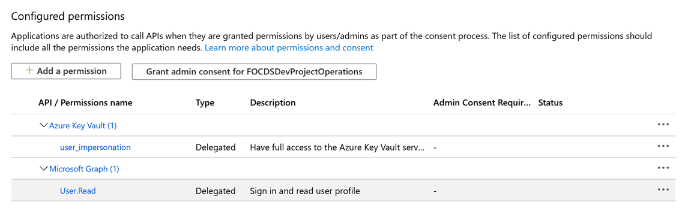

---
# required metadata

title: Configuration for Finance Insights (preview)
description: This topic walks through the configuration steps that will enable your system to the capability that's available in Finance Insights. 
author: ShivamPandey-msft
manager: AnnBe
ms.date: 07/20/2020
ms.topic: article
ms.prod: 
ms.service: dynamics-ax-applications
ms.technology: 

# optional metadata

ms.search.form: 
# ROBOTS: 
audience: Application User
# ms.devlang: 
ms.reviewer: roschlom
ms.search.scope: Core, Operations
# ms.tgt_pltfrm: 
ms.custom: 14151
ms.assetid: 3d43ba40-780c-459a-a66f-9a01d556e674
ms.search.region: Global
# ms.search.industry: 
ms.author: shpandey
ms.search.validFrom: 2020-07-20
ms.dyn365.ops.version: AX 10.0.13

---
# Configuration for Finance Insights (preview)

[!include [banner](../includes/banner.md)]
[!include [preview banner](../includes/preview-banner.md)]

# Configuration for Finance Insights

Finance Insights combines functionality from Microsoft Dynamics 365 Finance, with the Microsoft Common Data Service (CDS), Microsoft Azure, and Microsoft AI Builder to provide powerful forecasting tools for your organizations. This topic walks through the configuration steps that will enable your system to the capability that's available in Finance Insights. 

## Deploy Dynamics 365 Finance

Deploy the environments by completing the following steps.

1. Create or update a Dynamics 365 Finance environment in Lifecycle Services (LCS). The environment needs App Version 10.0.11/Platform Update 35 or later.
  
2. The environment must be an high availability (HA) environment in Sandbox (also known as a Tier-2 environment).For more information, see [Environment planning](../../fin-ops-core/fin-ops/imp-lifecycle/environment-planning.md).

3. If you are using Contoso demo data, you'll need additional sample data to use Customer payment predictions, Cashflow forecasts, and Budget forecasts. See [Set up demo data for Payment predictions](set-up-demo-data.md) for information about setting up demo data specifically for Customer payment predictions.

  
## Configure the Common Data Service 

1. Create a new Common data services environment in the same Active Directory Tenant. To do this, open the Environments page on the [Power Platform admin center](https://admin.powerplatform.microsoft.com/).
   
      
   
   - Click +New environment
   - Select a Sandbox for the environment Type.
   - Set **Create Database** to **Yes**. 
   - Click **Next**.
   - Select the language and currency for your organization.
   - Accept the default values for the other options.
   - Click **Save**.
   - Navigate to the environment page, and then refresh the environments page. When the **State** shows **Ready**, complete the following steps. 
     - Record the CDS Organization ID.
     - Select the environment and click **Settings**.
     - Click **Resources > All Legacy Settings**.
     - Click **Settings** on the top bar and select **Customizations**.
     - Click **Developer Resources**.
     - Record the Instance Reference Information ID as the CDS Organization ID.
     - From the address bar in the browser, record the CDS Organization URL, such as &lt;https:/org42b2b3d3.crm.dynamics.com&gt;
2. If you plan to use Cash flow forecasts, or Budget forecasts, also update the annotation limit for your organization to at least 50 MB. To do so, complete the following steps. 
   - Go to the [Power Apps](https://make.powerapps.com) portal. Select the environment you created above and click **Advanced settings**.
   - Click **Settings > Email Configuration**.
   - Change the **Maximum file size** (in kilobytes) to 51,200.
   - Click **OK** to save the changes.
     

## Configuring Azure setup

### Record the CDS Directory ID and user's Azure Active Directory object ID

1. Record CDS Directory ID
   - Go to the [Azure portal](https://portal.azure.com).
   - Log in using the user ID that was used to create the CDS environment.
   - Go to Azure Active Directory
   - Copy the Tenant ID and record it as the CDS Directory ID.
2. Record the user's Azure Active Directory object ID.
   - Go to the [Azure portal](https://portal.azure.com).
   - Go to Users and search for the user by email.
   - Click the user's name.
   - Copy the Object ID as the CDS Initial User Object ID. 

### Using Azure Cloud Shell for setting up Finance Insights Data Lake Resources

A PowerShell script is available that can be used to create the Azure resources. If you prefer manual setup, skip the following section and continue with procedure in the Manual Setup section below. 

A PowerShell script has been provided to easily set up the Azure resources described in [Configure export to Azure Data Lake](https://docs.microsoft.com/en-us/dynamics365/fin-ops-core/dev-itpro/data-entities/configure-export-data-lake). The steps for configuring Azure using the script are as follows. You will need rights to create an Azure resource group, Azure resources, and an AAD application. See [Check Azure AD permissions](https://docs.microsoft.com/en-us/azure/active-directory/develop/howto-create-service-principal-portal#permissions-required-for-registering-an-app) for details on required permissions.

1. Navigate to your target Azure subscription from the [Azure Portal](https://portal.azure.com). Just to the right of the **Search box**, click the **Cloud Shell** button.

2. Select **PowerShell** in the new window that opens.

3. Create storage if prompted. Upload the PowerShell script to the session. 

4. Run the script. 

6. Click the device login link and enter the login information.

7. Follow prompts to execute the script.

8. Use the information from the script output to install the **Export to Data Lake** add-in in Lifecycle Services (LCS).

9. Use information from the script output to enable the entity store in Dynamics 365 for Finance (**System Administration > System parameters > Data connections**).

### Manual Setup

1. Add Applications to the Azure Active Directory Tenant
   - Go to Azure Active Directory
   - Go to Manage > Enterprise Applications 
   - Search for the following applications, using App ID (see steps below if you cannot find those applications)
 
   | Application                                 | App ID                                  |
   |---------------------------------------------|-----------------------------------------|
   | Microsoft Dynamics ERP Microservices        | 0cdb527f-a8d1-4bf8-9436-b352c68682b2    |
   | Microsoft Dynamics ERP Microservices CDS    | 703e2651-d3fc-48f5-942c-74274233dba8    |
   | AI Builder Authorization Service            | ad40333e-9910-4b61-b281-e3aeeb8c3ef3    |

   If you are unable to find any of the preceding applications, try the following in Enterprise Applications:
   - On your local machine: Click on the **Start** menu and search for powershell.
   - Right-click **Windows Powershell** and choose **Run as administrator**.
   - Run the following command to install “AzureAD” module
     - Install-Module -Name AzureAD
     - If NuGet provider is required to continue, select “Y” to install it.
     - If the **Untrusted repository** message appears, select “Y” to continue.
   - For each application that must be added, run the following commands to add the application to the Azure Active Directory. 
     - Login as the Azure Active Directory administrator when prompted
     - Connect-AzureAD 
     - New-AzureADServicePrincipal –AppId <AppId>

2. Create an Azure resource.
   > [!NOTE]
   > Be sure you are creating the following resources in the same Azure Active Directory as the CDS environment. It's not possible to use resources from another Azure Active Directory.  

  - Create a new Storage Account using the following instructions: 
  
   > [!NOTE] 
   > You must enable hierarchical namespaces when creating the storage account. See the Create storage accounts section in the [Make Entity store available as a Data Lake](https://docs.microsoft.com/en-us/dynamics365/fin-ops-core/dev-itpro/data-entities/entity-store-data-lake#create-storage-accounts) topic for more information.

   - Go to the storage account that you created
   - Copy and save the storage account Name
   - Go to **Access keys** from the menu on the left
   - Copy and save the connection string for either Key1 or key2
   - Copy and save the storage account name
		 
   - Create a new Key Vault using the following instructions. These instructions are also listed in the Create a key vault section of the [Make Entity store available as a Data Lake](https://docs.microsoft.com/en-us/dynamics365/fin-ops-core/dev-itpro/data-entities/entity-store-data-lake#create-a-key-vault-and-a-secret) topic.
   - Create and register an Azure Active directory application using the following instructions: 
     - In the Azure portal, select Azure Active Directory, and then select App registrations.
     - Select New application registration, and enter the following information:
     - **Name**: Enter the name of the app.
     - **Application type**: Select Web API.
 - **Redirect URI setup**: Provide the URL for your Dynamics instance, such as, &lt;https://yourdynamicsinstance.dynamics.com/auth&gt;. 
 - Go to the app just created, and save its **Application (client) ID**. You will have to provide this key when setting up the key vault later.
 - Copy and save the application ID.
 - Go to **API permissions**.
 - Then select ‘+ Add a permission’.
 - Select **Azure Key vault**.
 - After you select delegated permissions, select **user_impersonation**.

- Click **Add permissions**. The result will look similar to the following illustration. 

- Select **Certificates & secrets** on the menu for the app.

- Create Key Vault Secrets by completing the following steps.
  - Go to the Key Vault created previously and select Secrets.
  - For each secrete name in the table below repeat the following steps:
  - Select Generate/Import.
    - In the Create a secret dialog box, in the Upload options field, select Manual.
    - Create the secret name and value from the table below.
    - Select Enabled, and then select Create. The secret is created and added to Key Vault

    |     Secret   Name                        |     Secret   value                                                                 |
    |------------------------------------------|------------------------------------------------------------------------------------|
    |     app-id                               |     The ID   of the application just created                                       |
    |     app-secret                           |     The   client secret saved previously                                           |
    |     storage-account-name                 |     The   name of the storage account created previously, such as, storageaccount1     |
    |     storage-account-connection-string    |     The   connection string copied from Access Keys of the storage account         |

3. Authorize the application to access the key vault.
- In the Azure portal, open the **Key Vault** that you created previously. 
- Select the access policies. To access the list of applications in the table below complete the following steps.
  - Click **+ Add Access Policy** to create a new access policy.
  - In the **Secret permissions** field, select the permissions from the following table.
  - In the **Select principal** field, search for the application display name from the following table. 
  - Click **Add**.
  - Click **Save**.
  
    |     Application                                                      |     Permissions    |
    |----------------------------------------------------------------------|--------------------|
    |     Display name of the new application you created from step (c)    |     Get, List      |
    |     Microsoft Dynamics ERP Microservices                             |     Get, List      |

4. Assign roles to access the storage account. 
- In the Axure portal, open the storage account that you created previously. Select **Access Control (IAM)** and select **Role Assignments**. 
  - Click **+ Add, Add Role Assignment**.
  - Select the role from the following table.
  - Keep **Assign access to** as **Azure AD user, group, or service principal**.
  - In the **Select** field, enter the application from the following table.
  - Click **Save**.
  
 
    |     Application                           |     Role                             |
    |-------------------------------------------|--------------------------------------|
    |     Your application   from step 2 (b)    |     Owner                            |
    |     Your application   from step 2 (b)    |     Contributor                      |
    |     Your application   from step 2 (b)    |     Storage Account   Contributor    |
    |     Your application   from step 2 (b)    |     Storage Blob Data   Owner        |
    |     AI Builder   Authorization Service    |     Storage Blob Data   Reader       | 
 
  
  ## Configure entity store
  
  Set up the entity store in your Dynamics 365 Finance environment. 
  
 1. So to the **Data connections** page (**System administration > Setup > System parameters > Data connections**).
 
 2. Set **Enable Data Lake integration** to **Yes**. 
 
 3. Set Azure key vault. 
 
    - Application (client) ID: This is the App ID that you create above. 
    - Application Secrete: The secrete you saved for the application created above
    - DNS name: You can find the DNS name on the application details page for the application you created above
    - Secrete name: storage-account-connection-string
   
## Configure the Data Lake

Add Azure Data Lake add-in to the environment using LCS. 

1. Log in to the LCS and click **Full Details** under the environment name, which is on the right side of the page. 

2. Click the **Environment add-ins** section and select **+ Install a new add-in**.

3. Select **Azure Data Lake. 

4. Enter the following values. 

  |     Value                                                                                |     Description                                    |
  |------------------------------------------------------------------------------------------|----------------------------------------------------|
  |     Tenant   ID of the Azure Subscription where the Key Vault is located.                |     This   is the tenant Id where the storage account, apps and Key Vaults are located .           Go   to: Azure portal > Azure Active Directory > Tenant ID          |
  |     Provide   the DNS name of your Key Vault                                             |     The   DNS name of the Key Vault (same as what is used in Entity store). For example, &lt;https://customkeyvault.vault.azure.net/&gt;                                               |
  |     Provide   the secret that contains the name of the storage account                   |     storage-account-name                                      |
  |     Secret   Name for App ID to be used for accessing Data Lake                          |     app-id                                                    |
  |     Secret   name to be used with App ID                                                 |     app-secret                                                |

5. Agree to the terms and click **Install**.

6. The add-in will be installed within a few minutes. 

## Configure AI Builder

1. Login to LCS and go to the **Environment details** page. 
2. Scroll to the **Environment add-ins** section. You should see the add-ins that are already installed in this environment. 
3. You should see the **Export to Data Lake** add-in installed. If you do not see **Export to Data Lake add-in** installed, configure **Export to Data Lake** as a first step.
4. Select the **AI builder integrator** add-in. 

   - The **AI builder integrator** add-in details page will open. Enter the values listed in the following table. 

   |     Value                                                         |     Description                                                 |
   |-------------------------------------------------------------------|-----------------------------------------------------------------|
   |     CDS   Organization URL                                        |     The   CDS Organization URL of the CDS instance.           Make.powerapps.com     Click the **Settings** icon (right upper corner)  Advance  Setting  Copy the URL (ending with dynamics.com)    |
   |     CDS   Org ID                                                  |     The   Environment ID of the CDS instance.     Make.powerapps.com           Settings   > Customizations > Developer resources > Instance Reference   Information > ID                                    |
   |     CDS   Tenant ID (Directory ID  from AAD)                      |     The   Tenant ID of the CDS instance.     Go   to: **Azure portal > Azure Active Directory > Tenant ID**       |
   |     Provide   user object ID who has system administrator role    |     The   AAD User Object ID of the user in CDS. This user must be a System Administrator of the CDS instance  **Azure Active directory > Users > select your user > Identity > Object   ID**      |
   |     Is this the default CDS environment for the tenant?         |     If the CDS instance was the first production instance created, Click the checkbox. If the CDS instance was created manually, clear the checkbox.                                                  |

#### Privacy notice
Previews (1) might use less privacy and fewer security measures than the Dynamics 365 Finance and Operations service, (2) aren't included in the service level agreement (SLA) for this service, (3) should not be used to process personal data or other data that is subject to legal or regulatory compliance requirements, and (4) have limited support.
