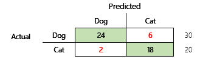
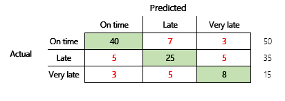
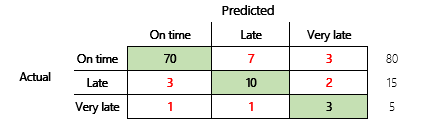
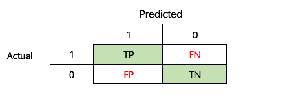

---
# required metadata

title: Results of machine learning models
description: This article discusses confusion matrices, classification problems, and accuracy in machine learning (ML) models. The purpose is to enhance your understanding of accuracy in ML prediction results.
author: ShivamPandey-msft
ms.date: 07/16/2021
ms.topic: article
ms.prod: 
ms.technology: 

# optional metadata

ms.search.form: 
# ROBOTS: 
audience: Application User
# ms.devlang: 
ms.reviewer: kfend
# ms.tgt_pltfrm: 
ms.assetid: 3d43ba40-780c-459a-a66f-9a01d556e674
ms.search.region: Global
# ms.search.industry: 
ms.author: shpandey
ms.search.validFrom: 2020-07-14
ms.dyn365.ops.version: AX 10.0.12

---
# Results of machine learning models

[!include [banner](../includes/banner.md)]

This article discusses confusion matrices, classification problems, and accuracy in machine learning (ML) models. The purpose is to enhance your understanding of accuracy in ML prediction results. The target audience includes engineers, analysts, and managers who want to build their knowledge and skills in data science.

## Confusion matrix
After a supervised ML problem is trained on a set of historical data, it's tested by using data that is withheld from the training process. In this way, you can compare the predictions from the trained model with the actual values. The confusion matrix provides a means of evaluating how successful a classification problem is and where it makes mistakes (that is, where it becomes "confused").

For example, your objective is to predict whether a pet is a dog or a cat, based on some physical and behavioral attributes. If you have a test dataset that contains 30 dogs and 20 cats, the confusion matrix might resemble the following illustration.

The numbers in the green cells represent correct predictions. As you can see, the model predicted a higher percentage of the actual cats correctly. The overall accuracy of the model is easy to calculate. In this case, it's 42 ÷ 50, or 0.84.

### Multi-class classifiers in a confusion matrix

Most discussions about the confusion matrix are focused on binary classifiers, as in the preceding example. This case is a special case where other metrics can be considered, such as sensitivity and recall.

Next, we will consider a classification problem for a finance scenario that has three states. The model predicts whether a customer invoice will be paid on time, late, or very late. For example, out of 100 test invoices, 50 are paid on time, 35 are paid late, and 15 are paid very late. In this case, a model might produce a confusion matrix that resembles the following illustration.

]

A confusion matrix provides significantly more information than a simple accuracy metric. However, it's still relatively easy to understand. A confusion matrix tells you whether you have a balanced dataset where the output classes have similar counts. For the multi-class scenario, it tells you how far off a prediction might be when the output classes are ordinal, as in the preceding example about customer payments.

## Model accuracy 
Different accuracy metrics have the advantage of quantifying the model quality. 

Because accuracy is an easy metric to understand, it's a good starting point for explaining a model to other people, especially to users of the model who aren't data scientists. No understanding of statistics is required to understand the model's accuracy. When a confusion matrix is available, it provides further insight into the model's performance.

However, for a more thorough understanding, several challenges that are associated with accuracy should be noted. The usefulness of the metric depends on the context of the problem. A question that often arises in relation to model performance is, "How good is the model?" However, the answer to this question isn't necessarily straightforward. Consider the following confusion matrix (model 2).

A quick calculation shows that this model's accuracy is (70 + 10 + 3) ÷ 100, or 0.83. On the surface, this result seems better than result for the previous multi-class model (model 1), which has an accuracy of 0.73. But is it better?

To begin to address this question, consider the accuracy of a naïve guess. For a classification problem, a simple guess will always predict the most common class. For model 1, that guess will be "on time," and it will produce an accuracy of 0.50. The guess for model 2 will also be "on time," and it will produce an accuracy of 0.80. Because model 1 improves on the naïve guess by 0.73 – 0.50 = 0.23, whereas model 2 improves on the naïve guess by 0.83 – 0.80 = 0.03, model 1 is a better model, even though it has lower accuracy. The calculation reveals that effective assessment of a model's quality requires more context than the accuracy value.

Another aspect is worth noting. Consider a scenario where a medical test is used to detect a disease in a patient. This problem is a binary classification problem where a positive result indicates that the patient has the disease. In this scenario, you must think about the impact of the following errors:

- False positives, where the test says that a patient has the disease, but the patient doesn't really have it.
- False negatives, where the test says that a patient doesn't have the disease, but the patient really does have it.

Obviously, both types of error are undesirable, but which is worse? Again, it depends. In the case of a life-threatening disease that requires fast treatment, minimization of false negatives (hopefully followed by additional tests) takes priority. In other, less critical situations, the model creators might minimize false positives instead. At any rate, a reasonable conclusion is that to effectively determine a model's quality, you must have more information than an accuracy metric provides.

### Recommendations

Accuracy is an important tool for communicating with domain experts who aren't familiar with statistics. However, to make the information useful, it's critical that additional context be provided together with the accuracy value.

For the payment prediction scenario, you can set a target for the ML model that includes factors in different payment behaviors. The target is that the model should improve upon a naïve guess by reducing the number of incorrect answers by at least 50 percent. In other words, you want a target accuracy that splits the different between the accuracy of a naïve guess and 100 percent.

The following table summarizes this principle for the confusion matrices in this article.

| Model   | Naïve guess | Target | Model accuracy | Is the goal met?                                          |
|---------|-------------|--------|----------------|-----------------------------------------------------------|
| Model 1 | 0.50        | 0.75   | 0.73           | Almost. This model significantly improves upon the guess. |
| Model 2 | 0.80        | 0.90   | 0.83           | No. Improvement is required.                              |

## Classification F1 accuracy

The final consideration in this article is a more advanced measure of classification ML performance that is known as F1 accuracy.

Before F1 accuracy can be defined, two additional metrics must be introduced: precision and recall. Precision indicates how many of the total number of predictions that are specified as positive are correctly assigned. This metric is also known as the positive predictive value. Recall is the total number of the actual positive cases that were predicted correctly. This metric is also known as sensitivity.

In the confusion matrix in the preceding illustration, these metrics are calculated in the following way:

- Precision = TP ÷ (TP + FP)
- Recall = TP ÷ (TP + FN)

The F1 measure combines precision and recall. The result is the harmonic mean of the two values. It's calculated in the following way:

- F1 = 2 × (Precision × Recall) ÷ (Precision + Recall)

Let's look at a concrete example. Earlier in this article, there was an example of a model that predicted whether an animal was a dog or a cat. The illustration is repeated here.

Here are the results if "Dog" is used as the positive answer.

- Precision = 24 ÷ (24 + 2) = 0.9231
- Recall = 24 ÷ (24 + 6) = 0.8
- F1 = 2 × (0.9231 × 0.8) ÷ (0.9231 + 0.8) = 0.8572

As you can see, the F1 value is between the values for precision and recall.

Although F1 accuracy isn't as easy to understand, it adds nuance to the basic accuracy number. It can also help with unbalanced datasets, as the following discussion will show.

The [Model accuracy](#model-accuracy) section of this article compared the following two confusion matrices. Even though the first model had lower accuracy, it was deemed a more useful model because it showed more improvement than the default guess of an on-time payment.

Let's see how these two models compare when the F1 score is used. The F1 score factors in precision and recall for each state, and the F1 macro calculation then averages the F1 score across the states to determine an overall F1 score. There are other F1 variants, but it's of greater interest to consider the macro version, given the equal consideration that is given to all three states.

To simplify the calculations, sample arrays were built to match the actual and predicted values. These arrays used sklearn's metrics library in Python to calculate the values. Here is the result.

| Model   | Naive guess | Accuracy | F1 macro |
|---------|-------------|----------|----------|
| Model 1 | 0.5         | 0.73     | 0.67     |
| Model 2 | 0.80        | 0.83     | 0.66     |

For more detail about how this calculation works, here is the sklearn.metrics classification report for model 1. The three states, "On time," "Late," and "Very late," are represented by the rows that are labeled 1, 2, and 3, respectively. The macro average is just the average of the "f1-score" column.

| &nbsp;    | precision | recall   | f1-score |
|-----------|-----------|----------|----------|
| **1**     | 0.83      | 0.80     | 0.82     |
| **2**     | 0.68      | 0.71     | 0.69     |
| **3**     | 0.50      | 0.50     | 0.50     |

As these results show, the two models have nearly identical F1 macro accuracy scores. In this and many other cases, F1 accuracy provides a better indicator of a model's capability. As for accuracy, interpretation of the results requires that you understand what is most important to consider in the model.

[!INCLUDE[footer-include](../../includes/footer-banner.md)]
