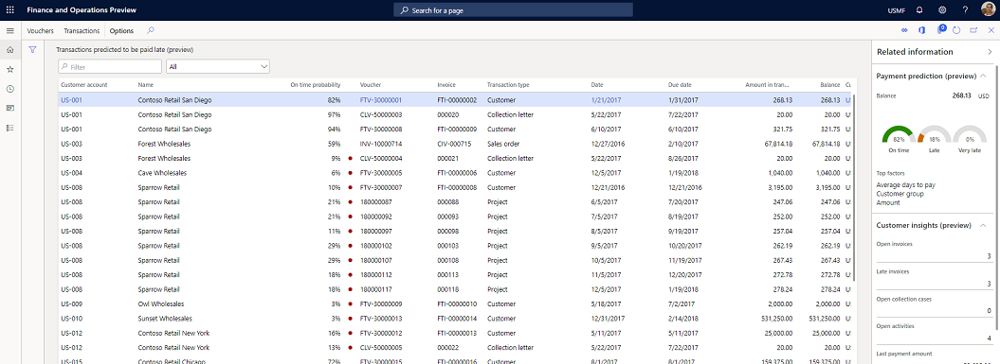

---
# required metadata

title: Enable customer payment predictions (preview)
description: This topic explains how to turn on and configure the Customer payment predictions feature in Finance insights.
author: ShivamPandey-msft
manager: AnnBe
ms.date: 05/27/2020
ms.topic: article
ms.prod: 
ms.service: dynamics-ax-applications
ms.technology: 

# optional metadata

ms.search.form: 
# ROBOTS: 
audience: Application User
# ms.devlang: 
ms.reviewer: roschlom
ms.search.scope: Core, Operations
# ms.tgt_pltfrm: 
ms.custom: 14151
ms.assetid: 3d43ba40-780c-459a-a66f-9a01d556e674
ms.search.region: Global
# ms.search.industry: 
ms.author: shpandey
ms.search.validFrom: 2020-05-29
ms.dyn365.ops.version: AX 10.0.12

---

# Enable customer payment predictions (preview)

[!include [banner](../includes/banner.md)]
[!include [preview banner](../includes/preview-banner.md)]

This topic explains how to turn on and configure the Customer payment predictions feature in Finance insights. You turn on the feature in the **Feature management** workspace and enter configuration settings on the **Financial insights parameters** page. This topic also includes information that can help you effectively use the feature.

> [!NOTE]
> Before you complete the following steps, be sure to complete the prerequisite steps in the [Configure for Finance insights](configure-for-fin-insites.md) topic.

1. Use information from the environment page in Microsoft Dynamics Lifecycle Services (LCS) to connect to the primary instance of Azure SQL for that environment. Run the following Transact-SQL (T-SQL) command to turn on flights for the sandbox environment. (You might have to turn on access for your IP address in LCS before you can connect remotely to Application Object Server \[AOS\].)

    `INSERT INTO SYSFLIGHTING (FLIGHTNAME, ENABLED) VALUES ('CashflowInsightsFeature', 1)`

    > [!NOTE]
    > If your deployment of Microsoft Dynamics 365 Finance is a Service Fabric deployment, you can skip this step. The Finance insights team should already have turned on the flight for you. If you don't see the feature in the **Feature management** workspace, or if experience issues when you try to turn it on, contact <fiap@microsoft.com>.

2. Turn on the Customer payment insights feature:

    1. Go to **System administration \> Workspaces \> Feature management**.
    2. Find the feature that is named **Customer payment insights (preview)**.
    3. Select **Enable now**.

    The Customer payment insights feature is now turned on and ready to be configured.

3. Configure the Customer payment insights feature:

    1. Go to **Credit and collections \> Setup \> Finance insights \> Finance insights parameters**.

        

    2. On the **Financial insights parameters** page, on the **Customer payment insights** tab, select the **View the data fields used in the prediction model** link to open the **Data fields for prediction model** page. There, you can view the default list of fields that are used to create the artificial intelligence (AI) prediction model for customer payment predictions.

        To use the default list of fields to create the prediction model, close the **Data fields for prediction model** page, and then, on the **Financial insights parameters** page, set the **Enable feature** option to **Yes**.

    3. Specify the "very late" transaction period to define what the **Very late** prediction bucket means for your business.

        For each open invoice, the system predicts the probability of payment in three buckets: **On time**, **Late**, and **Very late**.

        - **On time** – This bucket includes payments that are predicted to be paid on or before the transaction due date.
        - **Late** – This bucket includes payments that are predicted to be paid after the transaction due date but before the start of the "very late" transaction period.
        - **Very late** – This bucket includes payments that are predicted to be paid after the start of the "very late" transaction period.

        > [!NOTE]
        > If you change the "very late" transaction period and select **Change late threshold** after the AI prediction model for customer payments has been created, the existing prediction model is deleted, and a new model is created. The new prediction model will move transactions into the "very late" period, based on the settings that were entered to define it.

    4. After you've finished defining the "very late" transaction period, select **Create prediction model** to create the prediction model. The **Prediction model** section on the **Financial insights parameters** page shows the status of the prediction model.

        > [!NOTE]
        > At any time while the prediction model is being created, you can select **Reset model creation** to restart the process.

    The feature has now been configured and is ready to be used.

After the feature has been turned on and configured, and the prediction model has been created and is working, the **Prediction model** section of the **Financial insights parameters** page shows the accuracy of the model, as shown in the following illustration.

## Using the Customer payment predictions feature

This section explains how to use the Customer payment predictions feature. Before you use the feature, make sure that you've completed the setup steps that are described at the beginning of this topic.

You can view customer payment predictions in the **Manage customer credit and collections** workspace and on two new list pages, **Payment predictions per transaction** and **Payment prediction per customer**.

### Manage customer credit and collections workspace

The **Manage customer credit and collections** workspace includes two new tiles, **Payment prediction per transaction** and **Customers with predicted high late balances**.

- The **Transactions predicted to be paid late (preview)** tile shows the number of open customer transactions that have a probability of payment that is less than 50 percent in the **On time** bucket. You can select this tile to open the **Payment predictions per transaction** list page.
- The **Customers with predicted high late balances** tile shows the number of customers for which more than half (50 percent) of the total balance is predicted to be paid late and/or very late. You can select this tile to open the **Payment prediction per customer** list page.

### Payment predictions per transaction list page

On the **Payment predictions per transaction** list page, you can view the probability of payment for open transactions in the **On time**, **Late**, and **Very late** buckets. For each transaction in the grid, the **On time probability** column shows the probability that the invoice will be paid on or before the due date. If the probability of an on-time payment is less than 50 percent, a red circle appears next to the percentage in the **On time probability** column to indicate the risk of late payment.

The **Related information** pane on the right side of the page shows more details about the predictions:

- For the transaction that is selected in the grid, the **Payment prediction** FastTab shows the details of the payment predictions in the **On time**, **Late**, and **Very late** buckets. The **Top factors** section shows the top factors that influenced the predictions. The top factors are attributes of the selected transaction and/or the customer for that transaction.
- The **Customer insights** FastTab shows the current invoice, payment, and collections statistics for the customer for the selected transaction.
- The **Customer history** FastTab shows the customer's payment history in the **On time**, **Late**, and **Very late** buckets.

The data in the **Top factors** section, and on the **Customer insights** and **Customer history** FastTabs, helps explain the payment predictions. It can help increase your confidence in the efficacy of the predictions.

### Payment prediction per customer list page

The **Payment prediction per customer** list page shows the total open balance, and the amount that is predicted to be paid in the **On time**, **Late** and **Very late** buckets.

The payment amount in each bucket is calculated as the sum of the weighted average of the transaction balance. This amount is calculated based on the payment probabilities in each bucket.

For example, a customer has three open transactions that have the following payment probabilities in each bucket.

| Transaction | Amount | On-time payment probability | Late payment probability | Very late payment probability |
|-------------|--------|-----------------------------|--------------------------|-------------------------------|
| T1          | 100    | 10 percent                  | 50 percent               | 40 percent                    |
| T2          | 1,000  | 50 percent                  | 30 percent               | 20 percent                    |
| T3          | 10,000 | 1 percent                   | 4 percent                | 95 percent                    |

In this case, payments are projected for each bucket in the following way.

| Buckets   | Transaction T1      | Transaction T2         | Transaction T3            | Total |
|-----------|---------------------|------------------------|---------------------------|-------|
| On time   | 100 × 10 ÷ 100 = 10 | 1,000 × 50 ÷ 100 = 500 | 10,000 × 1 ÷ 100 = 100    | 610   |
| Late      | 100 × 50 ÷ 100 = 50 | 1,000 × 30 ÷ 100 = 300 | 10,000 × 4 ÷ 100 = 400    | 750   |
| Very late | 100 × 40 ÷ 100 = 40 | 1,000 × 20 ÷ 100 = 200 | 10,000 × 95 ÷ 100 = 9,500 | 9,740 |

The **Related information** section on the right side of the page shows more details about the predictions:

- For the transaction that is selected in the grid, the **Payment predictions** FastTab shows the details of the payment predictions in the **On time**, **Late**, and **Very Late** buckets. The **Top factors** section shows the top factors that influenced the payments. The top factors are attributes of the selected transaction and/or the customer for that transaction.
- The **Customer insights** FastTab shows the current invoice, payment, and collections statistics for the customer for the selected transaction.
- The **Customer history** FastTab shows the customer's payment history in the **On time**, **Late**, and **Very late** buckets.

The data in the **Top factors** section, and on the **Customer insights** and **Customer history** FastTabs, helps explain the payment predictions. It can help increase your confidence in the efficacy of the predictions.

## Improving the accuracy of payment predictions

You can view the accuracy of payment predictions by going to **Credit and collections \> Setup \> Finance insights \> Finance insights parameters**. On the **Customer payment insights** tab, the **Prediction model** section shows the accuracy of the prediction model as a percentage.

If you aren't satisfied with the accuracy, select the **Improve model accuracy** link to open the AI Builder extension experience. In the AI Builder extension experience, you can select or cancel the selection of fields until you've selected the fields that you believe are most important for accurately predicting payment probabilities. When you've finished, you can easily retrain the prediction model and publish your changes. The newly trained prediction model will automatically be picked up for predictions in Dynamics 365 Finance.

## Release details

Finance insights public preview is available for trial deployments in the United States of America, Europe, and the United Kingdom. Microsoft is incrementally adding support for more regions.

Public preview features can and should be turned on only in Tier-2 sandbox environments. Setup and AI models that are created in a sandbox environment can't be migrated to a production environment. For more information, see [Supplemental Terms of Use for Microsoft Dynamics 365 Previews](https://docs.microsoft.com/dynamics365/fin-ops-core/fin-ops/get-started/public-preview-terms).

## Privacy notice

Previews (1) might use less privacy and fewer security measures than the Dynamics 365 Finance and Operations service, (2) aren't included in the service level agreement (SLA) for this service, (3) should not be used to process personal data or other data that is subject to legal or regulatory compliance requirements, and (4) have limited support.
