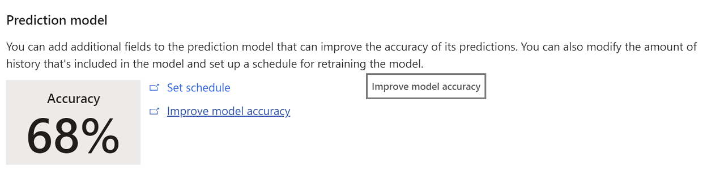
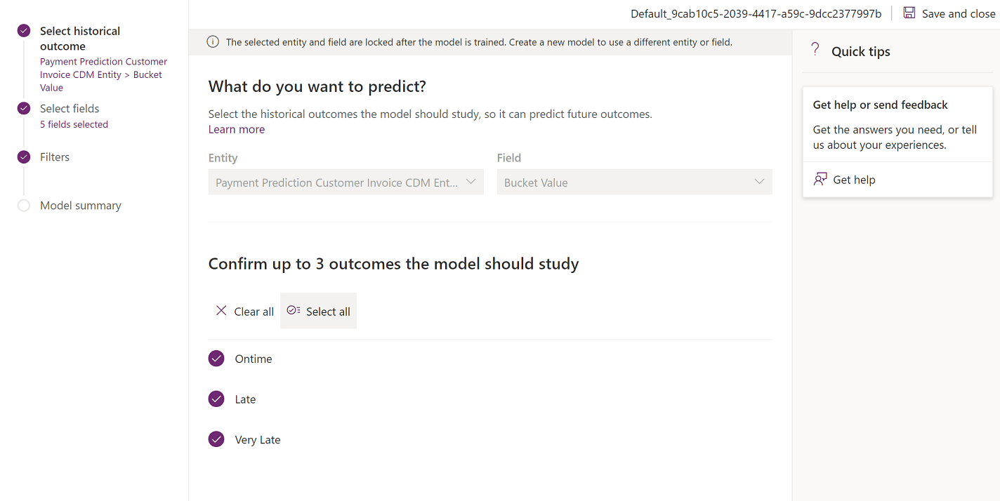
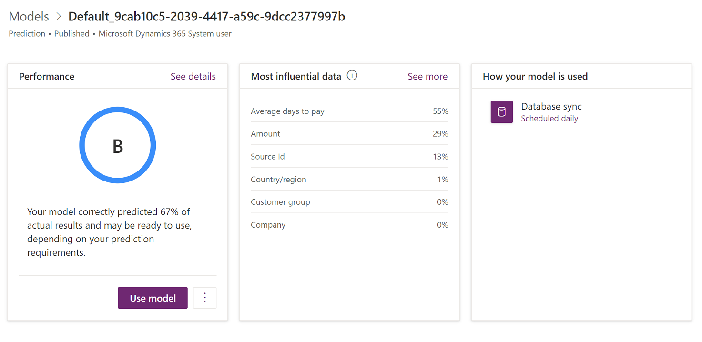
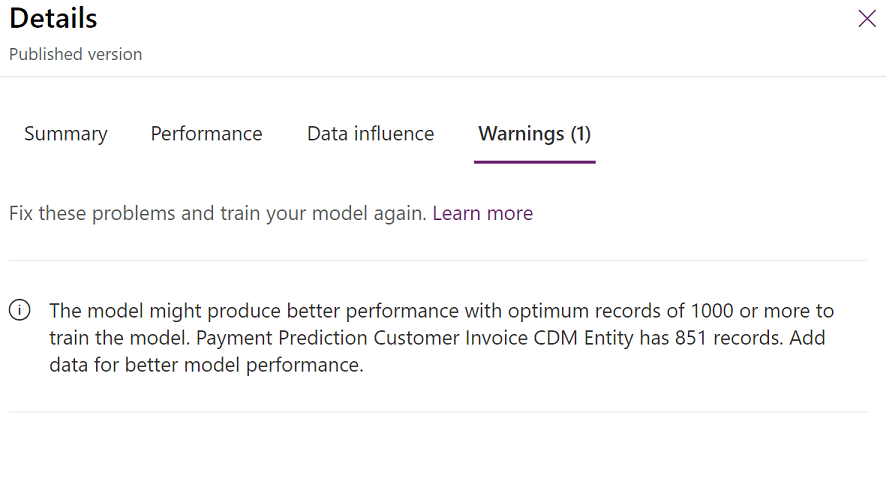
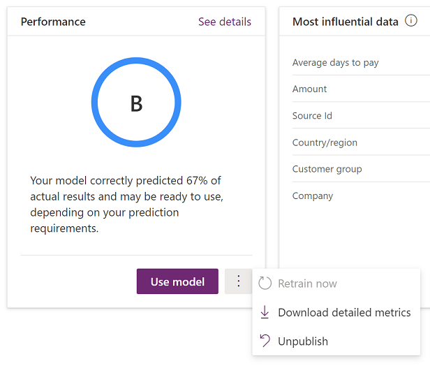
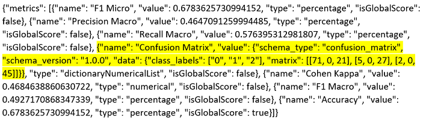

---
# required metadata

title: Evaluate the initial customer payment prediction model
description: This article describes the steps that you can take to understand the customer payment prediction model and evaluate its effectiveness. 
author: ShivamPandey-msft
ms.date: 05/02/2022
ms.topic: article
ms.prod: 
ms.technology: 

# optional metadata

ms.search.form: 
# ROBOTS: 
audience: Application User
# ms.devlang: 
ms.reviewer: kfend
# ms.tgt_pltfrm: 
ms.assetid: 3d43ba40-780c-459a-a66f-9a01d556e674
ms.search.region: Global
# ms.search.industry: 
ms.author: shpandey
ms.search.validFrom: 2020-05-28
ms.dyn365.ops.version: AX 10.0.8

---

# Evaluate the initial customer payment prediction model

[!include [banner](../includes/banner.md)]

This article explains how to evaluate a prediction model after you've turned on Finance Insights and then generated and trained your first model. This article addresses models for predicting customer payments. It describes the steps that you can take to understand the customer payment prediction model and evaluate its effectiveness.

## Getting details about the model

On the **Finance Insights parameters** page in Microsoft Dynamics 365 Finance, an **Improve model accuracy** link appears next to the accuracy score.

This link takes you to AI Builder, where you can learn more about the current model and also take steps to improve it. The following illustration shows the page that is opened.

The page that is opened shows the following information:

- In the **Performance** section, the model performance grade provides perspective on the quality of the model. For more information about this grade, see [Prediction model performance](/ai-builder/prediction-performance) in the AI Builder documentation.
- The **Most influential data** section shows how important different input types of data were for your model. You can evaluate this list and the corresponding percentages to determine whether the information is consistent with what you know about your business and market.

    

- In the **Performance** section, select **See details** to learn more about the grade and other considerations. In the following illustration, the details show that the model uses less information than is recommended. Therefore, the system has generated a warning message.

    

## Digging deeper

Although accuracy is a good starting point for evaluating a model, and the performance grade provides perspective, AI Builder provides more detailed metrics that you can use for your evaluation. To download the details, in the **Performance** section, select the ellipsis button (**...**) next to the **Use model** button, and then select **Download detailed metrics**.

The following illustration shows the format that you can download the data in.

For a deeper analysis of the results, a good starting point is to review the "Confusion Matrix" metric. For example, here is the data that is shown for this metric in the previous illustration.

`{"name": "Confusion Matrix", "value": {"schema_type": "confusion_matrix", "schema_version": "1.0.0", "data": {"class_labels": ["0", "1", "2"], "matrix": [[71, 9, 21], [5, 0, 27], [2, 0, 45]]}}, "type": "dictionaryNumericalList", "isGlobalScore": false}`

You can expand this data in the following way.

| &nbsp;                   | Predicted On time | Predicted Late | Predicted Very late |
|--------------------------|-------------------|----------------|---------------------|
| Actual on time payment   | **71**            | 0              | 21                  |
| Actual late payment      | 5                 | **0**          | 27                  |
| Actual very late payment | 2                 | 0              | **45**              |

The confusion matrix shows the results of a randomly selected test dataset from the training process. Because these closed invoices weren't used to train the model, they are good test cases for the model. Additionally, because the actual state of the invoice is known, the model's performance can also be seen.

The first thing to look for is the most common actual value. Although this value might not be perfectly aligned with the overall dataset, it's a reasonable approximation. In this case, **Actual on time payment** occurs for 92 of the 171 total invoices and is the most common actual value. Therefore, it's a good baseline for your model. If you just guessed that all invoices would be on time, you would be correct 92 out of 171 times (that is, 54 percent of the time).

It's important that you understand how balanced your dataset is. In this case, 92 out of 171 invoices were paid on time, 32 were paid late, and 47 were paid very late. These values indicate a reasonably balanced dataset, because there are non-trivial results in each classification. A situation where one of the states has very few results can be challenging for a machine learning model.

The accuracy of the model indicates the number of correct predictions for the test dataset. These correct predictions are the values that are shown in bold in the preceding example. In this case, the values produce a calculated accuracy of 67.8 percent (= \[71 + 0 + 45\] ÷ 171). This value represents an improvement of 14 percent over the baseline guess of 54 percent and is one indicator of the model's quality.

If you look more closely at the confusion matrix, you will notice that the model does a good job of predicting on-time and very late invoice payments. However, it's wrong about all 32 invoices that were actually paid late (but not very late). This result suggests that additional exploration and improvement of the model are required.

A number that represents the performance of the model better than accuracy is the F1 Macro score. This score considers the results of each classification state (on-time, late, and very late). For example, here is the data that is shown for the "F1 Macro" metric in the previous illustration.

`{"name": "F1 Macro", "value": 0.4927170868347339, "type": "percentage", "isGlobalScore": false}`

In this case, the F1 Macro score of approximately 49.3 percent indicates that the model doesn't provide effective predictions across each state, despite an overall accuracy score that seems reasonably high.

## Improving the model

After you understand the results of your first model better, you might want to improve the model by adding or removing feature columns, or by filtering any parts of the dataset that don't support accurate predictions. Close AI Builder, and then use the **Improve model** link in Dynamics 365 Finance to restart the AI Builder process. You can experiment with different characteristics without affecting the published model. The published model is affected only when you select **Publish**. Remember that a single model is used for your instance of Dynamics 365 Finance. Therefore, you should carefully review any new model before you publish it.

## For more information

For more information about how to evaluate prediction models, [Results of machine learning models](confusion-matrix.md)

[!INCLUDE[footer-include](../../includes/footer-banner.md)]
