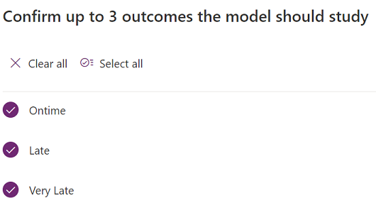
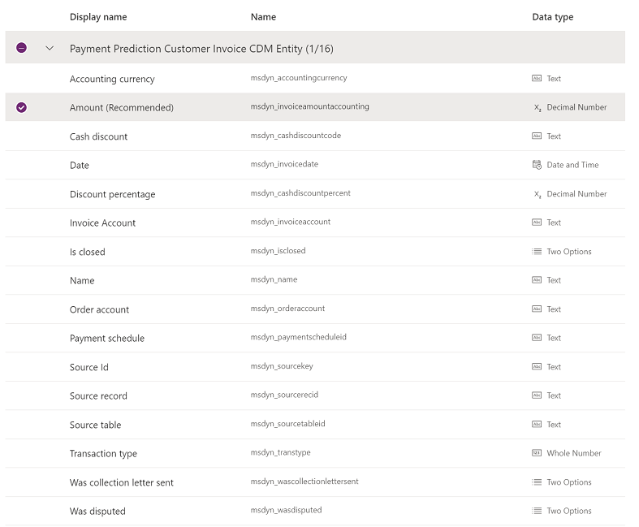
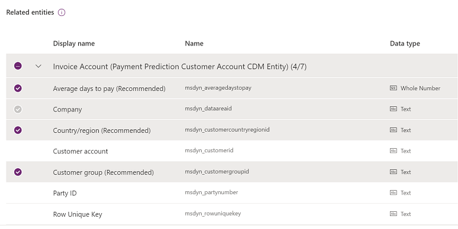

---
# required metadata

title: Improve the prediction model
description: This article describes features that you can use to improve the performance of prediction models.
author: ShivamPandey-msft
ms.date: 07/16/2021
ms.topic: article
ms.prod: 
ms.technology: 

# optional metadata

ms.search.form: 
# ROBOTS: 
audience: Application User
# ms.devlang: 
ms.reviewer: kfend
# ms.tgt_pltfrm: 
ms.assetid: 3d43ba40-780c-459a-a66f-9a01d556e674
ms.search.region: Global
# ms.search.industry: 
ms.author: shpandey
ms.search.validFrom: 2020-05-28
ms.dyn365.ops.version: AX 10.0.8

---

# Improve the prediction model

[!include [banner](../includes/banner.md)]

This article describes features that you can use to improve the performance of prediction models. You start to improve your model in the **Customer payment predictions** workspace in Microsoft Dynamics 365 Finance. The improvement steps are then completed in AI Builder.

## Select historical outcomes

You first select one or more of the three possible outcomes for invoices: **On time**, **Late**, and **Very late**. All three outcomes should be selected. If you clear the selection of any of the outcomes, invoices will be filtered out of the training process and the accuracy of the prediction will be reduced.

If your organization requires only two outcomes, change the **Late** and **Very late** thresholds to 0 (zero) days. In this way, you effectively collapse the prediction to a binary state of **On time** or **Late**.

## Select fields

When you're selecting fields to include in the model, be aware that the list includes all available fields in the Microsoft Dataverse table that is mapped to the data in the Azure data lake. Some of these fields should **not** be selected. The fields that should not be selected fall into one of three categories:

- The field is required for the Dataverse table, but there is no backing data for it in the data lake.
- The field is an ID and therefore doesn't make sense for a machine learning feature.
- The field represents information that won't be available during prediction.

The following sections show the fields that are available for the invoice and customer entities, and list the fields that should **not** be selected for training. The category that is specified for each of those fields refers to the categories in the preceding list.
 
### Invoice Dataverse table

The following illustration shows the fields that are available for the invoice table.

The following fields should not be selected for training:

- **Invoice Account** (category 2)
- **Is closed** (category 3) – This field is used to filter invoices for training (closed) and prediction (not closed).
- **Name** (category 1)
- **Source Id** (category 2)
- **Source record** (category 2)
- **Source table** (category 2)

### Customer Dataverse table

The following illustration shows the fields that are available for the customer table.

The following field should not be selected for training:

- **Row Unique Key** (category 2)

## Filters

You can filter the invoices that are used for training by setting filter criteria for fields on the invoice or in the customer tables. For example, you can set a threshold to include only invoices where the total equals or exceeds a specific amount. Alternatively, you can exclude invoices that are associated with customers in a specific customer group.

For more information on filtering your data, see [Create a prediction model](/ai-builder/prediction-create-model#filter-your-data).

[!INCLUDE[footer-include](../../includes/footer-banner.md)]
