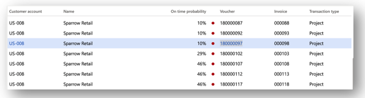

---
# required metadata

title: Customer payment predictions
description: This article describes the payment predictions capability that can help you better understand a customer's typical payment practices. This feature can also help identify circumstances that should cause you to start collection processes earlier than you might otherwise start them.
author: ShivamPandey-msft
ms.date: 11/03/2021
ms.topic: overview
ms.prod: 
ms.technology: 

# optional metadata

ms.search.form: 
# ROBOTS: 
audience: Application User
# ms.devlang: 
ms.reviewer: kfend
# ms.tgt_pltfrm: 
ms.collection: get-started
ms.assetid: 3d43ba40-780c-459a-a66f-9a01d556e674
ms.search.region: Global
# ms.search.industry: 
ms.author: shpandey
ms.search.validFrom: 2019-11-06
ms.dyn365.ops.version: AX 10.0.8

---

# Customer payment predictions

[!include [banner](../includes/banner.md)]

This article describes the payment predictions capability that can help you better understand a customer's typical payment practices. This feature can also help identify circumstances that should cause you to start collections processes earlier than you might otherwise start them.

## Overview

Organizations often find it challenging to predict when customers will pay their invoices. This lack of insight can cause the following issues:

- Less accurate cash flow forecasts
- Collections processes that start too late
- Orders that are released to customers who might default on their payment

Customer payment predictions helps organizations predict when a customer invoice will be paid. Therefore, they can create collections strategies that help increase the likelihood that they will be paid on time.

## Predictions

Payment predictions let organizations improve their business processes by helping them identify the invoices that are likely to be paid late. Organization can use that information to take actions that improve the chances that they will be paid on time.

The Customer payment predictions feature uses a machine learning model to more accurately predict when a customer will pay an outstanding invoice. This machine learning model includes historical invoices, payments, and customer data.

For each open invoice, the feature assigns three payment probabilities:

- The probability that the payment will be made on time
- The probability that the payment will be made late
- The probability that the payment will be made very late

The feature also provides an aggregated view of expected payments.

Each invoice is assigned a probability of on-time payment. Invoices that have a probability of on-time payment that is less than 50 percent are tagged with a red circle to indicate that they might require attention from a collections agent.

The Customer payment predictions feature also provides contextual information to explain the prediction. This information includes the top factors that influenced the prediction, the current state of business with the customer, and details about the customer's historical payment behavior.

In many businesses, the collections process has been a reactive activity. In other words, the collections process doesn't start until invoices become due. Customer payment predictions let organizations be more proactive about collections. They no longer have to wait for a transaction to become due to start the collections process. Instead, they can use the payment predictions capability to determine whether proactive collections will improve the probability that they will be paid on time.

## Methodology

In the past, it has typically been difficult to develop and deploy an artificial intelligence (AI) solution. The process has required a team that includes data scientists, subject matter experts (SMEs), and engineers, who work over time to formulate, develop, deploy, and maintain a usable AI solution. Customer payment predictions makes it easy to deploy and use an AI solution in Microsoft Dynamics 365 Finance. Microsoft is prepackaging AI solutions that are built on top of Microsoft AI Builder. Therefore, users can deploy the AI solution in a single mouse click to take advantage of the benefits of intelligent predictions. If you aren't satisfied with the accuracy of predictions, a power user can (again, in a single mouse click) enter the AI Builder extension experience, and then select or clear the fields that are used to generate predictions. When you're ready, you can "train" the model and publish the changes. The newly trained model will automatically be picked up to generate predictions in Dynamics 365 Finance.

[!INCLUDE[footer-include](../../includes/footer-banner.md)]
