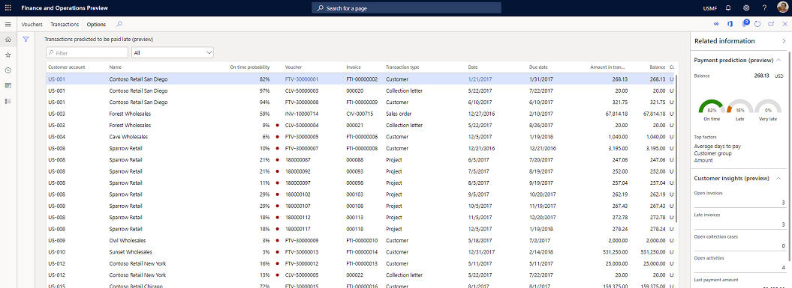
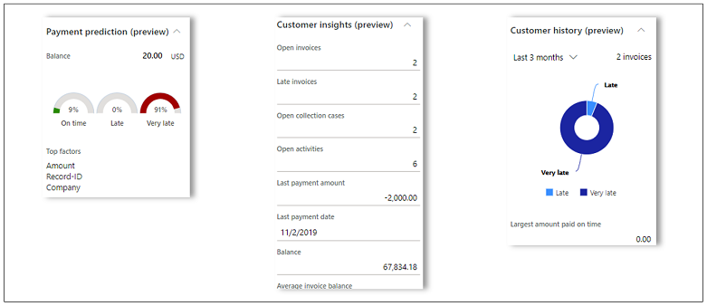
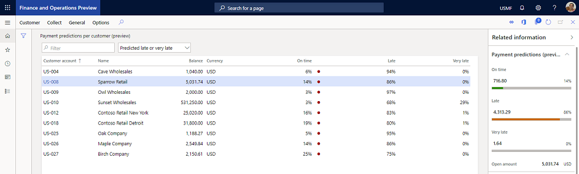

---
# required metadata

title: Use Customer payment predictions
description: This article walks through the prerequisites and the broad steps that are required to use a trial version of Finance insights.
author: ShivamPandey-msft
ms.date: 11/03/2021
ms.topic: article
ms.prod: 
ms.technology: 

# optional metadata

ms.search.form: 
# ROBOTS: 
audience: Application User
# ms.devlang: 
ms.reviewer: kfend
# ms.tgt_pltfrm: 
ms.assetid: 3d43ba40-780c-459a-a66f-9a01d556e674
ms.search.region: Global
# ms.search.industry: 
ms.author: shpandey
ms.search.validFrom: 2020-11-16
ms.dyn365.ops.version: AX 10.0.14

---
# Use Customer payment predictions

[!include [banner](../includes/banner.md)]

This article explains how to use the Customer payment predictions. Before you use this feature, make sure that you've completed the setup steps for it. For more information, see [Enable customer payment predictions](enable-cust-paymnt-prediction.md).

You can view customer payment predictions in the **Manage customer credit and collections** workspace and on two new list pages: **Transaction payment predictions** and **Customer payment predictions**.

### Manage customer credit and collections workspace

The **Manage customer credit and collections** workspace includes two new tiles: **Transaction payment predictions** and **Customer payment predictions**.

### Transaction payment predictions list page

On the **Transaction payment predictions** list page, you can view the probability of payment for open transactions in the **On time**, **Late**, and **Very late** buckets. For each transaction in the grid, the **On time probability** column shows the probability that the invoice will be paid on or before the due date. If the probability of an on-time payment is less than 50 percent, a red circle appears next to the percentage in the **On time probability** column to indicate the risk of late payment.

The **Related information** pane on the right side of the page shows more details about the predictions:

- For the transaction that is selected in the grid, the **Payment prediction** FastTab shows the details of the payment predictions in the **On time**, **Late**, and **Very late** buckets. The **Top factors** section shows the top factors that influenced the predictions. The top factors are attributes of the selected transaction and/or the customer for that transaction.
- The **Customer insights** FastTab shows the current invoice, payment, and collections statistics for the customer for the selected transaction.
- The **Customer history** FastTab shows the customer's payment history in the **On time**, **Late**, and **Very late** buckets.

The data in the **Top factors** section, and on the **Customer insights** and **Customer history** FastTabs, helps explain the payment predictions. It can help increase your confidence in the efficacy of the predictions.

### Customer payment predictions list page

The **Customer payment predictions** list page shows the total open balance, and the amount that is predicted to be paid in the **On time**, **Late**, and **Very late** buckets.

The payment amount in each bucket is calculated as the sum of the weighted average of the transaction balance. This amount is calculated based on the payment probabilities in each bucket.

For example, a customer has three open transactions that have the following payment probabilities in each bucket.

| Transaction | Amount | On-time payment probability | Late payment probability | Very late payment probability |
|-------------|--------|-----------------------------|--------------------------|-------------------------------|
| T1          | 100    | 10 percent                  | 50 percent               | 40 percent                    |
| T2          | 1,000  | 50 percent                  | 30 percent               | 20 percent                    |
| T3          | 10,000 | 1 percent                   | 4 percent                | 95 percent                    |

In this case, payments are projected for each bucket in the following way.

| Buckets   | Transaction T1      | Transaction T2         | Transaction T3            | Total |
|-----------|---------------------|------------------------|---------------------------|-------|
| On time   | 100 × 10 ÷ 100 = 10 | 1,000 × 50 ÷ 100 = 500 | 10,000 × 1 ÷ 100 = 100    | 610   |
| Late      | 100 × 50 ÷ 100 = 50 | 1,000 × 30 ÷ 100 = 300 | 10,000 × 4 ÷ 100 = 400    | 750   |
| Very late | 100 × 40 ÷ 100 = 40 | 1,000 × 20 ÷ 100 = 200 | 10,000 × 95 ÷ 100 = 9,500 | 9,740 |

The **Related information** section on the right side of the page shows more details about the predictions:

- For the transaction that is selected in the grid, the **Payment predictions** FastTab shows the details of the payment predictions in the **On time**, **Late**, and **Very Late** buckets.
- The **Customer insights** FastTab shows the current invoice, payment, and collections statistics for the customer for the selected transaction.
- The **Customer history** FastTab shows the customer's payment history in the **On time**, **Late**, and **Very late** buckets.

The data on the **Customer insights** and **Customer history** FastTabs helps explain the payment predictions. It can help increase your confidence in the efficacy of the predictions.

## Improving the accuracy of payment predictions

You can view the accuracy of payment predictions by going to **Credit and collections \> Setup \> Finance insights \> Finance insights parameters**. On the **Customer payment insights** tab, the **Prediction model** section shows the accuracy of the prediction model as a percentage.

If you aren't satisfied with the accuracy, select the **Improve model accuracy** link to open the AI Builder extension experience. In the AI Builder extension experience, you can select or cancel the selection of fields until you've selected the fields that you believe are most important for accurately predicting payment probabilities. When you've finished, you can easily retrain the prediction model and publish your changes. The newly trained prediction model will automatically be picked up for predictions in Dynamics 365 Finance.

[!INCLUDE[footer-include](../../includes/footer-banner.md)]
