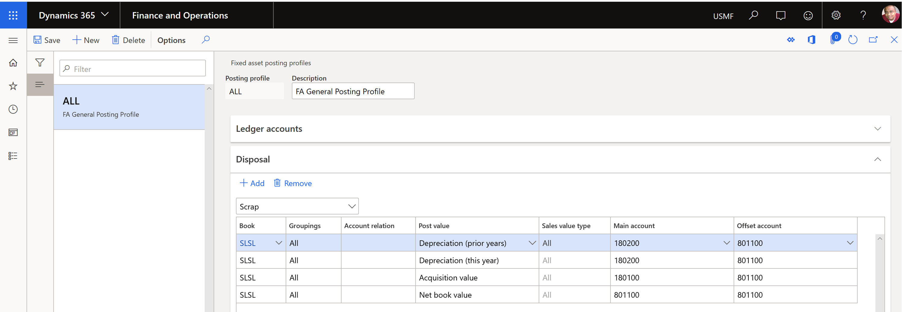
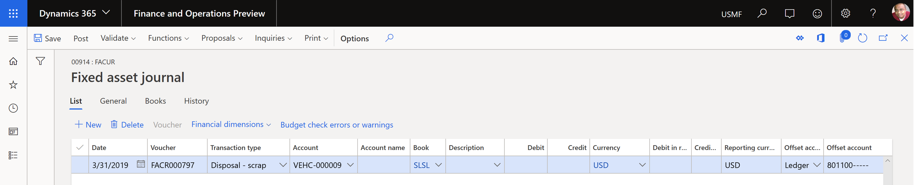
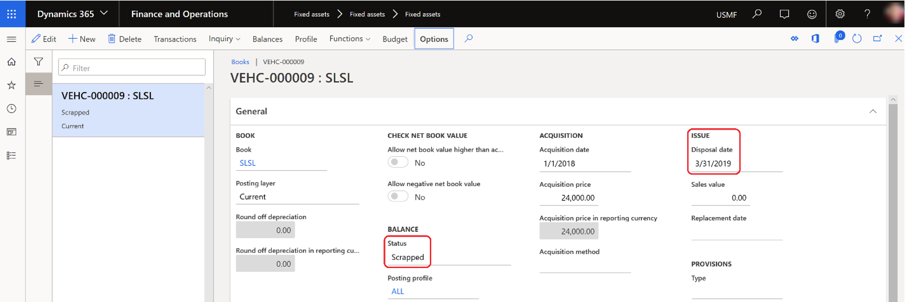
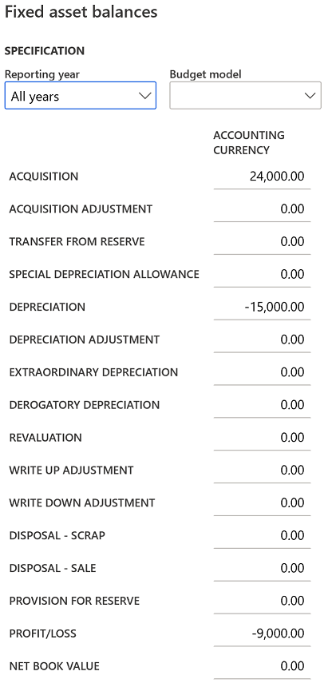
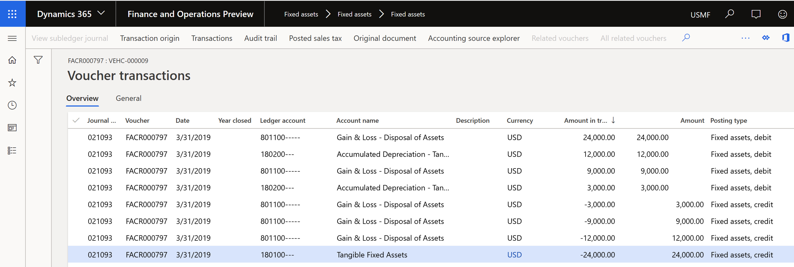

---
# required metadata

title: Dispose of a fixed asset as scrap
description: The article describes the process of eliminating transactions for a fixed asset that was disposed of as scrap.
author: moaamer
ms.date: 01/19/2023
ms.topic: article
ms.prod: 
ms.technology: 

# optional metadata

ms.search.form: TaxTable
# ROBOTS: 
audience: Application User
# ms.devlang: 
ms.reviewer: twheeloc

# ms.tgt_pltfrm: 
ms.custom: 4464
ms.assetid: 5f89daf1-acc2-4959-b48d-91542fb6bacb
ms.search.region: Global
# ms.search.industry: 
ms.author: moaamer
ms.search.validFrom: 2019-08-14
ms.dyn365.ops.version: 10.0.6

---

# Dispose of a fixed asset as scrap

[!include [banner](../includes/banner.md)]

The article describes the process of eliminating transactions for a fixed asset that was disposed of as scrap. The transaction types that can be eliminated include an asset's acquisition and accumulated depreciation transactions and other fixed asset transactions. Elimination of these transactions affects balance sheet accounts, such as acquisition adjustment, depreciation adjustment, revaluation, write-up, and write-down accounts.

| Transaction                                         | Debit (Dr.) | Credit (Cr.) |
|-----------------------------------------------------|-------------|--------------|
| Dr. Accumulated depreciation                        | X           |              |
| Cr. Fixed assets gain/loss                          |             | X            |
| Dr. Fixed assets gain/loss                          | X           |              |
| Cr. Fixed asset acquisition account                 |             | X            |
| Dr. Fixed assets gain/loss (net book value \[NBV\]) | X           |              |
| Cr. Fixed assets gain/loss (NBV)                    |             | X            |

> [!NOTE]
> We recommend that you work closely with your company's chief financial officer (CFO) or controller to identify the correct accounts that should be used for each transaction type, and also to verify that the disposal process and the transactions that it generates update those accounts correctly.

Before you dispose of a fixed asset as scrap, you must create ledger accounts that are associated with:
 - the asset's acquisition value 
 - depreciation for the current year 
 - depreciation for previous years 
 - the asset's NBV 

The fixed asset transaction types are listed on the **Fixed assets posting profile** page. Go to **Fixed assets \> Setup \> Fixed asset posting profiles**, and then, on the **Disposal** FastTab, select **Scrap** in the field above the grid. The following illustration shows the list of fixed asset transaction types on the **Fixed asset posting profiles** page.

The disposal posting profile has two ways to account for the acquisition values during the disposal process:
 - The lump sum of all acquisitions that has a **Acquisition value** posting type
 - Differentiate between acquisitions this or prior years that have the **Acquisitions this** and **Acquisition prior years** posting types

-	**Acquisition value** combines all acquisition transactions in all times in one transaction line and disposal transaction post it to the corresponding account to acquisition value in the posting profile. This could be used if you don't want to break down the acquisitions of this year and prior years. In this case, set the **Post disposal transactions in detail** option on the **Fixed assets parameters** page to **No**.  
-	**Acquisition this year** and **Acquisition prior years** break down the acquisition values when there are different acquisitions posted to the disposed asset this year or prior years. Set the **Post disposal transactions in detail** option on the **Fixed assets parameters** page to **Yes**, to validate against detailed posting types in the posting profile.

> [!NOTE]
>You can’t define the both options of posting types **Acquisition value** and **Acquisition this year** or **Acquisition prior year** in the disposal sale/scrap at the same time to ensure accurate disposal posting. 

For the following example, a fixed asset was acquired on January 1, 2018, and it will be scrapped on March 31, 2019.

- **Acquisition price:** 24,000.00 US dollars (USD)
- **Service life:** Two years
- **Depreciation method:** Straight line service life
- **Depreciation amount:** 1,000.00 USD per month

The NBV of a fixed asset is calculated by using the following formula:

Net book value = Acquisition price – Depreciation

In this example, the fixed asset was acquired and was depreciated for 15 months, from January 2018 through March 2019. Therefore, the asset's NBV is 9,000.00 USD (24,000.00 USD – 15,000.00 USD).

To create a disposal journal, go to **Fixed assets \> Journal entries \> Fixed assets journal**, on the Action Pane, select **Lines**. Select **Disposal – scrap**, and select a fixed asset ID. To fully dispose of the asset, don't enter a value in either the **Debit** field or the **Credit** field.

The fixed asset disposal scrap transaction changes the field values for the fixed asset book in the following ways:

- In the **Balance** section, the **Status** field is updated to **Scrapped**.
- In the **Issue** section, the **Disposal date** field is set to the date when the asset was scrapped.

The following illustration shows the fixed asset balance.

The following illustration shows the voucher that is posted.

[!INCLUDE[footer-include](../../includes/footer-banner.md)]
