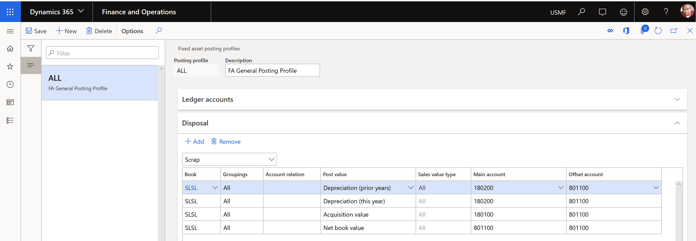
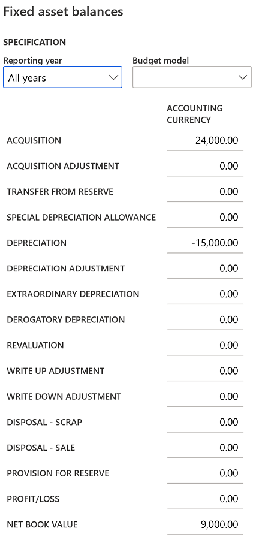
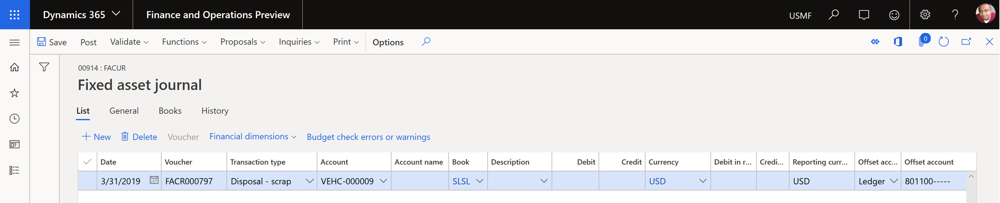
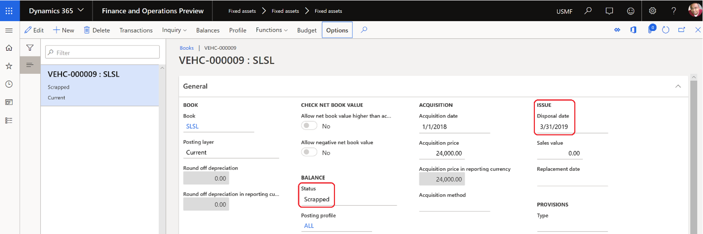
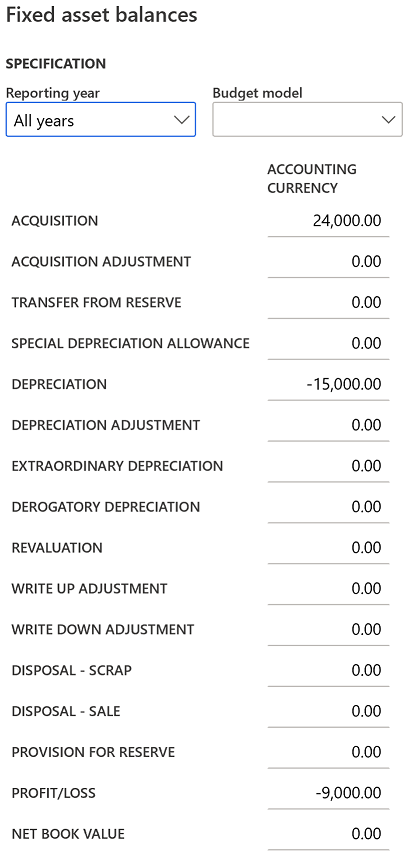
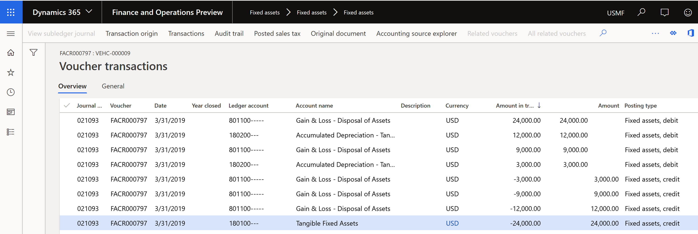

# Dispose of a fixed asset as scrap

[!include [banner](../includes/banner.md)]

This article describes the process of eliminating transactions for a fixed asset that you dispose of as scrap. The transaction types that you can eliminate include an asset's acquisition and accumulated depreciation transactions, along with other fixed asset transactions. When you eliminate these transactions, you affect balance sheet accounts such as acquisition adjustment, depreciation adjustment, revaluation, write-up, and write-down accounts.

| Transaction                                         | Debit (Dr.) | Credit (Cr.) |
|-----------------------------------------------------|-------------|--------------|
| Dr. Accumulated depreciation                        | X           |              |
| Cr. Fixed assets gain/loss                          |             | X            |
| Dr. Fixed assets gain/loss                          | X           |              |
| Cr. Fixed asset acquisition account                 |             | X            |
| Dr. Fixed assets gain/loss (net book value \[NBV\]) | X           |              |
| Cr. Fixed assets gain/loss (NBV)                    |             | X            |

> [!NOTE]
> Work closely with your company's chief financial officer (CFO) or controller to identify the correct accounts for each transaction type. Also verify that the disposal process and the transactions it generates update those accounts correctly.

Before you dispose of a fixed asset as scrap, create ledger accounts that are associated with:

- the asset's acquisition value
- depreciation for the current year
- depreciation for previous years
- the asset's NBV

The **Fixed assets posting profile** page lists the fixed asset transaction types. Go to **Fixed assets \> Setup \> Fixed asset posting profiles**, and then, on the **Disposal** FastTab, select **Scrap** in the field above the grid. The following illustration shows the list of fixed asset transaction types on the **Fixed asset posting profiles** page.

The disposal posting profile has two ways to account for the acquisition values during the disposal process:

- The lump sum of all acquisitions that has an **Acquisition value** posting type.
- Differentiate between acquisitions this year or prior years that have the **Acquisitions this** and **Acquisition prior years** posting types.

- **Acquisition value** combines all acquisition transactions at all times into one transaction line. The disposal transaction posts it to the corresponding account for acquisition value in the posting profile. Use this option if you don't want to break down the acquisitions of this year and prior years. In this case, set the **Post disposal transactions in detail** option on the **Fixed assets parameters** page to **No**.  
- **Acquisition this year** and **Acquisition prior years** break down the acquisition values when different acquisitions are posted to the disposed asset this year or prior years. Set the **Post disposal transactions in detail** option on the **Fixed assets parameters** page to **Yes**, to validate against detailed posting types in the posting profile.

> [!NOTE]
>You can’t define both options of posting types **Acquisition value** and **Acquisition this year** or **Acquisition prior year** in the disposal sale/scrap at the same time to ensure accurate disposal posting.

For the following example, you acquired a fixed asset on January 1, 2024, and you scrap it on March 31, 2025.

- **Acquisition price:** 24,000.00 US dollars (USD)
- **Service life:** Two years
- **Depreciation method:** Straight line service life
- **Depreciation amount:** 1,000.00 USD per month

Calculate the NBV of a fixed asset by using the following formula:

Net book value = Acquisition price – Depreciation

In this example, you acquired and depreciated the fixed asset for 15 months, from January 2024 through March 2025. Therefore, the asset's NBV is 9,000.00 USD (24,000.00 USD – 15,000.00 USD).

To create a disposal journal, go to **Fixed assets \> Journal entries \> Fixed assets journal**, on the Action Pane, select **Lines**. Select **Disposal – scrap**, and select a fixed asset ID. To fully dispose of the asset, don't enter a value in either the **Debit** field or the **Credit** field.

The fixed asset disposal scrap transaction changes the field values for the fixed asset book in the following ways:

- In the **Balance** section, the **Status** field is updated to **Scrapped**.
- In the **Issue** section, set the **Disposal date** field to the date when you scrap the asset.

The following illustration shows the fixed asset balance.

The following illustration shows the voucher that you post.

[!INCLUDE[footer-include](../../includes/footer-banner.md)]
