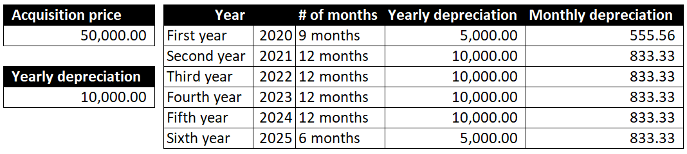

# Half-year depreciation convention methodology

[!include [banner](../includes/banner.md)]
[!include [preview banner](../includes/preview-banner.md)]

This article describes the method that fixed assets use to calculate depreciation by using the half-year convention. The half-year convention calculates six months of depreciation during an asset’s first and last year of service. For more information about depreciation conventions, see [Depreciation methods and conventions](Fixed-asset-depreciation-conventions.md).

When you use the six-month depreciation convention, the system uses the acquisition year or the year that the asset was placed in service, then calculates five years of depreciation from that year, and then adds six months. To illustrate this process, consider an asset that you acquired for $50,000 and placed in service in April 2025. Also assume that the asset has a five-year service life.

The first year of service concludes in December 2025, which means the end of the asset’s five-year service life is December 2030. The half-year depreciation convention adds six months to the asset’s life, which means its service life ends in June 2030.

> Yearly depreciation 50,000/5 = 10,000 monthly depreciation 10,000/12 = 833.33  
> First year depreciation 10,000/2 = 5,000  and the subsequent monthly depreciation 5,000/9 = 555.56

   

The extended depreciation periods that the half-year convention adds provide a more accurate allocation of depreciation. The six-month convention represents depreciation expenses more equally, which is useful for reporting on the profit and loss statement.

[!INCLUDE[footer-include](../../includes/footer-banner.md)]
