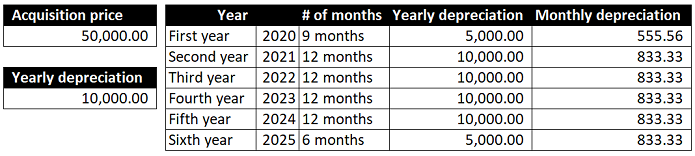

---
# required metadata

title: Half-year depreciation convention methodology
description: This topic describes the method that fixed assets uses to calculate depreciation using the half-year convention, which calculates six months of depreciation during an asset’s first and last year in service.
author: moaamer
ms.date: 08/17/2019
ms.topic: article
ms.prod: 
ms.technology: 

# optional metadata

ms.search.form: TaxTable
# ROBOTS: 
audience: Application User
# ms.devlang: 
ms.reviewer: roschlom

# ms.tgt_pltfrm: 
ms.custom: 4464
ms.assetid: 5f89daf1-acc2-4959-b48d-91542fb6bacb
ms.search.region: Global
# ms.search.industry: 
ms.author: roschlom
ms.search.validFrom: 2019-08-17
ms.dyn365.ops.version: 10.0.12

---

# Half-year depreciation convention methodology

[!include [banner](../includes/banner.md)]
[!include [preview banner](../includes/preview-banner.md)]

This topic describes the method that is used in fixed assets to calculate depreciation using the half-year convention. The half-year convention calculates six months of depreciation during an asset’s first and last year of service. For more information about depreciation conventions, see [Depreciation methods and conventions](Fixed-asset-depreciation-conventions.md). 

When you use the six-month depreciation convention, the system uses the acquisition year or the year that the asset was placed in service, then calculates five years of depreciation from that year, and then adds six months. To illustrate this process, consider an asset that was acquired for the price of 50,000, and placed in service in April 2020. Also assume that the asset has a five-year service life.

The first year of service will conclude in December 2020, which means the end of the asset’s five-year service life will be December 2024. The half-year depreciation convention will add six months to the asset’s life, which means its service life will end in June 2025. 

> Yearly depreciation 50,000/5 = 10,000 monthly depreciation 10,000/12 = 833.33  
> First year depreciation 10,000/2 = 5,000  and the subsequent monthly depreciation 5,000/9 = 555.56

   

The extended depreciation periods that are added by the half-year convention provide more accurate allocation of depreciation. The six-month convention represents depreciation expenses more equally, which is useful for reporting on the profit and loss statement.

[!INCLUDE[footer-include](../../includes/footer-banner.md)]